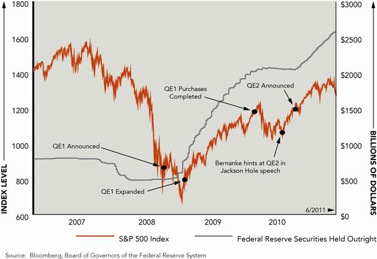

## Table of Contents

## What is quantitative easing?

Quantitative easing, often called QE, is a special tool that central banks use to help the economy. When the economy is not doing well, and regular methods like lowering interest rates aren't enough, central banks buy things like government bonds or other financial assets. This puts more money into the economy, making it easier for people and businesses to borrow and spend. It's like adding more water to a pond to make it fuller.

The main goal of QE is to boost economic activity. By buying these assets, central banks increase the amount of money available, which can lead to more spending and investment. This can help businesses grow and create jobs. However, QE can also have some downsides, like possibly causing inflation if too much money is added. It's a powerful tool, but it needs to be used carefully to balance the benefits and risks.

## How does quantitative easing work?

Quantitative easing works by central banks buying financial assets, like government bonds, from banks and other financial institutions. When the central bank buys these assets, it pays for them by creating new money electronically. This new money goes into the accounts of the sellers, which are usually banks. As a result, the banks have more money to lend out to people and businesses. This increase in available money can help lower interest rates because there's more money to go around.

The idea behind this is to encourage more spending and investment in the economy. When interest rates are lower, it's cheaper for people to borrow money for things like buying a house or starting a business. This can lead to more economic activity, which can help the economy grow. However, central banks need to be careful because if they add too much money, it could lead to higher inflation, which means prices for goods and services go up. So, they have to balance the benefits of boosting the economy with the risk of causing too much inflation.

## What is the purpose of quantitative easing?

The main purpose of quantitative easing is to help the economy when it's not doing well. When regular methods like lowering interest rates aren't working, central banks use quantitative easing to put more money into the economy. They do this by buying things like government bonds from banks and other financial institutions. This gives the banks more money to lend out, which can help people and businesses borrow more easily.

By making it easier to borrow money, quantitative easing encourages people to spend and businesses to invest. This can lead to more economic activity, which helps the economy grow. However, central banks need to be careful because adding too much money can cause prices to go up, which is called inflation. So, they have to balance helping the economy with keeping inflation under control.

## How does quantitative easing affect the economy?

Quantitative easing puts more money into the economy by having the central bank buy things like government bonds. This gives banks more money to lend out, which can make it easier for people and businesses to borrow. When borrowing is easier, people might spend more on things like houses or cars, and businesses might invest more in growing their operations. This extra spending and investment can help the economy grow and create more jobs.

However, quantitative easing can also have some downsides. If too much money is added to the economy, it can lead to higher prices, which is called inflation. This means that the cost of goods and services goes up, and people's money doesn't go as far. Central banks have to be careful to balance the benefits of boosting the economy with the risk of causing too much inflation. They watch the economy closely and can adjust their actions to try to keep things stable.

## What is the relationship between quantitative easing and stock markets?

Quantitative easing can have a big effect on stock markets. When central banks do quantitative easing, they put more money into the economy. This extra money can make people feel more confident about the economy, so they might be more willing to invest in stocks. Also, because interest rates are usually low when quantitative easing happens, people might move their money from savings accounts to the stock market to get a better return on their money. This can push stock prices up.

However, quantitative easing can also make stock markets more risky. If people think that the central bank is adding too much money to the economy, they might worry about inflation. High inflation can make the value of money go down, which can hurt stock prices. Also, if the central bank decides to stop or slow down quantitative easing, it can make people less confident and cause stock prices to drop. So, while quantitative easing can help stock markets in the short term, it can also lead to more ups and downs in the long run.

## Can you explain how quantitative easing influences stock prices?

When central banks do quantitative easing, they put more money into the economy by buying things like government bonds. This extra money can make people feel more confident about the economy, so they might be more willing to invest in stocks. Also, because interest rates are usually low during quantitative easing, people might move their money from savings accounts to the stock market to get a better return on their money. This increased demand for stocks can push stock prices up.

However, quantitative easing can also make stock markets more risky. If people think that the central bank is adding too much money to the economy, they might worry about inflation. High inflation can make the value of money go down, which can hurt stock prices. Also, if the central bank decides to stop or slow down quantitative easing, it can make people less confident and cause stock prices to drop. So, while quantitative easing can help stock markets in the short term, it can also lead to more ups and downs in the long run.

## What are the short-term effects of quantitative easing on stock markets?

When a central bank does quantitative easing, it puts more money into the economy. This makes people feel more confident about the economy, so they might want to invest more in stocks. Also, because interest rates are usually low when quantitative easing happens, people might take their money out of savings accounts and put it into the stock market to get a better return. This increased demand for stocks can push stock prices up in the short term.

However, quantitative easing can also make stock markets more risky. If people think that the central bank is adding too much money to the economy, they might worry about inflation. High inflation can make the value of money go down, which can hurt stock prices. So, while quantitative easing can help stock markets go up in the short term, it can also lead to more ups and downs.

## What are the long-term effects of quantitative easing on stock markets?

Over the long term, quantitative easing can make stock markets more unpredictable. When central banks keep adding money to the economy, it can make people worry about inflation. If prices start going up a lot, the value of money goes down, and this can make stock prices drop. Also, if the central bank decides to stop or slow down quantitative easing, it can make people less confident about the economy. This can lead to big drops in stock prices because people might start selling their stocks.

On the other hand, if quantitative easing helps the economy grow steadily over time, it can be good for stock markets. When the economy is doing well, businesses make more money, and this can make their stock prices go up. But it's a tricky balance. Central banks have to be careful not to add too much money, or it could cause problems like high inflation. So, while quantitative easing can help stock markets in the long run, it can also make them more risky and unpredictable.

## How do investors typically react to announcements of quantitative easing?

When a central bank announces quantitative easing, investors often feel more confident about the economy. They think that the extra money the central bank is putting into the economy will help businesses grow and create jobs. Because of this, many investors decide to buy more stocks, hoping to make money as stock prices go up. Also, since interest rates are usually low when quantitative easing happens, investors might move their money from savings accounts to the stock market to get a better return on their money.

However, not all investors react the same way. Some worry that too much money being added to the economy could lead to high inflation, which can make the value of money go down and hurt stock prices. These investors might sell their stocks or be more careful about buying new ones. Also, if investors think the central bank might stop or slow down quantitative easing soon, they might start selling their stocks because they worry about what will happen to the economy without that extra help. So, while many investors see quantitative easing as a good thing for stock markets, it can also make them more cautious and lead to more ups and downs.

## What are the potential risks of quantitative easing to stock market stability?

Quantitative easing can make the stock market less stable because it puts a lot of extra money into the economy. When people see this extra money, they might feel more confident and start buying more stocks. This can make stock prices go up quickly. But if too much money is added, people might start worrying about inflation. High inflation means prices go up a lot, and this can make the value of money go down. When people worry about inflation, they might sell their stocks, which can make stock prices drop suddenly.

Also, if the central bank decides to stop or slow down quantitative easing, it can make investors less confident. They might think the economy won't do as well without the extra help, so they might start selling their stocks. This can cause big drops in stock prices. So, while quantitative easing can help the stock market in the short term, it can also make it more unpredictable and risky in the long run. Central banks have to be careful to balance the benefits of helping the economy with the risks of making the stock market less stable.

## How does quantitative easing impact different sectors of the stock market?

When a central bank does quantitative easing, it puts more money into the economy. This can help different parts of the stock market in different ways. For example, sectors like real estate and construction might do well because people can borrow money more easily to buy houses or build things. Also, companies that need a lot of money to grow, like tech companies, might see their stock prices go up because they can borrow money at lower interest rates. This extra money can make people feel more confident about the economy, so they might buy more stocks in these sectors.

However, not all sectors benefit the same way. Sectors that depend a lot on how much money people have to spend, like retail or consumer goods, might not see as big of a boost. If people are worried about inflation because of all the extra money, they might spend less on things they don't need right away. Also, if the central bank stops or slows down quantitative easing, it can make people less confident about the economy. This can hurt sectors that are sensitive to changes in how people feel about the economy, like luxury goods or travel. So, while quantitative easing can help some parts of the stock market, it can also make things more unpredictable for others.

## What are some historical examples where quantitative easing significantly impacted stock markets?

After the 2008 financial crisis, the U.S. Federal Reserve started doing quantitative easing to help the economy. They bought a lot of government bonds and other assets, which put more money into the economy. This made people feel more confident, and they started buying more stocks. The stock market went up a lot during this time. For example, the S&P 500, which is a big stock market index, went up by about 100% from early 2009 to the end of 2012. This shows how quantitative easing can help the stock market when the economy is struggling.

Another example is from Japan in the early 2000s. The Bank of Japan started doing quantitative easing to fight against a long time of slow economic growth and low inflation. They bought a lot of government bonds and other assets, which put more money into the economy. This helped the stock market in Japan. The Nikkei 225, which is a big stock market index in Japan, went up by about 40% from 2003 to 2007. But, when the Bank of Japan stopped quantitative easing in 2006, the stock market became more unpredictable, showing how stopping quantitative easing can also affect the stock market.

## References & Further Reading

[1]: Bernanke, B. S. (2008). ["The Federal Reserve's Response to the Financial Crisis."](https://archive.org/details/federalreservefi0000bern) Speech at the Economic Club of New York. Federal Reserve Archive.

[2]: Krishnamurthy, A., & Vissing-Jorgensen, A. (2011). ["The Effects of Quantitative Easing on Interest Rates: Channels and Implications for Policy."](https://www.brookings.edu/wp-content/uploads/2016/07/2011b_bpea_krishnamurthy.pdf) Brookings Papers on Economic Activity. Brookings Institution.

[3]: Hendershott, T., Jones, C. M., & Menkveld, A. J. (2011). ["Does Algorithmic Trading Improve Liquidity?"](https://onlinelibrary.wiley.com/doi/full/10.1111/j.1540-6261.2010.01624.x) Journal of Finance, 66(1), 1-33. Wiley Online Library.

[4]: Friedman, M. (1968). ["The Role of Monetary Policy."](https://www.aeaweb.org/aer/top20/58.1.1-17.pdf) American Economic Review, 58(1), 1-17. JSTOR.

[5]: Gagnon, J., Raskin, M., Remache, J., & Sack, B. (2011). ["The Financial Market Effects of the Federal Reserve's Large-Scale Asset Purchases."](https://www.ijcb.org/journal/ijcb11q1a1.pdf) International Journal of Central Banking, 7(1), 3-43. IJCB.

[6]: Carpenter, S., Demiralp, S., Ihrig, J., & Klee, E. (2015). ["Analyzing Federal Reserve Asset Purchases: From whom does the Fed buy?"](https://www.federalreserve.gov/econres/feds/analyzing-federal-reserve-asset-purchases-from-whom-does-the-fed-buy.htm) Journal of Banking & Finance, 52, 230-244. ScienceDirect.

[7]: Haldane, A., Roberts-Sklar, M., Wieladek, T., & Young, C. (2016). ["QE: The Story So Far."](https://www.bankofengland.co.uk/working-paper/2016/qe-the-story-so-far) Bank of England Staff Working Paper No. 624. Bank of England.

[8]: Brunnermeier, M. K., & Pedersen, L. H. (2009). ["Market Liquidity and Funding Liquidity."](https://www.jstor.org/stable/30225714) Review of Financial Studies, 22(6), 2201-2238. Oxford Academic.

[9]: Woodford, M. (2012). ["Methods of Policy Accommodation at the Interest-Rate Lower Bound."](https://academiccommons.columbia.edu/doi/10.7916/D8Z899CJ) Jackson Hole Economic Policy Symposium. Federal Reserve Bank of Kansas City.

[10]: ["Quantitative Easing Explained."](https://www.investopedia.com/terms/q/quantitative-easing.asp) European Central Bank. ECB.