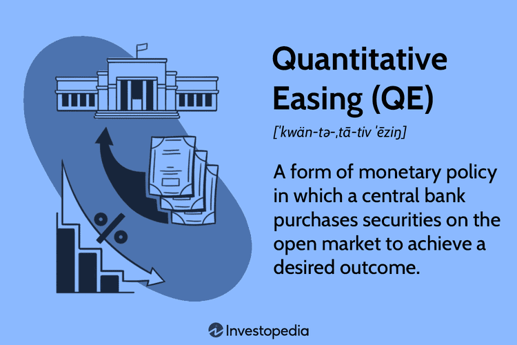

The interplay between stock markets, economic policy, quantitative easing (QE), and algorithmic trading forms a complex web that significantly influences the global financial landscape. Understanding these concepts is crucial for investors, as they collectively shape both short-term market movements and long-term economic trends. Stock markets serve as a barometer of economic health, reflecting investors' collective sentiment and expectations about future economic conditions. Economic policies, particularly those enacted by central banks, aim to stabilize or stimulate economies, affecting financial markets in the process.

Quantitative easing is a key tool of modern economic policy that involves large-scale asset purchases by central banks to inject liquidity into the economy. This injection aims to lower interest rates, foster lending, and stimulate economic activity. Originating in response to the 2008 financial crisis and utilized again amid the COVID-19 pandemic, QE has been pivotal in preventing economic downturns by propping up financial markets. This policy directly affects the money supply and indirectly influences stock prices, as increased liquidity often leads to higher asset valuations.



Algorithmic trading, characterized by the use of computer algorithms to execute trades at high speeds and volumes, has increasingly become a dominant force in financial markets. These algorithms can quickly integrate macroeconomic indicators, such as QE announcements, into trading strategies. This efficiency ensures that markets react rapidly to policy shifts, thereby magnifying the impact of economic interventions on stock prices.

For investors, the nexus of these elements—economic policy via QE, stock markets, and algorithmic trading—underpins investment decisions. Market responses to central bank actions can influence risk profiles and drive portfolio strategies. By understanding these interconnected mechanisms, investors can better anticipate market movements and potentially mitigate risks. The sections that follow will explore these themes further, providing insights into the multifaceted relationship between central banks' policies, market dynamics, and algorithmic trading strategies.

## Table of Contents

## Understanding Quantitative Easing (QE)

Quantitative Easing (QE) is a non-traditional monetary policy tool used by central banks to stimulate economic activity when standard monetary policy becomes ineffective. It involves the large-scale purchasing of financial assets, predominantly government securities, to increase the money supply and encourage lending and investment. The primary objective of QE is to lower interest rates and increase liquidity in the financial system, thereby supporting economic growth during periods of economic downturn or crisis.

Historically, QE has been employed during significant financial disruptions. One of the most notable implementations was during the 2008 financial crisis. In response to the collapse of major financial institutions and a severe economic downturn, the United States Federal Reserve initiated several rounds of QE to stabilize the financial system and promote recovery. The strategy involved purchasing large quantities of mortgage-backed securities and long-term Treasury bonds, aiming to lower long-term interest rates and restore market confidence.

Similarly, during the COVID-19 pandemic, central banks globally reintroduced or expanded QE programs as the pandemic-induced economic shock prompted a need for swift monetary intervention. The Federal Reserve, along with other central banks like the European Central Bank and the Bank of Japan, took aggressive QE measures to counteract the sharp economic contraction and support recovery efforts.

The impact of QE on money supply and interest rates is significant. By purchasing financial assets, central banks inject [liquidity](/wiki/liquidity-risk-premium) directly into the economy, increasing the overall money supply. This increase aims to lower borrowing costs by reducing interest rates, particularly those on long-term loans and securities, to encourage both individual and corporate borrowing and spending. 

Regarding stock markets, QE is often seen as a catalyst for asset price inflation. With more liquidity in the financial system and lower interest rates, investors typically seek higher returns in riskier assets, including stocks. This can lead to a rise in stock prices as demand increases. The influx of liquidity can also lead to a depreciating currency, making exports more competitive, thus indirectly benefiting companies and boosting their market valuations.

Evidence of QE's effect on boosting stock markets is observable in the positive market responses during and after QE announcements. For instance, during the 2008 financial crisis, the S&P 500 index experienced notable increases following each QE round, as investor sentiment improved and risk appetite returned. Similarly, the massive QE interventions during the COVID-19 pandemic supported a swift recovery in stock markets, leading to record-high valuations despite underlying economic uncertainties.

In conclusion, QE serves as an essential tool in modern economic policy, particularly during crises when traditional monetary tools fall short. Its implementation during the 2008 financial crisis and the COVID-19 pandemic underscores its vital role in enhancing liquidity, stabilizing markets, and fostering economic recovery. The impact on money supply, interest rates, and stock markets reflects the deep connections between central bank policies and the broader financial ecosystem.

## The Impact of QE on Stock Markets

Quantitative Easing (QE) is a significant monetary policy tool that has profound implications for stock markets. The correlation between QE and rising stock markets is well-documented, as the influx of liquidity tends to drive asset prices upward, benefiting equity investors. During QE periods, central banks purchase financial assets, such as government and corporate bonds, which injects liquidity into the economy and lowers interest rates. This creates an environment where equities often become more attractive to investors compared to bonds, due to the lower yield environment.

Investor expectations play a critical role in determining market performance during QE periods. When QE is announced or expanded, investors typically anticipate an increase in liquidity and a reduction in borrowing costs, which are conducive to economic growth and corporate profitability. As a result, investors often recalibrate their portfolios to include a higher proportion of equities, driving stock prices up.

Furthermore, QE influences risk-taking behavior among investors. The low-interest-rate environment associated with QE encourages investors to seek higher returns through riskier assets such as stocks. This phenomenon, known as the "portfolio rebalancing effect," explains why many investors shift away from safer assets (like bonds) during QE, contributing to higher stock market valuations.

Several case studies highlight significant market movements during QE periods. For instance, following the 2008 financial crisis, the Federal Reserve implemented several rounds of QE to stabilize the economy. The first round, QE1, commenced in late 2008 and correlated with a significant rally in the S&P 500 index, which saw a marked recovery from its 2009 lows. Similarly, the European Central Bank's QE program initiated in March 2015 coincided with an increase in equity markets across Europe, as investor confidence was bolstered by the improved liquidity conditions.

These examples underline the substantial impact that QE can have on stock markets, shaping investor behavior and market dynamics by altering risk preferences and valuation metrics. Understanding these interactions is crucial for investors seeking to navigate financial markets influenced by central bank policies.

## Algorithmic Trading in the Context of QE

Algorithmic trading has become increasingly dominant in financial markets, characterized by the use of computer systems to automate trading strategies. These strategies can execute orders at speeds and frequencies that are impossible for human traders. The rise of high-frequency trading ([HFT](/wiki/high-frequency-trading-strategies)), a subset of [algorithmic trading](/wiki/algorithmic-trading), has further cemented the role of algorithms in the modern financial landscape.

Quantitative Easing (QE) and its impacts provide a unique setting for algorithmic trading strategies. Macroeconomic indicators such as QE have a direct influence on financial markets by altering liquidity conditions and investor sentiment. Algorithms, designed to capitalize on market inefficiencies, can adapt their strategies based on these macroeconomic signals. For instance, an algorithm might increase trading [volume](/wiki/volume-trading-strategy) when QE announcements are expected, anticipating higher liquidity and [volatility](/wiki/volatility-trading-strategies). 

Central bank announcements regarding QE often trigger immediate market reactions. Algorithms, programmed to parse economic news and central bank meetings, can execute trades milliseconds after an announcement, capitalizing on the market's initial response. For example, speech recognition and natural language processing (NLP) techniques are used to analyze central bank statements in real-time, enabling algorithms to predict subsequent market movements based on the sentiment and keywords identified. 

```python
# Example of a simplified NLP model using sentiment analysis
import nltk
from nltk.sentiment import SentimentIntensityAnalyzer

nltk.download('vader_lexicon')
sia = SentimentIntensityAnalyzer()

statement = "The central bank has decided to maintain the current QE policy."
sentiment_score = sia.polarity_scores(statement)
print(sentiment_score)
```

Algorithmic trading during QE periods presents several risks and rewards. The increased liquidity resulting from QE can enhance trading conditions, allowing algorithms to perform efficiently with tighter bid-ask spreads and lower transaction costs. However, the same conditions can lead to increased market volatility, posing a risk to algorithms that are not robust against rapid price movements. Additionally, as many algorithms might follow similar news-triggered strategies, they can exacerbate market trends, contributing to flash crashes or bubbles.

Overall, while algorithmic trading can leverage the conditions created by QE for profit maximization, it must also navigate the heightened uncertainties and market dynamics induced by policy shifts. The adaptive nature of these trading systems underscores the necessity for continuous strategy updates to align with ongoing economic developments.

## The Role of Central Banks and Policy Makers

Central banks play a pivotal role in the economic landscape through their implementation of quantitative easing (QE). QE is an unconventional monetary policy tool used especially in times of economic distress. When standard monetary policies, such as lowering interest rates, become ineffective—typically because rates are already near zero—central banks resort to QE. Through QE, central banks purchase large amounts of financial assets, including government bonds and other securities, from the market. This process injects liquidity directly into the economy, aiming to lower longer-term interest rates, stimulate borrowing and investment, and thereby foster economic growth.

Quantitative Tightening (QT) stands in contrast to QE. While QE expands a central bank's balance sheet to increase money supply, QT reduces it by allowing bonds to mature without replacing them or by selling assets back into the market. This withdrawal of liquidity tends to increase interest rates, potentially slowing economic activity and curbing inflationary pressures.

The dual policies of QE and QT illustrate the balancing act central banks face. On one hand, during periods of economic stagnation or deflationary risk, central banks may employ QE to stimulate growth and encourage lending and spending. On the other hand, when inflation begins to rise to undesirable levels, QT may be employed to tighten financial conditions and stabilize prices.

Central banks, therefore, must navigate complex economic conditions and market sentiments. Accurate forecasting and careful timing are essential as missteps can lead to market volatility or unintended economic contractions. 

Future considerations for policymakers in a post-QE economic landscape involve assessing the long-term impacts of prolonged QE use. The accumulated large balance sheets of central banks can pose challenges in terms of mopping up excess liquidity without disrupting financial markets. Moreover, there is continuous debate about the effectiveness of QE in permanently boosting economic activity versus creating asset bubbles.

As economies gradually recover and gravitate towards normalcy, policymakers will need to recalibrate their strategies carefully, taking into account global economic interdependencies and financial stability. They must also consider the potential necessity and timing of QT measures, ensuring a gradual and transparent approach to avoid market panic, and focusing on communication to manage investor expectations effectively.

## When the Flow of QE Ends

Quantitative Easing (QE) has been a pivotal tool used by central banks to stimulate economic growth, particularly during financial crises. However, its eventual tapering or cessation can have significant repercussions on financial markets, prompting a need for careful consideration by investors and policymakers alike.

### Potential Impacts When QE Programs Are Tapered or Ended

When QE programs are scaled back or concluded, markets can experience increased volatility due to shifts in investor expectations and liquidity. During QE, central banks purchase large quantities of financial assets, thus injecting substantial liquidity into the market and often pushing asset prices higher. The cessation of these purchases may result in a withdrawal of this liquidity, leading to a re-evaluation of asset prices and potentially causing downward pressure on stock markets.

#### Historical Analysis of Market Reactions

Historically, the announcement or anticipation of reducing QE, commonly referred to as "tapering," can lead to immediate market reactions, often characterized by increased volatility and declines in asset prices. A notable instance occurred in 2013 when then-Federal Reserve Chairman Ben Bernanke signaled the possibility of tapering QE3, resulting in the so-called "Taper Tantrum." This led to a spike in bond yields and a sell-off in emerging market assets, illustrating how sensitive markets can be to changes in QE policy.

#### Long-Term Impacts on Company Valuations and Stock Market Stability

In the long term, the withdrawal of QE impacts company valuations and market stability. During QE, artificially low interest rates can inflate company valuations as investors seek higher returns in the stock market. When QE ends, rising interest rates may result, increasing borrowing costs and potentially leading to a contraction in corporate profits. This can prompt a reassessment of valuations, causing corrections in overvalued stocks and affecting overall market stability.

Moreover, the post-QE era might reveal underlying economic weaknesses that were masked by artificially buoyant asset prices, potentially leading to structural adjustments in the market. The removal of QE can expose the true health of economies, as businesses and consumers adjust to conditions without central bank support.

#### Speculations and Strategies for Investors Facing a Post-QE Market

Investors facing a post-QE market must navigate a complex landscape, balancing potential opportunities with increased risks. Strategic approaches might include diversifying portfolios to mitigate risk, focusing on sectors less sensitive to [interest rate](/wiki/interest-rate-trading-strategies) changes, and considering assets like commodities or real estate, which may offer a hedge against inflation and interest rate volatility.

Investors should also be attuned to central bank communications, as transparency and guidance can influence market expectations and subsequent financial strategies. Maintaining a flexible investment approach, which can adapt to evolving economic conditions and policy shifts, will be crucial for investors in a landscape devoid of QE support.

In summary, the end of QE represents a critical phase that can unsettle markets and affect both short-term and long-term economic dynamics. Understanding these impacts and preparing strategically can offer investors a way to navigate the transition from a QE-driven market to one governed more by intrinsic economic factors.

## Conclusion

The synthesis of quantitative easing (QE), stock markets, and algorithmic trading highlights the intricate connections between economic policy and financial market dynamics. Throughout the article, we discussed the pivotal role of QE, an unconventional monetary policy tool employed by central banks to stimulate the economy by increasing money supply and lowering interest rates. Its historical application during significant events like the 2008 financial crisis and the COVID-19 pandemic underscored its crucial impact on investor behaviors and market trends.

Understanding the influence of QE on stock markets is essential for investors, as it often correlates with market rallies by boosting asset prices through enhanced liquidity and lower borrowing costs. QE can drive risk-taking behavior, as investors seek higher returns in a low-interest-rate environment. Instances from previous QE periods offer critical insights into how market movements can be significantly swayed by central bank actions.

Algorithmic trading, which leverages computational power to execute trades at high speed, further complicates the landscape. Algorithms are designed to respond instantly to macroeconomic indicators, such as central bank announcements regarding QE, offering both opportunities and risks. The interplay between [quantitative trading](/wiki/quantitative-trading) strategies and QE underscores the necessity for investors and policymakers to understand the potential repercussions of automated trading during monetary interventions.

Central banks, tasked with balancing growth stimulation and inflation control, find themselves at the core of these economic strategies. As they navigate between QE and its opposite, Quantitative Tightening (QT), policymakers face the challenge of managing market expectations and economic stability in a fluid economic environment. The anticipated repercussions of tapering or ending QE programs necessitate that investors remain vigilant and adaptive to evolving conditions.

In conclusion, recognizing the nuances of QE's interaction with stock markets and algorithmic trading is indispensable for making informed investment decisions. As the financial landscape continues to evolve, a comprehensive understanding of these intertwined elements will be crucial for navigating the future of economic policy and market dynamics effectively.

## References and Further Reading

1. **Bernanke, B. S. (2008).** "The Federal Reserve's Response to the Financial Crisis." Speech at the Economic Club of New York. [Federal Reserve Archive](https://www.federalreserve.gov/newsevents/speech/bernanke20081015a.htm).

2. **Krishnamurthy, A., & Vissing-Jorgensen, A. (2011).** "The Effects of Quantitative Easing on Interest Rates: Channels and Implications for Policy." Brookings Papers on Economic Activity. [Brookings Institution](https://www.brookings.edu/bpea-articles/the-effects-of-quantitative-easing-on-interest-rates-channels-and-implications-for-policy/).

3. **Hendershott, T., Jones, C. M., & Menkveld, A. J. (2011).** "Does Algorithmic Trading Improve Liquidity?" Journal of Finance, 66(1), 1-33. [Wiley Online Library](https://doi.org/10.1111/j.1540-6261.2010.01624.x).

4. **Friedman, M. (1968).** "The Role of Monetary Policy." American Economic Review, 58(1), 1-17. [JSTOR](https://www.jstor.org/stable/1831652).

5. **Gagnon, J., Raskin, M., Remache, J., & Sack, B. (2011).** "The Financial Market Effects of the Federal Reserve's Large-Scale Asset Purchases." International Journal of Central Banking, 7(1), 3-43. [IJCB](https://www.ijcb.org/journal/ijcb11q1a1.htm).

6. **Carpenter, S., Demiralp, S., Ihrig, J., & Klee, E. (2015).** "Analyzing Federal Reserve Asset Purchases: From whom does the Fed buy?" Journal of Banking & Finance, 52, 230-244. [ScienceDirect](https://doi.org/10.1016/j.jbankfin.2014.12.014).

7. **Haldane, A., Roberts-Sklar, M., Wieladek, T., & Young, C. (2016).** "QE: The Story So Far." Bank of England Staff Working Paper No. 624. [Bank of England](https://www.bankofengland.co.uk/working-paper/2016/qe-the-story-so-far).

8. **Brunnermeier, M. K., & Pedersen, L. H. (2009).** "Market Liquidity and Funding Liquidity." Review of Financial Studies, 22(6), 2201-2238. [Oxford Academic](https://doi.org/10.1093/rfs/hhn098).

9. **Woodford, M. (2012).** "Methods of Policy Accommodation at the Interest-Rate Lower Bound." Jackson Hole Economic Policy Symposium. [Federal Reserve Bank of Kansas City](https://www.kansascityfed.org/publications/research/escp/jackson-hole/).

10. **"Quantitative Easing Explained."** European Central Bank. [ECB](https://www.ecb.europa.eu/explainers/show-me/html/app_driving_explainer.en.html).

These sources provide a comprehensive understanding of quantitative easing, its impact on financial markets, and its integration with algorithmic trading strategies. For further exploration, readers may also find value in reviewing the listed research studies and articles.

## References & Further Reading

[1]: Bernanke, B. S. (2008). ["The Federal Reserve's Response to the Financial Crisis."](https://archive.org/details/federalreservefi0000bern) Speech at the Economic Club of New York. Federal Reserve Archive.

[2]: Krishnamurthy, A., & Vissing-Jorgensen, A. (2011). ["The Effects of Quantitative Easing on Interest Rates: Channels and Implications for Policy."](https://www.brookings.edu/wp-content/uploads/2016/07/2011b_bpea_krishnamurthy.pdf) Brookings Papers on Economic Activity. Brookings Institution.

[3]: Hendershott, T., Jones, C. M., & Menkveld, A. J. (2011). ["Does Algorithmic Trading Improve Liquidity?"](https://onlinelibrary.wiley.com/doi/full/10.1111/j.1540-6261.2010.01624.x) Journal of Finance, 66(1), 1-33. Wiley Online Library.

[4]: Friedman, M. (1968). ["The Role of Monetary Policy."](https://www.aeaweb.org/aer/top20/58.1.1-17.pdf) American Economic Review, 58(1), 1-17. JSTOR.

[5]: Gagnon, J., Raskin, M., Remache, J., & Sack, B. (2011). ["The Financial Market Effects of the Federal Reserve's Large-Scale Asset Purchases."](https://www.ijcb.org/journal/ijcb11q1a1.pdf) International Journal of Central Banking, 7(1), 3-43. IJCB.

[6]: Carpenter, S., Demiralp, S., Ihrig, J., & Klee, E. (2015). ["Analyzing Federal Reserve Asset Purchases: From whom does the Fed buy?"](https://www.federalreserve.gov/econres/feds/analyzing-federal-reserve-asset-purchases-from-whom-does-the-fed-buy.htm) Journal of Banking & Finance, 52, 230-244. ScienceDirect.

[7]: Haldane, A., Roberts-Sklar, M., Wieladek, T., & Young, C. (2016). ["QE: The Story So Far."](https://www.bankofengland.co.uk/working-paper/2016/qe-the-story-so-far) Bank of England Staff Working Paper No. 624. Bank of England.

[8]: Brunnermeier, M. K., & Pedersen, L. H. (2009). ["Market Liquidity and Funding Liquidity."](https://www.jstor.org/stable/30225714) Review of Financial Studies, 22(6), 2201-2238. Oxford Academic.

[9]: Woodford, M. (2012). ["Methods of Policy Accommodation at the Interest-Rate Lower Bound."](https://academiccommons.columbia.edu/doi/10.7916/D8Z899CJ) Jackson Hole Economic Policy Symposium. Federal Reserve Bank of Kansas City.

[10]: ["Quantitative Easing Explained."](https://www.investopedia.com/terms/q/quantitative-easing.asp) European Central Bank. ECB.