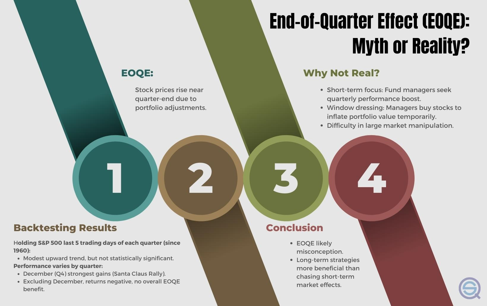

## Table of Contents

## What is a quarter-end in financial terms?

A quarter-end in financial terms refers to the last day of a three-month period within a company's fiscal year. Companies usually divide their fiscal year into four quarters, and the end of each quarter is important for financial reporting and analysis. This helps businesses and investors understand how the company is doing financially over shorter periods rather than waiting for the full year.

At the quarter-end, companies prepare financial statements like the income statement, balance sheet, and cash flow statement. These documents show the company's revenues, expenses, assets, liabilities, and cash movements for the quarter. This information is crucial for making business decisions, planning for the future, and meeting legal requirements for financial reporting.

## How does quarter-end affect portfolio management?

Quarter-end can have a big impact on how people manage their investment portfolios. This is because many investors and fund managers look at their investments at the end of each quarter to see how they are doing. They might decide to buy or sell certain investments based on how well they performed during the quarter. This can lead to a lot of trading activity around the quarter-end, which can cause prices to move up or down more than usual.

Also, some funds have rules about how they need to be balanced at the end of each quarter. For example, a fund might need to have a certain percentage of its money in stocks and a certain percentage in bonds. If the values of these investments have changed a lot during the quarter, the fund manager might need to buy or sell investments to get back to the right balance. This can affect the overall strategy and performance of the portfolio.

## What are the common strategies portfolio managers use at quarter-end?

At the end of each quarter, portfolio managers often look at their investments to see how they are doing. They might decide to sell investments that are not doing well and buy ones that they think will do better. This is called rebalancing. They might also try to make their portfolio look good for reports that they have to give to investors. This can mean selling some investments and buying others just to meet certain rules or targets they have set.

Another thing portfolio managers do at quarter-end is window dressing. This means they might sell stocks that have gone down in value and buy stocks that have gone up, even if it's just for a short time. They do this to make their portfolio look better in the reports they show to investors. It's like tidying up a room before guests come over. This can affect the prices of stocks and other investments around the quarter-end because a lot of managers might be doing the same thing at the same time.

## Can quarter-end reporting influence investment decisions?

Yes, quarter-end reporting can influence investment decisions a lot. When companies share their financial reports at the end of each quarter, investors look at these reports to see how well the companies are doing. If a company's report shows good profits and growth, investors might want to buy more of its stocks. But if the report shows the company is not doing well, investors might decide to sell their stocks or not buy any more.

This can also affect how fund managers handle their portfolios. They might change their investments based on what the quarter-end reports show. For example, if a report makes a company look good, many fund managers might start buying its stocks, which can push the stock price up. On the other hand, if a report makes a company look bad, many managers might sell its stocks, pushing the price down. So, quarter-end reports can lead to big changes in what investors and fund managers decide to do with their money.

## What are the potential risks associated with quarter-end portfolio adjustments?

Making changes to a portfolio at the end of a quarter can be risky. One big risk is that everyone might be trying to do the same thing at the same time. If lots of people are buying or selling the same stocks or other investments, it can make prices go up or down a lot very quickly. This can mean that you might end up buying something at a high price or selling something at a low price, which isn't good for your investment.

Another risk is that you might make decisions based on short-term results instead of thinking about the long term. When you look at how your investments did over just three months, you might decide to sell something that had a bad quarter, even if it could do well in the future. Or you might buy something that did well recently, but it might not keep doing well. This can lead to a lot of buying and selling, which can cost you money in fees and taxes, and it might not help your investments grow over time.

## How do regulatory requirements impact quarter-end portfolio management?

Regulatory requirements can really change how portfolio managers handle their investments at the end of a quarter. These rules might say that funds need to have a certain mix of stocks, bonds, and other investments. If the value of these investments has changed a lot during the quarter, managers might need to buy or sell things to meet these rules. This can mean making quick decisions that might not be the best for the long-term growth of the portfolio, but they have to do it to follow the law.

Also, some regulations require funds to report what they own at the end of each quarter. This can make managers do something called "window dressing," where they sell off investments that did badly and buy ones that did well, just to make their reports look better. While this might make the reports look good, it can lead to buying and selling that isn't really based on what's best for the investments. So, these rules can push managers to focus on meeting short-term requirements instead of thinking about what's best for the future of the portfolio.

## What metrics are most important to monitor at quarter-end?

At the end of each quarter, it's important to keep an eye on a few key numbers to see how your investments are doing. One big one is the return on your investments. This shows how much money you've made or lost over the last three months. Another important number is the volatility of your portfolio, which tells you how much the value of your investments has gone up and down. If your investments are very volatile, it might mean they're riskier than you thought.

Also, you should look at how well your investments are spread out. This is called diversification. If all your money is in just a few types of investments, you might be taking on more risk than you need to. It's good to have a mix of different kinds of investments to help protect your money. Finally, make sure to check your expenses and fees. These can eat into your returns, so it's important to keep them as low as possible.

## How can portfolio managers optimize performance during quarter-end?

Portfolio managers can optimize performance during quarter-end by focusing on rebalancing their portfolios. This means they should look at how their investments have changed over the last three months and make adjustments to keep the right mix of stocks, bonds, and other assets. If some investments have done really well, they might be a bigger part of the portfolio than they should be. So, managers might sell some of those to buy more of other investments that haven't done as well. This helps to spread out the risk and can make the portfolio more stable over time.

Another way to optimize performance is by keeping an eye on costs. Buying and selling investments can lead to fees and taxes, which can eat into the returns. So, managers should try to keep these costs low by not making too many changes all at once. They should also think about the long term instead of just trying to make the portfolio look good for the quarter-end report. By focusing on what's best for the future, managers can help their investments grow steadily over time.

## What role does window dressing play in quarter-end portfolio management?

Window dressing is when portfolio managers make their investments look good at the end of a quarter. They might sell stocks that have gone down in value and buy ones that have gone up, even if it's just for a short time. This makes their portfolio look better in the reports they show to investors. It's like cleaning up a room before guests come over. They do this because they want to show their investors that they are doing a good job, even if the changes they make don't really help the portfolio grow over time.

This practice can affect how well a portfolio does. When lots of managers are doing window dressing at the same time, it can push the prices of stocks up or down a lot. This might mean that managers end up buying stocks at high prices or selling them at low prices, which isn't good for their investments. Also, window dressing can make managers focus on short-term results instead of thinking about what's best for the long term. This can lead to a lot of buying and selling, which can cost money in fees and taxes, and might not help the portfolio grow as much as it could.

## How do different types of investors (e.g., institutional vs. retail) approach quarter-end differently?

Institutional investors, like big funds and pension plans, often have strict rules they need to follow at the end of each quarter. They might need to keep their investments in a certain mix, like having a set percentage in stocks and bonds. So, at quarter-end, they might buy or sell a lot to meet these rules. They also have to report what they own to their investors, which can lead them to do something called "window dressing." This is when they sell off investments that did badly and buy ones that did well, just to make their reports look better. They might also look at how their investments did over the last three months and make changes to try to improve their performance for the next quarter.

Retail investors, or regular people who invest their own money, usually don't have to follow the same strict rules as institutional investors. They might not even look at their investments every quarter. But some retail investors might still check their portfolios at the end of a quarter to see how they're doing. If they see that their investments did well, they might feel good and decide to keep them. If their investments did poorly, they might sell some and buy others that they think will do better. Retail investors might also be influenced by what they hear in the news or from friends, so their decisions at quarter-end can be more about feelings than strict rules.

## What advanced techniques can be used to predict and prepare for quarter-end market movements?

One advanced technique to predict and prepare for quarter-end market movements is to use quantitative analysis. This means using math and computers to look at lots of data from past quarters. By studying how the market moved in the past, you can try to guess what might happen next. For example, you might see that certain stocks go up or down a lot at the end of each quarter. If you notice these patterns, you can make smarter choices about when to buy or sell your investments. This can help you get ready for the changes that might happen at the end of the quarter.

Another technique is to use sentiment analysis. This involves looking at what people are saying on social media, in the news, and in financial reports to see how they feel about the market. If a lot of people are feeling positive, it might mean that stock prices will go up. If people are feeling negative, prices might go down. By understanding these feelings, you can predict how the market might move at the end of the quarter. This can help you decide whether to hold onto your investments or make changes to your portfolio to take advantage of the expected movements.

## How can historical quarter-end data be used to refine portfolio management strategies?

Looking at historical quarter-end data can help portfolio managers make their strategies better. By studying how the market moved at the end of past quarters, managers can find patterns and trends. For example, they might see that certain stocks or sectors tend to go up or down a lot at quarter-end. With this information, managers can decide when to buy or sell investments to get the best results. They can also use this data to see if their past decisions worked well or not, and then make changes to do better in the future.

Another way to use historical data is to understand how different events or news affected the market at quarter-end. If managers see that certain types of news, like economic reports or company earnings, often led to big market changes, they can prepare for similar events in the future. This can help them make smarter choices about their investments. By using historical data, portfolio managers can make their strategies more reliable and successful over time, which can lead to better returns for their investors.

## What is the significance of quarter-end for portfolio management?

Quarter-ends hold significant importance for portfolio management primarily due to the release of quarterly earnings reports. These reports provide updated financial information that investors and analysts use to assess the performance of companies. The reports facilitate crucial decision-making processes that often lead to the rebalancing of portfolios. Rebalancing involves the adjustment of asset allocations within a portfolio to align with specific investment goals and risk tolerances.

Institutional investors such as hedge funds and mutual funds pay particular attention to the quarter-end period as it provides a structured opportunity to evaluate portfolio performance against benchmarks. The release of earnings reports creates a surge in the availability of fresh data, enabling these investors to reassess their investment strategies and make necessary adjustments. For example, if a company reports better-than-expected earnings, an investor may choose to increase holdings in that company’s stock. Conversely, disappointing earnings might prompt reducing exposure or selling the stock entirely.

The process of rebalancing at the end of a quarter aligns with the investment strategy targeted by the fund, whether it's growth-oriented, value-based, or a balanced approach. The adjustments are crucial for maintaining the desired risk-reward ratio and ensuring that the portfolio's asset allocation reflects current market conditions and forecasts.

In quantitative terms, portfolio rebalancing could involve reallocating weights of various assets to maintain an optimal portfolio given the expected return $E(R)$ and the corresponding risk or [volatility](/wiki/volatility-trading-strategies) $\sigma$:

$$
\text{Rebalance to maintain: } \text{Maximize } \frac{E(R) - R_f}{\sigma}
$$

where $R_f$ is the risk-free rate. This formula, known as the Sharpe Ratio, is often used by investors to measure the performance of an asset or portfolio compared to a risk-free asset after adjusting for risk.

For institutional investors, the end of the quarter is also a time to strategically position themselves in anticipation of future market movements and economic changes. This strategic realignment is not only reactive to current performance data but also proactive in managing future expectations, helping funds meet their performance objectives while adhering to regulatory and fiduciary standards. 

In conclusion, quarter-end periods are critical for portfolio management as they allow investors to harness new financial data to refine their investment strategies, ensuring that portfolios remain well-aligned with their financial objectives and market conditions.

## What are the Rebalancing Strategies at Quarter-End?

Rebalancing strategies at quarter-end are a crucial component of portfolio management. This process involves the buying and selling of assets to maintain a desired portfolio allocation. The quarter-end is particularly opportune for rebalancing due to the release of updated financial performance data, which provides fresh insights into asset performance and market conditions.

The primary goal of rebalancing is to manage risk and ensure that the portfolio aligns with the investor's long-term goals and risk tolerance. As asset prices fluctuate throughout the quarter, the portfolio's allocation may drift away from its intended target. This drift can expose the portfolio to unintended risk levels or reduce its potential returns. By rebalancing, investors can realign the portfolio with its target allocation, thus maintaining the desired balance between risk and return.

### Mathematical Foundation of Rebalancing

To illustrate the concept, consider a simple example of a portfolio with two assets, A and B. Suppose the target allocation is 60% in asset A and 40% in asset B. If the value of asset A increases significantly over the quarter, it may now constitute, say, 70% of the portfolio. At the quarter-end, rebalancing would involve selling some of asset A and buying asset B to restore the 60/40 target allocation.

Using a mathematical approach, let $V_A$ and $V_B$ be the values of assets A and B, respectively. The target value ratio can be expressed as:

$$
\frac{V_A}{V_A + V_B} = 0.6 \quad \text{and} \quad \frac{V_B}{V_A + V_B} = 0.4
$$

If the current ratios deviate from these, rebalancing actions are required.

### Python Example for Rebalancing:

Below is a simple Python code snippet illustrating a basic rebalancing calculation:

```python
def rebalance_portfolio(values, target_allocations):
    total_value = sum(values)
    target_values = [total_value * alloc for alloc in target_allocations]

    buy_sell = [target - current for target, current in zip(target_values, values)]
    return buy_sell

# Example usage:
current_values = [7000, 3000]  # Current values of Asset A and B, respectively
target_allocations = [0.6, 0.4]  # Target allocations for Asset A and B

rebalancing_actions = rebalance_portfolio(current_values, target_allocations)
print(f"Adjustments needed: {rebalancing_actions}")
```

### Benefits of Rebalancing at Quarter-End

Rebalancing at the quarter-end enables investors to utilize recent performance data, making it an informed decision. It helps mitigate risks associated with market volatility by confluencing strategic focus with recent developments. Furthermore, quarter-end realignment of portfolios provides an opportunity to capitalize on tax strategies by offsetting gains with losses, which can ultimately enhance the portfolio's net return.

In summary, regular rebalancing, particularly at quarter-end, plays a vital role in maintaining consistency with investment strategies, safeguarding against elementary risk shifts, and adhering to holistic financial objectives.

## How can one implement effective quarter-end trading strategies?

To maximize returns during quarter-end periods, traders are encouraged to concentrate on data-driven and backtested strategies. This involves the systematic use of historical data to test trading strategies before deploying them in live markets. By simulating how a strategy would have performed in past market conditions, traders can refine their approaches and enhance predictive accuracy.

Key to the successful implementation of quarter-end trading strategies is robust risk management. Given the potential volatility during these times, employing comprehensive risk management frameworks is crucial. Techniques such as stop-loss orders, position sizing, and volatility scaling can prevent excessive losses. A simple stop-loss order can be defined as:

$$
\text{Stop Loss Price} = \text{Entry Price} - (\text{Entry Price} \times \text{Stop Loss \%})
$$

This formula helps ensure that any position is automatically exited once a set loss threshold is breached, protecting the trader from significant downturns.

Apart from managing risk, traders should adopt diversified approaches that align with long-term investment goals while also capturing short-term opportunities presented at quarter-end. Diversification can be achieved by spreading investments across multiple asset classes, industries, or geographic markets, reducing the impact of volatility in any single category.

To analyze and refine strategies, traders can employ [machine learning](/wiki/machine-learning) algorithms. Python, a popular programming language for financial modeling, offers a variety of libraries such as pandas for data manipulation, scikit-learn for machine learning models, and matplotlib or seaborn for visualization. An example of a simple machine learning model to predict market direction based on quarter-end data might look like this:

```python
import pandas as pd
from sklearn.model_selection import train_test_split
from sklearn.ensemble import RandomForestClassifier
from sklearn.metrics import accuracy_score

# Prepare data
data = pd.read_csv('market_data.csv')
X = data[['feature1', 'feature2', 'feature3']]  # Replace with actual features
y = data['market_direction']  # Target variable

# Split data into training and test sets
X_train, X_test, y_train, y_test = train_test_split(X, y, test_size=0.2, random_state=42)

# Train model
model = RandomForestClassifier(n_estimators=100, random_state=42)
model.fit(X_train, y_train)

# Predictions and accuracy
predictions = model.predict(X_test)
accuracy = accuracy_score(y_test, predictions)

print(f'Model Accuracy: {accuracy:.2f}')
```

By integrating data analysis, [backtesting](/wiki/backtesting), and algorithmic decision-making, traders can better navigate the complexities and opportunities of quarter-end trading. It is essential to maintain a balance between short-term adaptability and long-term strategy coherence to ensure overall success in portfolio management.

## References & Further Reading

**Algorithmic Trading Concepts**: For a comprehensive understanding of algorithmic trading and its integration with quarter-end strategies, consider reviewing the book "Algorithmic Trading and DMA" by Barry Johnson, which provides an in-depth look at advanced trading algorithms and market dynamics.

**Quarter-End Rebalancing Studies**: Examine the work of Grinold, R. C., & Kahn, R. N. in "Active Portfolio Management: A Quantitative Approach for Producing Superior Returns and Controlling Risk," which covers strategies for active portfolio management and rebalancing tactics, particularly effective at quarter-end periods.

**Market Volatility Research**: Study the findings in "Volatility and Return Dynamics of Dividend-paying Stocks with Reinvested Dividends" by Black, F., & Scholes, M., which explores market behaviors during specific financial periods, notably at quarter-end when volatility might increase.

**Empirical Analysis**: For empirical research on quarter-end trading strategies, refer to "The Cross-Section of Expected Stock Returns" by Fama, E. F., & French, K. R., which analyses stock return behaviors in relation to quarterly reporting cycles.

**Python Resources for Algorithmic Trading**: To implement algorithmic trading strategies using Python, tools like Zipline, an open-source algorithmic trading simulator, and the `pandas` library for data manipulation, can enhance strategy development. For example, a simple moving average crossover strategy can be implemented as follows:

```python
import pandas as pd

# Example data loading
data = pd.read_csv('stock_data.csv', parse_dates=True, index_col='date')

# Calculate the moving averages
short_window = 40
long_window = 100
data['short_mavg'] = data['close'].rolling(window=short_window, min_periods=1).mean()
data['long_mavg'] = data['close'].rolling(window=long_window, min_periods=1).mean()

# Strategy signal
data['signal'] = 0
data['signal'][short_window:] = np.where(data['short_mavg'][short_window:] > data['long_mavg'][short_window:], 1, 0)

# Execution of trading strategy
data['positions'] = data['signal'].diff()
```

**Further Learning Resources**: The [Financial Industry Regulatory Authority (FINRA)](https://www.finra.org/) provides guidelines and educational materials on regulatory practices affecting end-of-quarter trading activities. Additionally, resources such as the CFA Institute's publications offer insights into risk management and investment strategy adjustments necessary during these critical financial periods.

