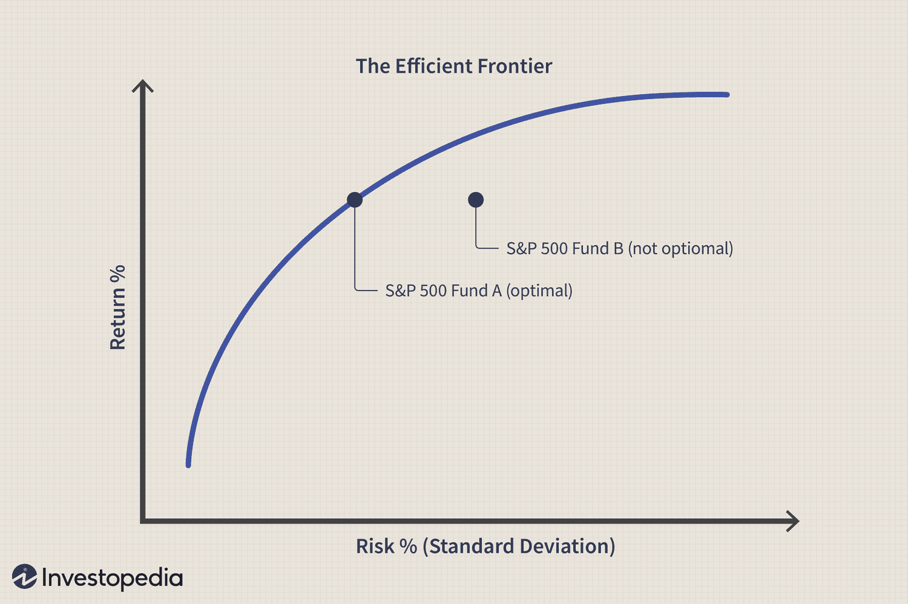

Quarter-end portfolio management represents a critical focus area for both individual and institutional investors, providing a structured opportunity for assessment and adjustment of investment strategies. The conclusion of a financial quarter is a period dense with financial disclosures, as companies release quarterly earnings reports that significantly influence market sentiment and investor decisions. These reports offer a detailed insight into a company's performance over the preceding three months, allowing investors to evaluate progress, realign strategies, and rebalance portfolios based on updated data and performance targets.

This period holds particular significance in the context of algorithmic trading. Algorithmic trading strategies exploit the increased data flow and market volatility typical at the end of financial quarters. Algorithms are designed to process large volumes of data at high speed, identifying patterns and executing trades faster than human traders could. By utilizing historical data and predictive analytics, these algorithms can capitalize on trends and adjust trading strategies with precision as new information becomes available.



The dynamic nature of the quarter-end period provides both challenges and opportunities. Investors and traders must navigate the complexities of portfolio rebalancing, market reactions to earnings reports, and potential changes in asset valuations. Understanding these elements enables investors to make informed decisions, mitigating risks while strategically positioning themselves to take advantage of emerging opportunities.

This article ventures into the nuances of quarter-end strategies, examining financial management practices and the role of algorithmic trading in optimizing portfolio performance. By understanding how quarter-end data influences market dynamics, investors can enhance both short-term and long-term investment outcomes.

## Table of Contents

## Understanding the Financial Quarter System

Financial quarters are designated three-month periods within a calendar year that companies utilize to report earnings and assess operational performance. This systematic division into quarters provides a structured approach to financial reporting and is essential for maintaining consistent communication with stakeholders and investors.

The financial year is divided into four quarters:

1. **Q1 (January to March)**: The first quarter of the year typically sets the tone for a company’s annual performance. It serves as a foundational period where initial strategic plans and forecasts are assessed. Events such as end-of-year holiday spending can influence the results reported in this quarter.

2. **Q2 (April to June)**: The second quarter marks a period where many companies experience transitional activities. This could include the launching of new products or services, as well as adjustments based on first-quarter performance analysis. The mid-year point often results in strategic evaluations and realignment of business objectives.

3. **Q3 (July to September)**: The third quarter is critical for evaluating market dynamics in the latter half of the year. Companies often prepare for the crucial fourth quarter by adjusting strategies and aligning with market trends observed during this period. External factors, such as back-to-school shopping in retail, can significantly impact performance.

4. **Q4 (October to December)**: The final quarter is often associated with heightened business activity driven by holiday sales and end-of-year financial settlements. Companies utilize this quarter for vigorous introspection and preparation for the upcoming fiscal year. It’s a vital period for ensuring that annual targets are met, and for projecting future outlooks.

For stakeholders and investors, quarters offer specific, repeatable timelines conducive to comprehensive financial analysis. Financial institutions, investors, and regulators rely heavily on quarterly reports to make informed decisions. The uniformity provided by these reporting intervals aids in comparing performance across different periods and among competing firms.

The structured timeline of financial quarters is instrumental for aligning corporate strategies with market realities, enabling businesses to navigate through economic variances effectively. This approach underpins critical decisions regarding investments, budgeting, and resource allocation.

## Significance of Quarter-End for Portfolio Management

Quarter-ends hold significant importance for portfolio management primarily due to the release of quarterly earnings reports. These reports provide updated financial information that investors and analysts use to assess the performance of companies. The reports facilitate crucial decision-making processes that often lead to the rebalancing of portfolios. Rebalancing involves the adjustment of asset allocations within a portfolio to align with specific investment goals and risk tolerances.

Institutional investors such as hedge funds and mutual funds pay particular attention to the quarter-end period as it provides a structured opportunity to evaluate portfolio performance against benchmarks. The release of earnings reports creates a surge in the availability of fresh data, enabling these investors to reassess their investment strategies and make necessary adjustments. For example, if a company reports better-than-expected earnings, an investor may choose to increase holdings in that company’s stock. Conversely, disappointing earnings might prompt reducing exposure or selling the stock entirely.

The process of rebalancing at the end of a quarter aligns with the investment strategy targeted by the fund, whether it's growth-oriented, value-based, or a balanced approach. The adjustments are crucial for maintaining the desired risk-reward ratio and ensuring that the portfolio's asset allocation reflects current market conditions and forecasts.

In quantitative terms, portfolio rebalancing could involve reallocating weights of various assets to maintain an optimal portfolio given the expected return $E(R)$ and the corresponding risk or [volatility](/wiki/volatility-trading-strategies) $\sigma$:

$$
\text{Rebalance to maintain: } \text{Maximize } \frac{E(R) - R_f}{\sigma}
$$

where $R_f$ is the risk-free rate. This formula, known as the Sharpe Ratio, is often used by investors to measure the performance of an asset or portfolio compared to a risk-free asset after adjusting for risk.

For institutional investors, the end of the quarter is also a time to strategically position themselves in anticipation of future market movements and economic changes. This strategic realignment is not only reactive to current performance data but also proactive in managing future expectations, helping funds meet their performance objectives while adhering to regulatory and fiduciary standards. 

In conclusion, quarter-end periods are critical for portfolio management as they allow investors to harness new financial data to refine their investment strategies, ensuring that portfolios remain well-aligned with their financial objectives and market conditions.

## Rebalancing Strategies at Quarter-End

Rebalancing strategies at quarter-end are a crucial component of portfolio management. This process involves the buying and selling of assets to maintain a desired portfolio allocation. The quarter-end is particularly opportune for rebalancing due to the release of updated financial performance data, which provides fresh insights into asset performance and market conditions.

The primary goal of rebalancing is to manage risk and ensure that the portfolio aligns with the investor's long-term goals and risk tolerance. As asset prices fluctuate throughout the quarter, the portfolio's allocation may drift away from its intended target. This drift can expose the portfolio to unintended risk levels or reduce its potential returns. By rebalancing, investors can realign the portfolio with its target allocation, thus maintaining the desired balance between risk and return.

### Mathematical Foundation of Rebalancing

To illustrate the concept, consider a simple example of a portfolio with two assets, A and B. Suppose the target allocation is 60% in asset A and 40% in asset B. If the value of asset A increases significantly over the quarter, it may now constitute, say, 70% of the portfolio. At the quarter-end, rebalancing would involve selling some of asset A and buying asset B to restore the 60/40 target allocation.

Using a mathematical approach, let $V_A$ and $V_B$ be the values of assets A and B, respectively. The target value ratio can be expressed as:

$$
\frac{V_A}{V_A + V_B} = 0.6 \quad \text{and} \quad \frac{V_B}{V_A + V_B} = 0.4
$$

If the current ratios deviate from these, rebalancing actions are required.

### Python Example for Rebalancing:

Below is a simple Python code snippet illustrating a basic rebalancing calculation:

```python
def rebalance_portfolio(values, target_allocations):
    total_value = sum(values)
    target_values = [total_value * alloc for alloc in target_allocations]

    buy_sell = [target - current for target, current in zip(target_values, values)]
    return buy_sell

# Example usage:
current_values = [7000, 3000]  # Current values of Asset A and B, respectively
target_allocations = [0.6, 0.4]  # Target allocations for Asset A and B

rebalancing_actions = rebalance_portfolio(current_values, target_allocations)
print(f"Adjustments needed: {rebalancing_actions}")
```

### Benefits of Rebalancing at Quarter-End

Rebalancing at the quarter-end enables investors to utilize recent performance data, making it an informed decision. It helps mitigate risks associated with market volatility by confluencing strategic focus with recent developments. Furthermore, quarter-end realignment of portfolios provides an opportunity to capitalize on tax strategies by offsetting gains with losses, which can ultimately enhance the portfolio's net return.

In summary, regular rebalancing, particularly at quarter-end, plays a vital role in maintaining consistency with investment strategies, safeguarding against elementary risk shifts, and adhering to holistic financial objectives.

## Algorithmic Trading and Quarter-End Strategies

Algorithmic trading at quarter-end provides traders with unique opportunities to optimize their strategies by leveraging newly released financial data. The end of each financial quarter often results in heightened market activity due to the release of quarterly earnings reports and adjustments by major institutional investors. This increased volatility can be beneficial for algorithmic traders looking to capitalize on short-term price movements.

One of the primary advantages of [algorithmic trading](/wiki/algorithmic-trading) during quarter-end periods is the ability to swiftly process and analyze vast amounts of data. By integrating data analysis algorithms, traders can quickly adapt their strategies in response to new information. For instance, [machine learning](/wiki/machine-learning) models can be used to predict price movements based on historical patterns and recent performance data. 

In Python, the integration of libraries such as pandas and numpy allows for efficient data manipulation and analysis. Here is an example of how traders might set up a basic strategy to monitor volatility and execute trades accordingly:

```python
import pandas as pd
import numpy as np

# Load financial data
data = pd.read_csv("financial_data.csv")
data['returns'] = data['close'].pct_change()

# Calculate rolling volatility (e.g., 20-day standard deviation)
data['volatility'] = data['returns'].rolling(window=20).std()

# Define a simple trading signal based on volatility thresholds
volatility_threshold = 0.02
data['signal'] = np.where(data['volatility'] > volatility_threshold, 1, -1)

# Execute trades based on signals
def execute_trades(signals):
    for index, signal in signals.iterrows():
        if signal['signal'] == 1:
            print(f"Buy signal on {signal['date']}")
        elif signal['signal'] == -1:
            print(f"Sell signal on {signal['date']}")

execute_trades(data[['date', 'signal']])
```

Algorithms can be tailored to react not just to volatility but also to other market indicators released at quarter-end, such as earnings per share (EPS) surprises, revenue growth figures, and changes in forward guidance. These metrics can be incorporated into predictive models to help traders make informed decisions.

Moreover, algorithmic traders benefit from the pre-programmed nature of their trading strategies, which allows for consistent execution devoid of emotional bias. This is particularly important during volatile periods when human traders might react impulsively to rapid market changes.

In summary, by utilizing sophisticated algorithms and rapid data processing capabilities, algo traders can efficiently navigate quarter-end market conditions, identify profitable opportunities, and adjust their positions in real-time.

## Challenges and Myths: End-of-Quarter Market Behavior

It's a common belief among investors that quarter-end periods witness market manipulation tactics such as "window dressing." This is when fund managers make strategic trades to improve the appearance of a portfolio's performance before reporting. Window dressing may involve selling losing stocks and buying securities that have performed well, aiming to create an impression of successful management to investors.

Empirical research on this behavior has produced mixed results. While some studies have identified patterns consistent with window dressing, such as increased buying and selling activity and unusual price movements toward the end of a quarter, others have found no definitive trends. For instance, academic investigations have explored whether stock return volatility increases perennially at quarter-end but often found inconsistencies in data across different markets and periods.

The phenomenon can affect stock volatility and provide opportunities for traders who are able to anticipate or react to these anomalies. However, this requires a robust understanding of underlying market mechanisms and data analysis. Backtesting strategies using historical data can be a method to determine if certain patterns recur consistently. For example, using Python, a trader could implement backtests to analyze quarter-end stock returns:

```python
import pandas as pd

# Load historical stock data
data = pd.read_csv('historical_stock_data.csv')

# Strip down to quarter-end dates
quarter_end_data = data[data['Date'].isin(['03-31', '06-30', '09-30', '12-31'])] 

# Calculate monthly returns
quarter_end_data['Return'] = quarter_end_data['Close'].pct_change()

# Analyze patterns
average_return = quarter_end_data['Return'].mean()
volatility = quarter_end_data['Return'].std()

print(f'Average Return at Quarter-End: {average_return:.2%}')
print(f'Return Volatility at Quarter-End: {volatility:.2%}')
```

Despite potential advantages, traders should remain cautious. Relating strategies exclusively to perceived end-of-quarter calendar effects without substantial evidence can expose traders to unnecessary risks. Market behavior is influenced by myriad factors beyond calendar-driven trades. Applying diversified strategies and integrating robustness checks can mitigate risks associated with end-of-quarter trading. Additionally, ensuring strategies are adaptable and consider market fundamentals rather than solely relying on anecdotal beliefs will enhance decision-making effectiveness and long-term success.

## Implementing Effective Quarter-End Trading Strategies

To maximize returns during quarter-end periods, traders are encouraged to concentrate on data-driven and backtested strategies. This involves the systematic use of historical data to test trading strategies before deploying them in live markets. By simulating how a strategy would have performed in past market conditions, traders can refine their approaches and enhance predictive accuracy.

Key to the successful implementation of quarter-end trading strategies is robust risk management. Given the potential volatility during these times, employing comprehensive risk management frameworks is crucial. Techniques such as stop-loss orders, position sizing, and volatility scaling can prevent excessive losses. A simple stop-loss order can be defined as:

$$
\text{Stop Loss Price} = \text{Entry Price} - (\text{Entry Price} \times \text{Stop Loss \%})
$$

This formula helps ensure that any position is automatically exited once a set loss threshold is breached, protecting the trader from significant downturns.

Apart from managing risk, traders should adopt diversified approaches that align with long-term investment goals while also capturing short-term opportunities presented at quarter-end. Diversification can be achieved by spreading investments across multiple asset classes, industries, or geographic markets, reducing the impact of volatility in any single category.

To analyze and refine strategies, traders can employ machine learning algorithms. Python, a popular programming language for financial modeling, offers a variety of libraries such as pandas for data manipulation, scikit-learn for machine learning models, and matplotlib or seaborn for visualization. An example of a simple machine learning model to predict market direction based on quarter-end data might look like this:

```python
import pandas as pd
from sklearn.model_selection import train_test_split
from sklearn.ensemble import RandomForestClassifier
from sklearn.metrics import accuracy_score

# Prepare data
data = pd.read_csv('market_data.csv')
X = data[['feature1', 'feature2', 'feature3']]  # Replace with actual features
y = data['market_direction']  # Target variable

# Split data into training and test sets
X_train, X_test, y_train, y_test = train_test_split(X, y, test_size=0.2, random_state=42)

# Train model
model = RandomForestClassifier(n_estimators=100, random_state=42)
model.fit(X_train, y_train)

# Predictions and accuracy
predictions = model.predict(X_test)
accuracy = accuracy_score(y_test, predictions)

print(f'Model Accuracy: {accuracy:.2f}')
```

By integrating data analysis, [backtesting](/wiki/backtesting), and algorithmic decision-making, traders can better navigate the complexities and opportunities of quarter-end trading. It is essential to maintain a balance between short-term adaptability and long-term strategy coherence to ensure overall success in portfolio management.

## Conclusion

Quarter-end periods are essential junctures for evaluating and optimizing financial strategies. They provide critical opportunities for both human and algorithmic traders to analyze newly released financial data and adapt their strategies accordingly. Understanding quarter-end dynamics can significantly enhance portfolio performance by allowing investors to effectively capitalize on trends and insights obtained during these periods.

At the heart of successful quarter-end strategies is the balancing act between short-term data-driven adjustments and long-term investment objectives. Traders who can interpret quarter-end information quickly, yet remain aligned with overarching financial goals, tend to maintain a competitive edge. This involves recognizing short-term market fluctuations while ensuring that these movements harmonize with the broader market outlook.

Algorithmic traders, in particular, gain an advantage by employing algorithms that swiftly react to quarter-end data releases. Such algorithms can optimize trading positions in real time, benefiting from increased market volatility often observed during this period. By backtesting strategies and incorporating risk management frameworks, traders can effectively mitigate potential downsides and leverage short-term opportunities.

Ultimately, the intersection of human insight and algorithmic precision during quarter-end periods presents a rich landscape for boosting portfolio performance. The challenge lies in integrating immediate data responses with consistent adherence to long-term investment strategies, ensuring sustainable and meaningful financial growth over time.

## FAQ

### FAQ

**What role does rebalancing play in quarter-end strategies?**

Rebalancing is a critical component of quarter-end strategies as it ensures that a portfolio remains aligned with the investor’s original goals and risk tolerance. During quarter-ends, investors have access to newly released financial reports, which provide updated data on individual asset performance and economic conditions. This updated information is crucial for making informed rebalancing decisions. The primary goal of rebalancing is to maintain a desired asset allocation by buying or selling assets to protect against excessive deviations due to market movements. By doing so, portfolio managers can manage risk more effectively and potentially improve returns over the long term. Mathematical portfolio optimization models, such as the mean-variance optimization, can be used to determine the optimal asset allocation post-rebalancing.

**How do quarterly reports impact market behavior?**

Quarterly reports significantly impact market behavior as they provide vital information on a company’s financial health, including earnings, expenses, and forward-looking guidance. Investors and analysts closely scrutinize these reports, and any deviation from expectations can lead to increased market volatility. A positive earnings surprise might lead to a surge in the company’s stock price, while a negative surprise could result in a decline. This often triggers a chain reaction, where individual and institutional investors adjust their portfolios based on the new data, leading to increased trading volumes and price adjustments in the broader market. Thus, quarterly reports are catalysts for market movements, influencing both short-term trading and long-term investment decisions.

**What are the risks associated with end-of-quarter trading?**

End-of-quarter trading comes with several risks that traders must consider. One prevalent risk is increased market volatility. As investors react to the new quarterly data, rapid price changes can occur, impacting both planned and existing trades. Additionally, the phenomenon known as "window dressing" might create temporary mispricing of assets, as fund managers reallocate assets to improve the appearance of their portfolios at quarter-end. Traders could be misled by these temporary fluctuations if they do not conduct a thorough analysis. Liquidity risk is another important consideration, as the high trading volumes typical at quarter-end might hamper the execution of trades at favorable prices. Lastly, there’s the risk of overreacting to short-term data, leading to decisions that could misalign with long-term investment goals. Prudent risk management practices are essential to navigating these challenges effectively.

## References & Further Reading

**Algorithmic Trading Concepts**: For a comprehensive understanding of algorithmic trading and its integration with quarter-end strategies, consider reviewing the book "Algorithmic Trading and DMA" by Barry Johnson, which provides an in-depth look at advanced trading algorithms and market dynamics.

**Quarter-End Rebalancing Studies**: Examine the work of Grinold, R. C., & Kahn, R. N. in "Active Portfolio Management: A Quantitative Approach for Producing Superior Returns and Controlling Risk," which covers strategies for active portfolio management and rebalancing tactics, particularly effective at quarter-end periods.

**Market Volatility Research**: Study the findings in "Volatility and Return Dynamics of Dividend-paying Stocks with Reinvested Dividends" by Black, F., & Scholes, M., which explores market behaviors during specific financial periods, notably at quarter-end when volatility might increase.

**Empirical Analysis**: For empirical research on quarter-end trading strategies, refer to "The Cross-Section of Expected Stock Returns" by Fama, E. F., & French, K. R., which analyses stock return behaviors in relation to quarterly reporting cycles.

**Python Resources for Algorithmic Trading**: To implement algorithmic trading strategies using Python, tools like Zipline, an open-source algorithmic trading simulator, and the `pandas` library for data manipulation, can enhance strategy development. For example, a simple moving average crossover strategy can be implemented as follows:

```python
import pandas as pd

# Example data loading
data = pd.read_csv('stock_data.csv', parse_dates=True, index_col='date')

# Calculate the moving averages
short_window = 40
long_window = 100
data['short_mavg'] = data['close'].rolling(window=short_window, min_periods=1).mean()
data['long_mavg'] = data['close'].rolling(window=long_window, min_periods=1).mean()

# Strategy signal
data['signal'] = 0
data['signal'][short_window:] = np.where(data['short_mavg'][short_window:] > data['long_mavg'][short_window:], 1, 0)

# Execution of trading strategy
data['positions'] = data['signal'].diff()
```

**Further Learning Resources**: The [Financial Industry Regulatory Authority (FINRA)](https://www.finra.org/) provides guidelines and educational materials on regulatory practices affecting end-of-quarter trading activities. Additionally, resources such as the CFA Institute's publications offer insights into risk management and investment strategy adjustments necessary during these critical financial periods.

