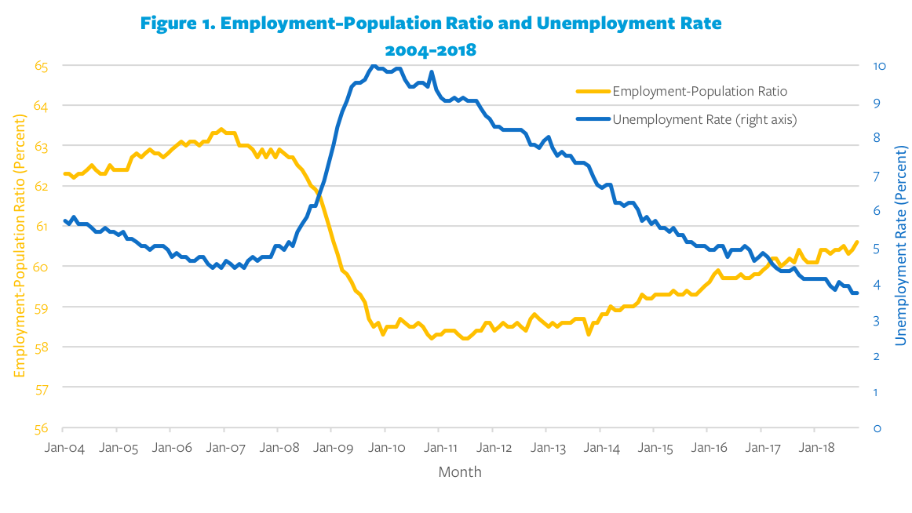

## Table of Contents

## What is a recession?

A recession is when the economy of a country slows down for a while. During a recession, people might lose their jobs, businesses might make less money, and it can be harder for people to buy things they want or need. Economists often say a recession is happening if the economy shrinks for two quarters in a row, which means six months.

Recessions can happen for many reasons. Sometimes, they start because people suddenly stop spending as much money. Other times, it might be because a big company fails or because of problems in other countries that affect the whole world's economy. Governments and banks try to help by lowering interest rates or giving out money to help people and businesses.

Even though recessions can be tough, they don't last forever. After a while, the economy usually starts to grow again. People find new jobs, businesses start making more money, and things get better. It's important for everyone to work together and stay hopeful during these times.

## How is unemployment defined?

Unemployment is when people who want to work can't find a job. It's measured by the number of people who are looking for work but are not employed. This number is usually shown as a percentage of the total workforce. For example, if 5% of people who want to work are unemployed, it means that out of every 100 people looking for work, 5 can't find a job.

There are different types of unemployment. One type is called "frictional unemployment," which happens when people are between jobs or just starting to look for work. Another type is "structural unemployment," which occurs when there's a mismatch between the skills workers have and the jobs that are available. "Cyclical unemployment" is linked to the ups and downs of the economy, like during a recession when many businesses cut jobs.

Unemployment can affect the economy in big ways. When a lot of people are out of work, they have less money to spend, which can slow down the economy even more. Governments often try to help by creating job programs or giving out unemployment benefits to help people while they look for work. Keeping unemployment low is important for a healthy economy.

## What are the typical causes of a recession?

Recessions can start for many reasons. One common cause is when people suddenly stop spending as much money. This can happen if people are worried about the future or if they've already bought a lot of things and don't need to buy more for a while. When people spend less, businesses make less money and might have to lay off workers. This can lead to even less spending, creating a cycle that pushes the economy into a recession.

Another cause of recessions can be big shocks to the economy, like a major company failing or a financial crisis. For example, if a big bank goes bankrupt, it can make it hard for other businesses to get loans, slowing down the whole economy. Problems in one country can also spread to others, especially in a global economy where countries trade a lot with each other. If a big economy like the United States or China slows down, it can affect the whole world.

Government policies can also play a role in causing or preventing recessions. If the government raises taxes or cuts spending too much, it can take money out of the economy and lead to a slowdown. On the other hand, if the government spends too much and creates a lot of debt, it can cause inflation and other problems that might lead to a recession. Balancing these policies is tricky but important for keeping the economy stable.

## How does a recession generally affect unemployment rates?

During a recession, unemployment rates usually go up. This happens because businesses make less money when people spend less. To save money, businesses might have to lay off workers or not hire new ones. When a lot of people are out of work, it's harder for them to buy things they need, which can make the recession worse. This cycle of less spending and more unemployment can keep going until the economy starts to recover.

Governments and central banks often try to help by lowering interest rates or giving out money to help people and businesses. These actions can make it easier for businesses to keep workers or hire new ones. But it takes time for these efforts to work, and unemployment might stay high for a while even after a recession officially ends. Keeping unemployment low is important for a healthy economy, so everyone tries their best to get through tough times like a recession together.

## Can you provide historical examples of recessions and their impact on unemployment?

One big recession happened in the United States in 2007-2009. It's called the Great Recession. It started because of problems in the housing market. Banks were giving out loans to people who couldn't pay them back, and when those loans failed, it caused a big financial crisis. During this time, the unemployment rate in the U.S. went up a lot. It went from about 5% in 2007 to over 10% in 2009. Millions of people lost their jobs, and it took years for the economy to get better.

Another example is the recession in the early 1980s. This one was caused by high inflation and high interest rates. The government raised interest rates to try to stop inflation, but it also slowed down the economy a lot. Unemployment in the U.S. went up from about 6% in 1979 to over 10% in 1982. Many people were out of work, and it was a tough time for a lot of families. But after a few years, the economy started to grow again, and unemployment went back down.

These examples show how recessions can lead to higher unemployment. When businesses struggle during a recession, they often have to let workers go. This makes it harder for people to find jobs, and it can take a long time for things to get back to normal. Governments try to help by creating jobs and supporting people who are out of work, but it's always a challenge to get through a recession.

## What economic theories explain the relationship between recessions and unemployment?

One important economic theory that explains the relationship between recessions and unemployment is called the business cycle theory. This theory says that economies go through ups and downs, kind of like a roller coaster. During the "down" part, which is a recession, businesses make less money and might have to lay off workers. This leads to higher unemployment. When the economy starts to go back up, businesses start hiring again, and unemployment goes down. The business cycle theory helps explain why unemployment rates go up during recessions and come back down when the economy recovers.

Another theory is called the Keynesian theory, named after the economist John Maynard Keynes. This theory focuses on how spending affects the economy. Keynes said that when people spend less money during a recession, it can make the recession worse because businesses make less money and have to lay off workers. This leads to even less spending and more unemployment. Keynes believed that the government should step in during a recession by spending more money to help the economy and reduce unemployment. His ideas have been used by many governments to try to fight recessions and keep unemployment low.

These theories show how closely linked recessions and unemployment are. When the economy slows down, businesses struggle, and more people lose their jobs. But when the economy starts to grow again, businesses do better, and they start hiring more workers. Understanding these theories helps economists and policymakers figure out how to help the economy and people who are out of work during tough times.

## How do different sectors of the economy experience unemployment during a recession?

During a recession, different sectors of the economy can feel the impact of unemployment in different ways. Some sectors, like construction and manufacturing, often see higher unemployment rates early in a recession. These industries are sensitive to changes in the economy because they rely a lot on people buying new homes or buying goods. When people stop spending as much money, construction projects might get canceled, and factories might not need as many workers to make products. This means more people in these sectors lose their jobs.

Other sectors, like healthcare and education, might not see as much unemployment during a recession. These sectors are often more stable because people still need medical care and education, even when the economy is struggling. But even in these sectors, there can be some job losses, especially if the government cuts spending on public services. Overall, the impact of a recession on unemployment can vary a lot depending on the sector, with some feeling the effects more quickly and strongly than others.

## What are the short-term versus long-term effects of recession on unemployment?

In the short term, a recession can cause a quick rise in unemployment. When businesses start making less money, they might have to lay off workers to save costs. This happens fast, and it can make a lot of people lose their jobs all at once. During this time, it's harder for people to find new jobs because businesses are not hiring as much. Governments might try to help by giving out unemployment benefits or starting job programs, but it can still be a tough time for many families who need to find work quickly.

In the long term, the effects of a recession on unemployment can last for years. Even after the economy starts to get better, it can take a long time for businesses to start hiring again. Some people might have to change careers or learn new skills to find work, which takes time. Also, if a lot of people have been out of work for a while, it can make the whole economy slower to recover. Governments and businesses work together to try to bring unemployment down, but it's a slow process that needs patience and effort from everyone.

## How do government policies respond to unemployment during a recession?

When a recession happens and more people lose their jobs, governments try to help by making special plans. One thing they do is give out unemployment benefits. This means people who are out of work get some money to help them pay for things they need while they look for a new job. Governments might also start job programs, where they create new jobs for people to do, like building roads or helping in schools. These programs can help people get back to work faster and keep the economy going.

Another way governments respond is by changing their spending and taxes. They might spend more money on things like building projects or helping businesses, which can create more jobs. At the same time, they might lower taxes so people have more money to spend. This can help businesses make more money and hire more workers. Governments also work with banks to lower interest rates, making it easier for businesses to borrow money and grow. All these steps are meant to help the economy recover and bring down unemployment over time.

## What are the social and psychological impacts of increased unemployment due to a recession?

When more people lose their jobs during a recession, it can make them feel really sad and worried. Losing a job can make someone feel like they're not good enough or that they've failed. This can lead to feeling down, anxious, or even depressed. It's hard to be out of work because it can make people feel like they don't have control over their lives. They might worry about money and how they'll pay for things they need, like food and a place to live. This stress can also make it hard for them to sleep well or enjoy time with family and friends.

Not having a job can also make people feel lonely. When someone is out of work, they might not see their friends from work as much, and it can be hard to stay connected with others. This loneliness can make their sadness and worry even worse. Families can also feel the strain when someone loses their job. It can lead to arguments or tension at home because everyone is stressed about money and the future. But it's important to remember that these feelings are normal during tough times, and there are people and resources that can help, like talking to a counselor or joining a support group.

## How can businesses prepare for and mitigate the effects of unemployment during a recession?

Businesses can get ready for a recession by saving money and not spending too much when times are good. They can put some money aside in case they need it later. It's also a good idea for businesses to have a plan for what to do if the economy slows down. This could mean finding new ways to make money or figuring out how to keep costs low. By being ready, businesses can help keep more people working even when things get tough.

During a recession, businesses can try to keep their workers by finding other things for them to do, even if they're not making as much money. For example, they could train workers to learn new skills that might be needed later. Businesses can also talk to their workers about what's happening and work together to find solutions. By being open and working as a team, businesses can help their workers feel more secure and stay with the company until things get better.

## What are the global implications of a recession on unemployment rates in interconnected economies?

When a recession happens in one country, it can affect other countries too because the world's economies are all connected. If a big economy like the United States or China goes into a recession, it can make other countries have more unemployment too. This happens because businesses in those countries might sell less stuff to the country that's in a recession. When businesses sell less, they might have to let workers go, which means more people are out of work in other countries as well.

To deal with this, countries around the world might work together to help each other. For example, they might make trade deals or share money to help businesses keep their workers. Governments can also change their own policies to help their people find jobs. Even though a recession in one country can cause problems everywhere, by working together, countries can try to keep unemployment from getting too bad and help the world's economy recover faster.

## What is the relationship between recession and unemployment?

A recession represents a noticeable and extensive downturn in economic activity, often spanning several months. This decline manifests in various economic indicators, such as decreases in GDP, income, employment, manufacturing, and retail sales. One of the most pronounced effects of a recession is the rise in unemployment. As economic demand decreases, businesses are compelled to adjust by cutting costs, often resulting in workforce reductions. This correlation between reduced demand and higher unemployment is particularly evident during economic downturns.

The 2007-2009 Great Recession is a significant historical example that illustrates how unemployment trends lag behind the overall economic recovery. Despite the technical end of the recession in 2009, unemployment rates remained high for an extended period, illustrating the persistence of labor market adjustments compared to other economic recovery metrics. This delay occurs partly because businesses are hesitant to hire until they are confident that economic conditions have sustainably improved.

Understanding the relationship between GDP growth and unemployment changes is crucial, and economic theories like Okun’s Law provide a framework for this analysis. Okun’s Law suggests an empirical relationship between the rate of GDP growth and changes in the unemployment rate. Specifically, it proposes that for every 1% increase in the unemployment rate, a country’s GDP will be approximately an additional 2% lower than its potential GDP. This relationship can be represented mathematically as:

$$
\Delta Y = k - c \times \Delta U
$$

where:
- $\Delta Y$ is the change in real GDP,
- $k$ is the average GDP growth unaffected by changes in unemployment,
- $c$ is a constant, typically around 2 for the United States,
- $\Delta U$ is the change in the unemployment rate.

Unemployment functions not only as a barometer for economic health but also as a significant [factor](/wiki/factor-investing) influencing consumer spending and the broader economic [momentum](/wiki/momentum). When unemployment rises, consumer confidence and spending often decrease due to reduced income and economic uncertainty. This decrease in consumer spending can further suppress economic growth, as consumer expenditure constitutes a substantial portion of GDP.

By analyzing unemployment trends, economists and policymakers can gauge the severity of recessions and identify appropriate interventions to bolster economic recovery. Understanding these dynamics aids in preparing strategies to mitigate the adverse impacts of recessional periods on employment and the broader economy.

## References & Further Reading

[1]: Sahm, C. R. (2019). ["Direct Stimulus Payments to Individuals."](https://www.hamiltonproject.org/assets/files/Sahm_web_20190506.pdf) The Hamilton Project.

[2]: Stock, J. H., & Watson, M. W. (2003). ["Understanding changes in international business cycle dynamics."](https://www.nber.org/papers/w9859) Journal of the European Economic Association.

[3]: Lopez de Prado, M. (2018). ["Advances in Financial Machine Learning."](https://www.amazon.com/Advances-Financial-Machine-Learning-Marcos/dp/1119482089) John Wiley & Sons.

[4]: Jansen, S. (2020). ["Machine Learning for Algorithmic Trading: Predictive Models to Extract Signals."](https://github.com/stefan-jansen/machine-learning-for-trading) 

[5]: Baker, S. R., Bloom, N., & Davis, S. J. (2016). ["Measuring Economic Policy Uncertainty."](https://academic.oup.com/qje/article/131/4/1593/2468873) The Quarterly Journal of Economics.
