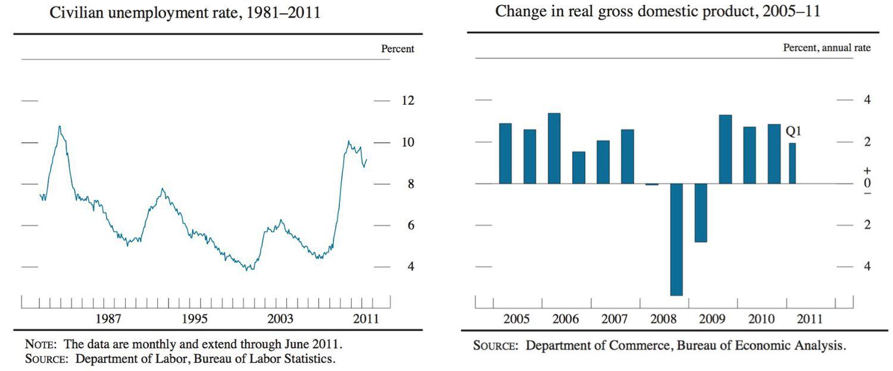

The interconnected world of economics experiences periodic cycles of growth and decline, which often lead to recessions impacting unemployment rates. Recessions, characterized by prolonged periods of economic contraction, can significantly disrupt labor markets, increasing unemployment as businesses cut back on their workforce in response to declining demand. 

In recent years, algorithmic trading has emerged as a sophisticated strategy to manage financial risks associated with these economic downturns. This form of trading leverages automated systems to execute trades based on predefined criteria, allowing market participants to respond swiftly to changing economic conditions.



Understanding the dynamic relationship between economic indicators, such as unemployment rates, and trading strategies is crucial for successfully navigating recessive periods. Unemployment is a critical indicator not only of economic health but also influences consumer behavior and overall economic momentum. During recessions, elevated unemployment levels can signal broader economic distress, impacting market confidence and investment decisions.

This article explores the interplay between recession, unemployment, macroeconomic principles, and the role of algorithmic trading. By analyzing the causes and effects of recessions and the significance of unemployment as a key economic indicator, we can better comprehend how algorithmic trading systems utilize these insights to inform trading strategies and manage risks. Through integrating economic indicators into trading algorithms, financial markets can enhance decision-making processes and optimize portfolio management during periods of economic uncertainty.

## Table of Contents

## Understanding Recession and Unemployment

A recession represents a noticeable and extensive downturn in economic activity, often spanning several months. This decline manifests in various economic indicators, such as decreases in GDP, income, employment, manufacturing, and retail sales. One of the most pronounced effects of a recession is the rise in unemployment. As economic demand decreases, businesses are compelled to adjust by cutting costs, often resulting in workforce reductions. This correlation between reduced demand and higher unemployment is particularly evident during economic downturns.

The 2007-2009 Great Recession is a significant historical example that illustrates how unemployment trends lag behind the overall economic recovery. Despite the technical end of the recession in 2009, unemployment rates remained high for an extended period, illustrating the persistence of labor market adjustments compared to other economic recovery metrics. This delay occurs partly because businesses are hesitant to hire until they are confident that economic conditions have sustainably improved.

Understanding the relationship between GDP growth and unemployment changes is crucial, and economic theories like Okun’s Law provide a framework for this analysis. Okun’s Law suggests an empirical relationship between the rate of GDP growth and changes in the unemployment rate. Specifically, it proposes that for every 1% increase in the unemployment rate, a country’s GDP will be approximately an additional 2% lower than its potential GDP. This relationship can be represented mathematically as:

$$
\Delta Y = k - c \times \Delta U
$$

where:
- $\Delta Y$ is the change in real GDP,
- $k$ is the average GDP growth unaffected by changes in unemployment,
- $c$ is a constant, typically around 2 for the United States,
- $\Delta U$ is the change in the unemployment rate.

Unemployment functions not only as a barometer for economic health but also as a significant [factor](/wiki/factor-investing) influencing consumer spending and the broader economic [momentum](/wiki/momentum). When unemployment rises, consumer confidence and spending often decrease due to reduced income and economic uncertainty. This decrease in consumer spending can further suppress economic growth, as consumer expenditure constitutes a substantial portion of GDP.

By analyzing unemployment trends, economists and policymakers can gauge the severity of recessions and identify appropriate interventions to bolster economic recovery. Understanding these dynamics aids in preparing strategies to mitigate the adverse impacts of recessional periods on employment and the broader economy.

## The Role of Economic Indicators

Economic indicators are essential tools in assessing the overall health of an economy and anticipating potential recessions. Among the core indicators are the unemployment rate, Gross Domestic Product (GDP), and consumer confidence. These metrics provide insights that can shape both policy-making and investment strategies.

The unemployment rate is a crucial indicator reflecting the percentage of the labor force that is jobless and actively seeking employment. An increase in unemployment typically signals economic distress, as businesses reduce workforce sizes in response to lower demand. This metric serves as a lagging indicator, often confirming periods of economic downturn post-facto. Understanding changes in unemployment data helps in predicting consumer spending trends, as rising unemployment often correlates with decreased consumer expenditure.

GDP is another cornerstone economic indicator, representing the total value of goods and services produced over a specific time period within a country. It serves as a measure of economic activity and health, with declining GDP growth rates often heralding recessionary periods. Okun's Law, for example, describes a relationship wherein for every 1% increase in the unemployment rate, GDP is expected to decrease by approximately 2%. Thus, economists and analysts closely monitor GDP figures alongside unemployment rates to gauge potential recessions.

Consumer confidence indices, meanwhile, quantify how optimistic consumers are about the state of the economy and their financial situations. High confidence levels generally precede increased consumer spending and economic expansion, whereas declining confidence can foreshadow reduced spending and economic contraction. Such indices are aggregated based on surveys that inquire about personal financial situations and overall economic outlooks.

The Sahm Rule is a refined approach that utilizes unemployment data specifically to predict recessions. Developed by economist Claudia Sahm, the rule signals a recession if the three-month moving average of the national unemployment rate increases by 0.5 percentage points or more, relative to its lowest point in the previous twelve months. This criterion provides a more immediate warning system compared to traditional unemployment metrics.

To effectively use these indicators, real-time data interpretation is vital. Economic data often undergoes revisions, and initial [statistics](/wiki/bayesian-statistics) may be subject to inaccuracies. Thus, continuous updates and revisions are integrated to ensure data precision. This aspect is critical for improving predictive accuracy, allowing for timely adjustments in both policy responses and market strategies.

Overall, understanding and interpreting the interaction between various economic indicators enable policymakers, businesses, and investors to make informed decisions. The combination of unemployment rates, GDP growth, and consumer confidence indices, complemented by tools like the Sahm Rule, provides a robust framework for anticipating economic health and potential recessions.

## Algorithmic Trading and Economic Cycles

Algorithmic trading is an advanced form of trading that leverages automation and real-time data processing to execute trades. It employs predefined parameters, allowing it to respond swiftly to market fluctuations that might be influenced by macroeconomic indicators such as the Sahm Rule. The Sahm Rule, which utilizes upticks in unemployment to signal a recession, can be incorporated into algorithmic strategies to optimize trading during economic downturns.

Algorithmic systems are capable of analyzing and processing vast quantities of data at speeds unattainable by human traders. This ability to identify patterns and trends enables these systems to adapt trading strategies rapidly, potentially identifying profitable opportunities or mitigating risks in volatile markets. For instance, by integrating economic indicators that predict recessive trends, such as heightened unemployment rates linked to the Sahm Rule, algorithms can recalibrate trading strategies to reflect expected economic downturns.

The primary aim of such algorithmic methodologies is risk management and capital optimization. By anticipating market conditions that correlate with recession indicators, trading algorithms can adjust portfolio allocations, choosing to buy, sell, or hold assets based on anticipated shifts in market dynamics. This is designed to safeguard investments from losses common during economic slowdowns and to take advantage of undervaluations when the market begins to recover.

Algorithmic trading works on the principle of defining trading criteria through a set of rules or algorithms—a mathematical and statistical framework—that continuously evaluates real-time data. These algorithms may use historical data, technical analysis, and macroeconomic signals to make informed predictions about asset price movements. For example, a simple Python implementation could be devised to automatically adjust investment portfolios based on changes in unemployment data:

```python
def adjust_portfolio(unemployment_rate):
    if unemployment_rate > threshold:  # threshold could be defined according to the Sahm Rule
        sell_assets()  # function to execute selling of certain asset classes
    else:
        buy_assets()  # function to execute buying of certain asset classes

unemployment_rate = get_unemployment_data()  # this function would retrieve current unemployment data
adjust_portfolio(unemployment_rate)
```

The effectiveness of [algorithmic trading](/wiki/algorithmic-trading) during economic cycles hinges on the precision of the input data and the robustness of the algorithms deployed. As the global financial environment grows increasingly complex, managing the dual objectives of risk mitigation and opportunity capitalization becomes critical. Algorithmic systems, armed with the capability to integrate sophisticated economic indicators, provide a structured yet flexible approach to navigating economic cycles with strategic agility.

## Implementing the Sahm Rule in Trading Strategies

The integration of the Sahm Rule into algorithmic trading strategies offers a precise and methodical approach to responding to recessionary signals. The Sahm Rule, developed by economist Claudia Sahm, leverages unemployment data to identify economic downturns, allowing traders to make timely and informed decisions. By incorporating this rule, algorithms are programmed to react to key economic indicators, such as a significant rise in unemployment rates, to trigger buy, sell, or hold decisions in investment portfolios.

Programming trading algorithms with inputs from the Sahm Rule involves first setting predefined criteria based on historical unemployment trends. These criteria are used to automate responses to economic changes. For instance, the Sahm Rule suggests that if the three-month moving average of the national unemployment rate rises by 0.5 percentage points or more compared to its low during the previous year, the economy is likely entering a recessionary phase. This threshold can be encoded into trading algorithms to trigger risk-averse actions, such as shifting to more stable or less volatile assets.

Consider the following basic Python function as a conceptual illustration of how the Sahm Rule might be applied in a trading algorithm:

```python
def sahm_rule_trigger(current_unemployment_rate, lowest_unemployment_rate_last_year):
    threshold = lowest_unemployment_rate_last_year + 0.5
    if current_unemployment_rate >= threshold:
        return "Adjust Portfolio"
    else:
        return "Hold"

# Example usage
current_rate = 4.5  # Current unemployment rate
previous_low = 3.8  # Lowest unemployment rate last year

decision = sahm_rule_trigger(current_rate, previous_low)
print("Decision:", decision)
```

The strategic integration of the Sahm Rule highlights the critical role that unemployment data plays in macroeconomic forecasting and market predictions. By interpreting unemployment trends as early indicators of shifts in economic conditions, algorithmic systems make it possible to adjust portfolios strategically. Consequently, portfolio management is optimized by reducing exposure to potential recession-induced losses, thus maintaining, or even enhancing, the portfolio's performance during economic downturns.

The precision of these algorithms ensures that traders can react swiftly to changes in economic indicators, thereby gaining an edge over more traditional, manual methods of portfolio adjustment. By responding automatically to signals suggested by the Sahm Rule, algorithmic trading systems ensure that assets are allocated efficiently, managing risk, and capitalizing on opportunities that may arise during a recession.

## Challenges and Considerations

Despite its utility, reliance on the Sahm Rule necessitates accurate unemployment statistics, which can be subject to revisions. The Sahm Rule operates based on a specific threshold in the unemployment rate increase that signals the onset of a recession[1]. However, initial unemployment data are often revised as more comprehensive information becomes available, potentially altering recession predictions. This introduces an inherent uncertainty in using real-time data and necessitates ongoing model adjustments to accommodate these changes.

Economic indicators may sometimes present conflicting signals, requiring a more nuanced strategy incorporating diverse data sources. While the Sahm Rule focuses specifically on unemployment trends, other indicators such as GDP growth, inflation rates, and consumer confidence must also be considered to form a holistic economic view. Each of these indicators may convey different aspects of economic health, and disparities between them can complicate the financial landscape[2]. For instance, a rising unemployment rate might intuitively suggest economic decline, yet it could coincide with other positive indicators, creating a mixed signal environment.

Overall market trends and geopolitical factors must also be considered for a comprehensive risk assessment. Markets do not operate in a vacuum; they are influenced by global events, policy changes, and geopolitical tensions. These factors can rapidly shift market dynamics independent of domestic economic indicators such as unemployment. The increasing interconnectedness of global economies means that what happens in one region can have far-reaching impacts elsewhere. A prime example is the impact of trade wars or geopolitical tensions, which can swiftly alter market sentiments and economic forecasts irrespective of national unemployment rates.

In dealing with these challenges, financial analysts and traders must adopt advanced methodologies to synthesize various data points and account for unpredictable external influences. For instance, implementing [machine learning](/wiki/machine-learning) models that integrate diverse economic indicators can enhance predictive accuracy by weighing the significance of each data source within its contextual relevance. Additionally, adaptive algorithms capable of learning from data revisions and historical trends may better accommodate the fluid nature of economic data, thus refining decision-making processes in algorithmic trading systems.

References:
1. Sahm, C. R. (2019). "The Sahm Rule recession indicator: Timely considerations for effective monetary policy." [Federal Reserve Economic Data].
2. Stock, J. H., & Watson, M. W. (2003). "Understanding changes in international business cycle dynamics." Journal of the European Economic Association.

## Future Implications

The future of algorithmic trading is poised for significant transformation, driven by advancements in [artificial intelligence](/wiki/ai-artificial-intelligence) (AI) and machine learning. These technologies are augmenting the capabilities of predictive models and real-time trading systems, allowing market participants to anticipate and respond to economic changes with increased precision. Predictive models now benefit from AI's ability to analyze complex and non-linear relationships within data, leading to enhanced forecasting of market conditions and economic cycles.

The integration of big data plays a crucial role in elevating the sophistication of trading algorithms. By processing vast and diverse data sets—including social media sentiment, economic indicators, and market news—algorithms become more adept at discerning patterns that might elude human analysis. This capability allows traders to develop strategies that are responsive not only to traditional economic indicators but also to new data sources that provide a more comprehensive view of the market landscape.

Future developments in algorithmic trading will prioritize the enhancement of predictive accuracy and the automation of decision-making processes. Automation minimizes human intervention, reducing latency in trading actions and enabling more timely reactions to market fluctuations. As a result, these systems can potentially improve risk management by implementing strategies that adjust dynamically based on continuous data analysis.

Moreover, the synergy between AI, machine learning, and big data in algorithmic trading will increasingly focus on improving the adaptability of trading algorithms. Machine learning models can iterate and learn from historical data and real-time inputs, continually refining their predictions and decision criteria. This iterative learning process promises to make trading strategies more resilient to unexpected economic shocks.

As technology evolves, the emphasis will be on developing more robust frameworks that incorporate diverse data types and real-time analytics to further enhance the efficacy of trading systems. The ongoing innovation in AI and machine learning is expected to continue streamlining the integration of economic indicators, thereby facilitating more informed and sophisticated trading decisions.

## Conclusion

Recessions and unemployment play a critical role in influencing economic landscapes and shaping trading strategies. During times of economic downturn, as businesses adjust to reduced demand, unemployment typically rises, impacting consumer spending and overall economic stability. Algorithmic trading has emerged as a dynamic solution, offering precise navigation through these economic cycles. By relying on automated systems that rapidly process vast quantities of data, algorithmic trading enables a swift response to economic shifts. 

The integration of the Sahm Rule and similar economic indicators provides traders and investors with valuable insights into market conditions, allowing for timely adjustments in market strategy. The Sahm Rule, specifically, leverages unemployment statistics to predict recessionary trends, thus informing trading decisions with data-backed foresight.

As technology evolves, the sophistication of trading algorithms continues to increase. Advances in artificial intelligence and machine learning are enhancing predictive accuracy, enabling the development of more robust real-time trading systems. The use of big data allows for the incorporation of complex economic analyses into trading frameworks, further refining strategies to protect against losses during recessional periods and to capitalize on potential market gains.

In conclusion, the amalgamation of economic insights with advanced algorithmic trading strategies supports more informed and resilient financial decision-making, equipping investors with the precision necessary to navigate the fluctuations of economic cycles effectively. As these technological and analytical techniques advance, they promise to further expand the possibilities for optimizing portfolio management in the face of economic uncertainty.

## References & Further Reading

[1]: Sahm, C. R. (2019). ["Direct Stimulus Payments to Individuals."](https://www.hamiltonproject.org/assets/files/Sahm_web_20190506.pdf) The Hamilton Project.

[2]: Stock, J. H., & Watson, M. W. (2003). ["Understanding changes in international business cycle dynamics."](https://www.nber.org/papers/w9859) Journal of the European Economic Association.

[3]: Lopez de Prado, M. (2018). ["Advances in Financial Machine Learning."](https://www.amazon.com/Advances-Financial-Machine-Learning-Marcos/dp/1119482089) John Wiley & Sons.

[4]: Jansen, S. (2020). ["Machine Learning for Algorithmic Trading: Predictive Models to Extract Signals."](https://github.com/stefan-jansen/machine-learning-for-trading) 

[5]: Baker, S. R., Bloom, N., & Davis, S. J. (2016). ["Measuring Economic Policy Uncertainty."](https://academic.oup.com/qje/article/131/4/1593/2468873) The Quarterly Journal of Economics.
