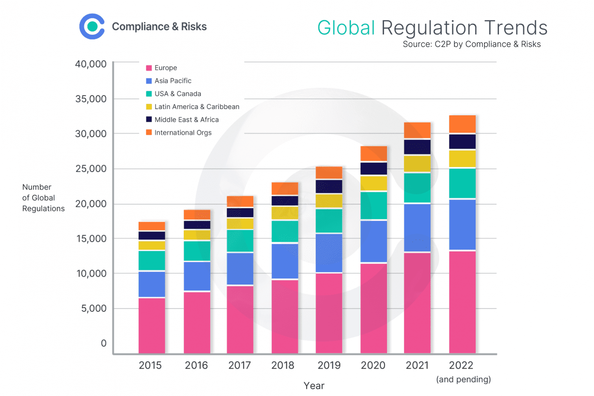

The electronics industry and algorithmic trading are both under significant regulatory scrutiny, which affects their operational efficiency and growth trajectories. These regulations are pivotal in ensuring the industries' compliance with global standards that prioritize environmental sustainability, consumer protection, and financial transparency. For businesses embedded within these sectors, a keen understanding of regulatory changes is vital to maintain competitive advantage and foster innovation.

This article aims to elucidate the complex interactions between the electronics industry, regulatory frameworks, and algorithmic trading. We will analyze the way regulations influence the electronics industry, the particular challenges algorithmic trading faces, and what these mean for business operations as a whole. Regulations dictate the pace at which the electronics industry can develop new technologies, influencing both product development and market accessibility. Meanwhile, algorithmic trading, characterized by its speed and efficiency, must align with regulations to prevent market manipulation and ensure ethical trading practices.

By understanding these dynamics, stakeholders can better navigate and strategize according to the complex realities of their respective industries. The convergence of regulations across these sectors necessitates a comprehensive approach to compliance and innovation. Businesses that effectively integrate regulatory requirements into their operational strategies position themselves to leverage potential opportunities and mitigate risks.

This exploration sets the stage for comprehending how these sectors are evolving and how regulatory frameworks play a defining role in shaping their futures. Through this understanding, stakeholders will be equipped to manage and adapt to the regulatory landscapes of the electronics and algorithmic trading industries.

## Table of Contents

## The Electronics Industry: A Highly Regulated Sector

The electronics industry is one of the most dynamic and rapidly evolving sectors in the global economy. However, it is also one of the most regulated. Regulations affecting this industry are primarily designed to ensure environmental sustainability and guarantee product safety.

### Environmental Regulations

One of the critical areas of regulation in the electronics industry is environmental protection. Many countries have enacted stringent environmental regulations designed to minimize the ecological impact of electronic products. For instance, the European Union's Restriction of Hazardous Substances Directive (RoHS) limits the use of specific hazardous materials found in electrical and electronic products. Similarly, the Waste Electrical and Electronic Equipment Directive (WEEE) aims to reduce electronic waste and promote recycling.

These regulations require companies to adopt eco-friendly manufacturing processes and manage electronic waste effectively, which often incurs significant compliance costs. These costs can impact the efficiency of supply chains and influence the pricing of end products. For businesses, this means investing in sustainable technologies and practices to reduce their environmental footprint and adhere to regulatory requirements.

### Product Safety Regulations

Ensuring product safety is another critical objective of the regulations governing the electronics sector. Safety standards are designed to protect consumers from potential hazards associated with electronic devices. Regulations such as Underwriters Laboratories (UL) certifications in the United States and CE marking in Europe are imperative for any electronic product entering these markets.

Compliance with these standards requires rigorous testing and quality control measures, which can further elevate production costs. Nevertheless, adherence to safety regulations is crucial, as it enhances consumer trust and provides a competitive advantage in global markets.

### Global Variability in Regulations

The regulatory landscape for the electronics industry varies significantly across countries. Developed countries usually have more robust regulatory frameworks focused on both environmental protection and consumer safety. In contrast, developing nations may have less stringent regulations, which can create disparities in global competition.

For instance, while some countries might demand comprehensive lifecycle assessments for electronic goods, others may have limited requirements. This variability necessitates that companies develop region-specific strategies to comply with the diverse regulatory environments effectively.

### Benefits and Challenges

The benefits of rigorous regulations in the electronics industry are manifold. They ensure higher standards of safety and contribute to environmental conservation efforts. However, these regulations also pose challenges, primarily by increasing production and operational costs. For businesses, the challenge lies in balancing these costs with the benefits of compliance, such as enhanced brand reputation and access to international markets.

### Strategic Compliance

Understanding the complex regulatory requirements is essential for companies in the electronics sector to remain competitive. Companies must strategically plan their operations, from design and manufacturing to distribution and disposal of electronic goods, to align with regulatory demands. This strategic approach not only aids in compliance but also positions companies favorably in a market increasingly conscious of sustainability and safety standards. 

By staying informed about regulatory changes and integrating compliance into their business models, stakeholders can not only mitigate risks but also leverage these regulations as opportunities for innovation and growth.

## Algorithmic Trading: Navigating Regulatory Challenges

Algorithmic trading has revolutionized the financial markets by utilizing computer algorithms to automate trading decisions and executions. This technology offers undeniable advantages in terms of speed and execution efficiency, enabling traders to capitalize on market opportunities with minimal human intervention. However, with these advantages come significant regulatory concerns, primarily centered around market manipulation and ethical implications.

One of the key regulatory challenges in [algorithmic trading](/wiki/algorithmic-trading) is the potential for market manipulation. Algorithms can execute trades at high speeds, which raises concerns about practices such as spoofing and layering. These practices involve placing and then canceling large orders to create false signals in the market, misleading other traders and potentially destabilizing the market. Due to these risks, regulatory bodies worldwide are intensifying their focus on algorithmic trading practices.

Regulators such as the Financial Conduct Authority (FCA) in the UK and the Securities and Exchange Commission (SEC) in the United States are at the forefront of addressing these challenges. They emphasize the importance of maintaining transparency and integrity within trading operations. These regulatory bodies have underscored the necessity for firms engaged in algorithmic trading to implement robust compliance measures.

For instance, the SEC has tightened its regulations around algorithmic trading through rules aimed at enhancing market stability and transparency. Rule 15c3-5, the Market Access Rule, requires brokers and dealers to comprehensively manage the financial and regulatory risks associated with market access. Similarly, the FCA has introduced guidelines emphasizing the need for firms to ensure that their trading algorithms do not compromise market integrity.

To align with regulatory expectations, firms involved in algorithmic trading must develop comprehensive governance and oversight policies. This includes regular testing and monitoring of trading algorithms to ensure compliance with regulatory standards and avoid unintended market disruptions. Additionally, firms are encouraged to establish internal controls and conduct periodic audits to detect and mitigate potential risks in their trading activities.

Developing these comprehensive policies involves incorporating advanced technology solutions to monitor trading activities and detect anomalous patterns indicative of non-compliant behavior. Utilizing technologies such as [machine learning](/wiki/machine-learning) can enhance the detection of irregular trading patterns and provide firms with the tools to proactively address potential regulatory breaches.

In conclusion, while algorithmic trading offers significant advantages in terms of speed and efficiency, it also presents unique regulatory challenges. By adopting and implementing robust compliance and oversight measures, firms can effectively navigate the complex regulatory landscape and contribute to a more transparent and ethical trading environment.

## The Intersection of Electronics and Algorithmic Trading

Both the electronics industry and algorithmic trading are essential components of the modern economy, and their intersection hinges significantly on understanding regulatory impacts. Regulations in the electronics sector often focus on environmental standards, safety, and innovation, all of which have downstream effects on algorithmic trading, particularly in the areas of technology and infrastructure.

Regulatory changes in one industry can ripple through to affect other sectors. For example, stringent environmental regulations in the electronics industry may push companies to innovate and produce more energy-efficient hardware. This can directly impact algorithmic trading firms, which rely heavily on high-performance computing systems to execute trades rapidly. The need for more efficient technology can lead to the development of new, faster processors and data handling systems, contributing to more effective algorithms and trading strategies.

Moreover, as regulations drive technological advancements, they also shape the tools and technologies employed in algorithmic trading. For example, the push for reduced electronic waste and increased recyclability can lead to the creation of modular components. Algorithmic trading firms can benefit from such innovations by utilizing hardware that is both more sustainable and adaptable to changing computational needs. 

Understanding the regulatory impacts across these sectors is crucial for businesses aiming to adapt operations and remain competitive. Firms engaged in either sector must recognize how regulatory changes can affect their business models and technological capabilities. Staying abreast of these developments enables firms to realign their strategies, ensuring compliance while taking advantage of new opportunities for technological advancement and cost reduction.

Stakeholders, including businesses, regulatory bodies, and industry groups, must remain informed of legislative and policy shifts to leverage potential benefits and mitigate challenges. Engaging proactively with regulatory bodies can help businesses anticipate changes and adapt their practices accordingly. This proactive approach not only ensures compliance but also fosters innovation that can lead to competitive advantages in both the electronics and algorithmic trading sectors. 

Ultimately, maintaining a proactive stance in understanding and responding to regulatory changes is essential for stakeholders to harness the full potential of technological advancements and sustain growth in an increasingly regulated global market.

## Adapting to Regulatory Changes: Strategies for Success

To navigate the regulatory landscape, businesses must invest in compliance and adapt their strategies to meet evolving requirements. This involves building robust compliance infrastructures and leveraging technology to streamline operations and reduce costs.

### Compliance Infrastructures and Technology

Developing comprehensive compliance systems is crucial for businesses operating in highly regulated sectors such as the electronics industry and algorithmic trading. These systems often include automated monitoring, reporting tools, and effective risk management practices. Automation, for instance, can facilitate real-time data analysis, allowing companies to identify and rectify compliance issues promptly. Advanced technologies, such as [artificial intelligence](/wiki/ai-artificial-intelligence) and machine learning, can predict regulatory changes and assess their potential impact, providing businesses with the agility needed to respond effectively.

### Engagement with Regulatory Bodies

Engaging with regulatory bodies is essential for understanding and anticipating changes in regulations that may impact the business landscape. Organizations should participate in industry groups and consultations to gain insights into forthcoming regulatory frameworks. Establishing open channels of communication with regulators can help ensure that businesses remain informed about compliance expectations and have the opportunity to provide feedback during the regulatory development process. This proactive approach allows companies to adjust their compliance strategies in anticipation of regulatory changes, minimizing disruptions to business operations.

### Cross-Industry Collaboration

Collaboration across different industry sectors can foster innovation in compliance approaches, benefiting both the electronics industry and algorithmic trading. By sharing best practices and technological advancements, businesses can improve compliance processes and reduce associated costs. Industry-wide initiatives, such as jointly developed compliance platforms, can standardize practices and improve transparency across sectors. Collaborations may also involve partnerships with technology firms that specialize in compliance solutions, offering tailored tools that address specific industry challenges.

### Staying Informed and Proactive

Staying informed about regulatory developments is critical for businesses seeking to minimize compliance risks while maximizing growth potential. This necessitates continuous education and training for employees to ensure they understand compliance requirements and the importance of adherence. Additionally, businesses should allocate resources to track regulatory updates, evaluating their implications on operations and strategic planning promptly. Employing dedicated compliance officers or teams can ensure that regulatory developments are consistently monitored and integrated into the company’s strategic framework.

In summary, strategic adaptation to regulatory changes enhances operational efficiency and market credibility. By investing in technology, engaging with regulators, collaborating across industries, and maintaining vigilance over regulatory trends, businesses can transform compliance challenges into strategic advantages.

## Conclusion

The interactions between the electronics industry, regulation, and algorithmic trading create a landscape filled with both obstacles and prospects for growth. In the electronics industry, regulations focusing on environmental sustainability and product safety play a pivotal role. Similarly, in algorithmic trading, regulatory measures aim to enhance market transparency and prevent manipulation. Both sectors must deeply understand these regulations to stay competitive and foster innovation.

As the regulatory framework continues to shift, businesses that proactively adapt and develop strategic foresight will find themselves at a distinct advantage. Companies that treat regulatory compliance not just as a requirement but as a strategic advantage can unlock greater operational efficiencies and bolster their market reputation. Implementing effective compliance systems can mitigate risk exposures, reduce operational bottlenecks, and enhance scalability. One way to leverage technology is through automated compliance checks that can be integrated into existing systems, ensuring real-time adherence to regulatory standards.

An agile approach to regulatory changes, characterized by rapid adaptation and a forward-thinking mindset, is essential for success in this evolving environment. Embracing industry collaborations and fostering open dialogue with regulatory bodies can also facilitate a smoother navigation of complex compliance landscapes. This approach not only aids in anticipating and adjusting to new regulations but also in seizing new business opportunities that arise from technological and regulatory innovation.

Ultimately, staying well-informed about policy shifts and remaining flexible in response to regulatory dynamics are crucial for thriving in the complex environments of both the electronics industry and algorithmic trading. With a robust strategy and keen foresight, businesses can transform regulatory challenges into opportunities for unprecedented growth and innovation.

## References & Further Reading

[1]: Directorate-General for Environment (European Commission). (2012). ["Guidance on the interpretation and implementation of directive 2002/95/EC on the restriction of the use of certain hazardous substances in electrical and electronic equipment (RoHS)."](https://eur-lex.europa.eu/legal-content/EN/TXT/?uri=CELEX%3A32002L0095)

[2]: European Parliament and Council. (2003). ["Directive 2002/96/EC on waste electrical and electronic equipment (WEEE)."](https://eur-lex.europa.eu/legal-content/EN/LSU/?uri=oj:JOL_2003_037_R_0024_01)

[3]: Financial Conduct Authority (FCA). (2018). ["Algorithmic Trading Compliance in Wholesale Markets."](https://www.fca.org.uk/publications/multi-firm-reviews/algorithmic-trading-compliance-wholesale-markets)

[4]: Securities and Exchange Commission (SEC). (2015). ["Market Access Rule: Rule 15c3-5."](https://www.ecfr.gov/current/title-17/chapter-II/part-240/subpart-A/subject-group-ECFR541343e5c1fa459/section-240.15c3-5)

[5]: Underwriters Laboratories (UL) Standards. (2019). ["UL Certification for Safety Standards in Electronics."](https://www.ul.com/news/ul-opens-catalog-safety-standards)

[6]: Walter, Christian, Arnold, Vincent. (2019). ["The Ethics of Algorithmic Trading"](https://academic.oup.com/book/27407) Wiley.