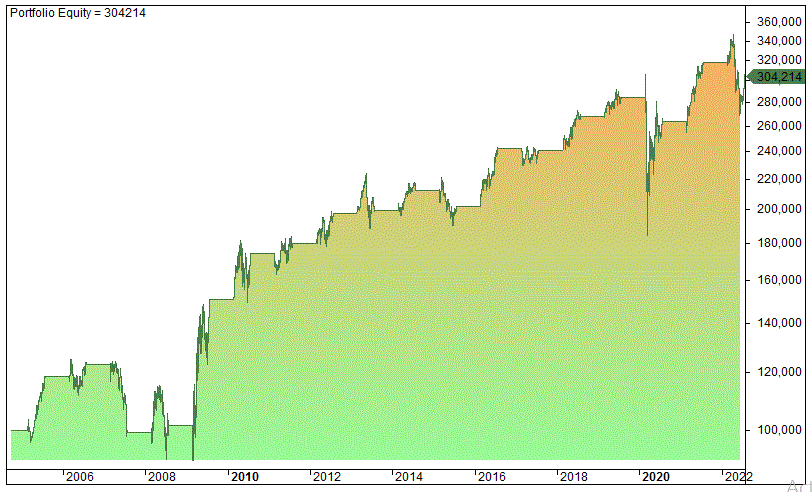

The housing market is characterized by a series of seasonal trends that significantly impact its dynamics throughout the year. These trends broadly refer to predictable patterns in real estate activities influenced by the various seasons: spring, summer, fall, and winter. For buyers, sellers, and investors, understanding these trends is crucial for informing timely and strategic decisions in the real estate market. For instance, spring is traditionally a period of heightened activity with increased listings and buyer interest, while winter often sees a slowdown due to fewer listings and less demand.

Recognizing these seasonal trends provides stakeholders in the housing market with a competitive edge. Buyers can take advantage of the demand dips in fall or winter to negotiate better prices, while sellers might target the spring or summer to capitalize on increased buyer interest. Investors can allocate their resources more effectively by anticipating market fluctuations associated with these seasonal changes.



Seasonal trends also play a pivotal role in influencing real estate decisions, including pricing strategies, marketing approaches, and inventory management. For example, knowing that summer typically experiences greater demand allows sellers to potentially list properties at higher prices. Conversely, winter's reduced competition might offer buyers better negotiating room.

In recent years, the concept of algorithmic trading, widely established in traditional financial markets, has begun to permeate the real estate sector. Algorithmic trading uses computational models to make trading decisions based on pre-defined criteria and large datasets. In the context of real estate, integrating algorithmic trading involves leveraging these vast data reservoirs to predict market behaviors and optimize investment decisions.

This article aims to explore the intriguing intersection between seasonal real estate trends and algorithmic trading. By examining how these trends can be incorporated into algorithmic models, the article outlines the potential for enhanced investment strategies that align with natural market rhythms. An understanding of both seasonal dynamics and algorithmic processes will enable market participants to optimize their involvement in the real estate sector, thereby gaining an upper hand in a rapidly evolving landscape.

## Table of Contents

## Understanding Seasonal Trends in the Real Estate Market

Seasonal trends in the real estate market refer to predictable patterns and fluctuations in housing activity that occur at different times of the year. These trends are influenced by various factors, including climatic conditions, cultural traditions, and economic cycles, and they can vary significantly by region.

Typically, the real estate market is divided into four seasons: spring, summer, fall, and winter. Each of these seasons has distinct characteristics that influence housing supply and demand.

1. **Spring:** Generally considered the most active season for real estate, spring often sees an increase in inventory, as more sellers list their homes in anticipation of higher demand. The improved weather conditions encourage potential buyers to visit properties. Historically, spring is marked by heightened buyer interest and competition, leading to potentially higher prices and quicker sales.

2. **Summer:** Activity remains robust in the summer, particularly early in the season. Families prefer to move when school is not in session, contributing to demand. However, as the season progresses, there can be a slight slowdown as vacations and hot weather impact buyer activity.

3. **Fall:** This season typically shows a tapering off from summer's activity but can still offer opportunities for buyers and sellers. Those listings that remain on the market may indicate more motivated sellers, potentially leading to price negotiations. The buyer pool may be smaller, resulting in less competition.

4. **Winter:** Traditionally the slowest season for real estate, winter months see reduced activity due to holidays and unfavorable weather conditions in many regions. However, this period may attract serious buyers who are less deterred by lower temperatures, and sellers who are more willing to negotiate on price.

Variations in these general patterns can be influenced by regional climates. For example, areas with milder winters, such as parts of the Southern United States, may experience less pronounced slowdowns in the winter season compared to northern regions with harsh winters.

### Historical Data and Pattern Analysis

Historical data plays a crucial role in understanding these seasonal trends. Analyzing previous years' sales volumes, price changes, and inventory levels can provide insights into what to expect in upcoming seasons. The data may reveal recurring patterns, such as peak months for sales or price drops during specific times. For instance, spring often shows a spike in both listings and sales, while winter might present an opportunity for buyers to negotiate lower prices due to decreased competition.

### Predicting Market Behavior

By leveraging historical data and understanding seasonal trends, market participants can better anticipate market behavior. For instance, investors could predict a likely increase in property values during spring and summer, aligning buying strategies to capitalize on anticipated appreciation. Conversely, buyers seeking value might aim for off-peak seasons like late fall or winter.

These seasonal insights allow buyers, sellers, and investors to make more informed decisions, optimizing their approaches based on expected market conditions. Understanding these patterns enhances the ability to strategize effectively, making real estate transactions more predictable and potentially more profitable.

## Factors Influencing Seasonal Real Estate Trends

Seasonal real estate trends are influenced by a variety of factors that converge to impact housing market dynamics throughout the year. These factors can be broadly categorized into weather, economic conditions, holidays, interest rates, government policies, societal trends, and consumer behavior.

Weather plays a significant role in shaping real estate activity across different seasons. In many regions, spring and summer months see increased real estate activity due to favorable weather conditions. Potential buyers are more inclined to visit properties and conduct viewings when the weather is agreeable. Conversely, harsh winter conditions can dampen market activity as inclement weather discourages property tours and open houses. Regions with mild winters, however, might experience a less pronounced drop in real estate transactions during the colder months.

Economic conditions are another crucial [factor](/wiki/factor-investing) influencing seasonal trends. Economic stability and growth often lead to increased consumer confidence, encouraging spending and investment in real estate. On the other hand, economic downturns can lead to cautious behavior among buyers and sellers, potentially reducing market activity. Seasonal economic indicators, such as holiday spending and year-end bonuses, can also affect the financial capability of buyers during different times of the year.

Holidays have a noticeable impact on real estate trends, as they often coincide with family gatherings and planned relocations. The holiday season, particularly at the end of the year, can slow down real estate transactions as both buyers and sellers may be preoccupied with personal commitments. However, the spring season tends to see a surge in activity as families look to purchase homes before the new school year begins.

Interest rates and government policies significantly impact the real estate market across all seasons. Interest rates determine the cost of borrowing for mortgages, influencing buyer affordability. Lower interest rates often stimulate buyer demand, leading to increased market activity. Government policies, such as tax incentives or homebuyer programs, can also vary seasonally, affecting real estate trends. For instance, first-time homebuyer incentives may encourage purchases at specific times of the year.

Societal trends and consumer behavior further contribute to seasonal variations in the real estate market. Shifts in societal norms, such as remote work flexibility post-pandemic, have altered seasonal real estate patterns by decoupling the traditional work-home location dynamic. Consumer behavior, driven by life events such as marriage, childbirth, or retirement, often follows predictable seasonal patterns. Families tend to seek new homes in spring and summer to accommodate these life changes, aligning with the availability of homes on the market.

Understanding these multifaceted influences is crucial for stakeholders within the real estate market, as they shape the ebb and flow of housing supply and demand across different times of the year. Leveraging knowledge of these factors can aid buyers, sellers, and investors in making informed decisions that align with seasonal market conditions.

## Real Estate Investment Strategies Based on Seasonal Trends

Real estate investment strategies leveraging seasonal trends require a keen understanding of the timing and patterns in property markets. These phenomena allow buyers, sellers, and investors to optimize their transactions, maximizing potential gains while minimizing risks.

### Strategies for Buyers, Sellers, and Investors

**1. Buying Strategy**

Spring and summer often see a surge in housing activity, marked by increased inventory and greater buyer interest. Buyers should aim to capitalize on the heightened supply characteristic of these periods to negotiate better deals. The abundance of choices allows for more thorough comparisons, often restraining price increases due to competition among sellers. Analytical tools can help pinpoint opportunities that may be undervalued relative to the seasonal index.

**2. Selling Strategy**

Spring is conventionally the optimal season for selling, driven by favorable weather conditions and familial timing - as many families prefer to relocate during summer school breaks. Sellers benefit from increased buyer activity, often resulting in higher selling prices. It’s prudent, however, to consider regional variations in these trends. For instance, warmer climates may not experience the same degree of seasonal fluctuation.

**3. Investment Strategy**

Investors can time the acquisition and disposition of properties to align with these seasonal trends. For example, purchasing properties in late fall or winter, when demand typically wanes, can lead to better pricing opportunities. These properties can then be sold after refurbishments during higher demand seasons at potentially significant mark-ups. To simulate potential returns, investors might apply time-series analysis on past market data using statistical tools such as Python's Pandas library to identify predictive seasonal patterns:

```python
import pandas as pd
import numpy as np

# Example code to calculate seasonal indices using monthly data
data = pd.read_csv('real_estate_data.csv')  # Hypothetical dataset
monthly_avg = data.groupby('month').mean()

seasonal_index = monthly_avg / monthly_avg.mean()
```

### Case Studies of Successful Seasonal Investments

A historical example includes investors leveraging foreclosures during the 2008 financial crisis. By purchasing distressed properties during winter months when competition was lower, investors realized substantial returns in the recovery period. Such case studies highlight the importance of timing and patience in realizing seasonal gains.

### Risks of Ignoring Seasonal Trends

Disregarding seasonal trends can lead to misvalued investments. For instance, buying property during peak seasons can mean overpaying when facing intense competition. Additionally, failing to sell before a market cooldown can result in prolonged property holdings and associated costs. Misalignment with seasonal patterns can also lead to suboptimal rental income, as tenant demand aligns closely with these trends.

Overall, understanding and incorporating seasonal patterns into real estate strategies can significantly impact profitability and the timing of returns in the real estate sector. Recognizing these patterns allows for strategic planning and aids in mitigating risks associated with market [volatility](/wiki/volatility-trading-strategies).

 to Algorithmic Trading in Real Estate

Algorithmic trading, traditionally associated with financial markets like stocks and [forex](/wiki/forex-system), involves using computer programs to execute pre-defined strategies for trading. Its primary appeal lies in its ability to process large datasets and perform trades at speeds and frequencies impossible for human traders. By utilizing complex algorithms, traders can identify patterns, execute trades, and manage risk with minimal human intervention.

While [algorithmic trading](/wiki/algorithmic-trading) has predominantly been applied in liquid markets, its principles are increasingly being used in real estate. The emergence of algorithmic strategies in real estate is driven by advances in big data analytics, [machine learning](/wiki/machine-learning), and automated transaction systems. These developments enable the analysis and prediction of market trends, thereby optimizing investment decisions.

The application of algorithmic trading in real estate provides several benefits. Speed is a crucial advantage, as algorithms can analyze vast datasets and execute transactions faster than manual processes. This capability is essential in a market where rapid shifts can occur due to numerous factors, including economic policies, demographic changes, and consumer behavior.

Efficiency is another significant advantage. Algorithms can continuously monitor multiple market variables, adjusting strategies in real-time without fatigue or oversight. This constant vigilance allows for better risk management and the ability to seize opportunities that might be missed by a human operator. By minimizing the emotional and psychological biases that often affect human decision-making, algorithmic systems offer a more objective approach to real estate investing.

Furthermore, algorithmic models can incorporate a wide range of data inputs, such as historical real estate prices, rental yields, macroeconomic indicators, and even social media sentiment. This holistic view enables a more nuanced understanding of market dynamics, facilitating more informed investment decisions.

In summary, algorithmic trading represents a transformative approach within the real estate industry. By leveraging advanced technologies, investors can achieve greater precision and responsiveness in their strategies, optimizing outcomes in an inherently complex and often unpredictable market.

## Integrating Seasonal Trends with Real Estate Algo Trading

Incorporating seasonal trends into algorithmic trading models for real estate begins with understanding the patterns and cycles that influence the housing market. These patterns, driven by factors such as weather, school schedules, and economic cycles, dictate fluctuations in housing demand and supply throughout the year. By analyzing these trends, investors and traders can optimize their strategies to maximize returns.

Data collection is the first step in recognizing these seasonal patterns. This involves gathering historical real estate data, including housing prices, sales volumes, and time-on-market [statistics](/wiki/bayesian-statistics). Additional data such as macroeconomic indicators, weather conditions, and demographic shifts are also valuable. These datasets can be sourced from government databases, real estate platforms, and market research reports.

Once the data is collected, the next step is to process and analyze it to uncover seasonal trends. Statistical models like time series analysis are commonly used to examine patterns in data over time. A common approach is decomposing the time series into trend, seasonal, and random components using techniques such as Seasonal-Trend Decomposition using Loess (STL) or moving averages. For example, if $y(t)$ represents the housing price at time $t$, it can be expressed as:
$$
y(t) = T(t) + S(t) + R(t)
$$
where $T(t)$ is the trend component, $S(t)$ is the seasonal component, and $R(t)$ is the residual or random component.

Machine learning algorithms, such as random forests or neural networks, can also be employed to identify complex patterns and relationships within the data. These models are trained on historical data to predict future market behavior and identify optimal buying or selling opportunities. The inclusion of seasonal variables as features in these models can significantly improve their accuracy and reliability.

Python offers a suite of tools and libraries for data analysis and algorithm development. Libraries like Pandas and NumPy are essential for data manipulation and processing, while Scikit-learn and TensorFlow facilitate the implementation of machine learning models. Visualization tools like Matplotlib and Seaborn can help in understanding the seasonal patterns in data.

For algorithmic trading in real estate, technological advancements have made it possible to execute trades swiftly and effectively. Automated trading platforms can be programmed to respond to signals derived from the seasonal analysis. These systems can continuously monitor the market and execute transactions based on predefined criteria, thus reducing human intervention and the potential for error.

One could write a simple Python script to simulate a basic algorithmic trading strategy based on seasonal trends:

```python
import pandas as pd
from sklearn.model_selection import train_test_split
from sklearn.ensemble import RandomForestRegressor

# Load historical real estate data
data = pd.read_csv('real_estate_data.csv')

# Feature engineering to include seasonal components
data['month'] = pd.to_datetime(data['date']).dt.month
data['year'] = pd.to_datetime(data['date']).dt.year

# Splitting data into training and testing sets
X = data[['month', 'year']]
y = data['price']
X_train, X_test, y_train, y_test = train_test_split(X, y, test_size=0.2, random_state=42)

# Training a Random Forest model
model = RandomForestRegressor(n_estimators=100, random_state=42)
model.fit(X_train, y_train)

# Predicting future prices
predictions = model.predict(X_test)

# (Further steps would involve integrating these predictions into a trading strategy)
```

Overall, integrating seasonal trends with algorithmic models offers a data-driven approach to real estate investment, allowing for timely and strategic decision-making. As the technology continues to evolve, these models will likely become more sophisticated, providing deeper insights and greater efficiency in the market.

## Challenges and Considerations in Algorithmic Real Estate Trading

Algorithmic trading in real estate presents a set of challenges and considerations that must be addressed for effective implementation and ethical use. Among the primary concerns is market volatility, which can significantly impact the performance of algorithm-driven decisions. The real estate market is inherently subject to fluctuations due to economic conditions, geopolitical events, and sudden changes in interest rates, all of which can create rapid price shifts and [liquidity](/wiki/liquidity-risk-premium) challenges. Algorithms must be equipped to adapt to these dynamics to prevent unexpected losses or inefficient trades.

Data quality is another critical factor influencing algorithmic trading in real estate. The models rely heavily on data accuracy and completeness to make informed decisions. Real estate data can be fragmented and inconsistent, often sourced from multiple providers with varying quality standards. Any discrepancies or biases in the data can lead to flawed predictions and suboptimal trading outcomes. Continuous efforts to enhance data collection, cleaning, and integration processes are essential to maintain the reliability of algorithmic systems.

Ethical considerations emerge prominently when using algorithms in real estate. The increasing automation of decision-making processes raises questions about fairness, transparency, and accountability. Algorithms can inadvertently reinforce existing biases present in historical data, leading to discriminatory practices in property valuations or investment decisions. It is crucial to implement ethical guidelines and conduct regular audits to ensure that algorithmic systems operate fairly and without unintended bias.

The market impact of algorithmic trading should not be overlooked. Large-scale algorithm-driven trades can influence market prices and introduce new forms of volatility. This phenomenon is especially pertinent in less liquid real estate markets, where significant trades can lead to price distortions or imbalances in supply and demand dynamics. To mitigate such impacts, regulatory frameworks may need to be established, governing the deployment and operation of algorithmic trading systems in real estate markets.

Despite the potential for automation, human oversight remains indispensable in algorithmic real estate trading. Experienced professionals must guide and monitor the algorithms to ensure their decisions align with strategic goals and ethical standards. Human intervention is crucial in adapting to unforeseen market conditions or in scenarios where algorithmic outputs deviate from expected patterns. This oversight serves as a safeguard against over-reliance on purely automated processes and helps maintain the human judgment that is often necessary for complex investment decisions.

In conclusion, while algorithmic trading offers numerous advantages in terms of speed and efficiency, its success in real estate hinges on effectively navigating challenges related to market volatility, data quality, and ethical implementation. A balanced approach that combines technological innovation with human expertise is vital to leveraging the full potential of algorithmic systems in real estate trading.

## Future Outlook: Technology and Seasonal Trends in Real Estate

As real estate trading continues to evolve with technological advancements, the integration of technology is poised to significantly influence the market, particularly in terms of algorithmic trading and the relatively predictable nature of seasonal trends. The increasing availability of big data, machine learning, and advanced analytics tools allows for more precise modeling and forecasting of market behaviors, potentially leading to more informed decision-making for stakeholders in real estate.

### Speculative Developments in Technology Affecting Real Estate Trading

The nature of real estate transactions is expected to become increasingly digitized, with blockchain technology offering a secure and efficient means of handling property transactions and smart contracts. The decentralized nature of blockchain could facilitate faster and more transparent transactions while reducing costs and mitigating fraud. Additionally, [artificial intelligence](/wiki/ai-artificial-intelligence) and machine learning algorithms can analyze vast amounts of market data, identifying patterns and trends with greater accuracy than traditional methods.

Virtual reality (VR) and augmented reality (AR) technologies are also likely to enhance the real estate buying experience, allowing buyers to tour properties remotely and assess potential investments in a virtual space. These technologies can make the buying and selling process more efficient and accessible, broadening the market's reach and appeal.

### Potential Changes in Seasonal Trends Due to Climate Change and Economic Shifts

Climate change is gradually altering weather patterns, which could disrupt established seasonal trends in the real estate market. For instance, regions that traditionally experience a high demand in spring and summer might shift as changing climates make certain areas less desirable or negatively affect infrastructure and habitability. This shift could necessitate adjustments in traditional strategies based upon historical data, compelling investors to adopt more dynamic, real-time methodologies for predicting seasonal demand variations.

Economic shifts, including changes in employment patterns and urbanization trends, could also impact real estate seasonality. As remote working becomes more prevalent, the demand for housing in suburban and rural areas might experience atypical seasonal patterns compared to urban centers. Investors and real estate professionals need to remain adaptable to these shifts, incorporating multifaceted economic indicators into their seasonal predictions.

### Enhancements in Algorithmic Real Estate Trading

Algorithmic trading in real estate will benefit from continual advancements in artificial intelligence and machine learning, allowing for real-time data processing and prediction modeling. Algorithms can be fine-tuned to account for the evolving patterns brought on by climate change and socio-economic factors by utilizing techniques like [deep learning](/wiki/deep-learning) and neural networks. These can analyze complex datasets to forecast market trends and provide actionable insights.

The development and deployment of Internet of Things (IoT) devices also hold potential in refining real estate market predictions. By collecting real-time data on housing conditions, energy usage, and environmental factors, algorithms can generate forecasts that consider an extensive array of variables previously unreachable, consequently improving the accuracy and reliability of predictive models.

In conclusion, technology continues to reshape the landscape of real estate trading by offering innovative tools for analysis and transaction execution. While seasonal trends remain a critical consideration, the influence of disruptive factors such as climate change and economic shifts necessitates adaptable strategies supported by sophisticated algorithmic tools. As these technologies advance, they are likely to provide more robust solutions for navigating the complex and dynamic real estate market.

## Conclusion

The examination of seasonal trends and algorithmic trading in the housing market underscores a significant opportunity for enhanced real estate investment strategies. Seasonal trends provide crucial insights into the variations in housing supply and demand throughout the year, characterized by predictable patterns such as increased activity in spring and summer and a slowdown in winter. These trends are influenced by factors including weather, economic conditions, interest rates, and social behaviors. Understanding them can lead to strategic timing in buying, selling, or investing in real estate.

Algorithmic trading, initially confined to the stock markets, has emerged as a powerful tool in real estate investment. By leveraging technology and data analysis, algorithms can quickly process vast amounts of information to identify optimal investment opportunities, thereby enhancing decision-making speed and efficiency. Integrating seasonal trends into algorithmic models can create sophisticated systems that anticipate market movements and improve investment outcomes.

The convergence of seasonal insights and algorithmic trading marks a pivotal evolution in real estate investment. However, challenges such as data reliability, market volatility, and ethical considerations underscore the need for robust systems and human oversight. As technological advancements continue to reshape the industry, staying adaptable and informed is essential for stakeholders looking to capitalize on these innovations. The future of real estate investment will likely be defined by those who can seamlessly merge traditional market understanding with cutting-edge technological tools.

## References & Further Reading

[1]: Wheaton, W. C. (1990). ["Vacancy, Search, and Prices in a Housing Market Matching Model."](https://www.jstor.org/stable/2937758) Journal of Political Economy, 98(6), 1270-1292.

[2]: Ngai, L. R., & Tenreyro, S. (2009). ["Hot and Cold Seasons in the Housing Market."](https://www.jstor.org/stable/43495363) American Economic Review, 99(1), 586-589.

[3]: Brown, L. F. (2004). ["The role of seasonality in economic time series."](https://papers.ssrn.com/sol3/papers.cfm?abstract_id=586423) Journal of Economic Perspectives, 53(2), 37-59.

[4]: Glaeser, E. L., & Gyourko, J. (2006). ["Housing Dynamics."](https://www.nber.org/papers/w12787) Harvard University Press.

[5]: Brooks, C. (2014). ["Introductory Econometrics for Finance,"](https://www.cambridge.org/highereducation/books/introductory-econometrics-for-finance/75E9C608EA95A3AD87FB3BC683B9EBBF) Cambridge University Press.