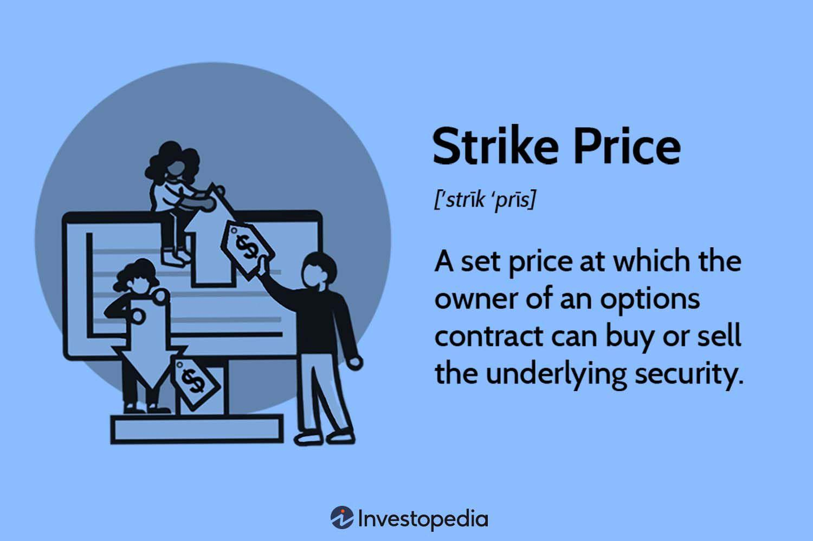

Options trading stands as a fundamental aspect of financial markets, offering a structured approach to gaining flexibility and profit potential via derivatives. Options are contracts granting the right, but not the obligation, to buy or sell an underlying asset at a predetermined price, known as the strike price, before or on a specific expiration date. These instruments provide significant versatility, allowing traders to tailor strategies that can leverage market conditions to their advantage.

This article explores the critical elements of options trading, primarily focusing on the significance of strike prices and the influence of algorithmic trading on securing advantageous positions and enhancing pricing efficiency. The strike price is a central component that significantly affects the profit or loss outcome of an options contract and is instrumental in determining the option's moneyness. Moneyness refers to the inherent value of an option, which can be classified as in-the-money, at-the-money, or out-of-the-money, each influencing the option's intrinsic and extrinsic value.



Algorithmic trading has become increasingly prominent in the fast-paced environment of options markets. By employing sophisticated computer algorithms, traders can automate strategies to optimize decision-making and execution speed. This technological integration not only enhances the ability to react to fluctuating market conditions swiftly but also helps in eliminating human biases that can impede success. Algorithms perform tasks ranging from simple executions to complex strategies like Straddles and Iron Condors, showcasing their strategic importance across different market environments.

Understanding the mechanics of options, including the impact of strike prices and algorithmic interventions, can furnish traders with profound insights into devising effective strategies and managing potential risks. This knowledge is crucial for optimizing trading outcomes and achieving a competitive edge in today's dynamic financial landscape. As options trading evolves, particularly with the integration of advanced technology, staying informed and adaptable remains vital for traders aiming to navigate this complex arena successfully.

## Table of Contents

## Understanding Strike Price in Options Trading

The strike price is a critical component in an options contract, representing the fixed price at which the holder can buy or sell the underlying asset upon exercising the option. Understanding strike prices is essential for traders as they play a significant role in determining the moneyness of an option, which in turn influences its intrinsic value and potential profitability. 

Strike prices are key factors in options valuation, affecting how attractive an option is to traders based on its moneyness: in-the-money (ITM), at-the-money (ATM), or out-of-the-money (OTM). An option is considered ITM when the strike price is favorable relative to the current market price of the underlying asset—specifically, a call option is ITM when the market price is above the strike price, and a put option is ITM when the market price is below the strike price. This implies that ITM options have intrinsic value, as they provide a profit if exercised immediately. For example, if a stock trades at $100, a call option with a strike price of $90 is ITM, possessing an intrinsic value of $10.

Conversely, ATM options have strike prices equal to the market price of the underlying asset, making them valuable primarily due to their time value and [volatility](/wiki/volatility-trading-strategies) rather than intrinsic value. An option is OTM when the strike price is not favorable for exercise based on the market's current state—where call options have higher strike prices than the current market and put options have lower strike prices. OTM options possess no intrinsic value but may still hold extrinsic (time) value.

Market conditions and trader sentiment significantly influence strike price selection. For instance, in volatile markets, traders might choose strike prices further away from the current market price to capitalize on expected movements. In stable or predictable markets, closer strike prices may be preferred to maximize the likelihood of the option being ITM at expiration.

In practical terms, a trader anticipating a significant upward movement in a stock priced at $100 might purchase a call option with a strike price of $110, expecting the stock to rise above this level before expiration. Alternatively, in a stable market or when hedging, a trader might select a strike price closer to the current market price, such as $105, to increase the chances of the option being ITM.

Understanding and strategically selecting strike prices enable traders to tailor their options strategies to align with market expectations and their risk tolerance, enhancing potential profitability and risk management.

## Moneyness and Its Impact on Options Valuation

Moneyness describes the status of an options contract relative to its current strike price and the market price of the underlying asset. It provides a way to classify the profitability and intrinsic value potential of options, which directly affects trading decisions.

### Categories of Moneyness

1. **In-the-Money (ITM):** 
   - *Call Options:* A call option is ITM when the current price of the underlying asset is higher than the strike price. For example, if a call option has a strike price of $50 and the asset is trading at $60, the option is ITM.
   - *Put Options:* A put option is ITM when the current price of the underlying asset is lower than the strike price. For instance, a put option with a strike price of $70 is ITM when the asset is trading at $60.

2. **At-the-Money (ATM):**
   - An option is considered ATM when the underlying asset's current price is equal to its strike price, making neither a profit nor a loss from the intrinsic value perspective. For example, if the asset is priced at $100 and both call and put options have a strike price of $100, they are ATM.

3. **Out-of-the-Money (OTM):**
   - *Call Options:* A call option is OTM when the current price of the underlying asset is below the strike price. For instance, a call option with a strike price of $50 is OTM if the asset is trading at $40.
   - *Put Options:* A put option is OTM when the current price of the underlying asset is above the strike price. For example, a put option with a strike price of $30 is OTM if the asset is trading at $40.

### Impact on Options Valuation

Moneyness influences both intrinsic and extrinsic values within options pricing. **Intrinsic value** refers to the profit that would be realized if the option were exercised immediately. In contrast, **extrinsic value** (also known as time value) reflects other factors affecting an option's price, including time remaining until expiration, volatility, and prevailing interest rates.

For ITM options, the intrinsic value is positive, providing a baseline profit potential. The intrinsic value of call options is calculated as $(\text{Current Asset Price} - \text{Strike Price})$, and for put options, it is $(\text{Strike Price} - \text{Current Asset Price})$. OTM options have no intrinsic value, meaning their price consists purely of extrinsic value, representing higher risk and potential premium decay as expiration approaches.

### Trading Decisions Influenced by Moneyness

Traders strategically use moneyness to capitalize on market movements. ITM options are often selected by traders seeking immediate intrinsic value and greater probability of profitability, leveraging predictable trends if the market direction aligns positively.

For example, a trader anticipating a rise in stock price might purchase ITM call options to capitalize on immediate gains. Conversely, ATM options are popular in strategies aiming to exploit time decay and volatility changes, given their sensitivity to external factors besides the asset price. Meanwhile, OTM options are more speculative, chosen for their lower cost and higher potential percentage gains if market movement makes them profitable before expiration.

Python can be used to calculate moneyness scenarios by simulating various market conditions:

```python
def option_moneyness(asset_price, strike_price, option_type):
    if option_type == 'call':
        if asset_price > strike_price:
            return 'In-the-Money'
        elif asset_price == strike_price:
            return 'At-the-Money'
        else:
            return 'Out-of-the-Money'
    elif option_type == 'put':
        if asset_price < strike_price:
            return 'In-the-Money'
        elif asset_price == strike_price:
            return 'At-the-Money'
        else:
            return 'Out-of-the-Money'
```

This Python function evaluates option moneyness, guiding traders in selecting the best opportunity to align with their strategy based on current market data.

## Algorithmic Trading in Options: An Overview

Algorithmic trading has transformed the landscape of options markets by implementing computer algorithms to automate and enhance trading strategies. This technology significantly benefits traders through speed, efficiency, and the removal of human biases, allowing for more precise trading actions. 

Algorithmic trading systems are designed to analyze large volumes of data at high speed, executing trades based on predefined criteria. This enables traders to capitalize on market opportunities more rapidly than manual trading methods. The algorithms can operate without the emotional influences that often skew human decision-making, leading to more consistent and rational trade execution.

In options trading, specific algorithmic strategies like the Straddle and Iron Condor are frequently utilized due to their strategic advantages. A Straddle involves buying both a call and a put option with the same strike price and expiration date. The objective is to profit from significant price moves in the underlying asset, regardless of direction. The algorithm can optimize such a strategy by efficiently identifying optimal entry and [exit](/wiki/exit-strategy) points based on real-time market data.

An Iron Condor strategy involves selling out-of-the-money call and put options while simultaneously buying further out-of-the-money call and put options on the same underlying asset and expiration. This strategy profits from low volatility when the underlying asset price remains within a certain range. Algorithms are adept at pinpointing these range-bound conditions, thereby enhancing the likelihood of executing a successful trade.

Algorithms in options trading utilize complex mathematical models to identify patterns and make swift trading decisions that humans cannot achieve manually. These models often incorporate key financial metrics such as implied volatility, historical price data, and market [liquidity](/wiki/liquidity-risk-premium). Python and other programming languages are commonly used to develop these algorithms, given their robust data processing capabilities and extensive libraries for financial analysis.

The implementation of [algorithmic trading](/wiki/algorithmic-trading) systems in options markets is not without its challenges, given the intricate nature of options contracts and the rapid pace at which market conditions can change. However, the strategic execution of algorithms like Straddle and Iron Condor, which have specific roles in options trading, underscores the profound impact algorithms have on improving trading competitiveness and efficiency.

## The Synergy of Strike Price and Algo Trading

Algorithmic trading has revolutionized the landscape of options trading by providing sophisticated tools for making timely and accurate decisions regarding strike prices. Algorithms can process large volumes of market data in real-time, facilitating enhanced execution speed and informed strike price selection. The optimal determination of strike prices can significantly impact the profitability and effectiveness of an options strategy.

**Optimizing Strike Price Decisions**: At the core of options trading strategies is the concept of the strike price, which plays a crucial role in determining the potential payoff of an options contract. Algorithms optimize strike price decisions by evaluating historical and real-time market data to identify patterns and trends. These algorithms consider multiple factors such as implied volatility, historical price movements, and macroeconomic indicators to propose strike prices that align with the trader's objectives, whether it be maximizing returns or minimizing risk.

**Execution Speed and Market Monitoring**: Algorithms excel in execution speed, enabling traders to capitalize on fleeting market opportunities. They continuously monitor market conditions, adjusting strategies in response to strike price movements. For example, if an algorithm detects a sudden increase in volatility, it might recommend a shift in strategy from an "at-the-money" option to an "in-the-money" option to capitalize on the changing market environment. This dynamic adjustment is crucial in a fast-paced trading environment where conditions can shift in the blink of an eye.

**Case Studies**:

1. **Market Volatility Adaptation**: A study showed that using algorithmic trading in a volatile market helped a financial firm adjust its strike prices in real-time based on predictive analytics of market movements. By employing machine learning models trained on historical data, the firm was able to forecast potential price swings and adjust their strike prices accordingly, which increased their return on investment by 15%.

2. **Profit Maximization through High-Frequency Trading**: Another case involved a high-frequency trading firm that utilized an algorithm to optimize the selection of strike prices in options trading. By integrating a latency-sensitive algorithm, the firm improved their order execution timing, significantly enhancing their opportunity to profit from short-term price movements. The study demonstrated a 20% jump in profit margins after the integration of algorithmic strategies.

By optimizing strike price decisions and enhancing execution capabilities, algorithmic trading provides traders with a strategic advantage. The ability to rapidly adapt to market conditions and execute trades with precision allows traders to not only realize more consistent profits but also mitigate risks associated with poor timing and incorrect strike price selections. As technology continues to advance, the synergy between computational algorithms and strategic decision-making is likely to deepen, leading to even more innovative approaches to options trading.

## Risks and Challenges in Options Algorithmic Trading

Algorithmic trading in the options market presents various risks and challenges that traders and firms must navigate carefully. One of the primary risks involves technical failures, which can arise from system glitches, coding errors, or network outages. These failures can lead to unintended trades or missed trading opportunities, potentially resulting in significant financial losses. To mitigate such risks, robust technical infrastructure and a thorough testing process for algorithms are essential. Regular system audits and redundant systems can further safeguard against disruptions.

Market volatility introduces another layer of complexity to algorithmic trading. Rapid price movements can lead to slippage, where the execution price deviates from the expected price. Algorithms must be designed to accommodate such volatility, employing mechanisms like dynamic adjustment of order limits and stop-loss strategies.

Regulatory considerations are crucial when implementing trading algorithms in options markets. Regulatory bodies, such as the Securities and Exchange Commission (SEC) in the United States, require firms to adhere to specific compliance standards. These include maintaining logs of algorithmic trading activities, implementing risk management controls, and providing transparency into trading strategies. Non-compliance can result in fines and legal action, making it imperative for organizations to establish comprehensive compliance frameworks.

To mitigate the risks associated with algorithmic trading, several strategies can be employed. Ensuring that algorithms are thoroughly backtested across a range of market conditions is critical. This involves simulating the algorithm's performance using historical data to identify potential weaknesses. Additionally, integrating [machine learning](/wiki/machine-learning) techniques can enhance the adaptability of algorithms, enabling them to learn from new market data and conditions.

Risk management protocols, such as setting limits on the number and size of trades, can prevent excessive exposure. Continuous monitoring of algorithm performance ensures that deviations from expected outcomes are promptly addressed. Furthermore, engaging in regular reviews of regulatory requirements keeps firms updated on compliance obligations.

In conclusion, while algorithmic trading in options markets offers significant benefits, it also presents considerable risks and challenges. By implementing thorough testing, compliance, and risk management strategies, traders can enhance the reliability and effectiveness of their algorithmic trading operations.

## Conclusion: The Future of Options Trading with Algorithms

Options trading, with its intricate balance of risk and reward, hinges significantly on a few critical elements. Among these, strike prices and algorithmic trading stand out as pivotal. Understanding the role of strike prices is essential, as they dictate the point at which an option can be exercised. This knowledge serves as the bedrock for determining an option's moneyness, which in turn influences its intrinsic and extrinsic value and ultimately guides trading decisions. When combined, strike prices and algorithmic trading form a powerful synergy capable of transforming options trading strategies to gain a competitive edge.

Algorithmic trading amplifies the potential of options trading by introducing precision, speed, and efficiency. These algorithms have the capability to analyze vast datasets, identify patterns, and execute trades with minimal human intervention, reducing biases and errors. As strike price selections often involve analyzing complex market conditions and potential future price movements, algorithms can optimize these decisions by rapidly processing information and adjusting strategies in response to market shifts.

Looking to the future, advancements in [artificial intelligence](/wiki/ai-artificial-intelligence) (AI) and machine learning (ML) are poised to further revolutionize options trading. The development of more sophisticated algorithms utilizing these technologies can enhance predictive accuracy and decision-making capabilities. These algorithms can model more variables and incorporate real-time data inputs, providing traders with sharper insights and automated responses to financial market dynamics.

For instance, [reinforcement learning](/wiki/reinforcement-learning)—a subfield of artificial intelligence—can be used to dynamically adjust trading strategies based on changing market environments. Here is a basic Python example that outlines how reinforcement learning might be applied to optimize an options trading strategy:

```python
import numpy as np

class OptionsTradingEnv:
    def __init__(self, initial_capital, strike_prices):
        self.capital = initial_capital
        self.strike_prices = strike_prices
        self.state = None

    def reset(self):
        self.state = np.random.choice(self.strike_prices)
        return self.state

    def step(self, action):
        reward = self._calculate_reward(action)
        self.state = np.random.choice(self.strike_prices)
        return self.state, reward

    def _calculate_reward(self, action):
        # Simplified reward calculation
        return self.capital * (0.01 * (self.strike_prices.index(action) + 1))

# Example usage
env = OptionsTradingEnv(initial_capital=100000, strike_prices=[100, 105, 110])
state = env.reset()
action = 105  # Select a strike price to exercise
state, reward = env.step(action)
```

This environment simulates capital interactions with different strike prices, providing a framework for training adaptive strategies.

As options trading becomes increasingly complex, integrating AI and ML can empower traders to navigate the dynamic marketplace effectively. Future trends suggest a continual rise in the adoption of these technologies, driving the development of coherent, data-driven trading strategies that not only address immediate market conditions but also anticipate future trends.

In conclusion, a robust understanding of strike prices combined with the capabilities of algorithmic trading can offer traders a significant advantage. By leveraging AI-driven strategies and continuing to explore innovative approaches, market participants can enhance their ability to navigate challenges, thereby setting the stage for sustained success in the ever-evolving world of options trading.

## References & Further Reading

[1]: Hull, J. C. (2017). ["Options, Futures, and Other Derivatives"](https://www.semanticscholar.org/paper/Options%2C-Futures%2C-and-Other-Derivatives-Hull/89bdee500c8623864fc9eb7a471546aa713acc44) (9th Edition). Pearson.

[2]: Johnson, R., and Faltin G. (2020). ["Algorithmic Trading and the Investment Decision"](https://www.kevindorst.com/uploads/8/8/1/7/88177244/johnson_2020_alg_bias.pdf). Coursera.

[3]: Lopez de Prado, Marcos. (2018). ["Advances in Financial Machine Learning"](https://www.amazon.com/Advances-Financial-Machine-Learning-Marcos/dp/1119482089). Wiley.

[4]: Chan, E. (2013). ["Algorithmic Trading: Winning Strategies and Their Rationale"](https://github.com/ftvision/quant_trading_echan_book). Wiley Trading.

[5]: Jansen, S. (2018). ["Machine Learning for Algorithmic Trading"](https://github.com/stefan-jansen/machine-learning-for-trading). Packt Publishing.

[6]: Kissell, R. (2013). ["The Science of Algorithmic Trading and Portfolio Management"](https://www.sciencedirect.com/book/9780124016897/the-science-of-algorithmic-trading-and-portfolio-management). Academic Press.