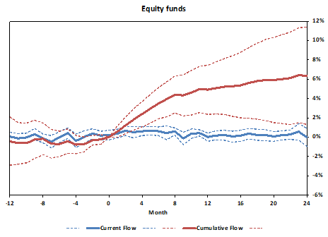

## Table of Contents

## What is a mutual fund?

A mutual fund is a type of investment where many people pool their money together to buy a variety of stocks, bonds, or other assets. It's like a big basket where everyone puts in some money, and a professional manager decides what to buy with it. This way, even if you don't have a lot of money, you can still invest in many different things.

Mutual funds are popular because they let you diversify your investments easily. Instead of buying just one stock or bond, you own a little bit of many different ones. This can help reduce risk because if one investment does poorly, the others might do well and balance it out. Plus, it's managed by experts, so you don't have to pick the investments yourself.

## How is the size of a mutual fund measured?

The size of a mutual fund is usually measured by its total assets under management (AUM). This is the total value of all the investments the fund holds. If a lot of people invest in the fund, the AUM will be bigger. If people take their money out, the AUM will be smaller. It's like a piggy bank where the size depends on how much money is inside.

AUM is important because it can show how popular a fund is. A bigger fund might mean more people trust it and want to invest in it. But size isn't everything. A smaller fund can still be a good choice if it's managed well and fits your investment goals. So, when you're looking at mutual funds, think about more than just the size.

## What are the different types of mutual funds?

There are several types of mutual funds, and each one is a bit different. One type is called a stock fund, which mostly invests in stocks of companies. These can be focused on growth, where the fund tries to buy stocks that will grow a lot in the future, or value, where the fund looks for stocks that are a good deal right now. Another type is a bond fund, which mainly invests in bonds. These are usually safer than stock funds because bonds pay back the money they borrow with interest, but they might not grow as much. There are also balanced funds, which mix stocks and bonds to try to balance risk and growth.

Another kind of mutual fund is a money market fund, which is very safe and focuses on short-term, low-risk investments like government securities. These funds are good if you want to keep your money safe and have it available when you need it. Then there are sector funds, which invest in specific parts of the economy, like technology or health care. These can be riskier because they depend a lot on how well that part of the economy does. Finally, there are index funds, which try to match the performance of a big group of stocks, like the S&P 500. These are popular because they're usually cheaper to own and can give you a broad, diversified investment.

So, when you're thinking about mutual funds, it's good to know what kind you're looking at. Each type has its own way of investing and its own level of risk and reward. Whether you want to grow your money a lot, keep it safe, or something in between, there's probably a mutual fund that fits what you're looking for.

## How does the size of a mutual fund affect its operational costs?

The size of a mutual fund can affect its operational costs in a few ways. When a mutual fund gets bigger, it can spread out its costs over more money. This means that the cost of running the fund, like paying the managers and doing the paperwork, can be lower for each investor. It's like sharing the cost of a pizza with more people; the more people there are, the less each person has to pay.

However, a bigger fund might also have some extra costs. For example, if the fund gets so big that it's hard to buy and sell investments quickly, it might need to spend more money on trading. Also, really big funds might need more people to manage them, which can add to the costs. So, while a bigger fund can often have lower costs per investor, it's not always true, and it depends on how the fund is managed.

## Can the size of a mutual fund influence its investment strategy?

Yes, the size of a mutual fund can influence its investment strategy. When a mutual fund grows really big, it might become harder for the fund managers to buy and sell investments quickly. This is because big funds can move markets when they trade a lot of stocks or bonds. So, the managers might need to change their strategy to focus on bigger, more liquid investments that they can trade without causing too much of a stir in the market.

Also, a larger fund might have to be more careful about where it invests its money. If the fund is too big, putting a lot of money into smaller companies might not make sense because it could own too much of those companies. This could lead the fund to focus more on larger, established companies. So, the size of the fund can push the managers to adjust their strategy to fit the fund's new size and keep it running smoothly.

## What is the relationship between mutual fund size and liquidity?

The size of a mutual fund can affect how easy it is for the fund to buy and sell its investments, which is called [liquidity](/wiki/liquidity-risk-premium). When a mutual fund is really big, it might be harder for it to trade quickly without affecting the market prices. Imagine if you had a huge amount of money and wanted to buy a lot of a certain stock. If you bought too much at once, the price might go up because of your big purchase. So, big funds need to be careful and might have to stick to more liquid investments that they can trade without causing big price changes.

Because of this, the managers of big mutual funds often choose to invest in bigger, more established companies that have lots of shares trading every day. These companies are easier to buy and sell without moving the market too much. Smaller funds, on the other hand, might have more freedom to invest in smaller companies or less common investments because they don't have as much money to move around. So, the size of the fund can really shape what kinds of investments it can make and how it manages its money.

## How does the size of a mutual fund impact its performance?

The size of a mutual fund can affect how well it does. When a fund gets really big, it might be harder for the managers to find good investments. They might have to stick to bigger companies because buying a lot of shares in smaller companies could make the price go up too much. This can limit the fund's choices and might make it harder to beat the market. Also, big funds can be slower to move their money around, which can mean they miss out on some good opportunities.

On the other hand, a bigger fund can spread out its costs over more money. This means the cost of running the fund, like paying the managers and doing the paperwork, can be lower for each investor. Lower costs can help the fund's performance because more of the money can stay invested and grow. But, if the fund gets too big, it might need more people to manage it, which can add to the costs. So, the size of a mutual fund can help or hurt its performance, depending on how it's managed.

## What are the advantages of investing in larger mutual funds?

One big advantage of investing in larger mutual funds is that they can spread out their costs over more money. This means the cost of running the fund, like paying the managers and doing the paperwork, can be lower for each investor. When costs are lower, more of your money stays invested and can grow over time. Also, bigger funds are often more well-known and trusted, which can make you feel more confident about your investment.

Another advantage is that larger mutual funds can be more stable. Because they have a lot of money, they can invest in a wide range of things, which can help balance out the risk. If one investment does poorly, the others might do well and make up for it. Plus, big funds are usually easier to buy and sell because they have a lot of investors coming and going. This can make it easier for you to get your money in and out of the fund when you need to.

## What are the potential drawbacks of larger mutual funds?

One potential drawback of larger mutual funds is that they can be less flexible. When a fund gets really big, it might be harder for the managers to find good investments. They might have to stick to bigger companies because buying a lot of shares in smaller companies could make the price go up too much. This can limit the fund's choices and make it harder to beat the market. Also, big funds can be slower to move their money around, which can mean they miss out on some good opportunities.

Another issue is that while bigger funds can spread out their costs, if they get too big, they might need more people to manage them, which can add to the costs. This can eat into the returns that investors get. Also, because big funds can move markets when they trade a lot of stocks or bonds, they might have to be more careful about where they invest their money. This can limit the fund's potential for high growth and might make it less exciting for investors looking for big gains.

## How do smaller mutual funds compare in performance to larger ones?

Smaller mutual funds can sometimes do better than bigger ones because they can be more flexible. When a fund is small, it can buy and sell investments more easily without moving the market too much. This means they can find good deals in smaller companies that bigger funds might not be able to invest in. Also, smaller funds might be managed by people who are really good at [picking](/wiki/asset-class-picking) investments and can make quick decisions. This can lead to higher returns if they pick the right investments.

On the other hand, smaller funds can be riskier. Because they have less money, they might not be as stable as bigger funds. If they make a bad investment, it can hurt their performance more because they don't have as many other investments to balance it out. Also, smaller funds might have higher costs because they can't spread out their expenses as much as bigger funds. This means less of your money stays invested and can grow over time. So, while smaller funds can offer big rewards, they also come with more risk.

## What empirical studies have been conducted on the impact of size on mutual fund performance?

Researchers have done a lot of studies to see how the size of a mutual fund affects how well it does. One big study by Chen, Hong, Huang, and Kubik in 2004 looked at how fund size impacts performance. They found that when mutual funds get bigger, it can be harder for them to do as well as before. This is because big funds have to buy and sell more shares, which can move the market prices. So, bigger funds might not be able to find the best deals as easily as smaller ones. The study showed that smaller funds often do better because they can be more flexible and pick better investments.

Another study by Pollet and Wilson in 2008 also looked at this question. They found that bigger funds tend to invest more in bigger companies because it's easier for them to buy and sell a lot of shares without changing the price too much. This means that larger funds might not be able to take advantage of the growth potential of smaller companies. On the other hand, bigger funds can spread out their costs over more money, which can help their performance a bit. But overall, the studies suggest that while bigger funds have some advantages, smaller funds can often do better because they can be more nimble and find better investment opportunities.

## How can investors use the understanding of size impact to optimize their mutual fund investments?

Investors can use their understanding of how size impacts mutual fund performance to make smarter choices. If you want to grow your money a lot, you might want to look at smaller funds. These funds can be more flexible and can invest in smaller companies that might grow a lot. But remember, smaller funds can also be riskier because they don't have as many different investments to balance out the risk. So, if you're okay with taking more risk for the chance of higher rewards, smaller funds might be a good choice for you.

On the other hand, if you want to keep your money safer and don't mind growing it a bit slower, bigger funds might be better. Bigger funds are often more stable because they can spread their money across a lot of different investments. This can help balance out the risk if one investment does poorly. Plus, bigger funds usually have lower costs because they can spread out the cost of running the fund over more money. So, if you want a more stable investment with lower costs, bigger funds could be the way to go.

## References & Further Reading

[1]: Brogaard, J., Hendershott, T., & Riordan, R. (2013). ["High-Frequency Trading and Price Discovery."](https://papers.ssrn.com/sol3/papers.cfm?abstract_id=1928510) The Review of Financial Studies, 26(8), 2267–2306.

[2]: Bogle, J. C. (2015). ["The Little Book of Common Sense Investing: The Only Way to Guarantee Your Fair Share of Stock Market Returns."](https://www.amazon.com/Little-Book-Common-Sense-Investing/dp/1119404509) John Wiley & Sons.

[3]: Carhart, M. M. (1997). ["On Persistence in Mutual Fund Performance."](https://onlinelibrary.wiley.com/doi/full/10.1111/j.1540-6261.1997.tb03808.x) The Journal of Finance, 52(1), 57-82.

[4]: French, K. R. (2008). ["Presidential Address: The Cost of Active Investing."](http://qed.econ.queensu.ca/faculty/milne/322/ECON322(2008)%20Kenneth%20R%20French.pdf) The Journal of Finance, 63(4), 1537-1573.

[5]: Grinold, R. C., & Kahn, R. N. (2000). ["Active Portfolio Management: A Quantitative Approach for Producing Superior Returns and Controlling Risk."](https://www.amazon.com/Active-Portfolio-Management-Quantitative-Controlling/dp/0070248826) McGraw Hill.

[6]: Lopez de Prado, M. (2018). ["Advances in Financial Machine Learning."](https://www.amazon.com/Advances-Financial-Machine-Learning-Marcos/dp/1119482089) Wiley.

[7]: Malkiel, B.G. (2015). ["A Random Walk Down Wall Street: The Time-Tested Strategy for Successful Investing."](https://www.academia.edu/10850809/A_Random_Walk_Down_Wall_Street_The_Time_Tested_Strategy_for_Successful_Investing) W.W. Norton & Company.

[8]: Sharpe, W. F. (1991). ["The Arithmetic of Active Management."](https://www.semanticscholar.org/paper/The-Arithmetic-of-Active-Management-Sharpe/a169b7b18d3d8e21dd35495508ad0bfd34c46754) Financial Analysts Journal, 47(1), 7-9.