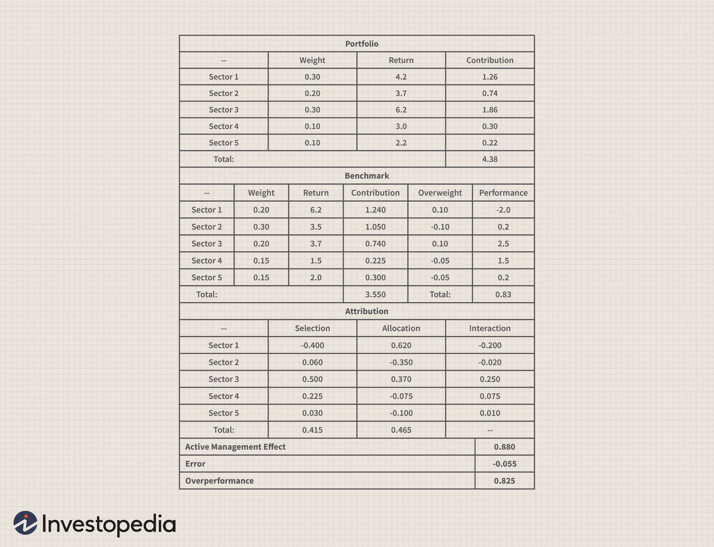

Mutual funds have emerged as a widely favored investment vehicle due to their capacity to offer investors both diversification and professional management. By pooling resources from a large number of investors, mutual funds can invest across a diverse array of asset classes, thereby minimizing unsystematic risk and enabling individual investors to benefit from professional expertise without the need for substantial capital.

One of the key considerations for investors assessing mutual fund options is understanding the factors influencing their performance. Among these factors, fund size plays a critical role. The size of a mutual fund, often measured by its total asset base, can have a significant impact on the fund's ability to perform. Larger funds, for instance, have the potential to achieve economies of scale, potentially lowering costs for investors. However, they may also face challenges such as reduced agility in executing trades, which can impact performance in fast-moving markets.



In this article, we explore the nuanced effects of mutual fund size on investment performance. Additionally, we discuss the role of algorithmic trading in fund management, a practice that has transformed how trades are executed, offering both opportunities and potential pitfalls. Through these analyses, we provide insights into what investors should consider when choosing a mutual fund, highlighting both the challenges and advantages that vary with fund size.

We will further discuss the specific challenges that large and small mutual funds encounter. While large funds might struggle with maintaining the sharp focus of active management, thereby potentially becoming "closet indexers," smaller funds might benefit from nimbleness but could be hindered by higher expense ratios and limited diversification.

By comprehending these aspects, investors can better navigate their mutual fund selections and optimize investment success, aligning their choices with personal financial goals and risk tolerance.

## Table of Contents

## Understanding Mutual Fund Size

The size of a mutual fund is quantified by its total asset base, which encompasses all the capital it holds. This size grows incrementally through robust portfolio performance, attracting capital inflows as existing and potential investors seek participation due to perceived success. Such growth signifies increased investor confidence and usually translates into economies of scale, where administrative and managerial costs represent a smaller portion of the total assets. However, this advantage has a threshold; beyond it, large fund size can become a double-edged sword.

A sharp increase in assets under management (AUM) triggers a range of challenges. For instance, managers may face pressure to invest vast sums quickly, increasing the risk of acquiring less attractive investments that dilute overall performance. Efficient investment mandates can become cumbersome as funds swell, potentially leading to inefficiencies. This process is conceptually akin to the law of diminishing returns, where past a certain point, the benefits of increased size start to wane.

The evaluation of a fund size relative to its investment strategy is crucial to assess potential impacts on returns. For actively managed funds, a larger size can impede agility in executing trades, especially in less liquid markets. Conversely, index funds may benefit from significant size through reduced expense ratios, enhancing operational efficiency due to passive management approaches. A notable risk is when mutual funds become "too large to manage," reflecting misalignment with their strategy. 

Deciphering when a mutual fund surpasses efficient size involves examining key indicators such as performance drift and [liquidity](/wiki/liquidity-risk-premium) constraints. Performance drift occurs when a fund's returns deviate from benchmarks due to its inability to maintain its original investment strategy as it scales. This is especially pertinent for funds specializing in small caps or niche markets, where large purchases may impact market prices significantly.

Investors and managers must assess these dynamics carefully. An optimal balance between fund size and strategy involves maintaining alignment between investment objectives and operational execution, ensuring that growth continues to be accretive to investor returns.

## Impact of Fund Size on Performance

The size of a mutual fund significantly impacts its performance, with both advantages and disadvantages emerging as the fund's asset base expands or contracts. Larger mutual funds often encounter challenges in effectively executing their investment strategies due to the sheer [volume](/wiki/volume-trading-strategy) of assets that need to be managed and allocated. This can lead to difficulty in quickly entering and exiting positions without affecting market prices—a situation often referred to as lack of liquidity. As a result, large funds may face reduced flexibility and higher transaction costs, potentially diminishing returns.

For certain types of funds, such as index and bond funds, a larger size can be beneficial. These funds typically benefit from economies of scale, where increased asset size allows the fund to reduce its expense ratio. This is achieved by spreading fixed costs over a larger asset base, thus enhancing overall fund efficiency. Reduced expense ratios can contribute positively to a fund's performance by lowering the cost burden on investors.

Conversely, small-cap funds are particularly susceptible to size-related challenges. When a small-cap fund grows too large, it risks deviating from its initial investment target. This is because the fund may have to invest in a broader array of securities to accommodate its larger size, thereby diluting its focus on smaller, high-growth companies that originally defined its investment strategy. This shift can inadvertently transform the fund's risk-return profile, often leading to reduced returns relative to its original mandate.

A critical aspect of maintaining performance as a mutual fund grows is understanding how its management adapts to these size changes. Effective adaptation involves scaling investment strategies appropriately, potentially altering asset allocation, and implementing more sophisticated risk management techniques to manage increased fund size. For example, a fund might employ derivative instruments to hedge risks or utilize an enhanced indexing strategy to maintain target market exposure without concentrating too heavily on individual securities.

Scenarios where fund size enhances performance typically involve effective leverage of economies of scale, as seen with larger index funds. These funds can offer lower-cost exposure to broad market indices and benefit from decreased transaction and management fees, which are advantageous for long-term investors seeking stable returns.

Conversely, performance hindrance often occurs when fund size creates liquidity challenges or diworsification—a term describing the phenomenon where excessive diversification dilutes the potential for higher returns, especially pertinent to active funds focusing on niche markets. Understanding these dynamics is crucial for investors considering how fund size aligns with their investment strategies and goals.

## Algorithmic Trading in Mutual Funds

Algorithmic trading has fundamentally reshaped the asset management industry, particularly influencing mutual funds through enhanced trading efficiency and diverse strategic possibilities. With the integration of high-frequency trading ([HFT](/wiki/high-frequency-trading-strategies)) practices, mutual funds have experienced both potential benefits and challenges in terms of performance.

### Impact on Performance

High-frequency trading in mutual funds can result in a range of performance outcomes. On one hand, [algorithmic trading](/wiki/algorithmic-trading) can improve market efficiency by reducing transaction costs and enhancing liquidity. This efficiency can benefit mutual funds by enabling faster execution of trades and optimal pricing, thus potentially improving returns. A 2013 study by Brogaard, Hendershott, and Riordan found that algorithmic trading contributes to narrower bid-ask spreads and more efficient price discovery, supporting the notion that algorithmic trading can enhance market quality.[^1]

On the flip side, algorithmic trading, particularly HFT, has been criticized for contributing to market [volatility](/wiki/volatility-trading-strategies) and enabling predatory trading practices such as spoofing and front-running. These activities can undermine investor confidence and potentially distort market prices. Mutual funds engaged in or affected by such practices might experience adverse performance impacts.

### Market Quality and Predatory Practices

The influence of algorithmic trading on mutual funds involves a delicate balance. While it can enhance market quality, the rise of HFT has sometimes led to concerns about fairness and market integrity. For instance, predatory practices can lead to temporary price dislocations that might adversely affect mutual funds not equipped with sophisticated trading algorithms to counteract such moves.

### Role in Fund Management

The integration of algorithmic trading in mutual funds is often used to implement quantitative strategies that may range from pure statistical [arbitrage](/wiki/arbitrage) to more complex risk management tactics. These strategies allow mutual funds to swiftly adjust their portfolios in response to market conditions, an ability that is crucial in maintaining the fund’s performance targets.

Python, a popular language for algorithmic trading, enables fund managers to implement sophisticated trading models quickly. Below is a simple example of how Python can be used to identify arbitrage opportunities:

```python
import pandas as pd

# Sample data frames for two stock prices
stock_a = pd.Series([100, 102, 101, 103])
stock_b = pd.Series([99, 101, 100, 102])

# Identify the price spread
spread = stock_a - stock_b

# Set a threshold for arbitrage opportunity
threshold = 1.5

# Identify trades
arbitrage_trades = spread[abs(spread) > threshold]

print(arbitrage_trades)
```

### Conclusion

The adoption of algorithmic trading by mutual funds presents a dual-edged sword; it brings about increased efficiency and the potential for enhanced returns but also introduces challenges related to market integrity and volatility. Identifying and managing the balance between these aspects is crucial for mutual fund managers aiming to leverage algorithmic trading effectively.

By understanding these dynamics, investors and fund managers can better navigate the complexities of algorithmic trading, ensuring beneficial outcomes for mutual fund performance.

[^1]: Brogaard, J., Hendershott, T., & Riordan, R. (2013). "High-Frequency Trading and Price Discovery." *The Review of Financial Studies, 26*(8), 2267–2306.

## Challenges and Opportunities of Fund Size

Large mutual funds can face specific challenges, often becoming "closet indexers," which means they might replicate index performance rather than providing true active management. This situation occurs because the vast asset base makes it difficult to maneuver and allocate resources to deliver unique performance. Managers may tend to invest in a wider array of securities to accommodate large inflows, leading to a dilution of active management benefits. Consequently, this may result in returns that closely mirror the benchmark index, despite charging fees for active management.

Small funds, on the other hand, often capitalize on their nimbleness to exploit market inefficiencies, which can potentially lead to higher returns. They can more easily take substantial positions in smaller, less liquid opportunities that larger funds may have to ignore. However, small funds may also suffer from lack of diversification, which increases risk, and higher expense ratios, as fixed costs are spread over a smaller asset base. This diminishes the net returns for investors.

Finding funds that effectively balance their size with their investment strategy is key to optimizing outcomes. A fund that is too large for its strategy may struggle with performance, while one that is too small may not achieve the necessary diversification. It's crucial for investors to assess management practices and strategic direction, ensuring that a fund's size aligns with its investment approach.

Contrary to common concerns, not all large funds fail to outperform the market. Certain funds, like the Fidelity Magellan Fund, have historically outperformed due to strong leadership and a well-implemented strategic focus. These funds demonstrate that effective management can leverage scale to capture opportunities and drive performance beyond benchmarks. 

Strategies to manage the challenges of fund size involve maintaining a clear investment focus and deploying efficient operational practices. Large funds can adopt a segmented approach, creating sub-portfolios that target specific market opportunities. For small funds, ensuring operational efficiency and targeted investment strategies can help mitigate higher costs and enhance potential returns.

In conclusion, while fund size poses both challenges and opportunities, a strategic alignment between size and investment strategy, supplemented by competent management, can enable funds to navigate these complexities successfully. By actively monitoring these aspects, investors can better position their portfolios for optimal performance.

## Choosing the Right Mutual Fund

When selecting a mutual fund, investors should assess its size relative to their investment goals and risk tolerance. A fund's size can influence its flexibility, efficiency, and potential for returns. A comprehensive evaluation of a mutual fund's historical performance is crucial. This includes analyzing past returns, volatility, and consistency in meeting performance benchmarks. A fund's performance history can provide insights into its potential future behavior, enabling investors to gauge alignment with their financial objectives.

The management practices of a mutual fund can significantly impact its success. It is essential to assess the expertise and stability of the fund's management team. Experienced managers with a solid track record often indicate a well-managed fund. Additionally, investors should evaluate the compatibility of the fund's investment strategy with their own risk appetite and goals. This involves scrutinizing the fund's asset allocation, sector focus, and investment philosophy to ensure alignment with personal investment preferences.

Investors should be cautious of mutual funds exhibiting shrinking asset bases or maintaining large cash holdings. A declining asset base may indicate waning investor confidence, which could lead to liquidity issues or affect the fund's ability to achieve economies of scale. Similarly, excessive cash holdings might signify missed investment opportunities that could have otherwise contributed to returns.

"Goldilocks investing," or identifying a fund that is "just right" for your portfolio, necessitates a balanced approach. It involves finding a fund that is appropriately sized for its intended strategy without being constrained by its asset base. A fund that is too large might face challenges in maintaining its investment focus, while a fund that is too small might lack diversification and incur higher expenses.

To effectively assess mutual fund size, investors can employ several strategies. One approach is to compare the fund's size against peers with similar investment strategies to identify outliers. Utilizing industry benchmarks can also provide context on how a fund's size affects its efficiency and expense ratios.

Overall, selecting the right mutual fund requires careful analysis, taking into account size, historical performance, management practices, and strategy compatibility. By aligning investment selections with these factors, investors can enhance their chances of achieving their financial goals.

## Conclusion

Mutual fund size is a pivotal [factor](/wiki/factor-investing) that can significantly influence a fund's performance, presenting various challenges and advantages. A larger fund size can offer benefits such as reduced expense ratios due to economies of scale, enhancing fund efficiency. However, it can also introduce complexities in executing investment strategies, especially in niche markets like small-cap equities where liquidity constraints might hinder performance.

Algorithmic trading has introduced new dynamics into mutual fund management, offering opportunities for improved market quality and trading efficiency. However, it also brings complexities, such as the potential for predatory trading practices. The integration of algorithmic trading should be carefully balanced to optimize performance while mitigating risks.

Investors are advised to weigh the size of a mutual fund in alignment with their investment strategy and risk tolerance. Large funds could gravitate towards passive index-like strategies, losing the benefits of active management, while small funds might provide agility but incur higher costs and limited diversification. Therefore, evaluating a mutual fund’s size in context with its investment style and market conditions is crucial for optimized investment outcomes.

Successful investing in mutual funds involves selecting funds that match their size with the chosen strategy and market conditions. By understanding the impact of fund size and incorporating the complexities of algorithmic trading, investors can enhance their decision-making processes, ultimately improving their mutual fund investment results.

## References & Further Reading

[1]: Brogaard, J., Hendershott, T., & Riordan, R. (2013). ["High-Frequency Trading and Price Discovery."](https://papers.ssrn.com/sol3/papers.cfm?abstract_id=1928510) The Review of Financial Studies, 26(8), 2267–2306.

[2]: Bogle, J. C. (2015). ["The Little Book of Common Sense Investing: The Only Way to Guarantee Your Fair Share of Stock Market Returns."](https://www.amazon.com/Little-Book-Common-Sense-Investing/dp/1119404509) John Wiley & Sons.

[3]: Carhart, M. M. (1997). ["On Persistence in Mutual Fund Performance."](https://onlinelibrary.wiley.com/doi/full/10.1111/j.1540-6261.1997.tb03808.x) The Journal of Finance, 52(1), 57-82.

[4]: French, K. R. (2008). ["Presidential Address: The Cost of Active Investing."](http://qed.econ.queensu.ca/faculty/milne/322/ECON322(2008)%20Kenneth%20R%20French.pdf) The Journal of Finance, 63(4), 1537-1573.

[5]: Grinold, R. C., & Kahn, R. N. (2000). ["Active Portfolio Management: A Quantitative Approach for Producing Superior Returns and Controlling Risk."](https://www.amazon.com/Active-Portfolio-Management-Quantitative-Controlling/dp/0070248826) McGraw Hill.

[6]: Lopez de Prado, M. (2018). ["Advances in Financial Machine Learning."](https://www.amazon.com/Advances-Financial-Machine-Learning-Marcos/dp/1119482089) Wiley.

[7]: Malkiel, B.G. (2015). ["A Random Walk Down Wall Street: The Time-Tested Strategy for Successful Investing."](https://www.academia.edu/10850809/A_Random_Walk_Down_Wall_Street_The_Time_Tested_Strategy_for_Successful_Investing) W.W. Norton & Company.

[8]: Sharpe, W. F. (1991). ["The Arithmetic of Active Management."](https://www.semanticscholar.org/paper/The-Arithmetic-of-Active-Management-Sharpe/a169b7b18d3d8e21dd35495508ad0bfd34c46754) Financial Analysts Journal, 47(1), 7-9.