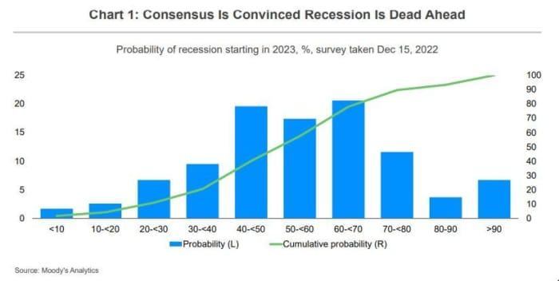

## Table of Contents

## What is a slowcession?

A slowcession is when the economy grows very slowly for a long time. It's not as bad as a recession, where the economy shrinks, but it still feels tough because things aren't getting better quickly. During a slowcession, people might find it hard to get raises or new jobs, and businesses might not make as much money as they want.

This kind of economic situation can last for years. It can make people feel unsure about the future because they don't see big improvements happening. Governments and businesses try to find ways to speed things up, but it's not always easy. A slowcession is tricky because it's not a clear crisis, but it still affects everyone's daily life.

## How does a slowcession differ from a recession?

A slowcession and a recession are different because of how fast the economy is growing or shrinking. A recession is when the economy actually gets smaller. This means fewer jobs, less money for people, and businesses making less money. It's like the economy is going backward. On the other hand, a slowcession is when the economy is still growing, but very, very slowly. It's not shrinking, but it's not getting better quickly either. People might still have jobs, but they might not get raises, and businesses might see slow growth.

The feelings people have during these times are also different. During a recession, people know things are bad and they're worried about losing their jobs or not being able to pay bills. It's a clear crisis, and everyone can see it. But during a slowcession, it's harder to see the problem because things are still moving forward, just very slowly. People might feel stuck or unsure about the future, but it's not as scary as a full-blown recession. Governments and businesses have to work hard to make things better, but it's a slower process than fixing a recession.

## What are the main indicators of a slowcession?

The main indicators of a slowcession are when the economy grows very slowly over a long time. You can see this in things like the Gross Domestic Product (GDP), which measures the total value of everything a country makes. If the GDP is growing, but only by a tiny bit each year, it might be a sign of a slowcession. Another sign is when businesses don't see much growth in their profits. They might be making money, but not as much as they want or expect.

Another indicator is in the job market. During a slowcession, people might not lose their jobs, but they might not get raises or promotions. It can be hard to find new jobs, and the ones that are available might not pay well. This makes people feel like their careers are stuck. Also, if you look at how much money people are spending, it might not be going up much. People might be careful with their money because they're not sure about the future, which is another sign of a slowcession.

Overall, a slowcession is hard to spot because things aren't getting worse, they're just not getting better quickly. It's like the economy is moving in slow motion. People and businesses feel like they're waiting for things to pick up, but it takes a long time. This can make everyone feel a bit unsure and stuck.

## How does a slowcession impact overall economic growth?

A slowcession impacts overall economic growth by making it very slow. Instead of the economy growing fast like it usually does, it only grows a little bit each year. This means businesses don't make as much money as they want, and people don't see their incomes go up much. When the economy grows slowly, it can be hard for new businesses to start and for existing ones to expand. This slow growth can last for years, making everyone feel like things aren't getting better quickly enough.

Because of this slow growth, people might spend less money. They might be worried about the future and save more instead of buying things they want. This can make the slowcession last even longer because businesses need people to spend money to grow. Governments might try to help by spending more on projects or cutting taxes, but it can take a long time for these actions to make a big difference. Overall, a slowcession means the economy is not in a crisis, but it's also not moving forward as fast as everyone hopes.

## What sectors of the economy are most affected by a slowcession?

During a slowcession, some sectors feel the impact more than others. Sectors like manufacturing and construction often struggle because they need a lot of growth to keep going strong. If people and businesses aren't buying new things or building new projects, these sectors don't do well. Retail can also be hit hard because when people are worried about money, they spend less on things they don't need right away. This means fewer sales for stores, which can lead to slower growth or even losses.

Another sector that feels the pinch is the service industry, especially things like restaurants and hotels. These businesses rely on people having extra money to spend on eating out or traveling. During a slowcession, people might cut back on these kinds of activities, which hurts these businesses. On the other hand, sectors like healthcare and utilities usually do okay because people still need these services no matter what the economy is doing. But even these sectors might see slower growth because people might delay non-urgent treatments or try to save money on utilities.

## Can a slowcession lead to long-term economic stagnation?

Yes, a slowcession can lead to long-term economic stagnation if it goes on for a long time. When the economy grows very slowly, businesses and people might start to think that things will always be this way. They might stop trying to grow or invest in new things because they don't see much point. This can make the economy stay slow for a long time, which is called stagnation. It's like the economy gets stuck in a rut and can't get out.

If businesses aren't growing and people aren't spending, it can create a cycle where the economy stays slow. Governments might try to help by spending more money or changing rules to encourage growth, but it can take a long time for these changes to work. If people and businesses lose hope that things will get better, they might not take the risks needed to get the economy moving again. This is why it's important for everyone to keep trying to move forward, even when things are slow.

## What are the global implications of a slowcession in a major economy?

When a big economy like the United States or China goes through a slowcession, it can affect the whole world. These big economies trade a lot with other countries. If they're growing slowly, they might buy fewer things from other places. This can make other countries' economies slow down too. For example, if the U.S. is in a slowcession, it might buy less from countries like Mexico or Germany. This can hurt those countries' businesses and make their economies grow slowly too.

Also, when a big economy is in a slowcession, it can make people around the world feel less sure about the future. If people see that a big economy isn't doing well, they might worry that their own country could be next. This can make them spend less money and save more, which can slow down their own economies. Governments and businesses in other countries might also be less likely to invest in new projects because they're worried about what's happening in the big economy. So, a slowcession in one big country can spread and make the whole world's economy grow more slowly.

## How do monetary policies typically respond to a slowcession?

When a country is going through a slowcession, the people in charge of money, like the central bank, usually try to help the economy grow faster. They do this by using something called monetary policy. One thing they might do is lower interest rates. This makes it cheaper for people and businesses to borrow money. When borrowing is cheaper, people might buy more things like houses or cars, and businesses might invest in new projects. This can help the economy start growing faster.

Another thing the central bank might do is something called quantitative easing. This is when they buy a lot of bonds or other things to put more money into the economy. By doing this, they hope to make people and businesses feel more sure about the future and spend more money. But it can take a long time for these actions to really work. Sometimes, even with these efforts, the economy might still grow very slowly because people are still worried about the future.

## What fiscal measures can governments implement to mitigate the effects of a slowcession?

When a country is in a slowcession, the government can use something called fiscal policy to help. This means they might spend more money on things like building roads, schools, or hospitals. This kind of spending can create jobs and make people feel more sure about the future. When people have jobs, they spend more money, which can help the economy grow faster. The government might also give money back to people by cutting taxes. When people have more money in their pockets, they might spend it on things they need or want, which can also help the economy.

Another thing the government can do is help businesses. They might give money to companies to help them grow or start new projects. This can make businesses feel more confident and willing to invest in new things. Governments might also make rules easier for businesses, so it's not so hard for them to do what they need to do. All these actions can help make the economy grow faster and get out of the slowcession. But it can take a long time for these changes to really make a big difference.

## How do consumer behaviors change during a slowcession?

During a slowcession, people often start to be more careful with their money. They might not buy things they don't really need, like new clothes or gadgets. Instead, they focus on paying their bills and saving money for the future. This is because they feel unsure about what will happen next. They might also look for cheaper options, like buying things on sale or choosing less expensive brands. This change in spending can make the slowcession last longer because businesses don't make as much money when people aren't buying a lot.

People might also change how they save and invest during a slowcession. They might put more money into savings accounts instead of spending it or investing in risky things like stocks. This is because they want to be ready for anything that might happen. They might also try to pay off debts faster, so they don't have to worry about owing money. All these changes in how people use their money can make the economy grow even more slowly, but it's what people do when they're trying to be safe during tough times.

## What role do technological advancements play in mitigating the effects of a slowcession?

Technological advancements can help make things better during a slowcession. New technology can make businesses work better and faster. For example, if a company starts using new machines or computer programs, they might be able to make more things without hiring more people. This can help them keep going even when the economy is slow. Also, technology can help people find new ways to make money. If someone loses their job, they might start a business online or use apps to do freelance work. This can help them keep [earning](/wiki/earning-announcement) money even when jobs are hard to find.

Another way technology helps is by making it easier for people to spend money. If shopping online is easy and safe, people might buy more things even when they're worried about money. This can help businesses keep selling things and keep the economy moving. Also, new technology can lead to new industries and jobs. For example, if a new kind of green energy becomes popular, it can create jobs in that area. This can help the economy start growing faster again. So, technology can play a big role in making things better during a slowcession.

## How can predictive analytics be used to anticipate and manage the impact of a slowcession on economic growth?

Predictive analytics can help people see a slowcession coming before it happens. By looking at a lot of data from the past, like how much people are spending, how many jobs there are, and how fast the economy is growing, computers can guess what might happen next. If the data shows that the economy is starting to grow very slowly, businesses and governments can get ready. They might start saving money or making plans to help the economy grow faster. This way, they can be ready to act before things get too slow.

Once a slowcession starts, predictive analytics can help manage its impact. By keeping an eye on the data, people can see which parts of the economy are doing the worst and focus on helping those areas. For example, if the data shows that people are not spending much money on new cars, the government might give money to car companies to help them keep going. Or, if the data shows that a lot of people are losing their jobs, the government might start programs to help them find new work. By using predictive analytics, people can make smart choices to help the economy start growing faster again.

## What is the relationship between Economic Growth and Slowcession?

Traditional economic growth is characterized by a significant increase in a country's Gross Domestic Product (GDP), reflecting a substantial rise in the production of goods and services. This growth is often driven by factors such as technological advancements, increased consumer spending, and higher investments in infrastructure. During such periods, economic indicators like employment rates, productivity levels, and consumer confidence typically show positive trends.

In contrast, a slowcession is a term used to describe an economy experiencing extremely slow growth, where the GDP growth rate is marginally positive but lacks the dynamism of robust expansion. Coined to describe a middle ground between growth and recession, this scenario suggests a stagnant or minimal increase in economic activity, where the economy is technically expanding but at a pace that barely outpaces population growth.

The key differences between traditional economic growth and slowcession are reflected in various economic indicators. Traditional growth sees a steady or accelerating GDP growth rate, while a slowcession settles for a decelerated growth trajectory. This lack of vigor in economic activity can be depicted through the formula for GDP growth rate:

$$
GDP\_Growth\_Rate = \left( \frac{GDP_{t} - GDP_{t-1}}{GDP_{t-1}} \right) \times 100
$$

In a slowcession, $GDP_{t} - GDP_{t-1}$ is small, indicating minimal changes in economic output, which contrasts sharply with periods of traditional growth.

Moreover, the financial health of households and businesses differs significantly between these two scenarios. During traditional growth, businesses often experience increased revenues and profits, leading to higher investments and employment. Households benefit from wage increases and job security, boosting consumer confidence and spending. On the other hand, a slowcession might see stagnation in wage growth, limited job creation, and cautious business investments, thereby suppressing consumer spending and overall economic [momentum](/wiki/momentum).

Both traditional growth and slowcession significantly impact investor confidence and market dynamics. In a growing economy, investors are generally more confident, leading to bullish market behavior and often resulting in stock market rallies. A slowcession, however, introduces uncertainty, where investor sentiment may wane due to unclear economic prospects. This could lead to more conservative investment strategies, heightening market [volatility](/wiki/volatility-trading-strategies) as traders and investors navigate these uncertain waters.

To manage these differing scenarios, investors and policy makers alike must evaluate the underlying health of the economy, considering both current economic indicators and future forecasts to tailor strategies that align with prevailing conditions. Understanding these dynamics helps in crafting informed responses, whether the goal is to harness growth potential or mitigate the impacts of a slowcession.

## References & Further Reading

[1]: Zandi, M. (2022). ["Slowcession - Navigating the Edge of Recession."](https://www.moodys.com/web/en/us/insights/resources/slowcession.pdf) Moody's Analytics.

[2]: ["Algorithmic Trading: Winning Strategies and Their Rationale"](https://www.wiley.com/en-us/Algorithmic+Trading%3A+Winning+Strategies+and+Their+Rationale-p-9781118460146) by Ernest P. Chan

[3]: Harford, T. (2020). ["The Slowpath to Growth: Why Economies are Slowing Down."](https://www.ft.com/tim-harford) Financial Times.

[4]: Carlin, B. P., & Stultz, R. M. (2008). ["Risk Management in Financial Firms: A Bayesian Dynamic Factor Modeling Approach."](https://onlinelibrary.wiley.com/doi/abs/10.1111/j.1745-6622.2008.00202.x) Journal of Economic Literature. 

[5]: ["The Little Book of Economic Development"](https://www.amazon.com/Little-Black-Book-Economic-Development/dp/1478242302) by John A. Tatom