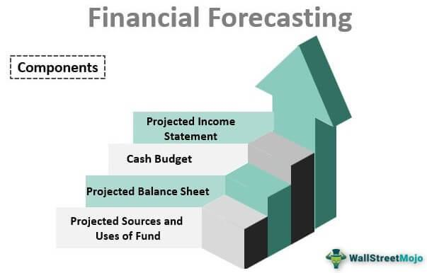

The world of investing has experienced remarkable transformation, driven by the rapid advancement of technology and innovative strategies designed to aid traders and investors in making informed choices. Today, the investment landscape is more complex and interconnected than ever, encompassing a range of elements such as investment advice, financial predictions, stock analysts, and algorithmic trading. Each of these components plays a crucial role in shaping modern finance, presenting both opportunities and challenges for investors—be they individuals managing personal wealth or institutions overseeing vast portfolios.

Investment advice, grounded in data-driven insights and personalized strategies, is now more accessible due to technological innovations such as robo-advisors. These digital platforms analyze market trends and individual preferences to provide cost-effective guidance, representing a paradigm shift in how investors approach portfolio management. Similarly, financial predictions have evolved with the integration of sophisticated data analytics and machine learning models. Investors can now leverage predictive tools that consider a myriad of variables including economic indicators, geopolitical shifts, and technology trends, although the inherent uncertainties of financial forecasting remain.



Stock analysts are pivotal in the investment decision process, offering insights into the potential performance of stocks. By evaluating company fundamentals, industry dynamics, and economic forecasts, analysts provide recommendations that influence investor behavior and market perceptions. These professionals contribute to market efficiency, helping align stock prices with their intrinsic value through rigorous analysis and reporting.

Algorithmic trading is yet another revolution in the investment domain, allowing for the execution of intricate trading strategies at unprecedented speeds. By automating trades based on predefined criteria and data analysis, algorithmic trading mitigates human error and enhances market liquidity. However, its rise has also introduced new risks such as system failures and volatility spikes, necessitating robust risk management frameworks.

Together, these developments highlight the intricate web of modern investing, offering investors the tools to navigate market complexities. By understanding the interconnected roles of investment advice, financial predictions, stock analysis, and algorithmic trading, investors can better position themselves to make informed decisions. This exploration will provide valuable insights into harnessing these tools and strategies effectively, ultimately equipping readers with the knowledge to optimize their investment endeavors in an ever-evolving financial ecosystem.

## Table of Contents

## Understanding Investment Advice

Investment advice serves as a critical component in cultivating financial health, steering investors towards decisions that aim to maximize returns while managing and minimizing risk exposure. This aspect of financial management has witnessed considerable evolution, primarily driven by technological advancements and the integration of sophisticated data analytics techniques.

### The Role of Financial Advisors

Traditionally, financial advisors have been pivotal in designing and managing investment portfolios tailored to the specific goals and financial circumstances of individuals. With the advent of technology, their role has expanded significantly. Modern financial advisors now incorporate advanced data analytics and algorithmic tools to refine their strategies. These tools enable the analysis of vast datasets to identify trends, forecast market movements, and ultimately offer more precise and customized advice.

### Types of Investment Advice

Investment advice comes in varied forms, ranging from highly personalized strategies that cater to individual investor objectives to broader market analyses that inform investment decisions across wider scopes. Personalized investment strategies consider specific parameters such as the investor's risk tolerance, time horizon, and [liquidity](/wiki/liquidity-risk-premium) needs. Risk tolerance is a pivotal [factor](/wiki/factor-investing), reflecting an investor's capacity and willingness to endure market [volatility](/wiki/volatility-trading-strategies):

$$
\text{Risk Tolerance} = \frac{\text{Investment Income Stability}}{\text{Market Volatility}}
$$

Time horizon, another crucial element, defines the period an investor plans to hold an investment before retrieving their money, which impacts the choice of securities in the investment mix. Economic conditions, including interest rates, inflation expectations, and market cycles, also play an essential role in shaping investment advice.

### Emergence of Robo-Advisors

Another notable shift in the landscape of investment advice is the rise of robo-advisors, digital platforms that offer automated financial planning services based on algorithms. These platforms have democratized access to investment advice, making it more affordable and accessible to a broader demographic. By employing mathematical algorithms and [machine learning](/wiki/machine-learning), robo-advisors can evaluate personal risk preferences, allocate assets, and rebalance portfolios. Here's a simplistic example of a portfolio rebalancing implementation in Python:

```python
def rebalance_portfolio(current_allocation, target_allocation, portfolio_value):
    adjustments = {}
    for asset, target_percentage in target_allocation.items():
        current_value = current_allocation.get(asset, 0) * portfolio_value
        target_value = target_percentage * portfolio_value
        adjustments[asset] = target_value - current_value
    return adjustments

current_allocation = {'stocks': 0.6, 'bonds': 0.3, 'commodities': 0.1}
target_allocation = {'stocks': 0.5, 'bonds': 0.4, 'commodities': 0.1}
portfolio_value = 100000

adjustments = rebalance_portfolio(current_allocation, target_allocation, portfolio_value)
print(adjustments)
```

The digital evolution, embodied by the increased use of robo-advisors, represents a transformative step in making investment advice more comprehensive and data-driven. However, while the convenience and efficiency of robo-advisors are apparent, complexities that require human judgment often necessitate the continued relevance of experienced financial advisors.

In conclusion, understanding and effectively utilizing investment advice involves a synthesis of traditional wisdom and modern technological tools. Investors are better positioned to navigate the complexities of financial markets by embracing these evolving trends, optimizing portfolio performance while mitigating risk in an increasingly dynamic economic environment.

## Financial Predictions in the Modern World

Financial predictions play a pivotal role for investors aiming to foresee market trends and make informed decisions. Core to this endeavor are the tools and methodologies employed in forecasting. Traditional economic indicators, such as interest rates, inflation rates, and employment figures, serve as foundational elements. These indicators provide a macroeconomic context that helps analysts and investors gauge the health and trajectory of economies.

However, the complexity of financial markets has driven the integration of advanced data analytics and machine learning models. These technologies enable the processing and analysis of vast datasets, uncovering patterns and insights that might otherwise go unnoticed. Machine learning algorithms, for example, can identify correlations and trends based on historical data, providing predictive insights that are sharper and more nuanced than traditional models.

Several factors influence financial predictions, including geopolitical events, which can trigger sudden market shifts. Economic policies, such as changes in fiscal and monetary policies, also impact predictions by influencing economic stability and growth prospects. Technological advancements, particularly in areas such as blockchain and fintech, introduce new dynamics that require forecasters to continuously adapt their models.

Understanding the inherent limitations and uncertainties in financial forecasting is crucial. Despite the sophistication of models and methodologies, predicting future events with complete certainty remains elusive. Unexpected events, sometimes referred to as "black swans," can drastically alter market conditions overnight. This underscores the importance of maintaining a degree of humility and caution when relying on financial predictions.

Nevertheless, accurate financial predictions offer a strategic advantage in investment planning. They allow for the anticipation of potential risks and opportunities, enabling investors to adjust their portfolios proactively. This strategic foresight can lead to more effective allocation of resources, optimized return on investment, and a competitive edge in the fast-paced financial landscape.

In conclusion, while financial predictions are not infallible, when used judiciously alongside traditional investment strategies, they provide invaluable guidance for navigating the complexities of the modern financial world. With continuous advancements in technology and methodology, the capabilities of financial forecasting are set to enhance, offering new opportunities for informed investment decision-making.

## The Role of Stock Analysts

Stock analysts are pivotal in the financial industry, providing evaluations and recommendations that can significantly influence investor decisions. These professionals specialize in investigating and analyzing the prospects of stocks, thereby offering insights that help in shaping market perceptions and investor confidence.

Two principal types of stock analysts operate within the sector: buy-side and sell-side analysts. Each type serves a distinct role, contributing to their respective areas of the financial ecosystem. Buy-side analysts are typically employed by institutional investors such as mutual funds, pension funds, and hedge funds. They focus on providing insights to support internal portfolio management decisions. By evaluating potential investments, buy-side analysts assist their institutions in crafting strategies that optimize returns while managing risks.

Sell-side analysts, on the other hand, work for brokerage firms and investment banks. Their primary task is to prepare comprehensive reports and recommendations for their clients, which can range from individual investors to large corporate entities. The insights provided by sell-side analysts are instrumental in guiding clients' investment decisions and often include stock ratings, price targets, and comprehensive future projections of a company's financial health.

The credibility of stock analysts is essential for their effectiveness and depends on several factors. Key among these is the level of qualifications and the experience they possess. A well-grounded understanding of financial markets, corporate finance, and economic principles is crucial. Additionally, an analyst's track record in accurately predicting stock performance contributes significantly to their reputation. Consistency in offering reliable insights not only boosts an analyst's esteem but also enhances trust among investors and stakeholders.

Stock analysts contribute to market efficiency by disseminating critical information that helps align stock prices with their intrinsic value. Through rigorous research and analysis, they uncover data and insights that may not be easily accessible to the broader investor community. By highlighting discrepancies between a stock's current market price and its perceived intrinsic value, analysts aid in correcting mispricings and ensuring that stock prices reflect a more accurate valuation.

The analytical processes employed by stock analysts involve quantitative and qualitative techniques, such as financial modeling, trend analysis, and industry-specific studies. By leveraging these methods, analysts can systematically evaluate companies' financial statements, market conditions, and competitive positions. This comprehensive analysis enables them to issue recommendations that, if well-founded, may result in significant market impact, affecting stock prices and investment strategies.

In conclusion, stock analysts serve as a cornerstone for informed investment decisions, balancing the scales of market information and contributing to an efficient financial market ecosystem. Through their work, investors gain access to high-caliber research and insights, facilitating more strategic and informed investment choices.

## The Rise of Algorithmic Trading

Algorithmic trading, often referred to as 'algo trading', represents a pivotal evolution in the world of securities trading. By leveraging sophisticated algorithms and advanced computing technologies, traders can now execute complex financial strategies with remarkable speed and precision. This section examines the foundational elements of [algorithmic trading](/wiki/algorithmic-trading), its diverse strategies, and the inherent risks associated with its use.

At its core, algorithmic trading involves the automation of trade decisions based on pre-defined criteria. These criteria juxtapose historical and real-time data to identify trading opportunities. The process is typically comprised of three essential components: data input, algorithm analysis, and trade execution. Data input requires the ingestion of vast datasets, including price, [volume](/wiki/volume-trading-strategy), and other market variables. These data points serve as the inputs for algorithm analysis, where the algorithm evaluates conditions based on logical frameworks or mathematical models. Upon satisfying the conditions, the system autonomously places trades on the market, thereby completing the cycle.

Several strategies are employed in algorithmic trading to capitalize on market inefficiencies. These include trend-following, mean-reversion, and statistical [arbitrage](/wiki/arbitrage). Trend-following strategies, for instance, focus on capturing [momentum](/wiki/momentum) in market trends by buying securities that are rising and selling those that are dropping. Mean-reversion strategies, on the other hand, operate on the assumption that asset prices will return to their historical mean over time, thus identifying potential entry and [exit](/wiki/exit-strategy) points through statistical analysis. Statistical arbitrage involves the simultaneous buying and selling of related securities to profit from pricing inefficiencies, heavily relying on quantitative models and historical data analysis.

Despite offering numerous advantages, algorithmic trading is not without its risks. One significant concern is the potential for system failures, which can result in substantial financial losses if not carefully managed. Furthermore, the high-speed nature of algo trading can exacerbate market volatility, as rapid trading may result in drastic price fluctuations, contributing to market instability. Such risks underscore the importance of rigorous system testing and the implementation of fail-safes to mitigate adverse outcomes.

In conclusion, algorithmic trading stands as a testament to the transformative power of technology in modern finance. By enabling rapid execution of complex trades and offering precision that was previously unattainable, algo trading continues to reshape the trading landscape. However, it also demands meticulous management of associated risks to ensure the stability and integrity of financial markets.

## Navigating the Future of Investing

The future of investing is being significantly shaped by rapid advancements in technology and data analytics. These innovations are providing new avenues for optimizing investment strategies and enhancing decision-making processes.

Emerging developments in [artificial intelligence](/wiki/ai-artificial-intelligence) (AI) and big data analytics are at the forefront of this transformation. AI algorithms are increasingly being used to analyze vast amounts of financial data, identify patterns, and make predictions about future market movements with a level of precision that was previously unattainable. For example, machine learning models can process data from various sources, such as news articles, social media trends, and historical market data, to generate insights and predictions that inform trading strategies.

Big data analytics further amplifies this capability by processing and analyzing large volumes of structured and unstructured data. Investors can leverage these insights to gain a competitive edge in the market. Techniques such as natural language processing (NLP) enable the analysis of qualitative data, providing additional layers of context to numerical data.

The increasing popularity of algorithmic trading among both institutional and retail investors highlights the need for robust regulatory measures. Algorithmic trading automates the execution of trades through pre-programmed instructions, based on variables such as timing, price, and volume. While this facilitates high-frequency trading and enhances market liquidity, it also introduces risks like market manipulation and flash crashes. Consequently, regulatory bodies are compelled to develop frameworks that ensure market integrity and protect investors from potential negative outcomes.

Investors are encouraged to remain vigilant and informed about emerging trends and innovations within the financial industry. By understanding new tools and technologies, they can capitalize on opportunities and mitigate potential risks. This dynamic environment requires adaptability and continuous learning to remain competitive.

The modern financial ecosystem demands a flexible approach to investing. As technology continues to evolve, so too must investment practices. Investors who successfully integrate traditional investment strategies with cutting-edge technological tools stand to benefit tremendously. In conclusion, embracing change and fostering a mindset of continuous improvement will enable investors to thrive in the ever-evolving landscape of finance.

## Conclusion

The interconnected roles of investment advice, financial predictions, stock analysts, and algorithmic trading are pivotal in shaping the modern investment environment. Each component offers unique insights and strategies that, when combined, equip investors to navigate complex markets with informed precision. Understanding these elements allows investors to not only position themselves strategically but also to anticipate and react wisely to market shifts.

Despite the tremendous advancements brought about by technology and innovation, the necessity of due diligence remains a foundation of prudent investment practices. Investors must harmonize traditional investment wisdom with cutting-edge tools and methodologies to critically assess opportunities and risks. This balance ensures that the insights provided by sophisticated systems and analyses are grounded in informed judgment.

As financial markets continuously evolve, the ability to stay informed, educated, and adaptable becomes increasingly vital. This dynamic environment calls for investors who can flexibly incorporate new technologies and theoretical developments into their strategies, continually updating their knowledge base to remain competitive. 

In conclusion, a holistic approach that integrates diverse insights from financial disciplines not only empowers investors but also ensures resilience in the face of economic turbulence. Such an approach advocates for a comprehensive understanding that leverages the strengths of each component while maintaining a vigilant watch on new developments. This will enable investors to thrive across various market cycles, capitalizing on opportunities and mitigating potential pitfalls with confidence and acuity.

## References & Further Reading

[1]: Bergstra, J., Bardenet, R., Bengio, Y., & Kégl, B. (2011). ["Algorithms for Hyper-Parameter Optimization."](https://papers.nips.cc/paper/4443-algorithms-for-hyper-parameter-optimization) Advances in Neural Information Processing Systems 24.

[2]: ["Advances in Financial Machine Learning"](https://www.amazon.com/Advances-Financial-Machine-Learning-Marcos/dp/1119482089) by Marcos Lopez de Prado

[3]: ["Evidence-Based Technical Analysis: Applying the Scientific Method and Statistical Inference to Trading Signals"](https://www.amazon.com/Evidence-Based-Technical-Analysis-Scientific-Statistical/dp/0470008741) by David Aronson

[4]: ["Machine Learning for Algorithmic Trading"](https://github.com/stefan-jansen/machine-learning-for-trading) by Stefan Jansen

[5]: ["Quantitative Trading: How to Build Your Own Algorithmic Trading Business"](https://www.amazon.com/Quantitative-Trading-Build-Algorithmic-Business/dp/1119800064) by Ernest P. Chan