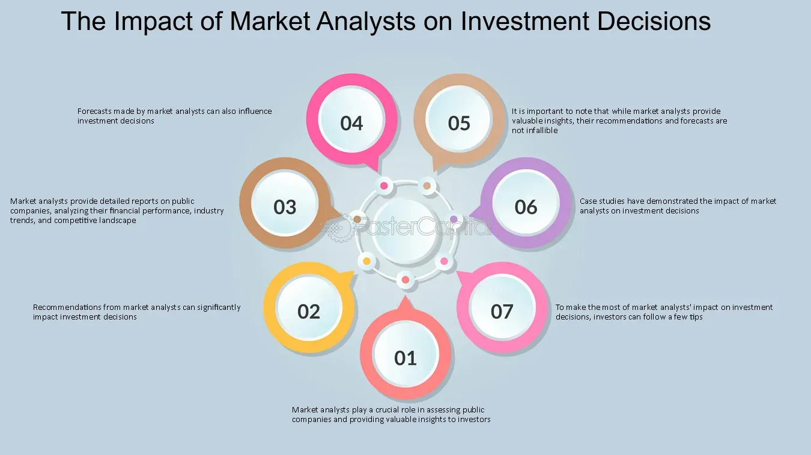

## Table of Contents

## What is a stock analyst?

A stock analyst is a person who studies and gives advice about stocks. Stocks are small pieces of a company that people can buy and sell. The job of a stock analyst is to look at a lot of information about companies and the economy. They use this information to guess if the price of a stock will go up or down. This helps people decide if they should buy, sell, or keep their stocks.

Stock analysts work for different places like big banks, investment companies, or research firms. They write reports and give presentations to help their clients make smart choices about their money. Some analysts focus on certain industries, like technology or healthcare, while others look at the big picture of the whole market. Their goal is to help people make money by giving them good advice about which stocks to choose.

## What are stock analyst predictions?

Stock analyst predictions are guesses about what will happen to the price of a stock in the future. Analysts look at a lot of information like how well a company is doing, what's happening in the economy, and what other people think about the stock. They use this information to make a prediction. They might say the stock price will go up, go down, or stay the same. These predictions help people decide if they should buy, sell, or keep their stocks.

These predictions are not always right because the future is hard to guess. Many things can change, like new laws, unexpected events, or changes in what people want to buy. Even though analysts try their best, their predictions are just educated guesses. People who use these predictions should remember that there's always a chance they might be wrong. It's a good idea to look at predictions from different analysts and think about other information too before making a decision about stocks.

## How do stock analysts make their predictions?

Stock analysts make their predictions by looking at a lot of information about companies and the economy. They study things like how much money a company is making, how much it's spending, and if it's growing. They also look at what's happening in the world, like if there's a new law that might affect the company or if the economy is doing well or not. They use special math and computer programs to help them understand all this information. They might also talk to people who work at the company or other experts to get more details.

After they have all this information, analysts try to guess what will happen to the stock price in the future. They might think the price will go up if the company is doing well and the economy is strong. Or they might think the price will go down if the company is having problems or if something bad is happening in the world. They write down their guesses in reports and share them with people who might want to buy or sell the stock. These predictions are not always right because the future is hard to predict, but they help people make better decisions about their money.

## What types of investment decisions are influenced by analyst predictions?

Analyst predictions help people make different kinds of investment decisions. One common decision is whether to buy a stock. If an analyst predicts that a company's stock price will go up, people might decide to buy the stock now, hoping to sell it later for more money. Another decision is whether to sell a stock. If an analyst predicts that a stock's price will go down, people who already own the stock might decide to sell it before the price drops.

Analyst predictions also help with decisions about holding onto stocks. If an analyst thinks a stock will stay the same or go up a little, people might decide to keep their stock and wait for a better time to sell. Another type of decision is about diversifying investments. If analysts predict that one industry will do better than another, people might choose to invest more in that industry to spread out their risk.

These predictions can also affect decisions about investing in mutual funds or exchange-traded funds (ETFs). If analysts think certain sectors or the whole market will do well, people might decide to put their money into funds that focus on those areas. Overall, analyst predictions give people important information to help them make smarter choices about where to put their money.

## How do investors typically use analyst predictions in their decision-making process?

Investors often use analyst predictions as a guide to help them decide what to do with their money. When an analyst says a stock will go up, investors might buy that stock, hoping to make money when the price increases. If an analyst thinks a stock will go down, investors who own it might sell it to avoid losing money. Analyst predictions give investors a starting point for their decisions, but they don't always follow the predictions exactly. They might look at other information too, like news about the company or what other analysts are saying.

Sometimes, investors use analyst predictions to help them decide if they should keep a stock or sell it. If an analyst thinks a stock will stay the same or go up a little, investors might decide to hold onto it and wait for a better time to sell. Analyst predictions also help investors decide where to put their money in different industries or types of investments. For example, if analysts think one industry will do better than another, investors might choose to invest more in that industry to spread out their risk. Overall, analyst predictions are one piece of the puzzle that investors use to make smart choices about their money.

## What is the accuracy rate of stock analyst predictions?

The accuracy rate of stock analyst predictions can vary a lot. It's hard to say exactly how often they are right because it depends on many things, like how good the analyst is, what they are predicting, and how far into the future they are looking. Some studies show that analysts are right about 50% to 60% of the time for short-term predictions, like a few months. But for longer-term predictions, like a year or more, their accuracy might drop to around 40% to 50%.

Even though analysts try their best, their predictions are just educated guesses. The stock market can be affected by many unexpected events, like changes in the economy, new laws, or big news stories. These things can make it really hard to predict what will happen. So, while analyst predictions can be helpful, investors should remember that they are not always right and should use them along with other information when making decisions about their money.

## How do analyst predictions affect stock prices in the short term?

Analyst predictions can have a big effect on stock prices in the short term. When an analyst says a stock will go up, many people might want to buy it. This can make the stock price go up right away because more people are trying to buy it than sell it. On the other hand, if an analyst says a stock will go down, people might want to sell it quickly. This can make the stock price drop because more people are selling than buying.

These quick changes in stock prices happen because a lot of people pay attention to what analysts say. When many investors make the same decision based on an analyst's prediction, it can cause a big move in the stock price. But these changes might not last long. The stock price might go back to where it was before if the prediction turns out to be wrong or if something else happens that changes what people think about the stock.

## Can analyst predictions lead to market manipulation or insider trading?

Analyst predictions can sometimes lead to market manipulation if people use them to trick others. For example, if someone knows an analyst is going to say a stock will go up, they might buy a lot of that stock first. Then, when the analyst's prediction comes out, the stock price goes up because more people want to buy it. The person who bought the stock early can then sell it for a profit. This is not fair because it tricks other people into buying the stock at a higher price.

Analyst predictions can also lead to insider trading if the analyst has secret information about a company that they are not supposed to share. If an analyst uses this secret information to make a prediction, it's not fair to other investors who don't know about it. This can give the analyst and their friends an unfair advantage in the stock market. To stop this from happening, there are rules that say analysts must be careful about the information they use and share.

## How do different types of investors (e.g., retail vs. institutional) respond differently to analyst predictions?

Retail investors, who are everyday people investing their own money, often follow analyst predictions closely. They might not have as much time or knowledge to do their own research, so they rely on what analysts say. When an analyst predicts a stock will go up, many retail investors might rush to buy it, hoping to make a quick profit. If an analyst says a stock will go down, retail investors might sell it quickly to avoid losing money. They often make decisions based on these predictions because they want to feel confident in their choices, even if they don't always understand all the details.

Institutional investors, like big banks or investment funds, use analyst predictions differently. They have more resources and can do a lot of their own research. While they pay attention to what analysts say, they also look at other information and use their own analysis. They might use analyst predictions to confirm what they already think or to get new ideas, but they don't always follow the predictions exactly. Institutional investors often make more thoughtful and slower decisions because they are managing a lot of money and need to be careful. They might see analyst predictions as just one part of a bigger picture.

## What are the psychological impacts of analyst predictions on investor behavior?

Analyst predictions can make investors feel different emotions. When an analyst says a stock will go up, it can make investors feel happy and excited. They might think they can make a lot of money quickly, so they rush to buy the stock. This can lead to what's called "herd behavior," where many people do the same thing because they see others doing it. But if the prediction turns out to be wrong, investors can feel disappointed or even angry. They might lose money and start to doubt their decisions.

On the other hand, when an analyst says a stock will go down, it can make investors feel worried or scared. They might sell their stocks quickly to avoid losing money, even if they don't have all the facts. This fear can make the stock price drop even more, which is called a "self-fulfilling prophecy." Sometimes, investors might also feel overconfident if they've made money following analyst predictions before. This can make them take bigger risks, thinking they can always predict the market. But the stock market is hard to predict, and these emotions can lead investors to make choices they might later regret.

## How do advanced statistical models and machine learning enhance the accuracy of analyst predictions?

Advanced statistical models and machine learning help analysts make better guesses about what will happen to stock prices. These tools can look at a lot of information very quickly, like how much money a company makes, what's happening in the economy, and even what people are saying on social media. They can find patterns that are hard for people to see. For example, a machine learning model might notice that every time a certain thing happens, the stock price goes up. This helps analysts make more accurate predictions because they can use these patterns to guess what might happen next.

Even though these tools are very helpful, they are not perfect. The stock market can be affected by many unexpected things, like new laws or big news stories. These things can change what happens to stock prices in ways that even the best models can't predict. But overall, using advanced statistical models and machine learning can make analyst predictions more accurate than just guessing based on what people think. This helps investors make smarter choices about their money.

## What are the long-term effects of consistently following or ignoring analyst predictions on investment portfolio performance?

Consistently following analyst predictions can help an investment portfolio do well in the short term, but it might not always be good in the long run. If investors always buy stocks that analysts say will go up, they might make money quickly when the predictions are right. But if the predictions are wrong, they could lose money. Also, following predictions too much can make investors buy and sell stocks a lot, which can lead to paying more in fees and taxes. Over time, these costs can add up and make the portfolio grow slower than if the investor had held onto their investments for longer.

Ignoring analyst predictions completely might also affect an investment portfolio's performance. If investors never listen to what analysts say, they might miss out on good opportunities to buy stocks that could go up in value. On the other hand, they might avoid making big mistakes if they do their own research and make decisions based on their own understanding of the market. A balanced approach, where investors use analyst predictions as one part of their decision-making process but also do their own research, can help them make smarter choices and potentially improve their portfolio's performance over the long term.

## What is the key to understanding investment advice?

Investment advice serves as a critical component in cultivating financial health, steering investors towards decisions that aim to maximize returns while managing and minimizing risk exposure. This aspect of financial management has witnessed considerable evolution, primarily driven by technological advancements and the integration of sophisticated data analytics techniques.

### The Role of Financial Advisors

Traditionally, financial advisors have been pivotal in designing and managing investment portfolios tailored to the specific goals and financial circumstances of individuals. With the advent of technology, their role has expanded significantly. Modern financial advisors now incorporate advanced data analytics and algorithmic tools to refine their strategies. These tools enable the analysis of vast datasets to identify trends, forecast market movements, and ultimately offer more precise and customized advice.

### Types of Investment Advice

Investment advice comes in varied forms, ranging from highly personalized strategies that cater to individual investor objectives to broader market analyses that inform investment decisions across wider scopes. Personalized investment strategies consider specific parameters such as the investor's risk tolerance, time horizon, and [liquidity](/wiki/liquidity-risk-premium) needs. Risk tolerance is a pivotal [factor](/wiki/factor-investing), reflecting an investor's capacity and willingness to endure market [volatility](/wiki/volatility-trading-strategies):

$$
\text{Risk Tolerance} = \frac{\text{Investment Income Stability}}{\text{Market Volatility}}
$$

Time horizon, another crucial element, defines the period an investor plans to hold an investment before retrieving their money, which impacts the choice of securities in the investment mix. Economic conditions, including interest rates, inflation expectations, and market cycles, also play an essential role in shaping investment advice.

### Emergence of Robo-Advisors

Another notable shift in the landscape of investment advice is the rise of robo-advisors, digital platforms that offer automated financial planning services based on algorithms. These platforms have democratized access to investment advice, making it more affordable and accessible to a broader demographic. By employing mathematical algorithms and [machine learning](/wiki/machine-learning), robo-advisors can evaluate personal risk preferences, allocate assets, and rebalance portfolios. Here's a simplistic example of a portfolio rebalancing implementation in Python:

```python
def rebalance_portfolio(current_allocation, target_allocation, portfolio_value):
    adjustments = {}
    for asset, target_percentage in target_allocation.items():
        current_value = current_allocation.get(asset, 0) * portfolio_value
        target_value = target_percentage * portfolio_value
        adjustments[asset] = target_value - current_value
    return adjustments

current_allocation = {'stocks': 0.6, 'bonds': 0.3, 'commodities': 0.1}
target_allocation = {'stocks': 0.5, 'bonds': 0.4, 'commodities': 0.1}
portfolio_value = 100000

adjustments = rebalance_portfolio(current_allocation, target_allocation, portfolio_value)
print(adjustments)
```

The digital evolution, embodied by the increased use of robo-advisors, represents a transformative step in making investment advice more comprehensive and data-driven. However, while the convenience and efficiency of robo-advisors are apparent, complexities that require human judgment often necessitate the continued relevance of experienced financial advisors.

In conclusion, understanding and effectively utilizing investment advice involves a synthesis of traditional wisdom and modern technological tools. Investors are better positioned to navigate the complexities of financial markets by embracing these evolving trends, optimizing portfolio performance while mitigating risk in an increasingly dynamic economic environment.

## References & Further Reading

[1]: Bergstra, J., Bardenet, R., Bengio, Y., & Kégl, B. (2011). ["Algorithms for Hyper-Parameter Optimization."](https://papers.nips.cc/paper/4443-algorithms-for-hyper-parameter-optimization) Advances in Neural Information Processing Systems 24.

[2]: ["Advances in Financial Machine Learning"](https://www.amazon.com/Advances-Financial-Machine-Learning-Marcos/dp/1119482089) by Marcos Lopez de Prado

[3]: ["Evidence-Based Technical Analysis: Applying the Scientific Method and Statistical Inference to Trading Signals"](https://www.amazon.com/Evidence-Based-Technical-Analysis-Scientific-Statistical/dp/0470008741) by David Aronson

[4]: ["Machine Learning for Algorithmic Trading"](https://github.com/stefan-jansen/machine-learning-for-trading) by Stefan Jansen

[5]: ["Quantitative Trading: How to Build Your Own Algorithmic Trading Business"](https://www.amazon.com/Quantitative-Trading-Build-Algorithmic-Business/dp/1119800064) by Ernest P. Chan