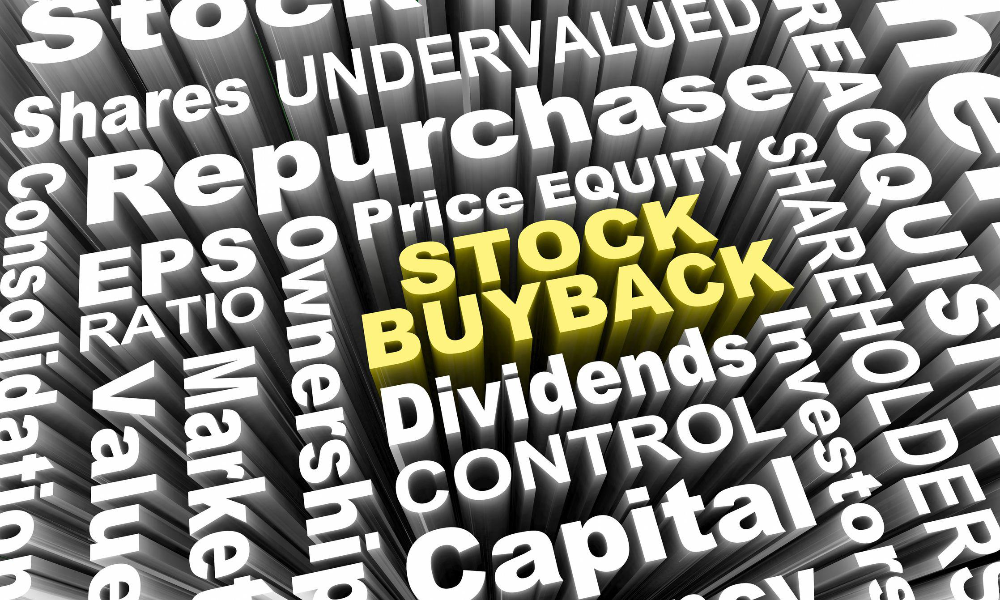

In today's dynamic financial landscape, three key components—stock buybacks, corporate finance strategies, and algorithmic trading—are increasingly influencing investing. A thorough understanding of these elements can significantly enhance both individual and organizational investment strategies by optimizing resource allocation and improving financial outcomes.

Stock buybacks, or share repurchases, have become a prevalent method for companies to return capital to shareholders. This practice involves a company purchasing its own shares from the marketplace, effectively reducing the total number of outstanding shares. The reduced share count can lead to an increase in the value of the remaining shares, assuming steady or growing company earnings. Buybacks are driven by motivations such as enhancing shareholder value, signaling confidence in the company’s fundamental health, and achieving favorable financial metrics, such as earnings per share (EPS).



Corporate finance, another cornerstone of financial strategy, deals with the efficient management of a company's capital structure and funding processes. These strategies have profound implications for a company's financial health and attractiveness to investors. Decisions made within corporate finance, including capital allocation strategies like stock buybacks, are integral in shaping shareholder value and influencing market perceptions.

Algorithmic trading, characterized by its use of sophisticated computational models to execute trades with high speed and frequency, has transformed modern financial markets. Algorithms can analyze vast amounts of data rapidly, identifying trading opportunities and executing them with precision. This technological advancement contributes to enhanced market liquidity but also introduces challenges, such as increased volatility and the need for robust risk management frameworks.

These concepts are intertwined, each impacting investment decisions from different angles. Understanding how stock buybacks, corporate finance decisions, and algorithmic trading intersect allows investors to craft strategies that are adaptable, forward-thinking, and capable of navigating the intricacies of today's financial environments. Such knowledge is not merely academic but is essential for effective decision-making in an ever-evolving market landscape.

## Table of Contents

## Understanding Stock Buybacks

Stock buybacks, also known as share repurchases, occur when a company buys back its own shares from the marketplace, effectively reducing the number of outstanding shares. This corporate financial strategy serves multiple purposes and has become a significant aspect of capital management.

One primary motivation for stock buybacks is the return of capital to shareholders. By purchasing its own shares, a company can provide value to shareholders, potentially leading to an increase in share price and thus enhancing shareholder wealth. Unlike dividend payments, which are generally subject to taxation, stock repurchases offer a tax-efficient method for distributing earnings to shareholders, as realized gains from increased share prices due to buybacks are often taxed at a lower rate, if taxed at all.

Companies may also engage in buybacks when they believe their stock is undervalued. Executives might decide that the current market price is below intrinsic value and thus strategically purchase shares to signal confidence in the company’s future prospects. This can occur following market corrections or in situations where internal assessments identify the stock as undervalued relative to peers or based on fundamentals.

Enhancement of financial metrics is another driving force behind buybacks. Reducing the number of outstanding shares can improve key financial ratios. For instance, earnings per share (EPS), a crucial indicator of profitability, is calculated as:

$$
\text{EPS} = \frac{\text{Net Income}}{\text{Average Outstanding Shares}}
$$

Thus, with fewer shares outstanding after a buyback, EPS can rise even if net income remains constant, often leading to improved perceptions of a company's financial performance, appealing to investors focused on profitability indicators.

Historically, stock buybacks have evolved through various phases of regulatory and market conditions. In the United States, for example, substantial changes occurred with the introduction of Rule 10b-18 by the Securities and Exchange Commission (SEC) in 1982, which provided a legal framework enabling companies to repurchase shares without being charged for market manipulation, provided they adhered to certain conditions such as time, [volume](/wiki/volume-trading-strategy), and price.

Regulatory environments and economic climates have impacted the prevalence and acceptance of stock buybacks over the decades. Periods of economic growth and low interest rates often see an uptick in repurchase activity as companies have more liquid capital at their disposal, whereas economic downturns may limit available resources for buybacks or shift focus towards [liquidity](/wiki/liquidity-risk-premium) preservation.

In summary, stock buybacks are a versatile financial strategy employed by companies to manage capital efficiently, enhance financial metrics, and potentially increase shareholder wealth. The practice is influenced by both internal assessments of company valuation and external regulatory and economic conditions. Understanding these dynamics is crucial for investors assessing corporate actions and predicting potential impacts on stock performance.

## Corporate Finance and Its Influence on Investment Strategies

Corporate finance is a pivotal facet of any business entity, concerned primarily with managing the capital structure, funding, and overall financial health of the organization. This involves strategic decisions that affect the company's balance sheet and, by extension, its market valuation and attractiveness to investors.

One of the primary ways corporate finance influences a company's trajectory is through efficient capital allocation. This encompasses a variety of financial strategies, including stock buybacks, mergers and acquisitions, investments in new projects, and managing debt levels. Each decision aims to optimize the company's capital structure—maximizing shareholder value while maintaining financial stability.

**Stock Buybacks**: Stock buybacks, or share repurchases, form a critical part of capital allocation strategies. When a company repurchases its shares, it reduces the total number of shares outstanding, thus often enhancing earnings per share (EPS). Consider the formula for EPS:

$$
\text{EPS} = \frac{\text{Net Income}}{\text{Outstanding Shares}}
$$

A reduction in the denominator (Outstanding Shares) without a change in the numerator (Net Income) leads to a higher EPS, potentially lifting the company's stock price. This strategy not only demonstrates the company's confidence in its intrinsic value but also reflects a commitment to returning value to shareholders.

Additionally, efficient capital allocation through stock buybacks can signal to investors that the company has sufficient cash flow and does not foresee better investment opportunities at the particular time. Nevertheless, the choice between deploying cash for buybacks or reinvesting in new ventures remains critical and complex.

**Impact on Shareholder Value and the Market**: The broader implications of these strategies on market perception can be significant. Strategic financial management can lead to enhanced shareholder value, which is often measured using metrics like Return on Equity (ROE) and Price/Earnings (P/E) ratio. Companies that successfully manage their capital allocation process typically exhibit stability and growth, which can positively affect their stock rankings and investor confidence. 

Moreover, the ripple effects of corporate finance decisions extend to the entire market. When large companies engage in stock buybacks or other financial maneuvers, these actions can influence market indices and peer companies' strategies. For example, widespread stock buybacks across sectors can lead to an artificial elevation in stock market valuations, impacting investment strategies across the board.

In essence, corporate finance is not just about the numbers. It serves as a guiding force that impacts business strategy, investor relations, and market dynamics. A well-crafted financial strategy aligns with the long-term vision of the company, ensuring sustainable growth and rewarding investors, while adapting to external economic shifts.

## The Role of Algorithmic Trading in Modern Markets

Algorithmic trading involves utilizing advanced computational models and algorithms to execute trades at high speed and frequency, reshaping modern financial markets. It has become a cornerstone for many institutional and individual investors due to its efficiency and precision in handling large volumes of transactions.

One of the primary benefits of [algorithmic trading](/wiki/algorithmic-trading) is its ability to enhance market liquidity. By executing trades rapidly and accurately, algorithms can match buy and sell orders efficiently, leading to tighter bid-ask spreads and increased market participation. This improvement in liquidity can reduce transaction costs and make markets more accessible to investors. However, the increased speed also introduces challenges, particularly concerning market [volatility](/wiki/volatility-trading-strategies). High-frequency trading ([HFT](/wiki/high-frequency-trading-strategies)) strategies can sometimes amplify price fluctuations, especially in less liquid markets, contributing to flash crashes or erratic price movements.

Integrating algorithmic trading strategies into investment portfolios can potentially improve returns, but it requires careful consideration and understanding of market dynamics. Investors can utilize various algorithmic strategies, such as [arbitrage](/wiki/arbitrage), [trend following](/wiki/trend-following), and statistical analysis, to identify and exploit market inefficiencies. For instance, arbitrage algorithms exploit price discrepancies across different markets or instruments, while trend-following strategies leverage historical price data to predict future movements.

A simple example of a trend-following algorithm in Python might involve using moving averages to signal when to buy or sell a security:

```python
import pandas as pd

def moving_average_strategy(prices, short_window=40, long_window=100):
    signals = pd.DataFrame(index=prices.index)
    signals['price'] = prices
    signals['short_mavg'] = prices.rolling(window=short_window, min_periods=1, center=False).mean()
    signals['long_mavg'] = prices.rolling(window=long_window, min_periods=1, center=False).mean()

    signals['signal'] = 0
    signals['signal'][short_window:] = np.where(signals['short_mavg'][short_window:] > signals['long_mavg'][short_window:], 1, 0)   
    signals['positions'] = signals['signal'].diff()

    return signals

# Example usage
# prices = pd.Series(data=some_time_series_data)
# signals = moving_average_strategy(prices)
```

While algorithmic trading offers potential for enhanced performance, it is not without risks. Market conditions can fluctuate rapidly, and models that do not adapt may incur significant losses. Additionally, technical failures or errors in algorithm design can lead to unintended trading outcomes.

Nevertheless, with robust risk management practices and continuous monitoring, investors can harness the power of algorithmic trading to achieve superior portfolio diversification and performance. By staying informed and adapting to technological advancements, investors can effectively integrate algorithmic strategies into their broader investment frameworks, aligning with evolving market trends.

## Stock Buybacks vs. Dividends: A Comparative Analysis

Stock buybacks and dividends are integral components of a company's capital distribution strategy, aiming to return value to shareholders. While both methods achieve this goal, they do so with differing financial implications and investor reactions.

**Tax Implications**

From a tax perspective, dividends are generally taxable as income when received by shareholders. This can present a less favorable outcome for investors, especially in regions with high tax rates on dividends. Conversely, stock buybacks often provide a more tax-efficient alternative. In a buyback, shareholders may choose whether to sell their shares and realize capital gains, which are often taxed at a lower rate compared to dividend income. This deferral of tax liabilities is advantageous for investors seeking to minimize tax burdens in the short term.

**Impact on Stock Prices**

The impact of each strategy on stock prices tends to vary. Dividends signal a company's strong cash flow capabilities and can boost investor confidence, leading to potential increases in stock prices. They provide a steady income stream, attracting income-focused investors, which stabilizes demand for the stock. Conversely, stock buybacks directly reduce the number of outstanding shares, enhancing metrics like earnings per share (EPS) and potentially driving up stock prices as demand remains constant, but supply decreases. The immediate perception of buybacks as a bullish signal can lead to short-term price increases, though the long-term effects are more complex and heavily contingent on the company's overall financial health and growth prospects.

**Investor Preferences**

Investor preferences between stock buybacks and dividends often hinge on individual financial situations and investment strategies. Income investors may favor dividends due to their consistent nature and predictable cash flow. Growth-focused investors or those in higher tax brackets might prefer buybacks, seeking capital appreciation and tax efficiency. Moreover, buybacks offer investors the flexibility to sell shares at their discretion, aligning with personal financial goals or market conditions.

**When One Approach Might Be Favored Over the Other**

Scenarios that favor one approach over the other are influenced by various factors:

1. **Market Conditions**: In volatile markets, dividends provide stability and can support share price. Conversely, when companies perceive their stock as undervalued, buybacks can be a strategic method of using excess cash for long-term growth.

2. **Company Life Cycle**: Mature companies with excess cash and limited growth opportunities often resort to dividends. In contrast, firms focused on aggressive growth might choose buybacks to reinvest in themselves by optimizing shareholder value.

3. **Balance Sheet Strength**: Companies with robust balance sheets may initiate buybacks to optimize capital structure or guard against potential takeovers. Meanwhile, companies with predictable cash flows might consistently pay dividends as a testament to financial stability.

Analyzing these strategies through a comprehensive lens reveals their unique roles in shareholder value creation. Each approach has distinct advantages and potential trade-offs that depend on specific corporate and investor scenarios.

## The Pros and Cons of Stock Buybacks

Stock buybacks, also known as share repurchases, have become a prevalent tactic among corporations to enhance shareholder value. By reducing the number of outstanding shares, buybacks directly increase the Earnings Per Share (EPS), assuming the company's net income remains constant. This can, in turn, lead to a boost in the company's stock price as investors perceive the firm's future earnings potential more favorably.

### Advantages of Stock Buybacks

One significant advantage of stock buybacks is the increased EPS, which often results in positive stock price movement. As the number of shares decreases, the same level of earnings is distributed over fewer shares, making each share more valuable. For example, the EPS is calculated as:

$$
\text{EPS} = \frac{\text{Net Income}}{\text{Outstanding Shares}}
$$

A decrease in the denominator, assuming stable or increasing net income, results in a higher EPS. Enhanced EPS often makes a company more attractive to investors, theoretically leading to a higher market valuation.

Stock buybacks also provide a flexible mechanism for returning capital to shareholders compared to dividends. While dividends commit a company to regular cash outflows, buybacks can be executed at the company's discretion, allowing for financial flexibility based on prevailing market conditions and cash reserves.

Moreover, buybacks can signal management's confidence in the company's future prospects. When a company buys back its shares, it often indicates that management believes the stock is undervalued, suggesting potential growth or profitability.

### Drawbacks of Stock Buybacks

Despite their advantages, stock buybacks are not without criticism. One potential drawback is the masking of underlying operational underperformance. By artificially inflating EPS without genuine growth in revenue or profit, companies may mislead investors about the actual health of the business.

Furthermore, excessive focus on buybacks can result in underinvestment in core business areas. Companies might prioritize short-term share price appreciation over long-term investments in research and development, expansion, or human capital, which are crucial for sustained growth.

Critics also argue that buybacks can contribute to an inequitable distribution of wealth within a company. Funds used for repurchases could alternatively be invested in employee welfare, infrastructure, or innovation, benefiting a broader stakeholder base.

### Regulatory Perspectives

Regulatory bodies have shown increased scrutiny over the practice of stock buybacks. Concerns include the potential for manipulation of stock prices and the prioritization of shareholder returns at the expense of other stakeholders. Some jurisdictions have introduced rules to enhance transparency and accountability, requiring companies to disclose comprehensive details of their buyback programs.

In conclusion, while stock buybacks can be a powerful tool for financial engineering and rewarding investors, they must be balanced against potential risks and criticisms. Thoughtful consideration of the company's long-term strategy and regulatory environment is crucial in employing buybacks effectively.

## Case Study: Impact of Stock Buybacks on Major Corporations

Stock buybacks have become a prominent financial strategy among major corporations, with companies like Apple leading the charge in utilizing this tactic to enhance shareholder value and optimize capital allocation. This section examines Apple's record-setting buyback initiatives, the observed outcomes, financial results, and strategic lessons learned.

### Apple Inc. Buyback Strategy

Apple Inc. is one of the most notable examples of a company employing stock buybacks as a significant element of its financial strategy. Since announcing its first major buyback program in 2012, Apple has consistently repurchased its shares, culminating in a staggering buyback of over $90 billion in 2020 alone. This commitment to buybacks has been part of Apple's broader capital return program, aimed at returning excess capital to shareholders.

### Observed Outcomes and Financial Results

1. **Increased Earnings Per Share (EPS)**:
   By reducing the number of outstanding shares, Apple's buybacks have contributed to an increase in its EPS. The formula for EPS is:
$$
   \text{EPS} = \frac{\text{Net Income}}{\text{Average Outstanding Shares}}

$$

   As the denominator decreases with buybacks, the EPS naturally increases, potentially enhancing the attractiveness of the stock to investors.

2. **Impact on Stock Price**:
   Apple's buybacks have helped support its stock price by increasing demand for shares and signaling confidence to the market about the company's financial health. Empirical studies show that companies engaging in buybacks often see a positive short-term impact on their stock prices.

3. **Return on Investment (ROI)**:
   Buybacks have contributed to Apple's strong ROI, demonstrating effective use of capital to generate shareholder value. This aligns with the company's strategy to optimize its capital structure without significantly increasing its debt levels.

### Strategic Lessons Learned

1. **Signal of Confidence**:
   Apple's commitment to large-scale buybacks serves as a market signal of the company's confidence in its stable cash flows and growth prospects. This strategy can enhance investor trust and potentially attract a broader investor base.

2. **Balancing Capital Allocation**:
   Through its buyback program, Apple balances capital allocation between returning money to shareholders and investing in growth opportunities, such as research and development or strategic acquisitions. This balance is crucial for sustaining long-term corporate growth alongside shareholder rewards.

3. **Navigating Market Conditions**:
   Apple's strategic deployment of buybacks, particularly during periods of market volatility, reflects its ability to adapt to changing market conditions while prioritizing shareholder returns. This adaptability demonstrates the importance of timing and flexibility in executing buyback programs.

In summary, Apple's stock buyback initiatives provide illuminating insights into how corporations can strategically utilize repurchase programs to enhance financial metrics, support stock prices, and strengthen shareholder relationships. The success of Apple's buyback strategy underscores the potential benefits of well-timed and appropriately scaled share repurchase programs in achieving corporate financial objectives.

## Aligning Investment Strategies with Market Trends

Adapting investment strategies to align with market trends is increasingly important in a landscape influenced by innovative practices like stock buybacks and algorithmic trading. Investors are advised to integrate these modern approaches with traditional models for optimal diversification and risk management.

Stock buybacks present an opportunity for investors to gauge a company's financial health and strategic intent. Companies repurchasing shares often aim to signal confidence in their business prospects, potentially leading to increased share value. Investors can analyze buyback announcements as a signal for investment decisions, considering factors such as the scale of the buyback, the company’s current valuation, and industry comparisons.

Algorithmic trading automates and optimizes trade execution by employing sophisticated mathematical models and high-speed computing. For investors, incorporating algorithmic insights can streamline portfolio management, enhancing return potential while managing risks. By utilizing algorithms to analyze large datasets, investors can identify patterns and trends that might not be apparent through manual analysis. Python, for instance, is a popular language used to develop algorithmic trading models due to its extensive libraries such as NumPy and pandas for data analysis, as well as [backtesting](/wiki/backtesting) libraries like Backtrader.

In terms of strategy integration, investors might use a balanced approach. Traditional investment models focusing on fundamentals and long-term growth can be complemented with data-driven techniques. Algo trading tools can provide real-time analysis, offering a competitive edge in identifying lucrative trading opportunities or hedging strategies. For instance, an algorithm might monitor market sentiment around buyback announcements, executing trades based on projected stock price movements.

Investment strategies should also consider diversification across asset classes and geographies to mitigate risks associated with market volatility. Incorporating both buyback signals and algorithmic insights into portfolios will require constant monitoring and adjustment to respond to market changes effectively. By blending traditional and modern tools, investors can enhance portfolio performance while navigating the complexities of contemporary financial markets.

## Conclusion

Stock buybacks, alongside robust corporate finance practices and the implementation of algorithmic trading, significantly influence investment strategies in today's markets. These elements collectively enhance both the decision-making process and the financial results for investors. Understanding how they interconnect allows investors to optimize their strategies by aligning them more closely with market dynamics and corporate behaviors. 

Stock buybacks can alter the supply-demand balance for a company's shares, often leading to price increases due to reduced share availability. This, combined with effective corporate finance strategies such as capital optimization and efficient resource allocation, can significantly impact shareholder value. Algorithmic trading further complements these strategies by providing enhanced market liquidity and allowing for rapid adjustments to investment portfolios, thereby optimizing returns.

Investors are encouraged to remain informed about these interconnected elements to effectively navigate the evolving financial landscape. By systematically analyzing market signals and corporate actions, incorporating technological advancements in trading, and understanding regulatory changes, investors can achieve superior portfolio performance and better risk management. In summary, a well-rounded approach that integrates stock buybacks, sound corporate finance, and cutting-edge trading technology is crucial for maximizing financial outcomes.

## Frequently Asked Questions (FAQs)

### Frequently Asked Questions (FAQs)

**1. What are stock buybacks and how do they impact stock prices?**

Stock buybacks, or share repurchases, occur when a company purchases its own shares from the marketplace. By reducing the number of outstanding shares, buybacks can increase the earnings per share (EPS) and, consequently, may drive up the stock price. This often signals to investors that the company believes its stock is undervalued, potentially leading to increased investor interest and a boost in market confidence.

**2. How do stock buybacks fit into corporate finance strategy?**

Stock buybacks are part of a broader corporate finance strategy focused on optimizing capital allocation. By repurchasing shares, companies return excess cash to shareholders, improve key financial ratios, and demonstrate disciplined capital management. The decision to initiate buybacks often reflects management's assessment of investment opportunities, balancing between reinvesting in the business and returning capital to shareholders.

**3. What are the fundamental principles of algorithmic trading?**

Algorithmic trading involves deploying computer programs to execute trades automatically based on predefined criteria, such as timing, price, or volume. Essential principles include speed, accuracy, and the elimination of human emotions in trading decisions. Algorithms can execute complex strategies with high precision and speed, enabling traders to exploit market inefficiencies and price discrepancies.

**4. What are the benefits of algorithmic trading?**

Algorithmic trading offers several benefits, including increased trading speed and efficiency, reduced transaction costs, and enhanced market liquidity. It allows traders to backtest strategies on historical data, optimize for profitability, and facilitate large volumes of transactions with minimal manual intervention. By minimizing human error, algo trading enhances the consistency and reliability of trading outcomes.

**5. What are the risks associated with algorithmic trading?**

While algorithmic trading can be advantageous, it also carries risks such as technical failures, over-optimization, and market impact. Algorithms reliant on historical data might perform poorly in unforeseen market conditions. Additionally, rapid and vast trade execution can inadvertently contribute to market volatility, as evidenced by events like the "Flash Crash" of 2010. Effective risk management and robust algorithm testing are crucial to mitigate these risks.

**6. How do investors integrate algorithmic trading into their portfolios?**

Investors can integrate algorithmic trading by leveraging trading platforms that offer algo trading capabilities or by collaborating with experienced algorithm developers. A diversified investment strategy may include a mix of algorithmic and traditional trading approaches. Investors should ensure they understand the underlying logic of the algorithms used and continuously monitor their performance to adjust as necessary based on market conditions.

## References & Further Reading

[1]: ["Stock Buyback: What It Is and How It's Used"](https://www.investopedia.com/terms/b/buyback.asp) by Adam Hayes, CFA, Investopedia

[2]: ["The Increasing Use of Stock Buybacks: Causes and Consequences"](https://hbr.org/2020/01/why-stock-buybacks-are-dangerous-for-the-economy) by Jesse M. Fried and Charles C.Y. Wang, National Bureau of Economic Research

[3]: ["Algorithmic Trading and DMA: An Introduction to Direct Access Trading Strategies"](https://www.amazon.com/Algorithmic-Trading-DMA-introduction-strategies/dp/0956399207) by Barry Johnson

[4]: ["Corporate Finance"](https://www.investopedia.com/terms/c/corporatefinance.asp) by Stephen A. Ross, Randolph W. Westerfield, and Jeffrey F. Jaffe

[5]: ["The Effects of Share Repurchases on Stock Prices in Different Market Conditions"](https://www.investopedia.com/articles/02/041702.asp) by Josef Lakonishok and Theo Vermaelen, The Journal of Finance

[6]: ["Dynamic Trading with Predictable Returns and Transaction Costs"](https://pages.stern.nyu.edu/~lpederse/papers/DynamicTrading.pdf) by Andrew W. Lo and Jiang Wang, The Journal of Finance