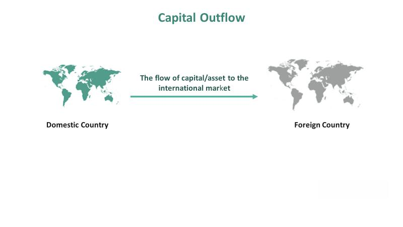

In recent years, the financial markets have experienced significant changes primarily driven by advancements in technology and automation. Notably, algorithmic trading has emerged as a crucial component in shaping stock market dynamics. This form of trading involves the use of sophisticated algorithms to execute trades at high speeds, far surpassing the capabilities of traditional human trading. As a result, algorithmic trading has become a dominant force in determining stock price movements.

One of the critical aspects that algorithmic trading influences is capital flow. Capital flow refers to the movement of money across different markets due to investment, trade, or business operations, and it plays a vital role in affecting stock prices. With the rise of technology, these flows have become more dynamic and complex, significantly impacting liquidity and volatility within financial markets.



Various factors drive these phenomena, including market psychology, economic indicators, and geopolitical tensions. Market psychology reflects the collective mood or sentiment of investors that can affect their trading decisions, often leading to fluctuations in stock prices. Economic indicators such as interest rates, unemployment figures, and GDP growth serve as critical metrics for evaluating the health of an economy, influencing investor decisions and, subsequently, capital flows. Additionally, geopolitical tensions can create uncertainty, prompting rapid movements of capital across borders as investors seek safer or more rewarding opportunities.

Understanding these influences is crucial for investors aiming to navigate the multifaceted landscape of modern financial markets. As these dynamics continue to evolve with technological advancements, staying informed about how algorithmic trading and capital flows influence stock price movements becomes more essential than ever. By identifying the key drivers and mechanisms at play, investors can better manage risks and capitalize on opportunities within this complex environment.

## Table of Contents

## Understanding Capital Flow in Financial Markets

Capital flow characterizes the movement of financial capital across international and domestic structures, with the primary motive being investment, trade, or business production. Within financial markets, this movement signifies the buying and selling of financial assets, which can significantly influence stock prices. The fluidity and volume of capital flow are critical as they determine market liquidity and can lead to price volatility when there are abrupt shifts.

The impact of capital flow on asset prices within markets is governed by multiple factors. One paramount consideration is the perceptions held by investors. Investor sentiment can drive intense capital movements; optimism may boost inflows, while pessimism could precipitate outflows. These perceptions are often influenced by available economic information, such as GDP growth rates, employment figures, and inflation data, which investors interpret to gauge future market conditions.

Economic policies also play a substantial role in shaping capital flows. Fiscal policies, including government spending and taxation, alongside monetary policies such as [interest rate](/wiki/interest-rate-trading-strategies) adjustments, can either attract or deter capital. For example, higher interest rates might attract foreign capital due to better returns, affecting stock prices and economic indicators positively. Conversely, expansionary fiscal policies, like increased government spending, can spur domestic investment but may also lead to inflationary pressures, affecting the attractiveness of local assets.

Global trends, including geopolitical developments, trade policies, and international economic agreements, further influence capital flows. Events such as trade wars, political instability in key regions, or shifts in global economic power can lead to significant reallocations of capital. For example, trade tariffs can alter capital flow patterns by affecting the relative competitiveness of goods and services, thus impacting investment priorities.

Understanding capital flow is essential for investors aiming to navigate the complex landscape of modern financial markets. By analyzing these flows, investors can make informed decisions regarding asset allocation. For instance, a consistent inflow of capital into a country might suggest a favorable investment environment, potentially leading to appreciating stock prices. Conversely, substantial outflows could indicate underlying economic challenges, encouraging investors to reconsider their investment strategies.

Moreover, advanced tools like [machine learning](/wiki/machine-learning) algorithms and quantitative models are increasingly employed to analyze capital flow patterns. These technologies allow for the processing of vast amounts of data, identifying trends, and forecasting future movements. Python, for example, with libraries such as Pandas and NumPy, can be used to analyze capital flow data efficiently:

```python
import pandas as pd
import numpy as np

# Example dataset: capital flow in/out per month
data = {'Month': ['Jan', 'Feb', 'Mar', 'Apr'],
        'Inflow': [1000, 1200, 1100, 900],
        'Outflow': [800, 600, 700, 950]}

df = pd.DataFrame(data)

# Calculate net flow
df['NetFlow'] = df['Inflow'] - df['Outflow']

# Determine periods of positive and negative net flow
positive_periods = df[df['NetFlow'] > 0]
negative_periods = df[df['NetFlow'] < 0]

positive_periods, negative_periods
```

By employing these strategies, investors not only safeguard their portfolios against potential adverse movements but also position themselves advantageously to capitalize on burgeoning opportunities within dynamic markets.

## The Dynamics of Stock Price Declines

Stock prices are highly susceptible to fluctuations driven by investor sentiment and the prevailing market environment. One of the primary contributors to downward stock price movements is negative economic data. Indicators such as rising unemployment rates, decreasing consumer spending, and declining manufacturing output can undermine investor confidence, often leading to a sell-off. For example, poor performance metrics from a major company or sector can create a ripple effect, causing investors to reassess the value of related stocks. Similarly, geopolitical tensions, such as trade disputes or military conflicts, introduce uncertainty, prompting investors to retreat to safer assets, thereby exerting downward pressure on stock prices.

Algorithmic trading plays a significant role in this dynamic, particularly in markets characterized by rapid changes. These systems utilize complex algorithms to determine trading strategies, execute orders, and manage trades at speeds and volumes unattainable by human traders. When unfavorable market conditions trigger pre-set conditions within these algorithms, they can initiate substantial sell orders, increasing the supply of stocks in the market instantaneously. This mechanized trading can lead to a domino effect: as prices begin to fall, algorithms may trigger additional sales, accelerating the decline in stock prices.

The amplification of price movements by [algorithmic trading](/wiki/algorithmic-trading) occurs because these systems react to price changes rather than the underlying fundamentals. For example, during a market downturn, algorithms might continue selling if specific price levels or [momentum](/wiki/momentum) thresholds are breached. This behavior can enhance [volatility](/wiki/volatility-trading-strategies), making stock prices move more dramatically in response to minor stimuli. Thus, while algorithms bring [liquidity](/wiki/liquidity-risk-premium) and efficiency to the markets, they can also intensify market swings, making stock prices more volatile and less predictable in the short term.

To illustrate these phenomena programmatically, consider the following simple Python representation of how algorithmic trading might exacerbate stock price declines:

```python
# Simulation of stock price decline with algorithmic trading impact
import numpy as np

def simulate_stock_price_decline(initial_price, steps, alg_trading_impact):
    prices = [initial_price]
    for _ in range(steps):
        market_trend = np.random.choice([-1, 1], p=[0.5 + alg_trading_impact, 0.5 - alg_trading_impact])
        price_change = np.random.normal(0, 1) * market_trend
        new_price = max(prices[-1] + price_change, 0)  # ensure price does not go negative
        prices.append(new_price)
    return prices

initial_stock_price = 100
time_steps = 100
algorithmic_impact = 0.1  # 10% chance that algorithms will exacerbate price changes

stock_prices = simulate_stock_price_decline(initial_stock_price, time_steps, algorithmic_impact)

# Plotting the result
import matplotlib.pyplot as plt

plt.plot(stock_prices)
plt.title("Simulated Stock Price Decline with Algorithmic Trading Impact")
plt.xlabel("Time Steps")
plt.ylabel("Stock Price")
plt.show()
```

In this simulation, the influence of algorithmic trading is represented by a parameter that slightly skews the probability of price declines. Such models help in understanding the potential amplification effects that algorithms may have during periods of market stress. This example reflects how algorithmic responses to price thresholds can contribute to more pronounced stock price declines, underscoring the complexity introduced by automated trading systems in modern financial markets.

## The Role of Algorithmic Trading

Algorithmic trading has fundamentally transformed financial markets by employing complex mathematical models to make trading decisions. These models leverage a vast array of data inputs, including historical prices, trading volumes, and even real-time news feeds, enabling algorithms to identify potential trading opportunities rapidly and efficiently. The central objective of algorithmic trading is to execute trades at high speeds and frequencies, a capability that has both enhanced market liquidity and efficiency.

For instance, consider a simplistic algorithmic trading strategy, a moving average crossover. The algorithm might be programmed to buy a stock when its short-term moving average crosses above its long-term moving average, signaling a potential upward trend, and to sell when the opposite occurs. This rudimentary strategy can be expressed in Python as follows:

```python
def moving_average(data, window_size):
    return data.rolling(window=window_size).mean()

short_window = 40
long_window = 100

signals = pd.DataFrame(index=data.index)
signals['short_mavg'] = moving_average(data['price'], short_window)
signals['long_mavg'] = moving_average(data['price'], long_window)

signals['signal'] = 0.0
signals['signal'][short_window:] = np.where(signals['short_mavg'][short_window:] 
                                             > signals['long_mavg'][short_window:], 1.0, 0.0)
signals['positions'] = signals['signal'].diff()
```

Such strategies underscore the potential of algorithmic trading to automate decision-making processes in financial markets. However, while algorithmic trading increases efficiency, its high-speed nature can also lead to increased market volatility, especially during abrupt market shifts. 

During periods of significant market stress, algorithms may execute large orders simultaneously based on similar pre-defined conditions, contributing to dramatic price swings. This phenomenon was exemplified during the 2010 Flash Crash, where rapid fluctuations were exacerbated by algorithms executing trades in microseconds, leading to drastic and momentary downturns in U.S. stock indices.

The unintended consequences of algorithmic trading raise notable concerns. During market routs, the swift execution of sell orders by algorithms can compound price declines, triggering further selling pressure and cascading adverse effects across global markets. This issue is compounded by a lack of transparency concerning the logic and criteria behind algorithmic decisions, often leading to unforeseen liquidity shortages.

The regulatory landscape continues to adapt to these challenges, with institutions like the U.S. Securities and Exchange Commission (SEC) increasing scrutiny and requiring greater transparency and controls over high-frequency trading practices. Overall, while algorithmic trading is a powerful tool that has revolutionized modern trading environments, its capacity to amplify market volatility and contribute to destabilizing downturns necessitates careful monitoring and regulation.

## The Psychological and Economic Impact of Stock Price Declines

Stock price declines have profound psychological and economic effects. When stock prices fall, there is an immediate and noticeable reduction in wealth for investors. This loss of wealth can lead to decreased consumer spending, as individuals and institutions might tighten their budgets in response to a perceived decrease in financial security. Reduced spending can, in turn, contribute to broader economic downturns, creating a vicious cycle where decreased expenditure further dampens economic growth, leading to more stock price declines.

Investor confidence is another casualty of declining stock prices. Confidence is a crucial component of market behavior, and when it wanes, it can trigger a series of reactions. One common response is panic selling. This phenomenon occurs when investors, driven by fear and uncertainty, hastily sell their assets as stock prices begin to fall. Panic selling amplifies downward pressure on prices because it often leads to a supply-demand imbalance—more sellers than buyers—which drives prices further down.

Consider a scenario where a stock price drop triggers panic among retail investors. The increased sell-off can lead to further price reductions, panicking more investors and perpetuating the cycle. This reaction can be modeled mathematically through simple mean-field models that describe how herd behavior affects stock prices. Using Python, the simulation of panic selling might involve random walks or agent-based models, demonstrating how individual decisions aggregate to market-wide phenomena.

For long-term investors, the challenge lies in distinguishing between short-term market volatility and underlying economic fundamentals. These investors often employ strategies that focus on the intrinsic value and long-term potential of their investments, minimizing the influence of daily price fluctuations. By maintaining a long-term perspective, investors can potentially avoid the pitfalls of rash decision-making prompted by short-term market movements.

Long-term investment strategies might include [fundamental analysis](/wiki/fundamental-analysis) to assess the value of a stock based on factors such as earnings, dividends, and growth potential, thereby setting aside temporary market noise. By concentrating on fundamentals, investors can better withstand periods of volatility, bolstering their capacity to endure market downturns without succumbing to panic. This approach can make the difference between a reactionary sell-off and informed, strategic decision-making.

In summary, stock price declines can severely impact both the economy and investor psychology. The feedback loop of reduced wealth and confidence can exacerbate economic challenges, while the psychological tendency toward panic selling enhances volatility. Long-term investors may mitigate these effects by focusing on the intrinsic value of their investments and remaining steadfast in the face of short-term fluctuations.

## Strategies to Mitigate the Impact of Market Volatility

Investors can protect against market volatility and declining stock prices through a range of strategies designed to manage risk and stabilize returns. Diversification is a cornerstone of risk management. By spreading investments across various asset classes and sectors, investors can reduce the impact of a downturn in any single area. For example, a diversified portfolio might incorporate equities, bonds, real estate, and commodities, each reacting differently to market conditions. The concept aligns with the saying, "Don't put all your eggs in one basket," which advocates for spreading risk across diverse investments.

Stop-loss orders are another effective risk management tool. These orders automatically sell a security when its price falls to a predetermined level, thereby limiting potential losses. For instance, if an investor sets a stop-loss order for a stock at 10% below its purchase price, the stock will be sold if its price drops to that level, preventing further losses. Implementing stop-loss orders can be part of a broader strategy that includes other techniques like trailing stops, which adjust the stop price as the stock's price moves favorably.

Long-term investing is another strategy that helps investors weather market volatility. By focusing on long-term goals, investors can look beyond short-term market fluctuations and resist the urge to panic sell during downturns. This approach requires resilience and a disciplined mindset, emphasizing the importance of maintaining a strategic perspective over temporal reactions. Historical data often supports this method; while markets experience downturns, they also recover and tend to grow over extended periods.

Additionally, maintaining a disciplined approach involves regular portfolio reviews and adjustments based on changing market conditions and personal financial goals. It is advisable for investors to keep updated with economic indicators and trends to make informed decisions. Leveraging technologies like robo-advisors can assist in managing portfolios effectively through automated portfolio rebalancing and tax-loss harvesting.

Incorporating these strategies can mitigate the impact of market volatility, enabling investors to maintain a balanced and resilient portfolio even during tumultuous times. By understanding and utilizing these approaches, investors can aim to secure their financial objectives amidst the inherent uncertainties of financial markets.

## Conclusion

The interplay between capital flow, stock price dynamics, and algorithmic trading is central to understanding the modern financial markets. These elements collectively shape the market's behavior, creating both opportunities and risks for investors. Capital flows, driven by investor sentiment and global economic trends, can significantly alter stock price levels. Meanwhile, algorithmic trading, with its high-speed execution and [volume](/wiki/volume-trading-strategy), often amplifies price movements, particularly during periods of market stress. 

For investors, understanding these interactions is crucial to making informed decisions and mitigating risks. The rapid advancements in technology are continuously evolving the landscape, making it essential for investors to remain informed about the latest market trends and dynamics. By employing a proactive approach—through strategies such as diversification, risk management, and aligning with long-term objectives—investors can better navigate volatile market environments. Staying informed and prepared is key to successfully managing investments in a world where financial markets are increasingly driven by complex and interconnected factors.

## References & Further Reading

[1]: Lopez de Prado, M. (2018). ["Advances in Financial Machine Learning."](https://www.amazon.com/Advances-Financial-Machine-Learning-Marcos/dp/1119482089) Wiley.

[2]: Chan, E. (2009). ["Quantitative Trading: How to Build Your Own Algorithmic Trading Business."](https://github.com/ftvision/quant_trading_echan_book) Wiley.

[3]: Jansen, S. (2020). ["Machine Learning for Algorithmic Trading."](https://github.com/stefan-jansen/machine-learning-for-trading) Packt Publishing.

[4]: Aronson, D. R. (2006). ["Evidence-Based Technical Analysis: Applying the Scientific Method and Statistical Inference to Trading Signals."](https://www.amazon.com/Evidence-Based-Technical-Analysis-Scientific-Statistical/dp/0470008741) Wiley.

[5]: Aldridge, I. (2013). ["High-Frequency Trading: A Practical Guide to Algorithmic Strategies and Trading Systems."](https://www.wiley.com/en-us/High+Frequency+Trading%3A+A+Practical+Guide+to+Algorithmic+Strategies+and+Trading+Systems-p-9780470579770) Wiley.