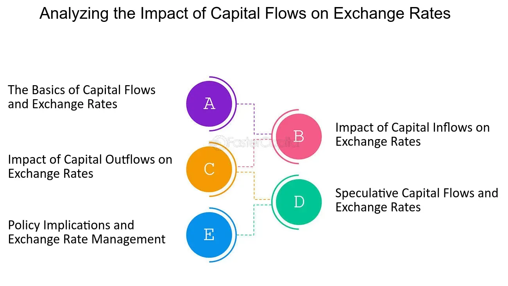

## Table of Contents

## What is a stock price decline?

A stock price decline happens when the price of a stock goes down. This can happen for many reasons, like if a company is not doing well or if people think it won't do well in the future. When the price drops, it means that the stock is worth less money than before.

This can be bad news for people who own the stock because their investment is now worth less. But, it can be good news for people who want to buy the stock because they can get it for a lower price. Sometimes, a stock price decline can be a short-term thing, and the price might go back up later.

## How does a stock price decline affect a company's market value?

When a stock price goes down, it directly affects the company's market value. The market value, or market capitalization, is figured out by multiplying the total number of shares a company has by the current price of one share. So, if the stock price drops, the market value of the company goes down too. This means the whole company is worth less money in the eyes of the stock market.

A lower market value can make it harder for the company to get money from investors or to borrow money from banks. If investors see that the company's value is going down, they might not want to put their money into it. Banks might also think the company is riskier and might charge more interest on loans or not give loans at all. This can make it tough for the company to grow or even to keep running smoothly.

## What are the immediate effects of a stock price decline on investors?

When a stock's price goes down, investors who own the stock see the value of their investment drop. This means if they wanted to sell their shares right then, they would get less money than before. It can be upsetting for investors because it looks like they are losing money. Some investors might decide to sell their shares to avoid losing even more money, which can make the stock price go down even more.

On the other hand, a stock price decline can be good news for some investors. People who want to buy the stock can now get it for a lower price. They might think the stock is a good deal and will go up in value later. So, they buy the stock hoping to make money when the price goes back up. This can help the stock price start to recover if enough people think it's a good buy at the lower price.

## How does a stock price decline influence capital flow within a company?

When a company's stock price goes down, it can make it harder for the company to get money from investors. Investors might see the lower stock price and think the company is not doing well. They might not want to give the company more money by buying new shares or investing in other ways. This can slow down the flow of capital into the company, making it harder for the company to grow or even to keep running smoothly.

Also, a lower stock price can affect the company's ability to borrow money. Banks and other lenders might see the lower stock price and think the company is riskier. They might charge higher interest rates on loans or might not want to lend money at all. This can make it tougher for the company to get the money it needs to operate and invest in new projects. So, a stock price decline can really change how money moves in and out of a company.

## What role do stock price declines play in investor confidence?

When a stock's price goes down, it can make investors feel less confident about the company. They might start to think that the company is not doing well or that it might have problems in the future. This can make them worried about their investment and less likely to put more money into the company. If a lot of investors feel this way, it can lead to even more people selling their shares, which can make the stock price go down even more.

On the other hand, some investors might see a stock price decline as a chance to buy the stock at a lower price. They might think the company is still good and that the price will go back up later. If enough investors feel this way and start buying the stock, it can help the price start to recover. So, a stock price decline can shake investor confidence, but it can also create opportunities for those who believe in the company's future.

## How do stock price declines impact a company's ability to raise new capital?

When a company's stock price goes down, it can make it harder for the company to raise new money. Investors might see the lower stock price and think the company is not doing well. They might not want to buy new shares or invest in other ways because they think it's too risky. This means the company can't get as much money from selling new shares, which is important for growing the business or even keeping it running smoothly.

A lower stock price can also make it harder for the company to borrow money. Banks and other lenders might see the lower stock price and think the company is riskier. They might charge higher interest rates on loans or might not want to lend money at all. This makes it tougher for the company to get the money it needs to operate and invest in new projects. So, a stock price decline can really change how much new money a company can bring in.

## What are the long-term effects of sustained stock price declines on capital investment?

When a company's stock price keeps going down for a long time, it can really hurt how much money the company can spend on new projects. Investors might see the falling stock price and think the company is not doing well. They might not want to give the company more money by buying new shares or investing in other ways. This means the company has less money to spend on things like new factories, research, or expanding into new markets. Without enough money, the company might have to cut back on these big projects, which can slow down its growth and make it harder to stay competitive.

Over time, if the stock price stays low, it can also make it harder for the company to borrow money. Banks and other lenders might see the low stock price and think the company is too risky. They might charge higher interest rates on loans or might not want to lend money at all. This can make it even tougher for the company to get the money it needs for big investments. If the company can't invest in new projects, it might fall behind other companies that are able to keep investing and growing. This can lead to even more problems for the company in the long run.

## How do stock price declines affect the cost of capital for a company?

When a company's stock price goes down, it can make the cost of capital go up. The cost of capital is how much it costs the company to get money, either by selling shares or borrowing from banks. If the stock price is low, investors might think the company is riskier. They might want a higher return on their investment to make up for that risk. So, if the company wants to sell new shares, it might have to offer them at a lower price, which means less money coming in for each share. This makes the cost of getting money from selling shares higher.

Also, a lower stock price can make borrowing money more expensive. Banks and other lenders might see the low stock price and think the company is not doing well. They might charge higher interest rates on loans to cover the risk of lending to a company that seems to be struggling. Higher interest rates mean the company has to pay more money back over time, which makes the cost of borrowing go up. So, when the stock price goes down, it can make it more expensive for the company to get the money it needs to run and grow.

## In what ways can a stock price decline lead to changes in corporate strategy?

When a company's stock price keeps going down, it might need to change its plans. The company might see that investors are not happy and decide to focus on making more money right away. This could mean cutting costs, like letting go of workers or closing some offices. The company might also stop spending on big projects that take a long time to pay off. Instead, it might try to find quick ways to make money to show investors that things are getting better.

Another way a stock price decline can change what a company does is by making it look for new ways to grow. If the company can't get money from selling shares or borrowing, it might try to find partners or even sell parts of the business to get cash. The company might also decide to go into new markets or start selling new products to bring in more money. These changes can help the company survive and maybe even make the stock price go back up over time.

## How do stock price declines influence mergers and acquisitions?

When a company's stock price goes down, it can make it a target for other companies wanting to buy it. The lower stock price means the company might be cheaper to buy. So, other companies might see this as a good chance to take over and get a good deal. This can lead to more mergers and acquisitions because the buying company can get more for their money. The company with the lower stock price might also be more willing to be bought because it needs money or wants to join forces with a stronger company.

On the other hand, a company with a falling stock price might find it harder to buy other companies. If its stock price is low, it might not have enough money to make a big purchase. Also, other companies might not want to be bought by a company that seems to be struggling. This can slow down mergers and acquisitions for the company with the lower stock price. So, while a stock price decline can make a company a target for takeovers, it can also make it harder for that company to grow by buying other businesses.

## What are the macroeconomic implications of widespread stock price declines on capital flow?

When many companies see their stock prices go down at the same time, it can affect how money moves around in the whole economy. Investors might get scared and stop putting money into the stock market. They might move their money to safer places like savings accounts or bonds. This means less money is available for companies to use for growing their businesses. When companies can't get as much money, they might have to cut back on spending, which can slow down the economy. Fewer new projects and less hiring can lead to less growth and even a recession if it goes on for a long time.

On the other hand, widespread stock price declines can also lead to changes in how money is used. Some investors might see the lower stock prices as a chance to buy stocks at a discount. If enough people start buying, it can help the stock market start to recover. Also, governments and central banks might step in to help. They might lower interest rates or start programs to make it easier for companies to borrow money. These actions can help keep money flowing and support the economy during tough times. So, while widespread stock price declines can cause problems, they can also lead to actions that help the economy get back on track.

## How can companies mitigate the negative impacts of stock price declines on capital flow?

When a company's stock price goes down, it can make it hard to get money from investors. To help with this, companies can focus on showing investors that they are still doing well. They can do this by sharing good news about their business, like making more money or growing in new markets. Another way is to cut costs and save money. By showing they are being smart with money, investors might feel better about giving them more. Companies can also talk to their investors a lot, explaining what they are doing to fix any problems and why they think the stock price will go back up.

Another thing companies can do is find other ways to get money. They might look for partners to invest in them or sell parts of their business to get cash. Sometimes, they can borrow money, but they need to be careful because if the stock price is low, borrowing can be more expensive. Companies can also try to make their business stronger by focusing on what they do best and maybe even going into new areas that can bring in more money. By doing these things, companies can keep money flowing even when their stock price is down.

## References & Further Reading

[1]: Lopez de Prado, M. (2018). ["Advances in Financial Machine Learning."](https://www.amazon.com/Advances-Financial-Machine-Learning-Marcos/dp/1119482089) Wiley.

[2]: Chan, E. (2009). ["Quantitative Trading: How to Build Your Own Algorithmic Trading Business."](https://github.com/ftvision/quant_trading_echan_book) Wiley.

[3]: Jansen, S. (2020). ["Machine Learning for Algorithmic Trading."](https://github.com/stefan-jansen/machine-learning-for-trading) Packt Publishing.

[4]: Aronson, D. R. (2006). ["Evidence-Based Technical Analysis: Applying the Scientific Method and Statistical Inference to Trading Signals."](https://www.amazon.com/Evidence-Based-Technical-Analysis-Scientific-Statistical/dp/0470008741) Wiley.

[5]: Aldridge, I. (2013). ["High-Frequency Trading: A Practical Guide to Algorithmic Strategies and Trading Systems."](https://www.wiley.com/en-us/High+Frequency+Trading%3A+A+Practical+Guide+to+Algorithmic+Strategies+and+Trading+Systems-p-9780470579770) Wiley.