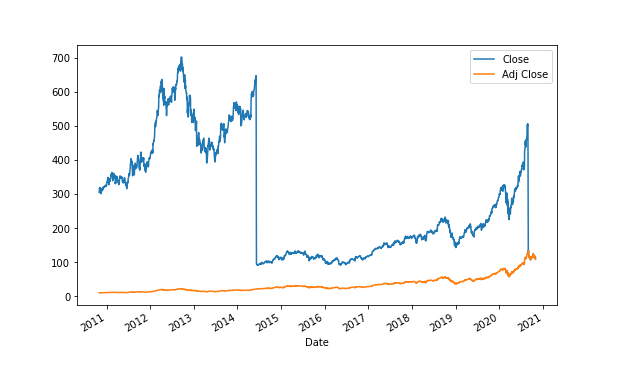

The stock market operates as a multifaceted financial entity influenced by a spectrum of events and methodologies, among which stock splits and algorithmic trading stand prominent. Stock splits represent a corporate maneuver through which a company modifies its share structure, generally to enhance the stock's accessibility and liquidity by reducing its trading price. This structural adjustment does not alter the company's market capitalization, but rather alters the number of shares outstanding. Although the intrinsic value of an investor’s holding remains constant, the perceived value and accessibility of the stock can be transformed significantly.

Algorithmic trading, on the other hand, employs computer-driven strategies to automate trading processes, exploiting minute market inefficiencies and reacting to financial events—such as stock splits—with remarkable speed and precision. These algorithms are designed to adjust strategies dynamically, taking into account variations in price, volume, and volatility that often accompany a stock split. As a result, algorithmic trading can magnify the effects of stock splits in the marketplace, contributing to changes in trading volume and liquidity by capitalizing on altered investor behavior and institutional practices.



Given these elements, understanding the dynamics underlying stock splits and algorithmic trading becomes crucial for investors who wish to effectively navigate and interpret stock market activity. This article focuses on exploring how these factors influence shareholder value and market behavior, equipping stakeholders with the knowledge necessary to make informed financial decisions.

## Table of Contents

## What is a Stock Split?

A stock split is a corporate action initiated by a company to increase its number of outstanding shares while maintaining the overall market capitalization. This is achieved by proportionately reducing the trading price of each share. The most common type of stock split is the forward split, where a company multiplies its existing shares, thus lowering the stock’s price while the total value of shareholders' equity remains unchanged. For instance, in a 2-for-1 stock split, each shareholder receives an additional share for every share they own, and the share price is halved.

Conversely, a reverse split reduces the total number of shares while increasing the share price. This kind of split might be enacted to meet stock exchange listing requirements or enhance the perception of the company by maintaining a minimum share price. A 1-for-2 reverse split, for instance, consolidates two shares into one, doubling the share price and halving the number of shares each shareholder owns.

Companies often employ stock splits to enhance the liquidity of their shares. Lower share prices make the stocks more accessible and affordable to a broader range of investors, particularly retail investors. Improved affordability could potentially expand the shareholder base, enhancing trading volume and market liquidity. This is particularly advantageous for companies seeking to maintain an active and engaged investor base.

By increasing the number of shares and reducing the share price, stock splits do not alter the market capitalization, which can be expressed mathematically as follows:

$$
\text{Market Capitalization} = \text{Number of Shares} \times \text{Share Price}
$$

After a stock split, both the number of shares and the share price adjust proportionally such that the market capitalization remains constant. For instance, if a company with a market capitalization of $200 million at a $100 share price enacts a 2-for-1 split, the new share price would approximately be $50, with twice as many shares outstanding.

Stock splits can influence investor perception positively. They are often viewed as signals of confidence by the company about its future performance, as historically, strong-performing companies tend to split shares more frequently. However, the actual signal a split sends to the market can vary, necessitating careful consideration by investors.

## Impact on Shareholders

Stock splits directly affect shareholders by adjusting the share price and the number of shares they own, while keeping the market capitalization unchanged. For example, in a 2-for-1 stock split, each shareholder receives an additional share for each share they hold, effectively doubling their total number of shares. Simultaneously, the stock price is halved, maintaining the same overall investment value. This process is primarily aimed at enhancing stock [liquidity](/wiki/liquidity-risk-premium) and accessibility to a broader range of investors.

One significant impact of stock splits is the increased market participation. By lowering the trading price per share, stock splits make stocks more affordable for retail investors who might have been deterred by higher-priced shares. This increased affordability can lead to a heightened interest in the stock from individual investors, potentially boosting trading [volume](/wiki/volume-trading-strategy).

Moreover, stock splits can influence the psychological perception of the stock’s value and the company's health. A lower share price after a split may suggest a potential for growth, as it appears more accessible and attractive to investors. The split can be interpreted as a signal of management's confidence in the company’s future prospects, suggesting that the company anticipates continued growth and success. This perception might encourage both current and prospective investors to engage more actively with the stock, increasing demand and potentially elevating its market interest.

Therefore, while stock splits do not alter the fundamental value of shareholders’ investments, they can significantly shift market dynamics through changes in perceived value and increased accessibility. This transformation can have downstream effects on investor behavior, often leading to heightened market activity and renewed interest in the company’s stock.

## Algorithmic Trading and Stock Splits

Algorithmic trading employs automated systems to capitalize on market events such as stock splits, which can introduce unique trading opportunities. When a company announces a stock split, it can cause fluctuations in the stock’s price and trading volume, creating short-term market inefficiencies that algorithmic strategies aim to exploit.

Algorithms are designed to dynamically respond to these announcements by adjusting their trading parameters. This typically involves recalibrating thresholds related to price movements, bid-ask spreads, or volume data. For example, a sudden decrease in stock price post-split might trigger increased buying activity from algorithms that are programmed to detect discounted securities.

Moreover, stock splits often lead to heightened [volatility](/wiki/volatility-trading-strategies) as market participants adjust their positions according to the new price structure. Algorithms monitor these volatility changes and adjust their risk management protocols accordingly. This can involve modifying stop-loss limits, hedging strategies, or leveraging volatility-based indicators to time trades more effectively.

The effective utilization of [algorithmic trading](/wiki/algorithmic-trading) during stock splits relies on the system’s ability to process large data sets quickly and execute trades with minimal latency. An algorithm might employ statistical models or [machine learning](/wiki/machine-learning) techniques to identify patterns or predict short-term price movements post-split. Python provides libraries such as NumPy and pandas, which facilitate data analysis and manipulation, essential for developing such models:

```python
import pandas as pd
import numpy as np

# Example: Calculate moving average to monitor post-split volatility
def moving_average(prices, window=5):
    return prices.rolling(window=window).mean()

# Mock price data following a stock split
price_data = pd.Series([100, 97, 95, 96, 94, 93, 90, 91])
ma = moving_average(price_data)

# Example output for data analysis
print(ma)
```

Successful exploitation of post-split dynamics through algorithmic trading enhances returns, as algorithms can execute high-frequency trades during periods of increased liquidity and fluctuating prices. This strategic advantage, derived from exploiting temporary inefficiencies and volatility spikes, is a hallmark of algorithmic trading excellence in the context of stock splits.

## Investment Strategies Post-Stock Split

Investors may employ a range of strategies to benefit from the unique conditions following a stock split. These strategies often focus on either short-term or long-term outcomes, each requiring specific considerations and adjustments.

**Short-Term Investment Strategies**

In the short term, stock splits can lead to increased trading volumes and a surge in market interest due to the reduced trading price per share. This perceived affordability can attract a wave of retail investors, temporarily boosting the stock’s liquidity and volatility. Traders looking to capitalize on these conditions might adopt [momentum](/wiki/momentum)-based approaches, where they buy shares immediately after the split announcement to ride the upward wave, hoping to sell at a higher price as demand spikes.

For example, a trader might use a moving average crossover strategy to identify buy and sell opportunities. This strategy involves purchasing the stock when a short-term moving average (e.g., 5-day) crosses above a long-term moving average (e.g., 20-day), indicating an upward trend, and selling when the opposite occurs.

```python
import pandas as pd

# Example data: stock prices over a period
data = {'Date': pd.date_range(start='2023-01-01', periods=30, freq='D'),
        'Price': [100, 102, 105, 107, 110, 108, 107, 108, 110, 115,
                  117, 120, 125, 128, 127, 126, 129, 130, 132, 135,
                  138, 140, 145, 148, 150, 149, 148, 155, 157, 160]}
df = pd.DataFrame(data)

# Calculate moving averages
df['Short_MA'] = df['Price'].rolling(window=5).mean()
df['Long_MA'] = df['Price'].rolling(window=20).mean()

# Identify buy/sell signals
df['Signal'] = 0
df.loc[df['Short_MA'] > df['Long_MA'], 'Signal'] = 1
df.loc[df['Short_MA'] < df['Long_MA'], 'Signal'] = -1

print(df[['Date', 'Price', 'Short_MA', 'Long_MA', 'Signal']])
```

**Long-Term Investment Strategies**

For long-term investors, the emphasis shifts towards evaluating the fundamentals of the company to predict sustainable growth after the stock split. Long-term strategies generally involve an analysis of the company’s earnings growth, market position, and overall financial health. Investors might consider whether the stock split is a signal of managerial confidence in future growth, as it may suggest favorable prospects and an expectation of rising demand.

A [fundamental analysis](/wiki/fundamental-analysis) might include evaluating the company’s Price-to-Earnings (P/E) ratio post-split, its earnings per share (EPS) growth, or leveraging discounted cash flow (DCF) models to assess intrinsic value. This approach helps in discerning whether the induced market euphoria aligns with the firm’s true valuation and long-term potential.

**Algorithmic Adjustments**

Algorithmic trading systems provide a sophisticated toolset to navigate post-split scenarios. These systems can adjust automatically to new market conditions by recalibrating their parameters to account for changes in share price and trading volumes. Algorithmic strategies benefit from precise entry and [exit](/wiki/exit-strategy) points guided by real-time data analysis, enabling traders to exploit fleeting [arbitrage](/wiki/arbitrage) opportunities.

An example of an algorithmic adjustment is recalibrating stop-loss and take-profit thresholds based on the heightened volatility that often follows a stock split. By leveraging machine learning models or statistical techniques, such algorithms can dynamically optimize trading strategies in response to observed market patterns.

In summary, the strategic approaches to investment post-stock split vary significantly between short-term and long-term perspectives. While short-term traders target immediate market reactions, long-term investors assess the underlying value of the firm, with algorithmic trading systems offering enhanced precision and adaptability.

## Conclusion

Stock splits serve as strategic maneuvers within the financial markets, providing companies the means to adjust their stock's price range without altering underlying market capitalization. These actions often alter market perception and can influence investor behavior. By making shares appear more affordable and enhancing the liquidity of the stock, splits can attract a broader base of retail investors, each interpreting the event through the prism of perceived value and corporate optimism. 

Moreover, understanding the interplay between stock splits and algorithmic trading is crucial for modern investors. Algorithmic trading systems are designed to identify and exploit market anomalies and inefficiencies, often triggered by corporate actions such as stock splits. These automated systems recalibrate trading strategies based on split announcements, price adjustments, and volume shifts, thus allowing them to capitalize on the post-split volatility and liquidity changes. As a result, they play a significant role in shaping the market dynamics post-split.

As financial landscapes continuously evolve, it is essential for investors to remain adaptable. By tailoring strategies to leverage the opportunities presented by stock splits, investors can potentially enhance investment returns. This involves a dual approach: short-term strategies may focus on capitalizing on the immediate post-split movements, while long-term strategies would consider the fundamental improvements promised by the company's outlook. 

Ultimately, a deep understanding of stock splits, complemented by insights into algorithmic trading, equips investors with the necessary tools to navigate and potentially benefit from these corporate actions. The ability to adapt and respond strategically to these market shifts can lead to optimized investment performance.

## References & Further Reading

Fama, E. F., Fisher, L., Jensen, M. C., & Roll, R. (1969). "The Adjustment of Stock Prices to New Information." This seminal paper explores how stock prices adjust to new information, providing a foundational understanding of market efficiency. It is especially relevant when analyzing the effects of corporate actions like stock splits, as it sheds light on investor behavior in response to such events.

Ikenberry, D., Rankine, G., & Stice, E. (1996). "What Do Stock Splits Really Signal?" This research investigates the underlying signals of stock splits, examining both the immediate market reactions and the long-term implications for company valuation. The analysis helps investors comprehend the motivations behind stock splits and their potential impact on stock performance.

Lopez de Prado, M. (2018). "Advances in Financial Machine Learning." This book introduces advanced machine learning techniques tailored for financial applications, including algorithmic trading. It discusses how these methods can enhance trading strategies by exploiting market inefficiencies, such as those created by stock splits. Python-based implementations illustrate practical applications of these techniques.

Chan, E. P. (2008). "Quantitative Trading: How to Build Your Own Algorithmic Trading Business." A comprehensive guide to creating and managing an algorithmic trading operation. The book covers the essentials of developing automated trading strategies, with examples that leverage market events like stock splits to maximize trading opportunities. It offers insights into the infrastructure and tools required for a successful algorithmic trading venture.