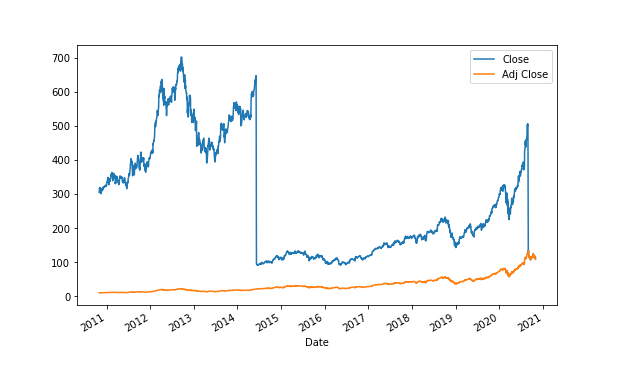

The financial world is a dynamic and multifaceted domain, integrating various elements that drive investment strategies and market behaviors. Among these elements, stock splits, financial derivatives, options trading, and algorithmic trading play pivotal roles in shaping market dynamics. Each component is vital in its own right; yet, their interconnections offer profound insights into the complex fabric of financial markets.

Stock splits are one strategy corporations use to enhance stock liquidity and marketability by increasing the number of shares outstanding and reducing the price per share. These actions can have psychological impacts on investors and influence market perceptions of a company's value. 



Financial derivatives, which include instruments like options and futures contracts, derive their value from an underlying asset. They are central in modern financial markets for both hedging risks and speculative opportunities. Options trading, a subset of derivatives, provides rights to purchase or sell assets at predetermined prices, offering flexibility in investment strategies. 

Algorithmic trading represents a revolution in how trades are executed, utilizing computer algorithms to perform complex trades at speeds unattainable by human traders. This technological advancement can significantly alter market liquidity and volatility, influencing market efficiency and trader strategy.

This article explores the intricate connections between stock splits, derivatives, options, and algorithmic trading, aiming to shed light on their individual roles and mutual influences within the financial ecosystem. Understanding these components and how they interact can provide significant insights that enhance trading strategies in a perpetually evolving market landscape.

## Table of Contents

## Understanding Stock Splits

Stock splits are a strategic mechanism deployed by corporations to adjust the number of outstanding shares by dividing existing shares into multiple ones. This action effectively lowers the price per share while maintaining the company's overall market capitalization, making the stock more affordable and accessible to a broader investor base. Here, we explore the types of stock splits, their rationale, and market reactions.

### Types of Stock Splits

There are two primary types of stock splits: regular splits and reverse splits.

**Regular Splits:** In a regular stock split, a company increases its number of shares outstanding by issuing more shares to current shareholders. For instance, in a 2-for-1 split, each existing share is divided into two, doubling the total number of shares while halving the price per share. The fundamental value of the company does not change, as mathematically expressed by:

$$
\text{New share price} = \frac{\text{Old share price}}{\text{Split ratio}}
$$

**Reverse Splits:** Conversely, a reverse split reduces the number of shares outstanding by consolidating them. A 1-for-2 reverse split means two shares are combined into one, effectively doubling the share price. This type of split is often used to boost a company's stock price and comply with stock exchange listing requirements.

### Reasons for Initiating Stock Splits

Companies initiate stock splits for several reasons:

- **Affordability:** By lowering the share price, companies can make their stock more attractive to small investors, potentially broadening their shareholder base.

- **Liquidity Enhancement:** Increasing the number of shares can enhance liquidity, making it easier for investors to buy and sell shares.

- **Market Perception:** A lower share price may enhance the appeal of a stock by making it seem more attainable, potentially attracting more retail investors.

Reverse splits, on the other hand, might be employed to meet regulatory requirements or to reposition a company's stock as a premium investment option.

### Market Reactions

Stock splits often trigger varied market reactions driven by investor psychology and market sentiment:

- **Perceived Affordability:** Regular splits can lead to a positive short-term price movement as new investors perceive the stock as more affordable.

- **Signal of Confidence:** A company announcing a stock split is sometimes seen as a sign of confidence in its growth prospects, which can positively influence investor sentiment.

- **Reverse Split Cautions:** Reverse splits might be met with skepticism, as they can signal financial distress or an attempt to mask poor performance.

Understanding stock splits is crucial for investors as they directly impact company valuation measures and investor psychology. By recognizing the strategic uses and implications of stock splits, investors can better align their portfolios with market opportunities while being cautious of the signals these corporate actions convey.

 to Financial Derivatives

Financial derivatives are sophisticated financial instruments whose value is derived from an underlying asset, which can encompass a wide array of financial products, including stocks, bonds, currencies, commodities, or market indices. These tools are essential in the structuring and management of risk exposure and have become integral components of modern financial markets.

Derivatives, including futures, forwards, options, and swaps, serve two primary purposes: risk management and speculative opportunity enhancement. Futures and forwards obligate the contract holder to purchase or sell the underlying asset at a specified price on a future date, allowing participants to lock in prices and hedge against potential adverse price movements. The critical distinction between the two is that futures are standardized and traded on exchanges, while forwards are customized contracts traded over-the-counter (OTC).

Options provide the holder with the right, but not the obligation, to buy or sell an underlying asset at a predetermined price before a specified expiration date. They are versatile tools, often employed in strategies aiming to capitalize on market movements while also hedging potential downsides. Call options allow the purchase, whereas put options allow the sale of the underlying asset, creating a spectrum of strategies that can be tailored to specific market views and risk appetites.

Swaps are another critical derivative category, involving the exchange of cash flows between two parties. The most common are [interest rate](/wiki/interest-rate-trading-strategies) swaps, enabling institutions to exchange fixed interest rate payments for floating rates, allowing for interest rate risk management. Currency swaps help manage foreign exchange risk by allowing the exchange of principal and interest in different currencies, crucial for multinational businesses.

The application of derivatives in hedging is integral to managing market [volatility](/wiki/volatility-trading-strategies) and price fluctuations. For instance, an airline might use futures contracts to lock in fuel prices, insulating itself from sudden spikes in oil prices. Speculative trading, on the other hand, involves taking on risk with the expectation of substantial returns. Traders and investors can leverage derivatives to amplify their market positions, utilizing leverage to increase potential returns while also accepting the accompanying risk of significant losses.

Given their complexity and potential impact, understanding derivatives is vital for participants in modern financial markets. They offer opportunities to mitigate risks and enhance returns while playing a pivotal role in maintaining market [liquidity](/wiki/liquidity-risk-premium) and efficiency. Their use across various sectors illustrates their versatility, yet also the necessity for a solid comprehension of their mechanics and risk factors involved.

## The Role of Options in Trading

Options are a financial derivative offering the holder the right, but not the obligation, to buy (call option) or sell (put option) an asset at a predetermined price, known as the strike price, within a specified period. This flexibility makes options a valuable tool for traders and investors seeking to manage risk, leverage positions, or capitalize on market movements.

### Types of Options and Market Strategies

There are primarily two types of options: call options and put options. A call option gives the holder the right to purchase the underlying asset, while a put option provides the right to sell it. These options are used in various strategies to suit different market views and risk tolerances.

For example, a trader anticipating a rise in the stock price might purchase a call option, benefiting from the potential upside without committing to the full cost of shares. Conversely, if a trader expects a decline in the stock price, they might buy a put option to gain from the downside.

Complex strategies often combine multiple options positions, such as:

- **Covered Call**: Holding the underlying asset and selling a call option to generate income from the premium.
- **Protective Put**: Holding the underlying asset and purchasing a put option to safeguard against price drops.
- **Straddle**: Buying both a call and a put option at the same strike price and expiration, betting on significant price movement without direction bias.
- **Iron Condor**: Involves selling out-of-the-money call and put options while buying further out options as a hedge, profiting from low volatility.

### Influence of Stock Splits and Market Speculation

Stock splits can directly impact options trading by altering the underlying asset's price. When a stock split occurs, the option's strike price and contract size are adjusted to maintain the contract's overall value. If a company announces a 2-for-1 stock split, an option with a strike price of $100 and covering 100 shares would adjust to a strike price of $50, covering 200 shares.

Market speculation also plays a critical role in options pricing. The Black-Scholes model, a popular pricing model for European options, incorporates factors such as the underlying asset's current price, the option's strike price, time to expiration, risk-free rate, and volatility, often estimated through market speculation. More advanced frameworks like the Binomial model or Monte Carlo simulations offer flexibility for pricing American and more complex options.

```python
# Example: Calculating European call option price using Black-Scholes model

from scipy.stats import norm
import numpy as np

def black_scholes_call(S, K, T, r, sigma):
    """
    Calculate European call option price using Black-Scholes formula.

    Parameters:
    - S: Current stock price
    - K: Strike price
    - T: Time to expiration (in years)
    - r: Risk-free interest rate (annualized)
    - sigma: Volatility of the underlying asset (annualized)

    Returns:
    - call_price: Theoretical price of the call option
    """
    d1 = (np.log(S / K) + (r + sigma ** 2 / 2) * T) / (sigma * np.sqrt(T))
    d2 = d1 - sigma * np.sqrt(T)

    call_price = S * norm.cdf(d1) - K * np.exp(-r * T) * norm.cdf(d2)
    return call_price

# Parameters
S = 100  # Current stock price
K = 100  # Strike price
T = 1    # Time to expiration (1 year)
r = 0.05 # Risk-free rate (5%)
sigma = 0.2 # Volatility (20%)

call_option_price = black_scholes_call(S, K, T, r, sigma)
print(f"The European call option price is: {call_option_price:.2f}")
```

Understanding how these elements interact is crucial for traders seeking to optimize their options trading strategies and achieve the desired risk-reward profile. Whether using simple or intricate strategies, the strategic application of options can significantly influence trading outcomes, especially when considering the broader market environment and events like stock splits.

## Algorithmic Trading and its Impact

Algorithmic trading is a significant advancement in financial markets, characterized by the use of computer algorithms to execute trades at speeds and frequencies unattainable by human traders. Algorithms are programmed to follow a defined set of instructions for trading to maximize profits, often completing trades in fractions of a second.

The development of [algorithmic trading](/wiki/algorithmic-trading) traces back to the 1970s when electronic trading platforms began to emerge. Initially, these platforms supported basic trading strategies and low-frequency trading. Over time, improvements in technology, including faster computer processors and high-speed internet, have exponentially increased the capability and complexity of algorithmic trading systems. Today, algorithmic trading is vital to market structures, with estimates suggesting it accounts for 60-75% of overall trading [volume](/wiki/volume-trading-strategy) in the United States alone.

Algorithmic trading systems use various strategies, including statistical [arbitrage](/wiki/arbitrage), [market making](/wiki/market-making), and high-frequency trading ([HFT](/wiki/high-frequency-trading-strategies)). These systems capitalize on minute price discrepancies across different markets or financial instruments. For example, [statistical arbitrage](/wiki/statistical-arbitrage) algorithms utilize quantitative models to identify and exploit patterns in historical data, predicting future price movements. Meanwhile, HFT focuses on achieving small profits from a large number of trades executed in split seconds across multiple markets.

Algorithms play a critical role in leveraging events like stock splits and options trading to optimize trading strategies. A stock split can induce price volatility and liquidity changes, providing an opportunity for algorithms to adjust their trading models to capture potential profit. Similarly, options trading, with its inherent complexity and volatility, presents numerous opportunities for algorithmic strategies to optimize entry and [exit](/wiki/exit-strategy) points to enhance returns.

Algorithmic trading significantly affects market liquidity and volatility. By supplying continuous liquidity through buying and selling activities, algorithmic traders reduce bid-ask spreads, contributing to overall market efficiency. However, the ultra-fast execution speeds can also lead to increased volatility, particularly during periods of market uncertainty or when erroneous trading algorithms disrupt normal market function.

Despite potential challenges, understanding and utilizing algorithmic trading is essential for modern traders. It offers a competitive edge in high-frequency trading environments, where milliseconds can mean the difference between profit and loss. Traders and investors must navigate this highly automated landscape by developing or utilizing sophisticated algorithms that can adapt to market dynamics, including price changes triggered by corporate actions like stock splits.

In conclusion, algorithmic trading represents a transformative element in financial markets. Its ability to execute trades rapidly and efficiently has made it indispensable for traders seeking to gain an advantage in an increasingly competitive environment. To fully harness its potential, traders must understand the operational mechanics and strategic applications of algorithmic trading systems, while remaining mindful of their impact on market stability and fairness.

## Interconnections and Strategic Implications

The interconnectedness of stock splits, financial derivatives, options, and algorithmic trading forms a complex web that significantly influences market dynamics. Understanding how these elements can be strategically combined is crucial for traders and investors aiming to enhance their market performance.

### Algorithmic Models and Stock Splits

Algorithmic trading models are designed to adapt swiftly to various market events, including stock splits. A stock split often results in a temporary price adjustment due to an increased number of shares and a corresponding decrease in share price. Algorithms can be programmed to account for these changes by recalibrating price thresholds and rebalancing portfolios to maintain optimal performance. For instance, a simplistic Python function for adjusting a trading model to accommodate a 2-for-1 stock split might look like this:

```python
def adjust_for_split(price, shares, split_ratio):
    adjusted_price = price / split_ratio
    adjusted_shares = shares * split_ratio
    return adjusted_price, adjusted_shares

# Example usage
current_price = 100  # Current stock price before split
current_shares = 50  # Number of shares
split_ratio = 2      # 2-for-1 stock split

new_price, new_shares = adjust_for_split(current_price, current_shares, split_ratio)
print(f"New Price: {new_price}, New Shares: {new_shares}")
```

By integrating such adjustments, algorithms can effectively recalibrate derivative pricing, ensuring accurate hedging and speculative strategies.

### Strategic Implications for Investors

Investors can leverage these interconnections by employing integrated strategies that utilize derivatives and options in anticipation of stock splits. For instance, traders might use call options to capitalize on an expected post-split price increase, driven by renewed investor interest and enhanced liquidity. Concurrently, employing put options might provide a hedge against potential volatility that often accompanies split announcements.

### Synergistic Trading Strategies

The application of these components in a cohesive trading strategy offers significant advantages. For example, options derived from post-split adjusted stock prices can be strategically selected to optimize cost and potential returns. Furthermore, algorithmic trading can be used to exploit arbitrage opportunities arising from discrepancies in option pricing pre- and post-split.

### A Well-rounded Financial Approach

Understanding these synergies is essential for developing a comprehensive approach to financial markets. By appreciating how stock splits influence derivative values and pricing, combined with the speed and precision of algorithmic trading, investors can devise more informed and effective trading strategies. This holistic understanding empowers traders to not only foresee market movements but also to leverage them for optimized trading outcomes. 

In conclusion, the strategic integration of stock splits, derivatives, options, and algorithmic trading represents a sophisticated approach to market participation, offering numerous avenues for maximizing returns while managing risks effectively.

## Conclusion

In conclusion, the complex interplay between stock splits, financial derivatives, options, and algorithmic trading significantly shapes market dynamics. Each of these components serves distinct functions within the financial ecosystem, yet their interactions create synergies that can be leveraged by traders and investors alike. Understanding the mechanism of stock splits allows investors to foresee changes in share accessibility and market perception. Financial derivatives, such as options, provide tools for hedging and speculation, enabling traders to manage risk and gain exposure to various market conditions.

Algorithmic trading further enhances this landscape by utilizing advanced computational techniques to execute trades with unprecedented speed and precision. It can exploit minute price discrepancies, optimize entry and exit points, and improve liquidity and efficiency within the market. Recognizing how these elements intertwine offers traders a strategic advantage, allowing them to navigate complex market scenarios more effectively and capitalize on emergent opportunities.

As the financial world continues to evolve with technological advancements and regulatory changes, staying informed about these components becomes crucial for achieving sustainable trading success. The insights gained from understanding how stock splits, derivatives, options, and algorithmic trading intersect can lead to informed decision-making and more sophisticated trading strategies. This article lays the groundwork for a deeper exploration into the strategies and innovations driving modern financial markets, providing a foundation upon which traders and investors can build more robust portfolios and enhance their competitive edge.

## References & Further Reading

[1]: Brennan, M. J., & Copeland, T. E. (1988). "Stock Splits, Stock Prices, and Transaction Costs." Journal of Financial Economics, 22(1), 83-101. [Link to Article](https://www.sciencedirect.com/science/article/pii/0304405X88900232)90023-2)

[2]: Hull, J. C. (2018). ["Options, Futures, and Other Derivatives."](https://www.semanticscholar.org/paper/Options%2C-Futures%2C-and-Other-Derivatives-Hull/89bdee500c8623864fc9eb7a471546aa713acc44) Pearson Education.

[3]: Kissell, R. (2013). ["The Science of Algorithmic Trading and Portfolio Management."](https://www.sciencedirect.com/book/9780124016897/the-science-of-algorithmic-trading-and-portfolio-management) Academic Press.

[4]: de Prado, M. L. (2018). ["Advances in Financial Machine Learning."](https://www.amazon.com/Advances-Financial-Machine-Learning-Marcos/dp/1119482089) Wiley.

[5]: Black, F., & Scholes, M. (1973). "The Pricing of Options and Corporate Liabilities." Journal of Political Economy, 81(3), 637-654. [Link to Article](https://www.cs.princeton.edu/courses/archive/fall09/cos323/papers/black_scholes73.pdf)

[6]: Chan, E. P. (2008). ["Quantitative Trading: How to Build Your Own Algorithmic Trading Business."](https://github.com/ftvision/quant_trading_echan_book) Wiley Trading.

[7]: Jansen, S. (2018). ["Machine Learning for Algorithmic Trading."](https://searchworks.stanford.edu/view/13246850) Packt Publishing.