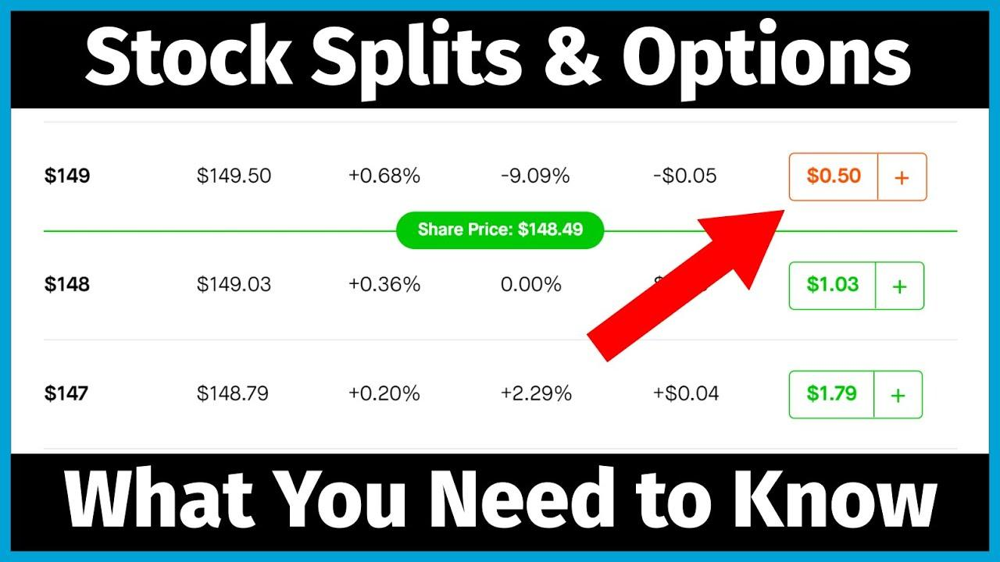

## Table of Contents

## What is a stock split?

A stock split is when a company decides to divide its existing shares into more shares. This makes the price of each share lower, but it doesn't change the total value of the shares you own. For example, if you have one share worth $100 and the company does a 2-for-1 split, you'll have two shares, but each will be worth $50.

Companies do stock splits for a few reasons. One big reason is to make their stock more affordable to smaller investors. If the price per share is lower, more people might want to buy it. Another reason is to make the stock seem more active and exciting, which can attract more attention from investors. Even though the total value of your investment stays the same right after a split, it can sometimes lead to the stock price going up over time because more people are interested.

## What are stock options?

Stock options are a type of financial tool that gives you the right, but not the obligation, to buy or sell a stock at a specific price before a certain date. They are like a contract between two people. One person has the option to buy or sell the stock, and the other person gets money for giving that option. There are two main types of stock options: call options and put options. A call option lets you buy the stock, while a put option lets you sell it.

People use stock options for different reasons. Some people use them to try to make money by guessing if a stock's price will go up or down. If they guess right, they can make a profit. Others use options to protect their investments. For example, if you own a stock and you're worried its price might fall, you can buy a put option to sell it at a set price, which can help limit your losses. Stock options can be complicated, but they are a popular way for people to manage risk or try to make money in the stock market.

## How does a stock split affect the price of a stock?

When a company does a stock split, it makes the price of each share lower. For example, if a company's stock is trading at $100 per share and they do a 2-for-1 split, the price of each share will be cut in half to $50. This happens because the total value of the company stays the same, but now there are more shares. So, if you owned one share worth $100 before the split, you would own two shares worth $50 each after the split, keeping your total investment value the same.

Even though the price per share goes down right after a stock split, it can sometimes lead to the stock price going up over time. This is because more people might be interested in buying the stock when it's cheaper. When more people want to buy, it can push the price up. So, while a stock split doesn't change the value of your investment right away, it can make the stock more attractive to new investors, which might help the price in the long run.

## What happens to the number of shares an investor owns after a stock split?

When a company does a stock split, the number of shares an investor owns goes up. For example, if you have one share and the company does a 2-for-1 split, you will have two shares after the split. The total value of your investment stays the same right after the split, but you have more shares.

This happens because the company is dividing its existing shares into more shares. If it's a 2-for-1 split, every share is split into two. If it's a 3-for-1 split, every share becomes three shares. So, if you owned 10 shares before a 3-for-1 split, you would own 30 shares after the split.

## How does a stock split impact the strike price of options?

When a company does a stock split, it changes the price of the stock, and this affects the strike price of options too. The strike price is the price at which you can buy or sell the stock if you use the option. If the stock splits, the strike price of the options gets adjusted to match the new stock price. For example, if a stock is trading at $100 and you have an option with a strike price of $100, and then the company does a 2-for-1 split, the stock price becomes $50. The strike price of your option will also be adjusted to $50.

This adjustment keeps the value of the options the same relative to the stock. It's important because it makes sure that the options still work the way they're supposed to after the split. If the strike price didn't change, the options would be worth a lot less because the stock price would be lower. So, the adjustment helps keep things fair for people who own the options.

## What adjustments are made to the number of options contracts after a stock split?

When a company does a stock split, the number of options contracts an investor owns stays the same. But, the number of shares each contract represents changes. For example, if you have one call option that lets you buy 100 shares of a stock, and the company does a 2-for-1 split, you will still have one call option, but it will now let you buy 200 shares instead of 100.

This adjustment happens to keep the value of the options the same after the split. If the number of shares per contract didn't change, the options would be worth less because each share is now worth less. So, by adjusting the number of shares each option contract represents, the options still have the same overall value and work the same way they did before the split.

## How does a stock split affect the intrinsic value of options?

A stock split doesn't change the intrinsic value of options. Intrinsic value is how much an option is worth if you use it right now. For a call option, it's the difference between the stock price and the strike price if the stock price is higher. For a put option, it's the difference between the strike price and the stock price if the stock price is lower. When a stock splits, the stock price goes down, but the strike price of the options also goes down by the same amount. This keeps the difference between the stock price and the strike price the same, so the intrinsic value stays the same.

Also, the number of shares each option contract represents goes up after a stock split. For example, if you have one option that lets you buy 100 shares, after a 2-for-1 split, that option will let you buy 200 shares. But since the price per share is now half, the total value of the option stays the same. So, even though the number of shares changes, the intrinsic value of the option doesn't change because the total value of the shares you can buy or sell with the option stays the same.

## What is the effect of a stock split on the time value of options?

A stock split doesn't change the time value of options directly. Time value is the extra amount an option is worth because it still has time left before it expires. It's like the potential for the option to become more valuable if the stock price moves in the right direction. Since a stock split only changes the number of shares and the price per share, but not the total value of the company or the time left on the options, the time value stays the same.

However, a stock split can make the stock more attractive to new investors because the price per share is lower. If more people start buying the stock, it might go up in price. This could increase the time value of the options if people think the stock will keep going up. So, while the stock split itself doesn't change the time value, the effects it has on the stock's popularity and price might influence it over time.

## How might a stock split influence the volatility of the underlying stock and, consequently, the options?

A stock split can sometimes make a stock more exciting to investors because the price per share goes down. When more people are interested in buying the stock, it can lead to more trading and more price changes. This increased activity can make the stock's price go up and down more, which we call volatility. If the stock becomes more volatile, it can affect the options too. Options on a more volatile stock might be worth more because there's a bigger chance the stock price will move a lot, making the options more valuable.

But, a stock split doesn't always make a stock more volatile. Sometimes, the stock might just keep trading the way it did before the split. It depends on how people react to the news of the split and if more investors start buying the stock. If the stock's volatility doesn't change much, then the options won't change much either. So, while a stock split can lead to more volatility and affect options, it's not guaranteed, and it depends on how the market reacts.

## What are the tax implications of stock splits for options holders?

A stock split itself doesn't cause you to owe any taxes right away. When a company does a stock split, the total value of your investment stays the same, even though you have more shares. Since nothing has changed about how much your investment is worth, you don't have to pay taxes just because of the split.

But, if you decide to sell your options after a stock split, you might have to pay taxes on any profit you make. The tax you owe depends on how long you held the options and how much money you made from selling them. The stock split doesn't change the rules about when you have to pay taxes or how much you owe; it's all about the profit you make when you sell.

## How should an options trader adjust their strategy before and after a stock split?

Before a stock split, an options trader should think about how the split might change the stock's price and how popular it becomes. If the trader thinks more people will want to buy the stock after the split, they might want to buy options now before the price goes up. They should also check if the options they have will still be useful after the split. The strike price and the number of shares each option covers will change, so the trader needs to make sure their strategy still works with these new numbers.

After a stock split, the trader should look at how the stock is doing. If the stock is more active and the price is moving around more, they might want to use options that take advantage of this volatility. They should also keep an eye on the new strike prices and how many shares their options cover now. Even though the total value of their options stays the same right after the split, the way they use them might need to change based on how the stock and the market are reacting.

## What historical examples illustrate the impact of stock splits on options pricing and trading volume?

One famous example is Apple's 7-for-1 stock split in 2014. Before the split, Apple's stock was trading at around $645 per share. After the split, the price dropped to about $92 per share. This made the stock more affordable to a lot more people, and the trading [volume](/wiki/volume-trading-strategy) went way up. The options also got more popular because more people were interested in trading Apple's stock. The strike prices of the options were adjusted to match the new stock price, so if you had an option with a strike price of $650 before the split, it became an option with a strike price of about $93 after the split. This kept the value of the options the same, but more people started trading them.

Another example is Tesla's 5-for-1 stock split in 2020. Before the split, Tesla's stock was trading at around $2,213 per share. After the split, the price dropped to about $442 per share. Like with Apple, this made the stock more attractive to new investors, and the trading volume increased a lot. The options on Tesla's stock also saw more trading because more people were interested in the company. The strike prices of the options were adjusted to match the new stock price, so an option with a strike price of $2,250 before the split became an option with a strike price of about $450 after the split. This adjustment kept the value of the options the same, but the increased interest in Tesla's stock led to more activity in the options market.

## What is the understanding of stock splits?

Stock splits are a strategic mechanism deployed by corporations to adjust the number of outstanding shares by dividing existing shares into multiple ones. This action effectively lowers the price per share while maintaining the company's overall market capitalization, making the stock more affordable and accessible to a broader investor base. Here, we explore the types of stock splits, their rationale, and market reactions.

### Types of Stock Splits

There are two primary types of stock splits: regular splits and reverse splits.

**Regular Splits:** In a regular stock split, a company increases its number of shares outstanding by issuing more shares to current shareholders. For instance, in a 2-for-1 split, each existing share is divided into two, doubling the total number of shares while halving the price per share. The fundamental value of the company does not change, as mathematically expressed by:

$$
\text{New share price} = \frac{\text{Old share price}}{\text{Split ratio}}
$$

**Reverse Splits:** Conversely, a reverse split reduces the number of shares outstanding by consolidating them. A 1-for-2 reverse split means two shares are combined into one, effectively doubling the share price. This type of split is often used to boost a company's stock price and comply with stock exchange listing requirements.

### Reasons for Initiating Stock Splits

Companies initiate stock splits for several reasons:

- **Affordability:** By lowering the share price, companies can make their stock more attractive to small investors, potentially broadening their shareholder base.

- **Liquidity Enhancement:** Increasing the number of shares can enhance liquidity, making it easier for investors to buy and sell shares.

- **Market Perception:** A lower share price may enhance the appeal of a stock by making it seem more attainable, potentially attracting more retail investors.

Reverse splits, on the other hand, might be employed to meet regulatory requirements or to reposition a company's stock as a premium investment option.

### Market Reactions

Stock splits often trigger varied market reactions driven by investor psychology and market sentiment:

- **Perceived Affordability:** Regular splits can lead to a positive short-term price movement as new investors perceive the stock as more affordable.

- **Signal of Confidence:** A company announcing a stock split is sometimes seen as a sign of confidence in its growth prospects, which can positively influence investor sentiment.

- **Reverse Split Cautions:** Reverse splits might be met with skepticism, as they can signal financial distress or an attempt to mask poor performance.

Understanding stock splits is crucial for investors as they directly impact company valuation measures and investor psychology. By recognizing the strategic uses and implications of stock splits, investors can better align their portfolios with market opportunities while being cautious of the signals these corporate actions convey.

 to Financial Derivatives

Financial derivatives are sophisticated financial instruments whose value is derived from an underlying asset, which can encompass a wide array of financial products, including stocks, bonds, currencies, commodities, or market indices. These tools are essential in the structuring and management of risk exposure and have become integral components of modern financial markets.

Derivatives, including futures, forwards, options, and swaps, serve two primary purposes: risk management and speculative opportunity enhancement. Futures and forwards obligate the contract holder to purchase or sell the underlying asset at a specified price on a future date, allowing participants to lock in prices and hedge against potential adverse price movements. The critical distinction between the two is that futures are standardized and traded on exchanges, while forwards are customized contracts traded over-the-counter (OTC).

Options provide the holder with the right, but not the obligation, to buy or sell an underlying asset at a predetermined price before a specified expiration date. They are versatile tools, often employed in strategies aiming to capitalize on market movements while also hedging potential downsides. Call options allow the purchase, whereas put options allow the sale of the underlying asset, creating a spectrum of strategies that can be tailored to specific market views and risk appetites.

Swaps are another critical derivative category, involving the exchange of cash flows between two parties. The most common are [interest rate](/wiki/interest-rate-trading-strategies) swaps, enabling institutions to exchange fixed interest rate payments for floating rates, allowing for interest rate risk management. Currency swaps help manage foreign exchange risk by allowing the exchange of principal and interest in different currencies, crucial for multinational businesses.

The application of derivatives in hedging is integral to managing market [volatility](/wiki/volatility-trading-strategies) and price fluctuations. For instance, an airline might use futures contracts to lock in fuel prices, insulating itself from sudden spikes in oil prices. Speculative trading, on the other hand, involves taking on risk with the expectation of substantial returns. Traders and investors can leverage derivatives to amplify their market positions, utilizing leverage to increase potential returns while also accepting the accompanying risk of significant losses.

Given their complexity and potential impact, understanding derivatives is vital for participants in modern financial markets. They offer opportunities to mitigate risks and enhance returns while playing a pivotal role in maintaining market [liquidity](/wiki/liquidity-risk-premium) and efficiency. Their use across various sectors illustrates their versatility, yet also the necessity for a solid comprehension of their mechanics and risk factors involved.

## References & Further Reading

[1]: Brennan, M. J., & Copeland, T. E. (1988). "Stock Splits, Stock Prices, and Transaction Costs." Journal of Financial Economics, 22(1), 83-101. [Link to Article](https://www.sciencedirect.com/science/article/pii/0304405X88900232)90023-2)

[2]: Hull, J. C. (2018). ["Options, Futures, and Other Derivatives."](https://www.semanticscholar.org/paper/Options%2C-Futures%2C-and-Other-Derivatives-Hull/89bdee500c8623864fc9eb7a471546aa713acc44) Pearson Education.

[3]: Kissell, R. (2013). ["The Science of Algorithmic Trading and Portfolio Management."](https://www.sciencedirect.com/book/9780124016897/the-science-of-algorithmic-trading-and-portfolio-management) Academic Press.

[4]: de Prado, M. L. (2018). ["Advances in Financial Machine Learning."](https://www.amazon.com/Advances-Financial-Machine-Learning-Marcos/dp/1119482089) Wiley.

[5]: Black, F., & Scholes, M. (1973). "The Pricing of Options and Corporate Liabilities." Journal of Political Economy, 81(3), 637-654. [Link to Article](https://www.cs.princeton.edu/courses/archive/fall09/cos323/papers/black_scholes73.pdf)

[6]: Chan, E. P. (2008). ["Quantitative Trading: How to Build Your Own Algorithmic Trading Business."](https://github.com/ftvision/quant_trading_echan_book) Wiley Trading.

[7]: Jansen, S. (2018). ["Machine Learning for Algorithmic Trading."](https://searchworks.stanford.edu/view/13246850) Packt Publishing.