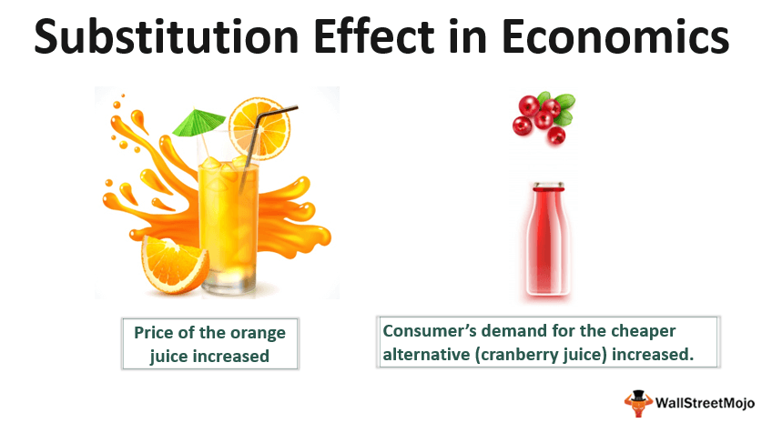

## Table of Contents

## What is the substitution effect?

The substitution effect is a concept in economics that explains how people change their buying habits when the price of something goes up or down. When the price of a product increases, people tend to buy less of it and look for cheaper alternatives. For example, if the price of beef goes up, people might buy more chicken instead because it's less expensive. This switch from one product to another is called the substitution effect.

On the other hand, if the price of a product decreases, people are more likely to buy more of it and less of the other products that are now relatively more expensive. For instance, if the price of apples drops, people might buy more apples and fewer oranges. The substitution effect helps us understand how price changes influence what people choose to buy, and it's an important part of how markets work.

## How does the substitution effect influence consumer behavior?

The substitution effect plays a big role in how people decide what to buy. When the price of a product goes up, people start looking for cheaper options. For example, if the cost of gasoline increases, people might choose to drive less or use public transportation more often. This switch happens because people want to save money, so they substitute the more expensive item with something that costs less.

On the other hand, when the price of a product drops, people tend to buy more of it. They might also buy less of other, now relatively more expensive items. For instance, if the price of a certain brand of cereal goes down, people might buy more of that cereal and less of other brands. This behavior shows how the substitution effect guides people to make choices based on what's most affordable at the time, helping them stretch their budgets further.

## Can you explain the difference between the substitution effect and the income effect?

The substitution effect and the income effect are two important ideas in economics that help explain how people change their buying habits when prices change. The substitution effect happens when people switch to a different product because it becomes cheaper compared to another. For example, if the price of butter goes up, people might start using margarine instead because it's less expensive. This switch is all about finding the best deal and saving money.

The income effect, on the other hand, is about how a change in price affects how much money people feel like they have. When the price of something goes down, it's like getting a little extra money because you don't have to spend as much. So, you might buy more of that product, not just because it's cheaper compared to other things, but because you feel richer. For example, if the price of bread drops, you might buy more bread because you can afford to, even if you weren't planning to switch from another type of food.

Both effects work together when prices change, but they focus on different parts of the decision-making process. The substitution effect is about choosing between different products based on their relative prices, while the income effect is about how the change in price makes you feel like your overall purchasing power has changed.

## What are some common examples of the substitution effect in everyday life?

The substitution effect happens a lot in everyday life. Imagine you usually buy coffee from a fancy café, but then they raise their prices. You might start buying coffee from a cheaper place, like a local diner or even making it at home. This switch happens because you want to save money, so you choose the cheaper option. Another example is with gas for your car. If gas prices go up, you might start using public transportation more or carpool with friends to save money on fuel.

This effect also shows up with food. Let's say the price of beef goes up, but chicken stays the same. You might cook more chicken dishes instead of beef because it's cheaper. Or if the price of a certain brand of cereal goes down, you might buy more of that brand and less of others. These choices help you make your money go further. The substitution effect is all about finding the best deal and making smart choices based on price changes.

## How do price changes trigger the substitution effect?

When the price of something goes up, people start looking for cheaper options. This is because they want to save money. For example, if the cost of buying a certain type of fruit, like apples, goes up, people might start buying more bananas instead because they're cheaper. This switch from apples to bananas is the substitution effect in action. It happens because people want to keep spending the same amount of money but still get what they need or want.

On the other hand, when the price of something goes down, people tend to buy more of it. They might also buy less of other things that are now more expensive compared to the cheaper item. For instance, if the price of a certain brand of soda drops, people might buy more of that soda and less of other drinks. This change in what people buy happens because they feel like they're getting a better deal on the cheaper item. The substitution effect helps people make their money go further by choosing the most affordable options when prices change.

## What role does the elasticity of demand play in the substitution effect?

The elasticity of demand is a big deal when it comes to the substitution effect. Elasticity of demand is about how much the amount of something people buy changes when its price changes. If a product has high elasticity, that means people will buy a lot less of it if the price goes up, and a lot more if the price goes down. When a product has high elasticity, the substitution effect is strong. People will quickly switch to other products if they find something cheaper. For example, if the price of one type of soda goes up, and people can easily switch to another type of soda, the substitution effect will be big because the demand for the first soda is elastic.

On the other hand, if a product has low elasticity, the substitution effect won't be as strong. Low elasticity means that people won't change how much they buy very much, even if the price changes. This happens with things that people really need or can't easily replace, like medicine. If the price of a certain medicine goes up, people might not switch to another brand because they need that specific medicine. So, the substitution effect is weaker because the demand for the medicine is inelastic. Understanding elasticity helps us see how big the substitution effect will be when prices change.

## How can businesses use the substitution effect to their advantage?

Businesses can use the substitution effect to their advantage by understanding how customers react to price changes. If a business lowers the price of their product, they can attract more customers who are looking for a good deal. For example, if a store drops the price of its own brand of cereal, people might buy more of that cereal instead of more expensive brands. This can help the business sell more and take customers away from competitors. By keeping an eye on what their competitors are charging, a business can set their prices to be just low enough to make people switch to their product.

Another way businesses can use the substitution effect is by offering products that are good substitutes for more expensive items. If a business knows that the price of a popular product is going up, they can offer a similar but cheaper alternative. For instance, if the price of beef goes up, a grocery store might promote chicken or other meats as a cheaper option. By doing this, the business can attract customers who are looking to save money and still meet their needs. Understanding the substitution effect helps businesses stay competitive and meet the changing needs of their customers.

## What are the limitations of the substitution effect in economic models?

The substitution effect is a useful idea in economics, but it has some limits. One big limit is that it assumes people always make choices based on price alone. In real life, people care about more than just the cost. They might choose a product because they like the brand, it's good quality, or it's what they're used to. So, even if a cheaper option is available, people might not switch if they value other things more than saving a little money.

Another limit is that the substitution effect doesn't work the same for all products. Some things, like medicine or certain foods, are hard to replace. If the price of a specific medicine goes up, people might not be able to switch to a different one because they need that exact medicine. Also, the substitution effect can be weaker if there aren't many good alternatives available. If there's only one store in town selling a certain product, people might keep buying it even if the price goes up because they don't have other choices.

## How does the substitution effect impact overall market dynamics?

The substitution effect can really shake things up in the market. When the price of a product goes up, people start looking for cheaper options. This means they might buy less of the expensive product and more of something else that's cheaper. For businesses, this can mean losing customers to competitors who offer similar products at lower prices. If a lot of people switch, it can even change how much of a product is made and sold overall. This can lead to businesses lowering their prices to stay competitive or coming up with new products that are good substitutes for what people are looking for.

On the flip side, when the price of a product goes down, people might buy more of it and less of other things. This can help a business sell more and maybe even take customers away from other companies. But it's not just about the price. If there aren't many good alternatives, the substitution effect might not be as strong. Also, if people really like a certain brand or product, they might not switch even if a cheaper option comes along. So, the substitution effect can make the market more competitive and dynamic, but it depends a lot on what people value and what other choices they have.

## Can the substitution effect lead to significant shifts in industry trends?

The substitution effect can definitely cause big changes in what industries do and how they grow. When the price of something goes up, people start looking for cheaper options. This can make a whole industry change what they make or sell. For example, if the price of beef goes up a lot, people might start buying more chicken. This could make the beef industry shrink and the chicken industry grow. Companies might start making more chicken products or even find new ways to make chicken cheaper or better. So, the substitution effect can push industries to change and adapt to what people want to buy.

But it's not just about the price. Sometimes, the substitution effect can start new trends in an industry. If a new, cheaper product comes out and people like it, it can become really popular fast. This can make other companies want to make similar products. For example, if a new type of energy drink becomes a hit because it's cheaper and tastes good, other companies might start making their own versions. This can lead to a whole new trend in the energy drink industry. So, the substitution effect can start new trends and change what's popular in an industry.

## How do economists measure the substitution effect in empirical studies?

Economists measure the substitution effect in empirical studies by looking at how people change what they buy when prices change. They use data to see if people buy less of a product when its price goes up and more of another product that's cheaper. They might use surveys or sales data to track these changes. By comparing how much people buy before and after a price change, economists can figure out if the substitution effect is happening. They also look at how much people switch to other products, which helps them understand how strong the effect is.

To make their measurements more accurate, economists often use something called the "compensated demand curve." This tool helps them see the substitution effect by imagining that people's income stays the same even when prices change. By doing this, they can focus just on how price changes affect what people buy, without the income effect getting in the way. This way, they can get a clearer picture of how much people switch to other products because of the substitution effect.

## What advanced theories exist that expand on the traditional understanding of the substitution effect?

Advanced theories have expanded the traditional understanding of the substitution effect by considering more than just price changes. One important theory is called "behavioral economics." This theory looks at how people's emotions, habits, and other psychological factors affect their buying choices. For example, people might stick with a product they know and like, even if a cheaper option is available. This means the substitution effect might not be as strong as traditional economics would predict because people don't always make choices based on price alone. Behavioral economics helps explain why people sometimes don't switch to cheaper products, even when it seems like a good idea.

Another advanced theory is the "network effect," which looks at how the value of a product can change based on how many other people use it. For example, if more people start using a certain type of smartphone, it becomes more valuable because it's easier to connect with others. This can make people less likely to switch to a cheaper phone, even if the price of their current phone goes up. The network effect shows that the substitution effect can be weaker when the value of a product depends on how many people use it. These theories help economists understand why the substitution effect might not always work the way they expect it to.

## What is the Substitution Effect and how can it be understood?

The substitution effect is a fundamental concept in economic theory, central to understanding consumer behavior. It describes how consumers adjust their consumption preferences in response to changes in the relative prices of goods. As the price of a particular item rises, consumers tend to substitute it with a less expensive alternative, holding their overall utility constant.

To illustrate, consider a consumer who typically purchases fruit cocktails. If the price of fruit cocktails increases, the consumer might opt for a less expensive substitute like peaches. This behavioral shift showcases how the substitution effect prompts consumers to make choices that align with their budget constraints while striving to maximize utility.

Distinguishing the substitution effect from the income effect is pivotal in analyzing consumer choice. While the substitution effect focuses on changes in relative prices, the income effect considers the change in consumer purchasing power due to price changes. For instance, a price hike not only makes a good relatively more expensive (prompting substitution) but also effectively reduces consumer's real income, potentially altering overall consumption patterns.

To visualize these concepts, consider a consumer's budget constraint represented in a demand curve. The slope of the budget line changes with price variations, illustrating the substitution effect. Changes along the same line indicate the substitution effect, while shifts in the entire budget line represent the income effect.

Mathematically, the substitution effect can be represented by the derivative of the utility function with respect to price changes, holding utility constant:

$$
SE = \frac{\partial Q_x}{\partial P_x} \bigg|_{U=constant}
$$

Where $SE$ is the substitution effect, $Q_x$ is the quantity of good $x$, and $P_x$ is the price of good $x$.

This mathematical and graphical representation helps in comprehending how substitution and income effects jointly affect consumer decision-making, underscoring the importance of these economic concepts in shaping market dynamics.

## What is the economic theory behind consumer decisions?

Economic theory, particularly the principle of utility maximization, plays a central role in understanding consumer decisions. Utility maximization is the idea that consumers aim to achieve the highest level of satisfaction or utility given their limited resources. This is mathematically represented by the utility function $U(X_1, X_2, \ldots, X_n)$, where $X_i$ are the various goods or services consumed. The goal of the consumer is to maximize $U$ subject to their budget constraint.

A budget constraint represents the limitations on consumption caused by limited income. It is expressed as $P_1X_1 + P_2X_2 + \ldots + P_nX_n = I$, where $P_i$ is the price of good $i$, and $I$ is the consumer's income. The consumer's problem is to allocate spending such that they maximize utility without exceeding this budget.

The substitution effect arises when a change in the price of a good changes relative prices, causing the consumer to substitute away from the more expensive good to a cheaper alternative. For instance, if the price of good $X_1$ increases, the budget line pivots inward, leading the consumer to potentially purchase less of $X_1$ and more of another good, $X_2$, which is now relatively cheaper. Mathematically, this can be illustrated using the demand curve, where a price increase for $X_1$ shifts consumption towards goods with lower relative prices.

This is distinct from the income effect, which results from the change in purchasing power due to the price change. When a good becomes more expensive, the real income of the consumer decreases, reducing overall consumption possibilities. Conversely, if the price drops, real income effectively increases, allowing for greater consumption.

Together, the substitution and income effects explain how consumers adjust their consumption in response to price changes. When the price of a good decreases, the substitution effect leads to increased quantities purchased due to the good becoming relatively cheaper, while the income effect enables a higher overall consumption pattern. These effects underpin the downward-sloping nature of the demand curve.

Mathematically, changes in consumer behavior can be modeled by derivatives of the utility function and demand curves. The marginal rate of substitution (MRS), defined as the rate at which a consumer can give up some amount of one good in exchange for another good while maintaining the same level of utility, is central here. It is expressed as the ratio of the marginal utilities of two goods:

$$
MRS = \frac{MU_1}{MU_2} = \frac{dX_2}{dX_1}
$$

where $MU_i$ is the marginal utility of good $i$. Equilibrium is achieved when the MRS equals the ratio of the prices of two goods, establishing an optimal consumption bundle under budget constraints.

The integration of substitution effects into broader economic models influences market dynamics by dictating consumer demand trends. As consumer choices shift in response to price changes, firms adjust supply and pricing strategies to maintain competitive advantage and market equilibrium. Understanding these interactions enables better predictions of market behaviors, enhancing economic models. 

This framework provides a basis for developing models that account for rich consumer behavior patterns and can be applied to various domains, including financial markets, to predict responses to economic stimuli.

## References & Further Reading

1. **Consumer Behavior and Economic Theory**
   - Samuelson, P.A. (1948). *Foundations of Economic Analysis*. Harvard University Press. This foundational text explores the quantitative methodology underlying consumer behavior and economic theory.
   - Varian, H.R. (1992). *Microeconomic Analysis*. W.W. Norton & Company. Offers detailed insights into utility maximization and consumer choice modeled through substitution and income effects.

2. **Substitution and Income Effects**
   - Hicks, J.R. (1939). *Value and Capital: An Inquiry into Some Fundamental Principles of Economic Theory*. Clarendon Press. A comprehensive exploration of demand theory, focusing on substitution and income effects.
   - Deaton, A., & Muellbauer, J. (1980). *Economics and Consumer Behavior*. Cambridge University Press. This text provides a thorough discussion of consumer demand models and explains the interplay between income and substitution effects on consumer choice.

3. **Algorithmic Trading Advances**
   - Kissell, R. (2013). *The Science of Algorithmic Trading and Portfolio Management*. Academic Press. Details the integration of algorithmic trading with economic models, illustrating how substitution effect concepts are applied.
   - Aldridge, I. (2013). *High-Frequency Trading: A Practical Guide to Algorithmic Strategies and Trading Systems*. Wiley. Explores the use of algorithms in trading, emphasizing adaptations based on market conditions and consumer behavior changes.

4. **Market Dynamics and Pricing Strategies**
   - Cournot, A. (1838). *Researches into the Mathematical Principles of the Theory of Wealth*. Richard D. Irwin, Inc. This classic text introduces essential concepts of market equilibrium and dynamics in economic scenarios.
   - Shapiro, C., & Varian, H.R. (1999). *Information Rules: A Strategic Guide to the Network Economy*. Harvard Business School Press. A modern perspective on dynamic pricing strategies within changing market environments influenced by substitution effects.

5. **Case Studies and Practical Applications**
   - Lo, A.W. (2017). *Adaptive Markets: Financial Evolution at the Speed of Thought*. Princeton University Press. Utilizes case studies to illustrate real-world applications of economic theories in adaptive trading environments.
   - Thaler, R.H. (2015). *Misbehaving: The Making of Behavioral Economics*. W.W. Norton & Company. Discusses behavioral economics with examples of consumer decision-making impacting market dynamics and trading strategies.

6. **Further Exploration**
   - Keeney, R.L., & Raiffa, H. (1993). *Decisions with Multiple Objectives: Preferences and Value Trade-Offs*. Cambridge University Press. This book assists in understanding decision-making processes with multiple consumer objectives, valuable for modeling trading strategies. 
   - Lambert, P. (2016). *Advanced Statistics Demystified*. McGraw-Hill Education. Provides advanced statistical tools and methodologies, beneficial for developing models and algorithms utilizing substitution effects in trading.

