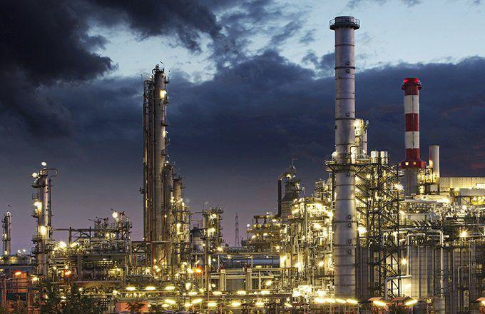

The oil industry operates at the intersection of supply and demand dynamics, where the forces that govern these fundamental economic principles hold significant sway. Supply refers to the total amount of oil producers are willing and able to sell at a given price, while demand represents the quantity consumers are prepared to purchase. The interaction of these elements determines the market equilibrium price.

Oil's role as a critical global commodity cannot be overstated. It is an indispensable energy source powering transportation, heating, and the production of electricity and chemicals. Its significance extends into economic sectors and influences geopolitical strategies. Sudden changes in oil prices can ripple through economies, altering inflationary pressures and affecting trade balances.



In recent years, the oil market has seen the rise of algorithmic trading, a modern innovation characterized by the use of computer algorithms to execute trades at high speeds and volumes. This method leverages advanced mathematical models and vast datasets to make trading decisions, potentially outpacing human traders in response to market conditions. Algorithmic trading has introduced new dynamics into the oil market, sometimes exacerbating price swings due to its rapid reaction to market news and data. As its influence grows, understanding its role is essential for grasping the current and future landscape of the oil industry.

## Table of Contents

## Understanding Supply and Demand in the Oil Industry

Supply and demand are fundamental economic concepts that dictate the availability and pricing of commodities, including oil. In economic terms, demand refers to the quantity of a good or service that consumers are willing and able to purchase at various prices, whereas supply represents the quantity that producers are ready to sell at different price levels. The interplay between these two forces determines the market price and quantity of oil.

In the oil industry, demand is notably inelastic, meaning that changes in the price of oil lead to relatively small changes in the quantity demanded. This inelasticity is primarily due to oil's integral role in transportation, manufacturing, and energy sectors, where alternatives are limited or costly. Mathematically, inelastic demand can be characterized by a price elasticity of demand coefficient less than one:

$$
E_d = \frac{\%\ \text{change in quantity demanded}}{\%\ \text{change in price}}
$$

When demand is inelastic, the coefficient $E_d$ is less than one. This characteristic of oil demand often results in pronounced price [volatility](/wiki/volatility-trading-strategies); small shifts in supply can lead to significant price changes. For instance, if geopolitical tensions lead to a reduction in oil supply, prices may surge due to the limited immediate alternative energy sources.

Several factors influence the supply side of the oil market. Geopolitical events are among the most significant. Political instability or conflict in oil-rich regions can disrupt production and transport, leading to supply shortages and increased prices. For example, conflicts in the Middle East, a region with substantial oil reserves, frequently lead to supply concerns and price spikes globally.

Technological advancements also play a crucial role in shaping oil supply. Innovations in drilling technologies, such as hydraulic fracturing and deep-water drilling, have increased access to previously unreachable reserves, consequently boosting supply. These advancements have been pivotal in altering global oil dynamics, leading to phenomena like the U.S. shale oil revolution, which repositioned the United States as a major oil producer.

In summary, the principles of supply and demand are vital for understanding the oil market dynamics. While demand exhibits low elasticity, contributing to substantial price volatility, supply is influenced by a mix of geopolitical developments and technological progress. These elements collectively determine the stability and responsiveness of the oil market to external shocks and shifts.

## The Role of Algorithmic Trading in the Oil Market

Algorithmic trading, a cornerstone of modern financial markets, employs computer algorithms to automate and optimize the trading process. This form of trading utilizes pre-programmed instructions based on variables such as time, price, and [volume](/wiki/volume-trading-strategy), making it capable of executing numerous transactions at speeds and frequencies that are impossible for human traders. Algorithmic trading is increasingly prevalent in the oil market due to its ability to analyze large datasets and execute trades with high precision and speed.

In the oil market, [algorithmic trading](/wiki/algorithmic-trading) strategies often analyze market indicators, historical data, and news releases to make instantaneous trading decisions. The involvement of algorithms can drastically increase efficiency by reducing transaction costs and enhancing the [liquidity](/wiki/liquidity-risk-premium) of the market. As such, algorithmic trading has become integral to the functioning of modern oil exchanges.

The rapid execution of trades by algorithms can also lead to amplified price swings, particularly in response to market news. For instance, in moments of geopolitical instability or significant announcements about oil production, algorithmic trading systems rapidly respond to news by buying or selling in large volumes. This often results in sudden and extensive price fluctuations. These algorithms are designed to exploit short-term movements, potentially leading to a feedback loop where price volatility is amplified rather than mitigated.

The pros of algorithmic trading are centered around its contributions to market efficiency and liquidity. Firstly, it facilitates a more competitive market by allowing for quicker price discovery, helping markets to more accurately reflect the intrinsic value of oil. Additionally, algorithmic trading can help distribute risks more effectively, as algorithms are often used to balance positions and hedge against potential losses.

However, there are significant cons to consider. High-frequency trading, a subset of algorithmic trading, is often cited for contributing to market instability. This is due, in part, to the potential for algorithms to react simultaneously to market signals, creating substantial and artificial price swings. This phenomenon was observed during the flash crash events in various markets, albeit less frequently in oil markets.

Moreover, the dependence on algorithmic systems can lead to systemic risks. If a dominant algorithm makes erroneous trades, it can affect the entire market due to the interconnected nature of trading platforms. Additionally, the high reliance on technology makes markets susceptible to cyber-attacks, which could have devastating consequences.

In summary, while algorithmic trading offers increased efficiency and liquidity in the oil market, it also poses challenges to market stability due to its potential to exaggerate price volatility. Balancing these aspects is crucial for ensuring a stable and efficient oil market.

## Economic Impacts of Oil Price Fluctuations

Oil price fluctuations have far-reaching economic consequences, impacting both oil-producing and oil-consuming nations. These fluctuations are primarily driven by variations in supply and demand, geopolitical tensions, and market speculation, among other factors.

One significant outcome of oil price volatility is the 'boom and bust' cycles frequently observed in the oil industry. During periods of high oil prices, oil-producing countries and companies often experience economic booms. Government revenues in oil-rich nations surge due to increased export earnings, leading to heightened public spending and economic growth. However, these booms are often followed by busts when oil prices drop, resulting in lower revenues, budget deficits, and reduced economic activity. This cycle can lead to financial instability and social challenges, as seen in countries like Venezuela and Nigeria, where over-reliance on oil revenues has led to severe economic downturns when prices collapsed.

Historically, dramatic fluctuations in oil prices have had profound impacts on various economies worldwide. For example, the oil crisis of the 1970s, precipitated by an oil embargo led by the Organization of Arab Petroleum Exporting Countries (OAPEC), resulted in skyrocketing oil prices, triggering inflation and economic recession in many Western countries. This crisis underscored the vulnerabilities of oil-dependent economies and led to a significant reevaluation of energy policies globally.

Similarly, the sharp decline in oil prices from 2014 to 2016, driven by increased production in the United States due to the shale oil boom and OPEC's decision not to cut production, had mixed effects across the globe. Oil-importing countries like China and India benefited from reduced energy costs, which supported economic growth and lower inflation. Conversely, oil-exporting countries such as Russia and Saudi Arabia faced budgetary constraints and economic slowdowns, prompting the need for economic diversification and fiscal reforms.

The global economy's sensitivity to oil price swings highlights the interconnectedness of markets and the intricate balance required to manage such volatility. Addressing the challenges posed by these fluctuations necessitates strategies such as economic diversification, the development of alternative energy sources, and enhanced market transparency to mitigate excessive speculation and ensure a more stable economic environment.

## Strategies for Managing Oil Market Volatility

To navigate the complexities of oil market volatility, investors and countries employ a variety of strategies. These strategies are vital for mitigating the economic risks associated with fluctuating oil prices and for enhancing market stability.

One of the primary tools utilized in managing oil market volatility is the use of financial instruments such as futures and options. Futures contracts allow investors to lock in a price for oil at a future date, providing a hedge against price fluctuations. For example, an airline company might use futures to ensure a stable fuel cost, thereby protecting itself from price spikes. Options, on the other hand, give the holder the right, but not the obligation, to buy or sell oil at a predetermined price within a specified timeframe. This flexibility is instrumental in managing risk without committing to a fixed transaction.

The mathematical foundation of these financial instruments can be modeled using various pricing models, such as the Black-Scholes formula for options pricing. In Python, the formula can be implemented as follows:

```python
from scipy.stats import norm
import numpy as np

def black_scholes(S, K, T, r, sigma, option_type='call'):
    d1 = (np.log(S / K) + (r + 0.5 * sigma ** 2) * T) / (sigma * np.sqrt(T))
    d2 = d1 - sigma * np.sqrt(T)

    if option_type == 'call':
        return S * norm.cdf(d1) - K * np.exp(-r * T) * norm.cdf(d2)
    elif option_type == 'put':
        return K * np.exp(-r * T) * norm.cdf(-d2) - S * norm.cdf(-d1)
    else:
        raise ValueError("option_type must be 'call' or 'put'")

# Example usage:
# S = current price, K = strike price, T = time to maturity, r = risk-free rate, sigma = volatility
call_price = black_scholes(S=50, K=50, T=1, r=0.05, sigma=0.2)
print(call_price)
```

Alongside financial instruments, policy measures and technological advancements play pivotal roles in stabilizing oil supply and demand. Governments may implement strategic oil reserves to cushion against supply shocks, ensuring a steady flow of oil in case of sudden constraints. For instance, the United States maintains a Strategic Petroleum Reserve (SPR) to enhance energy security during disruptions.

Technological advancements also contribute significantly to stability. Innovations in extraction methods, such as hydraulic fracturing and horizontal drilling, have revolutionized the ability to tap into previously inaccessible reserves, thereby increasing supply. Moreover, technological improvements in energy efficiency can reduce overall demand, providing a counterbalance to price volatility.

Additionally, international collaboration, through entities like the Organization of the Petroleum Exporting Countries (OPEC), aims to stabilize markets by coordinating production levels among member countries. This collective management of supply helps moderate extreme price shifts, although it's not without criticisms regarding market manipulation.

In conclusion, managing oil market volatility requires a multifaceted approach combining financial tools, policy interventions, and technological progress. These strategies are crucial in maintaining economic stability and ensuring a reliable energy supply in a world intricately connected through oil dependency.

## Future Trends: Oil, Supply, Demand, and Technology

The future of the oil market remains subject to a confluence of factors that span technological advancements, sustainability initiatives, and the evolution of trading mechanisms. As the world grapples with the urgent need for sustainable practices, the oil industry is at a crossroads, with significant changes anticipated in its demand, supply dynamics, and trading methodologies.

### Shifts in the Oil Market and Technological Advancements

The transition toward renewable energy sources and sustainability initiatives is expected to significantly impact future oil demand. According to the International Energy Agency (IEA), initiatives geared toward meeting the Paris Agreement targets could lead to a plateau or even a decline in global oil demand by mid-century. This shift is supported by the continued advancement in electric vehicle technology and increased energy efficiency. Technological breakthroughs in battery storage and grid resilience further bolster the viability of alternative energy sources, potentially reducing dependency on oil.

On the supply side, technological innovations such as advanced drilling techniques, enhanced oil recovery (EOR) methods, and digital oil fields have increased extraction efficiency and reduced operational costs. The integration of [artificial intelligence](/wiki/ai-artificial-intelligence) (AI) and [machine learning](/wiki/machine-learning) (ML) in oil exploration and production enables more accurate predictive maintenance and resource management, potentially optimizing supply chains and reducing environmental impact.

### Sustainability Initiatives and Alternative Energy Sources

As governments and corporations intensify their focus on reducing carbon footprints, alternative energy sources, such as wind and solar power, are gaining prominence. The growing adoption of these sources is facilitated by a reducing cost trajectory, as reported by the International Renewable Energy Agency (IRENA). Hydrogen as an energy carrier also presents promising possibilities, especially with increased investments in developing green hydrogen infrastructure.

This shift in energy preference could lead to a redefinition of energy security, traditionally dominated by oil supply considerations. Countries investing heavily in renewables might reduce their geopolitical vulnerability linked to oil imports, affecting global oil trade patterns.

### Evolution of Algorithmic Trading in Oil Markets

Algorithmic trading, characterized by the use of complex algorithms and mathematical models to execute trades at high speed and frequency, is expected to evolve with advancements in AI and quantum computing. Enhanced data analytics capabilities could further refine predictive models, enabling traders to react more swiftly to market stimuli. Despite offering increased efficiency and liquidity, algorithmic trading might also exacerbate market volatility due to its propensity to amplify disruptive impacts, such as those resulting from geopolitical events or natural disasters.

The rise of decentralized finance (DeFi) platforms presents another intriguing vector for change. By facilitating peer-to-peer transactions without traditional intermediaries, these platforms could democratize access to oil trading, although they also pose regulatory challenges that need to be addressed.

In summary, the future of the oil market is poised for transformative changes driven by technological advancements, sustainable energy initiatives, and the evolving landscape of algorithmic trading. These elements collectively underscore the need for adaptive strategies to navigate the impending transitions in global energy dynamics.

## Conclusion

The analysis of the oil market highlights the intricate balance between supply and demand, where their interaction is pivotal in determining oil prices. Oil remains a cornerstone of the global economy, significantly influencing both developed and developing nations. As the industry navigates the challenges and opportunities presented by algorithmic trading, it becomes clear that technology's role is profound, impacting price stability and market dynamics.

Algorithmic trading, while offering efficiencies, also introduces complexities that can heighten market volatility. Its capability to process vast amounts of data quickly precipitates market movements that, in the absence of adequate checks, can lead to significant price swings. Despite these challenges, algorithmic trading enhances market liquidity and efficiency, presenting a nuanced landscape for market participants.

Price fluctuations in the oil market have tangible economic impacts, often triggering 'boom and bust' cycles. These cycles affect not just economies reliant on oil exports but also global financial systems. Historical precedents illustrate how drastic price movements can precipitate broader economic instability, underscoring the need for effective management strategies.

To manage such volatility, stakeholders employ various strategies, including financial instruments like futures and options. These tools offer a hedge against adverse price movements, providing a buffer for investors and economies alike. Policymakers and industry leaders are also exploring technological advances and policy measures aimed at stabilizing supply and demand.

Looking ahead, the oil market faces potential shifts driven by sustainability initiatives and alternative energy sources. The ongoing pursuit of renewable energies and more efficient technologies could significantly alter the demand for oil. Additionally, the future evolution of algorithmic trading practices will likely continue to shape market dynamics, necessitating ongoing research and adaptation.

In conclusion, the oil industry's future hinges on the judicious management of supply and demand dynamics, the innovative application of technology, and the implementation of robust policy measures. Further research into these areas will be crucial to foster a stable and efficient market environment that can adapt to changing global needs.

## References & Further Reading

[1]: Hamilton, J. D. (2009). ["Understanding Crude Oil Prices."](https://www.jstor.org/stable/41323239) The Energy Journal, 30(2), 179-206.

[2]: Yergin, D. (2011). ["The Quest: Energy, Security, and the Remaking of the Modern World"](https://www.jstor.org/stable/24693824) by Daniel Yergin.

[3]: Geman, H. (2005). ["Commodities and Commodity Derivatives: Modelling and Pricing for Agriculturals, Metals and Energy."](https://download.e-bookshelf.de/download/0000/5675/90/L-G-0000567590-0015270354.pdf) Wiley Finance.

[4]: Fattouh, B., Kilian, L., & Mahadeva, L. (2013). ["The Role of Speculation in Oil Markets: What Have We Learned So Far?"](https://www.jstor.org/stable/41970495) The Energy Journal, 34(3), 7-33.

[5]: Lopez de Prado, M. (2018). ["Advances in Financial Machine Learning."](https://www.amazon.com/Advances-Financial-Machine-Learning-Marcos/dp/1119482089) Wiley.

[6]: International Energy Agency (IEA). (2020). ["World Energy Outlook 2020."](https://www.iea.org/reports/world-energy-outlook-2020)

[7]: Pirrong, C. (2012). ["The Economics of Commodity Trading Firms."](https://www.bauer.uh.edu/spirrong/economics-commodity-trading-firms.pdf) Trafigura White Paper.

[8]: Kaufman, P. D. (2005). ["Trading Systems and Methods, + Website (5th Edition)."](https://onlinelibrary.wiley.com/doi/book/10.1002/9781119202561) Wiley Trading.