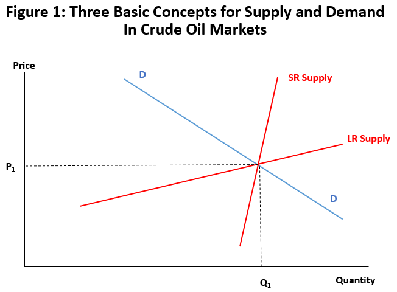

## Table of Contents

## What is supply and demand?

Supply and demand is a basic idea in economics that explains how the price and amount of goods or services are decided. It works like this: when a lot of people want something but there isn't much of it, the price goes up. On the other hand, if there is a lot of something but not many people want it, the price goes down. This balance between what people want and what is available helps set prices in a market.

For example, imagine there are only a few apples available at the store, but many people want to buy them. The store might raise the price of apples because they know people will still buy them. If the next week, the store gets a lot more apples, but fewer people want them, the store might lower the price to sell them all. This back-and-forth between supply and demand keeps the market moving and helps decide how much things cost.

## How does supply and demand affect the price of oil?

The price of oil is greatly influenced by supply and demand. When there's more oil available than people want to buy, the price goes down. This can happen if new oil fields are discovered or if countries produce more oil. On the other hand, if there's less oil available but a lot of people want it, the price goes up. This can happen if there are problems with oil production, like a war in an oil-producing country, or if demand suddenly increases, like during a cold winter when more oil is needed for heating.

Another [factor](/wiki/factor-investing) that affects the price of oil is how people expect the future to be. If people think there will be less oil in the future, they might buy more now, which can push the price up even if there's enough oil right now. Also, big events like economic changes or new laws about using less oil can change how much people want it, which then changes the price. So, the price of oil is always moving because of what's happening with supply and demand, and what people think will happen next.

## What factors influence the supply of oil?

The supply of oil is affected by many things. One big thing is how much oil countries can produce. This depends on how many oil wells they have and how well they can get oil out of the ground. If new oil fields are found or if technology gets better at getting oil out, more oil can be produced. But if there are problems like wars or strikes at oil fields, less oil can be made.

Another thing that changes the supply of oil is how much countries decide to produce. Sometimes, countries that make a lot of oil, like those in OPEC, agree to make less oil to keep the price high. They might also decide to make more oil if they want to make more money or if other countries need more oil. Also, oil companies might choose to store oil instead of selling it right away if they think the price will go up later.

Lastly, natural things like weather can affect oil supply. Big storms or natural disasters can damage oil wells and pipelines, making it hard to get oil out. Also, if there are rules about protecting the environment, these can make it harder or more expensive to produce oil, which can lower the supply. All these things together decide how much oil is available at any time.

## What factors influence the demand for oil?

The demand for oil depends a lot on how many people want to use it and for what. When the world's economy is doing well, more people and businesses are using oil. They use it for things like driving cars, flying planes, and running factories. If more people are working and making things, they need more oil. Also, in places where it's cold, people use oil to heat their homes. So, if it's a cold winter, the demand for oil can go up.

Another thing that changes the demand for oil is how much people want to use other kinds of energy. If people start using more electricity from wind or solar power, or if they drive electric cars instead of ones that use gas, they don't need as much oil. Also, if the government makes new rules to use less oil because of the environment, that can lower the demand. People's choices about what kind of energy to use can make a big difference in how much oil they need.

Lastly, the price of oil itself can affect how much people want to buy. If oil gets really expensive, people might try to use less of it or find other ways to do things. For example, they might drive less or take public transport. On the other hand, if oil is cheap, people might use more of it because it doesn't cost as much. So, the price of oil can make people change how much they want to use it.

## How do geopolitical events impact oil supply and demand?

Geopolitical events can have a big effect on how much oil is available and how much people want to buy. If there's a war or a big problem in a country that makes a lot of oil, like Saudi Arabia or Iraq, it can be hard to get oil out of the ground. Pipelines might get damaged, or workers might not be able to go to the oil fields. This can make less oil available, which can make the price go up because there's not enough to go around.

Also, geopolitical events can change how much people want to buy oil. If there's a lot of worry about where oil is coming from, countries might want to have more oil saved up, just in case. This can make the demand go up. On the other hand, if there's a big problem in one country, other countries might decide to use less oil from that place and look for oil somewhere else. This can change how much oil people want to buy and from where.

Sometimes, big groups like OPEC, which is made up of countries that make a lot of oil, can decide to make more or less oil because of what's happening in the world. If they think there might be a problem coming, they might choose to make less oil to keep the price high. Or, if they want to help out during a big event, they might make more oil to keep the price down. All these things together show how what's happening in the world can change how much oil there is and how much people want to use.

## What role do oil reserves play in the dynamics of supply and demand?

Oil reserves are like a big storage of oil that countries and companies keep for later use. They can change how much oil is available at any time. When there's a lot of oil in the reserves, it can make the supply seem bigger. This might happen if countries decide to release oil from their reserves to help keep the price down during a crisis. On the other hand, if countries start storing more oil in their reserves because they're worried about future shortages, it can make the supply seem smaller and push the price up.

The way oil reserves are used also affects how much people want to buy oil right now. If people know there's a lot of oil stored away, they might not feel the need to buy as much right away, which can lower the demand. But if people think the reserves are running low, they might want to buy more oil now to make sure they have enough later, which can increase the demand. So, oil reserves play a big part in keeping the balance between how much oil there is and how much people want to use.

## How do seasonal changes affect oil demand?

Seasonal changes can make a big difference in how much oil people want to use. In the winter, it can get very cold in many places. People use oil to heat their homes and buildings. Also, more people might drive less because of bad weather, but they still need to get around, so they might use more oil for heating their cars. All this means that the demand for oil goes up in the winter.

In the summer, things can change again. It might be hot, but people don't need as much oil for heating. Instead, they might use more oil for traveling. Summer is a time when a lot of people go on vacation and drive long distances or fly in airplanes. This can make the demand for oil go up, but it's different from the winter because it's for different reasons. So, the seasons can make the demand for oil go up and down throughout the year.

## What is the impact of alternative energy sources on oil demand?

Alternative energy sources like solar, wind, and electric power can lower the demand for oil. When more people start using these other types of energy, they don't need as much oil. For example, if someone buys an electric car instead of one that runs on gas, they won't need to buy oil for their car anymore. Also, if a factory switches from using oil to using solar power, it will use less oil. As more people and businesses choose these alternatives, the overall need for oil goes down.

Governments and companies are also pushing for less oil use to help the environment. They might make new rules or offer money to encourage people to use cleaner energy. When these rules or incentives work, more people switch to alternative energy, which means they use less oil. Over time, if more and more people keep choosing these other energy sources, the demand for oil can keep going down. This can change how much oil is used around the world and affect its price.

## How do economic cycles influence oil prices through supply and demand?

Economic cycles, like times when the economy is growing or shrinking, can change how much oil people want to buy and how much they're willing to pay for it. When the economy is doing well, more people have jobs and money to spend. They drive more, take more trips, and factories make more things, so they all use more oil. This makes the demand for oil go up, which can push the price higher because everyone wants more of it. But if the economy starts to slow down, people might lose their jobs or have less money. They won't drive as much or take as many trips, so they don't need as much oil. This makes the demand for oil go down, which can make the price go down too.

On the supply side, economic cycles can also affect how much oil countries want to produce. When the economy is good, oil companies might want to make more oil because they think they can sell it all and make more money. They might even find new ways to get oil out of the ground faster. But if the economy gets bad, they might slow down because they think they won't be able to sell as much oil. Also, during tough economic times, countries might decide to keep more oil in their reserves just in case things get worse. This can make the supply seem smaller and affect the price. So, the ups and downs of the economy can really change how much oil people want and how much is available, which then changes the price.

## What are the long-term trends in oil supply and demand?

Over the long term, the demand for oil has been growing because more people around the world are using it. As countries like China and India get richer, more people there can afford cars and need oil for factories. But at the same time, people are starting to use less oil in some places. This is because they are using more electric cars and getting energy from the sun and wind. Also, governments are making rules to use less oil to help the environment. So, while the total demand for oil is still going up, it's not growing as fast as it used to.

On the supply side, finding new oil is getting harder. The easy-to-reach oil is already being used up, so companies have to look in harder places like deep under the ocean or in the Arctic. This makes it more expensive to get oil out of the ground. But new technology is helping to find and use oil better. Also, countries that make a lot of oil, like those in OPEC, can decide to make more or less oil, which changes how much is available. Over time, these things together mean that the supply of oil can go up and down, but it's getting harder to keep up with the growing demand.

## How do OPEC decisions affect global oil supply and prices?

OPEC, which stands for the Organization of the Petroleum Exporting Countries, is a group of countries that make a lot of oil. When they get together, they can decide to make more or less oil. If they decide to make less oil, there's not as much oil to go around, so the price can go up. This can happen if they want to make more money or if they think there might be problems in the future. On the other hand, if they decide to make more oil, there's more oil available, which can make the price go down. They might do this if they want to help out during a big event or if they think they can sell more oil.

These decisions by OPEC can have a big effect on the whole world. When OPEC changes how much oil they make, it can change how much oil other countries want to buy and how much they're willing to pay. For example, if OPEC decides to make less oil, other countries might start looking for oil from other places, which can change where oil comes from and how much it costs. Also, because OPEC countries make so much of the world's oil, their decisions can make the price go up and down a lot, which can affect everything from how much it costs to fill up your car to how much it costs to heat your home.

## What forecasting models are used to predict future oil supply and demand?

To predict how much oil will be available and how much people will want in the future, people use different kinds of models. One common type is called an econometric model. This model looks at past information about how much oil was made and used, and then uses math to guess what will happen next. It takes into account things like how the economy is doing, how much oil countries are making, and what people think will happen in the future. Another type is a simulation model, which tries to copy how the oil market works. It can change different things, like how much oil OPEC decides to make or if there's a new law about using less oil, to see how these changes might affect the supply and demand of oil.

Another model that's used is called a scenario analysis. This model looks at different stories about what might happen in the future. For example, one story might be that everyone starts using electric cars, so they need less oil. Another story might be that a big new oil field is found, so there's more oil available. By looking at these different stories, people can see how oil supply and demand might change in different situations. All these models help people make better guesses about the future of oil, but they're not perfect because the future can be hard to predict.

## What is the understanding of supply and demand in the oil industry?

Supply and demand are fundamental economic concepts that dictate the availability and pricing of commodities, including oil. In economic terms, demand refers to the quantity of a good or service that consumers are willing and able to purchase at various prices, whereas supply represents the quantity that producers are ready to sell at different price levels. The interplay between these two forces determines the market price and quantity of oil.

In the oil industry, demand is notably inelastic, meaning that changes in the price of oil lead to relatively small changes in the quantity demanded. This inelasticity is primarily due to oil's integral role in transportation, manufacturing, and energy sectors, where alternatives are limited or costly. Mathematically, inelastic demand can be characterized by a price elasticity of demand coefficient less than one:

$$
E_d = \frac{\%\ \text{change in quantity demanded}}{\%\ \text{change in price}}
$$

When demand is inelastic, the coefficient $E_d$ is less than one. This characteristic of oil demand often results in pronounced price [volatility](/wiki/volatility-trading-strategies); small shifts in supply can lead to significant price changes. For instance, if geopolitical tensions lead to a reduction in oil supply, prices may surge due to the limited immediate alternative energy sources.

Several factors influence the supply side of the oil market. Geopolitical events are among the most significant. Political instability or conflict in oil-rich regions can disrupt production and transport, leading to supply shortages and increased prices. For example, conflicts in the Middle East, a region with substantial oil reserves, frequently lead to supply concerns and price spikes globally.

Technological advancements also play a crucial role in shaping oil supply. Innovations in drilling technologies, such as hydraulic fracturing and deep-water drilling, have increased access to previously unreachable reserves, consequently boosting supply. These advancements have been pivotal in altering global oil dynamics, leading to phenomena like the U.S. shale oil revolution, which repositioned the United States as a major oil producer.

In summary, the principles of supply and demand are vital for understanding the oil market dynamics. While demand exhibits low elasticity, contributing to substantial price volatility, supply is influenced by a mix of geopolitical developments and technological progress. These elements collectively determine the stability and responsiveness of the oil market to external shocks and shifts.

## References & Further Reading

[1]: Hamilton, J. D. (2009). ["Understanding Crude Oil Prices."](https://www.jstor.org/stable/41323239) The Energy Journal, 30(2), 179-206.

[2]: Yergin, D. (2011). ["The Quest: Energy, Security, and the Remaking of the Modern World"](https://www.jstor.org/stable/24693824) by Daniel Yergin.

[3]: Geman, H. (2005). ["Commodities and Commodity Derivatives: Modelling and Pricing for Agriculturals, Metals and Energy."](https://download.e-bookshelf.de/download/0000/5675/90/L-G-0000567590-0015270354.pdf) Wiley Finance.

[4]: Fattouh, B., Kilian, L., & Mahadeva, L. (2013). ["The Role of Speculation in Oil Markets: What Have We Learned So Far?"](https://www.jstor.org/stable/41970495) The Energy Journal, 34(3), 7-33.

[5]: Lopez de Prado, M. (2018). ["Advances in Financial Machine Learning."](https://www.amazon.com/Advances-Financial-Machine-Learning-Marcos/dp/1119482089) Wiley.

[6]: International Energy Agency (IEA). (2020). ["World Energy Outlook 2020."](https://www.iea.org/reports/world-energy-outlook-2020)

[7]: Pirrong, C. (2012). ["The Economics of Commodity Trading Firms."](https://www.bauer.uh.edu/spirrong/economics-commodity-trading-firms.pdf) Trafigura White Paper.

[8]: Kaufman, P. D. (2005). ["Trading Systems and Methods, + Website (5th Edition)."](https://onlinelibrary.wiley.com/doi/book/10.1002/9781119202561) Wiley Trading.