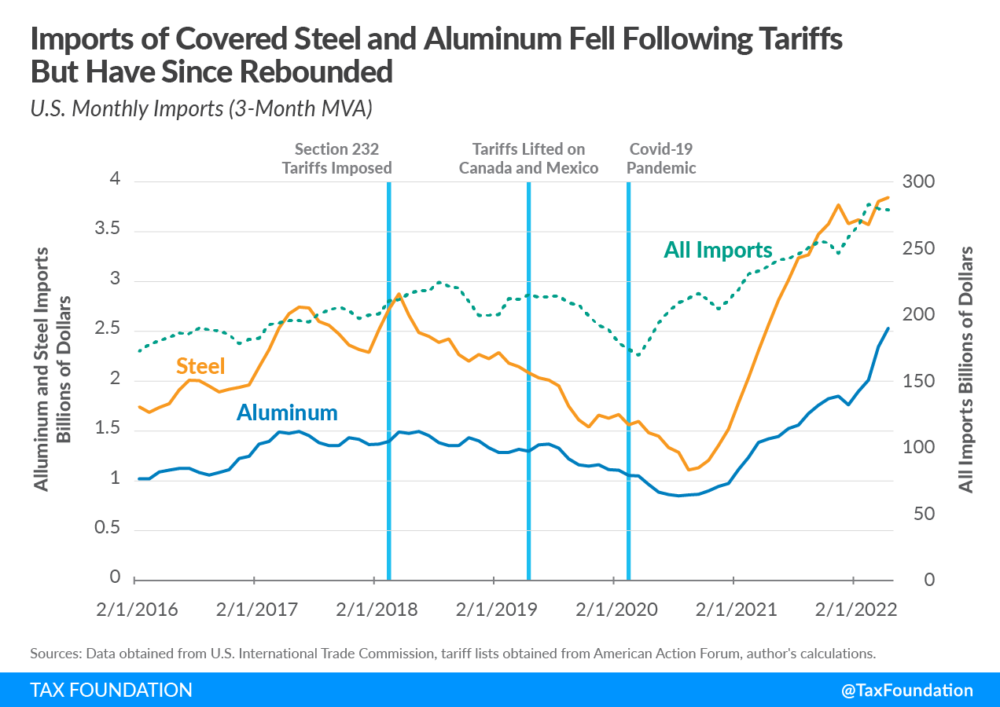

## Table of Contents

## What is a tariff and how does it apply to the steel industry?

A tariff is a tax that a government puts on imported goods. It makes these goods more expensive for people to buy. Governments use tariffs to protect their own industries from foreign competition. When a tariff is placed on an imported product, it can make the local product seem cheaper and more attractive to buyers.

In the steel industry, tariffs are often used to protect domestic steel producers. For example, if a country places a tariff on imported steel, it makes the price of that steel higher. This can help local steel companies because their steel becomes more competitive in price. As a result, people might choose to buy steel from local producers instead of from other countries. This can help keep jobs and money within the country.

## How do tariffs on steel affect the price of steel products?

When a government puts a tariff on steel, it makes the price of imported steel go up. This means that companies that use steel to make things, like cars or buildings, have to pay more for the steel they buy from other countries. Because of this, the cost of making their products goes up. To make up for the higher costs, these companies might raise the prices of their products. So, the tariffs on steel can make things made from steel more expensive for everyone.

But it's not just about the price going up. Sometimes, companies that make steel in the country where the tariff is put in place can benefit. They don't have to pay the tariff, so their steel might be cheaper than the imported steel. This can help them sell more steel and maybe even grow their business. But for people who buy things made from steel, like cars or appliances, the higher prices can mean they have to spend more money.

## What are the immediate effects of imposing tariffs on steel imports?

When a country puts a tariff on steel imports, the price of steel from other countries goes up right away. This means that companies that need steel to make things, like cars or machines, have to pay more for it. As a result, they might have to raise the prices of their products to cover the extra cost. This can make things more expensive for people who want to buy them.

At the same time, local steel companies that don't have to pay the tariff can benefit. Their steel becomes cheaper compared to the imported steel, so they might sell more of it. This can help them make more money and maybe even create more jobs. But for companies that use steel, the higher costs can cause problems, and they might have to find ways to save money or change how they do business.

## How do steel tariffs influence domestic steel production?

When a country puts a tariff on steel imports, it makes the price of foreign steel go up. This means that local steel companies can sell their steel for less than the imported steel. Because of this, people and businesses might choose to buy more steel from local companies. This can help these companies make more money and maybe even grow their business. They might hire more workers or invest in new equipment to make more steel.

But it's not all good for everyone. Some companies that use steel to make things, like cars or buildings, have to pay more for the steel they need. This can make it harder for them to keep their prices low. They might have to raise the prices of their products, which can make things more expensive for people who want to buy them. So, while tariffs can help local steel producers, they can also cause problems for other businesses and make things more expensive for everyone.

## What impact do steel tariffs have on employment in the steel industry?

When a country puts tariffs on steel imports, it can help the people who work in the steel industry. The tariffs make imported steel more expensive, so people might buy more steel from local companies instead. This can make local steel companies do better and they might need more workers. So, they could hire more people or keep the jobs they already have. This means more jobs and better job security for people who work in the steel industry.

But, tariffs on steel can also cause problems for other jobs. Companies that use steel to make things, like cars or buildings, have to pay more for the steel they need. This can make it harder for them to keep their prices low. They might have to raise the prices of their products, which can make things more expensive for everyone. If people buy less because things are more expensive, these companies might not need as many workers. So, they could lay off people or not hire new ones. This means fewer jobs in industries that use steel.

## How do tariffs affect the competitiveness of the steel industry on a global scale?

When a country puts tariffs on steel, it changes how competitive its steel industry is around the world. The tariffs make steel from other countries more expensive, so local steel companies can sell their steel for less. This can help them sell more steel at home and maybe even in other countries where they can offer a better price. But, it can also make it harder for them to sell steel in places that don't have tariffs, because other countries might put tariffs on their steel too.

On the other hand, tariffs can make it harder for other countries' steel industries to sell their steel in the country with the tariffs. They have to charge more because of the tariffs, so they might not be able to compete as well. This can lead to trade fights where countries put tariffs on each other's products. In the end, the global steel market can become less competitive overall, because tariffs can make it harder for companies to sell their steel in different places around the world.

## What are the long-term economic implications of steel tariffs for the industry?

In the long run, steel tariffs can have big effects on the steel industry. When a country keeps tariffs on steel for a long time, it can help local steel companies grow and become stronger. They might make more steel and hire more people because they can sell their steel for less than the imported steel. This can make the country less dependent on other countries for steel, which some people think is good for the economy. But, it can also make the local steel companies less good at competing with other countries. They might not try as hard to make their steel better or cheaper because they don't have to worry about competition from other countries.

On the other hand, long-term steel tariffs can cause problems for other parts of the economy. Companies that use steel to make things, like cars or buildings, have to pay more for the steel they need. This can make their products more expensive, so they might sell less and have to lay off workers. This can hurt the economy because fewer people have jobs and less money to spend. Also, other countries might put tariffs on the country's products in return, which can make it harder for the country to sell things around the world. So, while tariffs can help the steel industry in some ways, they can also cause big problems for the economy as a whole.

## How do steel tariffs influence related industries, such as automotive and construction?

When a country puts tariffs on steel, it makes the price of steel go up for companies that use it to make things, like cars and buildings. In the automotive industry, car makers have to pay more for the steel they need. This can make the cost of making cars go up. To make up for this, car companies might raise the price of their cars. This means that people might have to pay more to buy a car. If cars become too expensive, people might not buy as many, and car companies could sell less. This can hurt the automotive industry because they might have to lay off workers or not hire new ones.

In the construction industry, builders also have to pay more for steel. Steel is used a lot in buildings, so when it gets more expensive, the cost of building goes up too. Construction companies might have to charge more for their projects. This can make it harder for people and businesses to afford new buildings or to fix up old ones. If construction projects become too expensive, there might be fewer of them. This can lead to less work for construction workers, and some might lose their jobs. So, while steel tariffs can help the steel industry, they can make things harder for the automotive and construction industries.

## What are the potential retaliatory measures from countries affected by steel tariffs?

When a country puts tariffs on steel, other countries that sell steel might get mad. They might put their own tariffs on things from the country that started the tariffs. This can make it harder for the first country to sell its stuff in other places. For example, if Country A puts a tariff on steel from Country B, Country B might put a tariff on cars from Country A. This can make it harder for people in Country B to buy cars from Country A, and it can hurt the car industry in Country A.

These retaliatory measures can start a big fight over trade. It's like a game of tit-for-tat where countries keep putting tariffs on each other's products. This can make things more expensive for everyone and slow down trade between countries. In the end, it can hurt the economy because fewer things are being bought and sold. So, while tariffs on steel might help the steel industry in one country, they can cause big problems for other industries and make things harder for everyone.

## How have steel tariffs historically impacted trade agreements and international relations?

Steel tariffs have often caused big problems with trade agreements and international relations. When a country puts tariffs on steel, other countries might get upset. They might think it's not fair and start putting tariffs on things from the country that started it. This can mess up trade agreements that countries have worked hard to make. For example, if two countries have a deal to trade things without tariffs, putting a tariff on steel can break that deal. This can make countries not trust each other and make it harder for them to work together on other things.

Sometimes, steel tariffs can start big fights over trade. These fights can make it hard for countries to get along. For instance, in the past, when the United States put tariffs on steel, other countries like the European Union and China got mad. They put tariffs on things from the United States, like cars and farm stuff. This made things more expensive and slowed down trade. It also made it harder for countries to work together on other important things, like fighting climate change or keeping the world safe. So, while steel tariffs might help one industry, they can cause big problems for trade and international relations.

## What are the environmental considerations associated with changes in steel production due to tariffs?

When a country puts tariffs on steel, it can change how much steel is made and where it comes from. If local steel companies make more steel because of the tariffs, it can mean more pollution. Making steel uses a lot of energy and can make the air and water dirty. So, if more steel is made in the country with the tariffs, it might make the environment worse there. But, if less steel is imported from other countries, it might mean less pollution in those places, because they are making less steel.

On the other hand, if the tariffs make steel more expensive, people might use less steel. This could be good for the environment because less steel means less pollution from making it. But, it can also mean that people use other materials instead of steel, and those materials might be bad for the environment too. So, the environmental effects of steel tariffs can be hard to figure out. It depends on how much steel is made, where it's made, and what people use instead of steel.

## How can data analytics be used to predict the effects of steel tariffs on market trends and industry performance?

Data analytics can help people understand what might happen if a country puts tariffs on steel. By looking at past data, like how much steel was made and sold before, and what happened when tariffs were put on steel before, data analysts can make guesses about what might happen next. They can use numbers to see how tariffs might change the price of steel, how much steel companies might make, and how much money they might make or lose. This can help steel companies plan for the future and decide if they need to change how they do things.

Also, data analytics can look at other things that might be affected by steel tariffs, like the car and building industries. By studying data from these industries, analysts can predict how tariffs might make things more expensive for them and how that might change how much they sell. This can help these companies get ready for higher costs and maybe find ways to save money. In the end, using data analytics can help everyone understand the big picture and make better choices about what to do when tariffs are put on steel.

## How have recent tariff policies affected steel market dynamics according to the case study?

Recent tariff policies have had profound effects on the dynamics of the steel market, particularly concerning interactions between the United States and China. These policies have been prominent in shaping the global steel industry landscape, driven by strategic economic objectives and retaliatory actions.

### US and China Tariff Interactions

In recent years, the United States has implemented a series of tariffs aimed at protecting its domestic steel industry from foreign competition, particularly from China. The tariffs were introduced under Section 232 of the Trade Expansion Act of 1962, citing national security concerns as the basis for imposing a 25% tariff on imported steel in 2018. This move was aimed at revitalizing the domestic steel industry by reducing dependency on foreign imports. However, it led to significant tensions between the US and China, as China, a major steel producer and exporter, viewed these tariffs as protectionist measures.

In retaliation, China imposed its own set of tariffs on American products, creating a trade conflict that impacted various sectors. The back-and-forth tariff impositions exacerbated trade tensions and led to market [volatility](/wiki/volatility-trading-strategies). The tariffs not only affected bilateral trade but also had repercussions across global steel markets by distorting trade flows and causing shifts in traditional supply chains.

### Market Responses and Global Production Patterns

The series of tariffs has led to notable shifts in market dynamics and global steel production patterns. Initially, US tariffs led to a decrease in steel imports, providing a temporary boost to domestic steel prices and production. However, this also resulted in increased production costs for industries reliant on steel, such as automotive and construction sectors, thereby affecting their global competitiveness.

On a global scale, countries like China began redirecting their steel exports to other markets, notably in Southeast Asia and Europe. This shift was partly facilitated by China's Belt and Road Initiative, which expanded its trade reach to new markets, thus mitigating some of the impacts of the US tariffs.

Moreover, countries affected by the US tariffs sought to renegotiate trade agreements or pursue exemptions and alliances that could offer relief from tariff burdens. For instance, the European Union negotiated quotas that allowed a certain level of duty-free steel to be imported into the United States, while also preparing safeguard measures to protect its steel industry from being overwhelmed by redirected exports from countries like China.

This period also saw increased investment in technological upgrades and efficiency improvements within steel production facilities worldwide, as companies aimed to enhance their competitiveness despite tariff-induced price fluctuations. The adoption of advanced manufacturing techniques and innovation became critical strategies for steel producers facing volatile market conditions.

Quantitatively, the impact of tariffs can be analyzed through supply and demand models which show that tariffs generally lead to decreased imports and increased domestic production. However, they can also lead to inefficiencies represented by deadweight loss in the market. For a given tariff $t$, the deadweight loss $DWL$ can be calculated as:

$$
DWL = \frac{1}{2} \times (Q_d - Q_s) \times t
$$

where $Q_d$ and $Q_s$ are the quantities demanded and supplied domestically. 

In conclusion, recent tariff policies have fundamentally altered the steel market dynamics, initiating shifts in production patterns and reinforcing the need for strategic trade negotiations. These changes underscore the complexity and interconnectedness of global trade, highlighting the critical impact of tariffs on economic and industry-specific outcomes. Appropriate measures and policies are essential to managing these dynamics, ensuring that protective strategies do not lead to more significant long-term disruptions.

## References & Further Reading

[1]: Bown, C. P., & Irwin, D. A. (2015). [“The GATT's Starting Point: Tariff Levels circa 1947.”](https://papers.ssrn.com/sol3/papers.cfm?abstract_id=2771471) National Bureau of Economic Research.

[2]: Irwin, D. A. (2017). ["Peddling Protectionism: Smoot-Hawley and the Great Depression."](https://academic.oup.com/princeton-scholarship-online/book/23385) Princeton University Press.

[3]: Linsmeier, T. J., & Pearson, N. D. (2000). ["Value at Risk."](https://www.researchgate.net/profile/Thomas-Linsmeier/publication/23744167_Risk_Measurement_An_Introduction_to_Value_at_Risk/links/54ad64b20cf24aca1c6f2ff7/Risk-Measurement-An-Introduction-to-Value-at-Risk.pdf) Financial Analysts Journal, 56(2), 47-67.

[4]: Krugman, P. R., Obstfeld, M., & Melitz, M. J. (2015). ["International Economics: Theory and Policy."](https://www.pearson.com/se/Nordics-Higher-Education/subject-catalogue/economics/International-Economics-Theory-and-Policy-Krugman.html) Pearson Education.

[5]: Lopez de Prado, M. (2018). ["Advances in Financial Machine Learning."](https://www.amazon.com/Advances-Financial-Machine-Learning-Marcos/dp/1119482089) John Wiley & Sons, Inc.

[6]: He, Z., Kelly, B., & Manela, A. (2017). ["Intermediary Asset Pricing: New Evidence from Many Asset Classes."](https://www.sciencedirect.com/science/article/abs/pii/S0304405X1730212X) Journal of Financial Economics, 126(1), 1-35.

[7]: Baldwin, R. E. (1984). ["Trade Policies in Developed Countries."](https://www.sciencedirect.com/science/article/pii/S1573440484010157) Handbook of International Economics, Volume 1, 571-617.