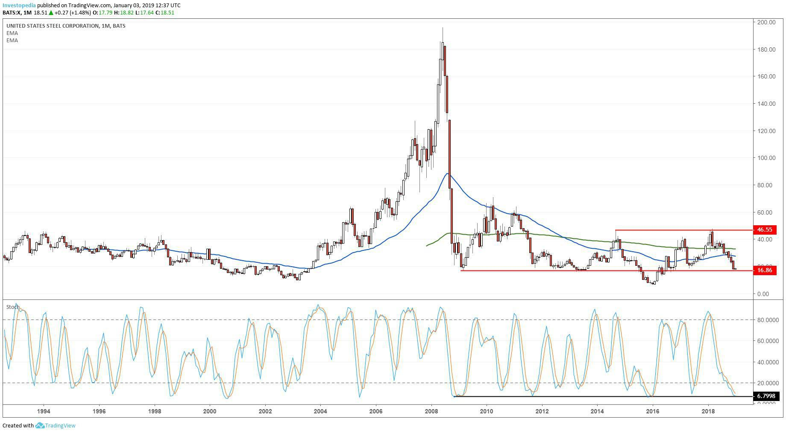

The steel industry plays a pivotal role in the global economy, underpinning essential sectors such as manufacturing and infrastructure. As an integral material for construction and production, steel's demand and supply dynamics significantly influence economic stability and growth. In recent years, tariffs on steel imports and exports have emerged as a critical factor shaping the industry's landscape. These tariffs, designed to protect domestic industries from foreign competition, can have widespread implications across various sectors, affecting costs, market competitiveness, and international relations.

Economic policies concerning steel tariffs aim to bolster domestic production by imposing duties on foreign-made steel. While these measures may provide a competitive edge to local manufacturers in the short term, they often lead to unintended market distortions. For instance, increased costs due to tariffs can ripple through related industries such as automotive, construction, and appliances, potentially leading to higher prices for consumers and a reduced competitive stance globally.



Moreover, as the global economy becomes increasingly interconnected, algorithmic trading has added another layer of complexity to the steel market. This form of automated trading uses sophisticated algorithms to make fast, high-frequency trading decisions, impacting price dynamics and market volatility. Algorithmic trading enables traders to hedge against potential risks associated with tariff changes, but it also poses challenges, such as increased market volatility and unpredictability.

Understanding the interplay between the steel industry, tariffs, and algorithmic trading is crucial for navigating the contemporary economic landscape. As worldwide trade tensions continue to evolve, stakeholders must develop adaptive strategies to mitigate risks and capitalize on opportunities within this complex ecosystem. Comprehensive trade policies and innovative approaches will play a decisive role in ensuring the sustainable growth and resilience of the steel industry in the face of these multifaceted challenges.

## Table of Contents

## The Role of Tariffs in the Steel Industry

Tariffs are strategic economic tools used by governments to protect domestic industries, including the steel sector, from foreign competition. Typically, tariffs involve imposing taxes on imported goods, making them more expensive and thus less competitive compared to domestic products.

Historically, tariffs have been used to shield the steel industry, particularly in countries with significant manufacturing sectors. For instance, the United States has a long tradition of steel tariffs, dating back to the Tariff of 1828, also known as the "Tariff of Abominations," aimed at protecting Northern manufacturers from foreign competition. More recently, the Trump Administration implemented a 25% tariff on steel imports in 2018 under Section 232 of the Trade Expansion Act of 1962, citing national security concerns. These tariffs sought to bolster domestic steel production by making imported steel more expensive.

The effectiveness of such tariffs is often debated. Proponents argue that they protect jobs and encourage investment in local industries. Critics, however, point out that while tariffs may provide short-term relief for domestic producers, they can lead to numerous market distortions in the long run. For example, by artificially inflating prices, tariffs might lower the competitiveness of domestic industries that rely on steel as a raw material, such as the automotive and construction sectors. Additionally, higher steel prices due to tariffs can increase costs for consumers and industries that use steel, leading to potential decreases in production and employment.

Global trade tensions can escalate as trading partners respond to tariffs with countermeasures. Such retaliatory actions may include imposing their own tariffs on exports from the tariff-imposing country, potentially leading to trade wars. For example, following the U.S. tariffs in 2018, several countries, including the European Union and China, introduced retaliatory tariffs on American products. This tit-for-tat approach not only affects bilateral trade relations but can also disrupt global supply chains, influencing global production patterns and market stability.

In conclusion, while tariffs can protect domestic steel industries, they often lead to complex market dynamics that may hinder overall economic growth. Countermeasures by trading partners and ensuing trade tensions can further complicate the global trade environment, necessitating careful consideration and strategic policymaking.

## Economic Impact of Steel Tariffs

The imposition of steel tariffs has both immediate and extended effects on economies, particularly impacting domestic producers and their global competitiveness. In the short term, tariffs are designed to protect national industries from foreign competition by making imported steel more expensive. This mechanism can bolster domestic steel producers by providing them with a less competitive market at home, ideally leading to increased sales, higher profit margins, and a more robust industry.

However, this protection comes with economic trade-offs. For domestic producers, while tariffs may initially shield them from foreign competition, the longer-term effects can be less beneficial. Tariffs can lead to increased production costs as imports become more expensive, potentially making domestic industries less competitive globally. This is particularly significant in sectors where cost efficiency is paramount. To maintain competitiveness, domestic producers may need to invest in technological innovation and efficiency improvements, an initiative that requires substantial capital.

The ripple effect of steel tariffs extends to related sectors such as automotive, construction, and appliances, which are substantial consumers of steel products. Higher steel prices can lead to increased production costs for these industries, potentially resulting in higher prices for consumers. For instance, a car manufacturer may face elevated costs due to more expensive steel, influencing everything from retail prices to profit margins. This can decrease the competitiveness of domestic products both locally and internationally, particularly if overseas producers have access to cheaper steel and can offer lower prices.

Moreover, these increased costs can lead to reduced demand for goods containing steel, impacting overall economic activity. Companies may be forced to cut costs elsewhere, often leading to job losses or depressed wages, particularly in manufacturing sectors that are heavily reliant on steel. This chain reaction illustrates how tariffs can have unintended consequences on employment. While the steel industry might experience job protection or growth in the short run, other sectors could see workforce reductions, complicating the overall employment landscape.

Economic models can highlight these impacts; for example, a basic supply and demand model could be used to illustrate shifts in the domestic steel supply curve following tariff implementation. If $P$ is the equilibrium price of steel and $Q$ is the quantity, a tariff-induced price increase shifts the supply curve leftward, increasing prices $P_1 > P$ and decreasing quantity $Q_1 < Q$.

```
import matplotlib.pyplot as plt
import numpy as np

# Initial conditions without tariffs
P = np.array([0, 50])
Q_supply = np.array([5, 10])
Q_demand = np.array([15, 0])

# Post-tariff conditions
Q_supply_tariff = Q_supply + 2

plt.plot(Q_demand, P, label='Demand')
plt.plot(Q_supply, P, label='Supply without Tariff')
plt.plot(Q_supply_tariff, P, label='Supply with Tariff', linestyle='--')

plt.xlabel('Quantity')
plt.ylabel('Price')
plt.title('Impact of Tariffs on Steel Market')
plt.legend()
plt.grid(True)
plt.show()
```

In conclusion, while steel tariffs can temporarily support domestic industries by reducing competition from abroad, they have broader economic implications that can affect market pricing, reduce competitiveness, and influence job dynamics across various sectors. The balance between protecting local industries and maintaining competitive and fair market conditions is a challenging yet critical objective for policymakers.

## Algorithmic Trading and Market Volatility

Algorithmic trading, commonly referred to as algo trading, refers to the use of computer programs to automate the trading process. This method employs complex algorithms to monitor market conditions and execute trades at high speeds, which human traders cannot match. In commodities markets like steel, [algorithmic trading](/wiki/algorithmic-trading) plays a significant role due to its ability to swiftly react to market changes and execute large volumes of trade efficiently.

The influence of automated trading on steel price [volatility](/wiki/volatility-trading-strategies) is profound. Algorithmic trading can exacerbate market swings due to the speed at which trades are executed and the substantial volumes involved. Algorithms are designed to respond to specific signals, such as price movements or external economic indicators, leading to rapid buy or sell decisions. These quick actions can amplify price fluctuations, especially in volatile markets like steel, where prices are susceptible to changes in global demand, economic policies, and supply chain dynamics.

Traders often use algorithms to hedge against risks associated with tariffs. Tariffs can introduce significant uncertainty by altering the cost structures of imported and exported goods. Automated trading systems can be programmed to take into account these uncertainties, adjusting trading strategies to minimize exposure to tariff-induced risks. For instance, algorithms might perform real-time analysis to predict price shifts driven by new tariff announcements, allowing traders to quickly reposition their portfolios to avoid losses.

The challenges of algorithmic trading in the steel sector are not insignificant. One major challenge is the risk of market destabilization due to erroneous algorithmic behaviors. Faulty algorithms can create market anomalies, leading to undesired financial consequences. Additionally, the reliance on historical data for algorithmic models can be misleading if the data does not accurately represent current market conditions, especially in rapidly changing environments influenced by unpredictable geopolitical events.

However, the benefits of algorithmic trading are substantial. It increases market efficiency by facilitating the rapid execution of trades, thereby enhancing [liquidity](/wiki/liquidity-risk-premium). The ability to process vast amounts of data quickly enables better pricing strategies and more informed trading decisions. Additionally, it allows for the effective management of large portfolios by systematically mitigating risks and optimizing returns.

In conclusion, algorithmic trading has revolutionized the dynamics of commodities markets like steel, contributing both to volatility and efficiency. While challenges remain, particularly in managing risk and preventing market disruptions, the benefits of speed, accuracy, and strategic adaptability provided by algorithmic trading make it an indispensable tool in today's financial markets.

## Case Study: Recent Tariff Policies and Steel Market Dynamics

Recent tariff policies have had profound effects on the dynamics of the steel market, particularly concerning interactions between the United States and China. These policies have been prominent in shaping the global steel industry landscape, driven by strategic economic objectives and retaliatory actions.

### US and China Tariff Interactions

In recent years, the United States has implemented a series of tariffs aimed at protecting its domestic steel industry from foreign competition, particularly from China. The tariffs were introduced under Section 232 of the Trade Expansion Act of 1962, citing national security concerns as the basis for imposing a 25% tariff on imported steel in 2018. This move was aimed at revitalizing the domestic steel industry by reducing dependency on foreign imports. However, it led to significant tensions between the US and China, as China, a major steel producer and exporter, viewed these tariffs as protectionist measures.

In retaliation, China imposed its own set of tariffs on American products, creating a trade conflict that impacted various sectors. The back-and-forth tariff impositions exacerbated trade tensions and led to market volatility. The tariffs not only affected bilateral trade but also had repercussions across global steel markets by distorting trade flows and causing shifts in traditional supply chains.

### Market Responses and Global Production Patterns

The series of tariffs has led to notable shifts in market dynamics and global steel production patterns. Initially, US tariffs led to a decrease in steel imports, providing a temporary boost to domestic steel prices and production. However, this also resulted in increased production costs for industries reliant on steel, such as automotive and construction sectors, thereby affecting their global competitiveness.

On a global scale, countries like China began redirecting their steel exports to other markets, notably in Southeast Asia and Europe. This shift was partly facilitated by China's Belt and Road Initiative, which expanded its trade reach to new markets, thus mitigating some of the impacts of the US tariffs.

Moreover, countries affected by the US tariffs sought to renegotiate trade agreements or pursue exemptions and alliances that could offer relief from tariff burdens. For instance, the European Union negotiated quotas that allowed a certain level of duty-free steel to be imported into the United States, while also preparing safeguard measures to protect its steel industry from being overwhelmed by redirected exports from countries like China.

This period also saw increased investment in technological upgrades and efficiency improvements within steel production facilities worldwide, as companies aimed to enhance their competitiveness despite tariff-induced price fluctuations. The adoption of advanced manufacturing techniques and innovation became critical strategies for steel producers facing volatile market conditions.

Quantitatively, the impact of tariffs can be analyzed through supply and demand models which show that tariffs generally lead to decreased imports and increased domestic production. However, they can also lead to inefficiencies represented by deadweight loss in the market. For a given tariff $t$, the deadweight loss $DWL$ can be calculated as:

$$
DWL = \frac{1}{2} \times (Q_d - Q_s) \times t
$$

where $Q_d$ and $Q_s$ are the quantities demanded and supplied domestically. 

In conclusion, recent tariff policies have fundamentally altered the steel market dynamics, initiating shifts in production patterns and reinforcing the need for strategic trade negotiations. These changes underscore the complexity and interconnectedness of global trade, highlighting the critical impact of tariffs on economic and industry-specific outcomes. Appropriate measures and policies are essential to managing these dynamics, ensuring that protective strategies do not lead to more significant long-term disruptions.

## Policy Recommendations and Future Outlook

Balancing domestic protection with global competitiveness in the steel industry requires a nuanced approach that integrates tariff policies with broader economic strategies. Policymakers should consider a multi-faceted approach to ensure that domestic industries are shielded from unfair competition while maintaining their capability to compete internationally.

Firstly, a dynamic tariff policy that can be adjusted in response to market conditions is essential. This approach allows for protective measures that can be relaxed when domestic industries have strengthened or when global competition dictates. Tariff rates should be set at levels that discourage dumping but do not excessively raise costs for domestic producers or consumers. For instance, a flexible tariff mechanism could be designed where rates are automatically adjusted based on specific economic indicators, such as domestic production growth rates or global price benchmarks.

In terms of stabilizing measures, governments could establish steel price stabilization funds that help cushion the fluctuations in international markets. Such funds could be financed through tariffs collected during high-demand periods and distributed to companies during downturns, helping to maintain steady operations and workforce levels. Additionally, strengthening trade agreements with major steel producers can ensure that tariffs do not lead to protracted trade wars. Diplomatic solutions, joint ventures, and technology exchange programs could also mitigate trade tensions.

Innovation and efficiency improvements should play a central role in future strategies. Encouraging research and development in new steelmaking technologies, such as those that reduce carbon emissions or increase recycling efficiency, can position domestic industries at the forefront of a more sustainable global market. Subsidies or tax incentives for companies investing in new technologies could accelerate this trend.

Moreover, investing in workforce development to improve skills and productivity in the steel sector can enhance competitiveness. Training programs aligned with technological advancements can ensure that the workforce is equipped to handle modern production techniques, ultimately reducing dependency on older, less efficient methods.

Finally, there is the potential to harness data analytics and [machine learning](/wiki/machine-learning) to optimize production processes and market strategies. For example, predictive analytics could be employed to anticipate market demands and adjust production schedules accordingly. Python or similar programming languages can be used to build models that simulate various market conditions and test policy effectiveness in real-time:

```python
import numpy as np
from sklearn.linear_model import LinearRegression

# Hypothetical data: market conditions and production levels
market_conditions = np.array([[1, 2], [3, 4], [5, 6], [7, 8]])
production_levels = np.array([10, 20, 30, 40])

model = LinearRegression().fit(market_conditions, production_levels)
predicted_production = model.predict(np.array([[5, 5]]))

print("Predicted Production Level:", predicted_production)
```

These strategies, if implemented effectively, could facilitate a balanced approach to domestic protection and global competitiveness, providing a stable foundation for the steel industry's growth and sustainability in the face of ongoing trade challenges.

## Conclusion

The intricate dynamics of the steel industry are profoundly influenced by tariffs, economic impacts, and algorithmic trading methods. This interplay creates a complex environment where careful navigation and strategic foresight are crucial. Tariffs serve both as a tool for domestic industry protection and a potential source of market distortion and global trade tension. When implemented without comprehensive planning, tariffs can lead to higher costs for consumers and retaliatory measures from trading partners, which can further unsettle the global market.

Economic impacts from steel tariffs are multifaceted, affecting various sectors that rely heavily on steel, such as automotive, construction, and appliances. These tariffs can provide short-term relief to domestic producers facing foreign competition but may also limit their competitiveness on the global stage over time. Job impacts within the manufacturing sector underscore the need for nuanced trade policies that balance protection and competition.

Algorithmic trading introduces another layer of complexity to the steel market. This trading method enhances market efficiency and liquidity but can also amplify price volatility, especially when external shocks, like tariff changes, occur. Algorithms designed to hedge against trade uncertainties are increasingly vital, yet they also pose regulatory and operational challenges.

Thus, comprehensive trade policies emerge as vital instruments shaping the future trajectory of the steel industry. Policymakers must strive to craft adaptive strategies that ensure stability and promote growth. These strategies should aim to mitigate volatility, foster innovation, and enhance efficiency across the steel supply chain. By harmonizing protective measures with the demands of a competitive global market, stakeholders can secure a resilient steel industry poised for sustainable growth amidst economic challenges.

## References & Further Reading

[1]: Bown, C. P., & Irwin, D. A. (2015). [“The GATT's Starting Point: Tariff Levels circa 1947.”](https://papers.ssrn.com/sol3/papers.cfm?abstract_id=2771471) National Bureau of Economic Research.

[2]: Irwin, D. A. (2017). ["Peddling Protectionism: Smoot-Hawley and the Great Depression."](https://academic.oup.com/princeton-scholarship-online/book/23385) Princeton University Press.

[3]: Linsmeier, T. J., & Pearson, N. D. (2000). ["Value at Risk."](https://www.researchgate.net/profile/Thomas-Linsmeier/publication/23744167_Risk_Measurement_An_Introduction_to_Value_at_Risk/links/54ad64b20cf24aca1c6f2ff7/Risk-Measurement-An-Introduction-to-Value-at-Risk.pdf) Financial Analysts Journal, 56(2), 47-67.

[4]: Krugman, P. R., Obstfeld, M., & Melitz, M. J. (2015). ["International Economics: Theory and Policy."](https://www.pearson.com/se/Nordics-Higher-Education/subject-catalogue/economics/International-Economics-Theory-and-Policy-Krugman.html) Pearson Education.

[5]: Lopez de Prado, M. (2018). ["Advances in Financial Machine Learning."](https://www.amazon.com/Advances-Financial-Machine-Learning-Marcos/dp/1119482089) John Wiley & Sons, Inc.

[6]: He, Z., Kelly, B., & Manela, A. (2017). ["Intermediary Asset Pricing: New Evidence from Many Asset Classes."](https://www.sciencedirect.com/science/article/abs/pii/S0304405X1730212X) Journal of Financial Economics, 126(1), 1-35.

[7]: Baldwin, R. E. (1984). ["Trade Policies in Developed Countries."](https://www.sciencedirect.com/science/article/pii/S1573440484010157) Handbook of International Economics, Volume 1, 571-617.