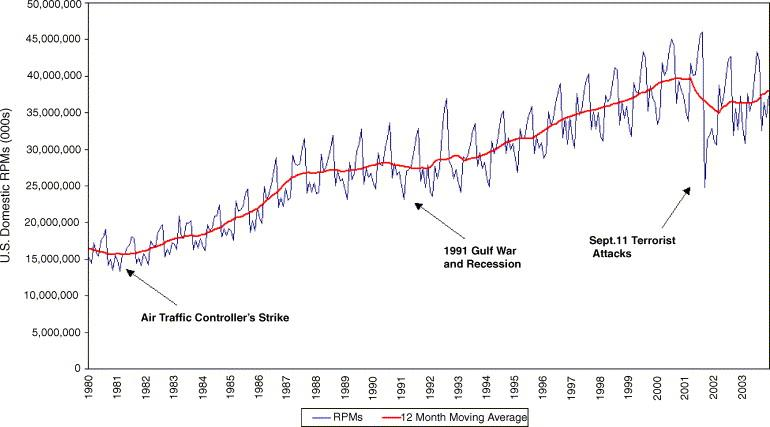

## Table of Contents

## What is terrorism and how is it defined in the context of aviation?

Terrorism is when people use violence or threats to scare others and try to achieve political, religious, or ideological goals. It's a way to create fear and make people feel unsafe. Terrorists often target places where many people gather, like public transport or big events, to cause as much harm and panic as possible.

In the context of aviation, terrorism is when someone tries to harm or scare people by attacking airplanes, airports, or other parts of the air travel system. This can include hijacking planes, planting bombs, or attacking airport buildings. Because air travel is so important and many people use it, these attacks can cause a lot of fear and disrupt travel around the world. Airports and airlines have special security measures to try to stop these attacks and keep people safe.

## How has terrorism directly affected airline operations and safety?

Terrorism has had a big impact on how airlines operate and keep people safe. After attacks like the ones on September 11, 2001, airlines had to change a lot of their rules and security measures. Now, passengers have to go through more checks before they can board a plane. This includes things like taking off shoes, limiting liquids, and going through body scanners. These changes make flying take longer and cost more, but they are meant to stop bad people from bringing dangerous things onto planes.

The fear of terrorism also makes airlines and airports spend a lot of money on security. They hire more security guards, use better technology to check bags, and train their staff to spot anything suspicious. All of these things help make flying safer, but they also mean that tickets can be more expensive. Despite these efforts, the threat of terrorism is always there, so airlines have to keep finding new ways to stay one step ahead and protect their passengers.

## What are some historical examples of terrorist attacks on airlines?

One of the earliest and most famous terrorist attacks on an airplane happened in 1968. It was called the hijacking of El Al Flight 426. Some people took over the plane and forced it to fly to Algeria. They wanted to use the plane and the passengers to make political demands. This attack showed the world how vulnerable airplanes could be and started a lot of changes in how airlines protect their flights.

Another big attack was in 1988, when Pan Am Flight 103 exploded over Lockerbie, Scotland. A bomb hidden in a suitcase went off while the plane was in the air, killing everyone on board and some people on the ground. This attack made countries around the world work together more to stop terrorism. It also led to new rules about checking luggage and making sure no one can sneak bombs onto planes.

The most well-known terrorist attack on airlines happened on September 11, 2001. On that day, terrorists hijacked four planes in the United States. They crashed two of the planes into the World Trade Center in New York City, one into the Pentagon in Washington, D.C., and the fourth crashed in a field in Pennsylvania after passengers tried to fight back. This attack changed the way people think about flying and led to a lot of new security measures at airports all over the world.

## How do airlines respond to terrorist threats and what security measures are implemented?

Airlines respond to terrorist threats by making their security much stronger. They work with governments and security experts to find out what the risks are and how to stop them. This means they check passengers and their bags more carefully before they get on the plane. They use machines like X-ray scanners to look inside bags and metal detectors to find anything dangerous. They also have rules about what people can bring on the plane, like limiting the size of liquids and not allowing sharp objects.

Airlines also train their staff to spot anything that looks suspicious. This includes flight attendants, pilots, and people who work at the airport. They learn how to stay calm and follow special plans if something bad happens. Airports have security cameras everywhere and sometimes use dogs to sniff out bombs or drugs. All of these things help make flying safer and keep terrorists from hurting people.

Even with all these measures, airlines know they have to keep improving their security. They use new technology and learn from past attacks to make their plans better. This way, they can keep up with new threats and make sure passengers feel safe when they fly.

## What is the economic impact of terrorism on the airline industry?

Terrorism has a big economic impact on the airline industry. When there is a terrorist attack, people get scared and might not want to fly. This means fewer people buy tickets, and airlines lose money. After the September 11 attacks, for example, many people stopped flying for a while, and airlines had to lower their prices to get people back. This made it hard for airlines to make money and some even went out of business.

Airlines also have to spend a lot of money on security to stop terrorist attacks. They need to buy new machines to check bags, hire more security guards, and train their staff. All of these things cost a lot of money, and airlines have to pay for them. This makes the price of tickets go up, which can make people fly less. So, even though these security measures are important to keep people safe, they also make it harder for airlines to make money.

## How does terrorism influence passenger behavior and airline demand?

When there is a terrorist attack on an airplane, it scares a lot of people. They might think that flying is not safe anymore. Because of this fear, fewer people want to fly. This is called a drop in demand. After the September 11 attacks, many people chose not to fly for a while. They drove or took trains instead. This made airlines lose a lot of money because they had fewer passengers.

Airlines try to make people feel safe again by adding more security. They check bags and passengers more carefully. But all these extra checks take more time and can make flying less fun. Some people might still be scared to fly, even with the new security. This can make them choose other ways to travel, like driving or taking a train. So, terrorism not only scares people but also changes how they decide to travel.

## What are the psychological effects on passengers and airline staff due to terrorism?

When there is a terrorist attack on an airplane, it can make passengers and airline staff feel very scared and worried. Passengers might be afraid to fly again because they think it's not safe. They might feel nervous every time they get on a plane, even if they know there are new security measures in place. This fear can make them feel stressed and anxious, and some might choose not to fly at all. For airline staff, like flight attendants and pilots, the fear of another attack can make their job feel dangerous. They might worry about their own safety and the safety of the passengers they are responsible for. This can lead to stress and sometimes even make them think about quitting their jobs.

Airlines try to help by giving passengers and staff more information about security and training them on what to do in an emergency. But even with this help, the fear of terrorism can stay with people for a long time. It can change how they feel about flying and make them always a little bit on edge when they are at the airport or on a plane. This ongoing worry can affect their mental health and make them feel less happy and more stressed in their daily lives.

## How do international regulations and policies change in response to airline terrorism?

After a terrorist attack on an airplane, countries around the world often change their rules and laws to make flying safer. They work together to make new rules about checking passengers and their bags. For example, after the September 11 attacks, many countries started to check bags more carefully and added more security at airports. They also made new laws about what people can bring on planes, like limiting the size of liquids. These changes are meant to stop bad people from getting dangerous things onto planes.

Countries also share information with each other to stop terrorism. They talk about who might be planning attacks and what they can do to stop them. This teamwork helps them stay one step ahead of terrorists. Governments also spend more money on security to make sure airports and airplanes are safe. All of these changes can make flying take longer and cost more, but they are important to keep people safe.

## What role do technology and intelligence play in preventing terrorist acts on airlines?

Technology and intelligence are very important in stopping terrorist attacks on airplanes. Airports use machines like X-ray scanners to look inside bags and find anything dangerous. They also use metal detectors and body scanners to check passengers. These machines help security guards see if someone is trying to bring a bomb or a weapon onto a plane. Airports also use cameras everywhere to watch what is happening and catch anything suspicious. Technology keeps getting better, so airports can use new tools to stay ahead of terrorists and keep people safe.

Intelligence is also key in stopping terrorist attacks. Governments and security agencies share information about who might be planning to hurt people. They look at things like phone calls, emails, and social media to find out what terrorists are planning. If they find out about an attack before it happens, they can stop it. This means working together with other countries to share information and make plans to keep airplanes safe. By using both technology and intelligence, airlines can do a better job of protecting passengers and stopping terrorists.

## How do airlines balance security enhancements with passenger experience and privacy concerns?

Airlines have to find a good balance between making flights safe and keeping passengers happy. They do this by using new technology and training their staff to check passengers and bags without making the process too slow or annoying. For example, they use machines that can quickly scan bags and people without making them take off too many clothes or unpack everything. This helps keep the lines moving and makes flying less stressful. Airlines also try to make the security process feel friendly and helpful, so passengers don't feel like they are being treated like criminals.

At the same time, airlines have to think about privacy. People don't like it when their personal information is shared or when they feel like they are being watched too closely. To deal with this, airlines use technology that can check for dangerous things without looking at private details. They also make sure that the information they collect is kept safe and only used to stop bad things from happening. By being careful about privacy, airlines can make passengers feel safe and respected at the same time.

## What are the long-term strategic changes airlines make in response to ongoing terrorism threats?

Airlines make big changes to their plans to keep flying safe when there are always threats of terrorism. They spend a lot of money on new machines and ways to check passengers and bags. They work with governments and security experts to find out what the risks are and how to stop them. This means they have to keep learning and changing their plans to be ready for new kinds of attacks. They also train their staff a lot so everyone knows what to do if something bad happens. All of these changes help make flying safer, but they also make it more expensive and take more time.

Airlines also try to keep passengers happy even with all the new security. They use technology that can check for dangerous things quickly so people don't have to wait too long. They also make sure that the security process feels friendly and not too strict. This helps passengers feel less stressed and more comfortable when they fly. At the same time, airlines have to be careful about privacy. They use machines that can check for bad things without looking at personal information. By doing all of these things, airlines can keep flying safe and make sure people still want to travel by plane.

## How can the airline industry collaborate globally to mitigate the impact of terrorism?

The airline industry can work together with other countries to stop terrorism by sharing information and making plans together. They can talk about who might be planning attacks and what they can do to stop them. By working together, they can learn from each other and use the best ideas to keep airplanes safe. Governments and security agencies can share what they know about possible terrorists and their plans. This teamwork helps them stay ahead of bad people and keep passengers safe.

Airlines can also make rules that are the same all over the world. This means that no matter where you fly, the security checks will be similar. This makes it harder for terrorists to find weak spots. Airlines can spend money on new technology that can check bags and people quickly and safely. They can also train their staff to know what to do if something bad happens. By working together and using the same rules and technology, the airline industry can make flying safer for everyone.

## References & Further Reading

[1]: Blalock, G., Kadiyali, V., & Simon, D. H. (2009). ["The Impact of Post‐9/11 Airport Security Measures on the Demand for Air Travel."](https://www.jstor.org/stable/10.1086/519816) The Journal of Law and Economics, 52(4), 801-823.

[2]: Drakos, K. (2004). ["Terrorism-induced structural shifts in financial risk: airline stocks in the aftermath of the September 11th terror attacks."](https://www.sciencedirect.com/science/article/pii/S0176268003001071) European Journal of Political Economy, 20(2), 435-446.

[3]: Chesney, M., Reshetar, G., & Karaman, M. (2011). ["The impact of terrorism on financial markets: An empirical study."](https://www.sciencedirect.com/science/article/pii/S037842661000292X) Journal of Banking & Finance, 35(2), 253-267.

[4]: Glaeser, E. L., & Shapiro, J. M. (2002). ["Cities and Warfare: The Impact of Terrorism on Urban Form."](https://www.sciencedirect.com/science/article/pii/S0094119001922624) Journal of Urban Economics, 51(2), 205-224.

[5]: Lopez, A. (2016). ["Algorithmic Trading: Winning Strategies and Their Rationale"](https://www.wiley.com/en-us/Algorithmic+Trading%3A+Winning+Strategies+and+Their+Rationale-p-9781118460146) by Ernie Chan

[6]: Transportation Security Administration. ["Advanced Imaging Technology."](https://www.dhs.gov/sites/default/files/publications/tsa_-_use_of_advanced_imaging_technology_at_checkpoints.pdf) 

[7]: International Civil Aviation Organization. ["Security Standards."](https://www.icao.int/security/sfp/pages/annex17.aspx)