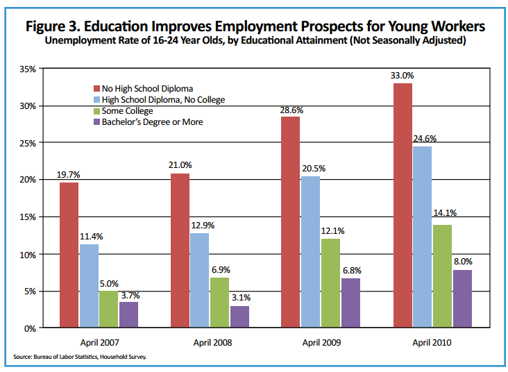

## Table of Contents

## What is a financial crisis?

A financial crisis is when problems in the money and banking system become very big and cause a lot of trouble for the economy. It can happen when banks and other financial institutions start to fail, or when people lose trust in them. This can lead to a situation where it's hard for people and businesses to borrow money, and the value of things like houses and stocks can go down a lot.

When a financial crisis happens, it can affect everyone. People might lose their jobs, and businesses might have to close. Governments often step in to try to fix the problems, but it can take a long time for things to get better. A big example of a financial crisis was the one that started in 2007, which led to a global economic downturn known as the Great Recession.

## When did the financial crisis that impacted Millennials occur?

The financial crisis that impacted Millennials happened in 2007 and got worse in 2008. It started in the United States but affected the whole world. This crisis was called the Global Financial Crisis or the 2008 Financial Crisis. It began because of problems with housing loans, which led to many banks failing and people losing their homes.

Millennials, who were young adults or teenagers at the time, felt the effects of this crisis in many ways. Many of them had a hard time finding jobs because businesses were struggling. Some Millennials also saw their parents lose jobs or homes, which made life harder for their families. The crisis made it tougher for Millennials to start their careers, buy homes, or save money, and its effects lasted for many years.

## Who are considered Millennials?

Millennials are people born between the early 1980s and the late 1990s. Different people might say the exact years are a bit different, but most agree it's around those times. This means that if you were born in 1981, you're a Millennial, and if you were born in 1996, you're also a Millennial.

Millennials grew up during a time when technology was becoming a big part of everyday life. They were the first generation to grow up with the internet, cell phones, and social media. Because of this, they are often called the "digital natives." They also experienced big events like the 2008 financial crisis when they were young adults or teenagers, which affected their lives in many ways.

## How did the financial crisis affect the job market for Millennials?

The financial crisis made it hard for Millennials to find jobs. When the crisis hit in 2007 and 2008, many businesses were struggling and had to cut jobs. This meant there were fewer jobs available for young people who were just starting their careers. Millennials who were graduating from college or high school found it tough to get their first job. Some had to take jobs that didn't match their skills or education, which is called underemployment.

Even after the crisis started to get better, the job market stayed tough for Millennials. It took a long time for the economy to recover, so many Millennials had to wait longer to find good jobs. This delay affected their whole careers because starting out with lower pay or in a job that wasn't a good fit can make it harder to move up later. The crisis also made Millennials more cautious about their careers and money, changing how they thought about work and their future.

## What were the effects of the financial crisis on Millennial housing and homeownership?

The financial crisis made it harder for Millennials to buy homes. During the crisis, many people lost their homes because they couldn't pay their mortgages. This made banks more careful about giving out loans, so it was harder for Millennials to get a mortgage. Even when they could get a loan, the prices of homes were high, and many Millennials were starting their careers with lower-paying jobs, so saving for a down payment was tough.

The crisis also changed how Millennials thought about homeownership. Many saw their parents or others struggle with their homes during the crisis, so they were more cautious about buying a house. Instead of buying, many Millennials chose to rent or live with family to save money. This shift in thinking, along with the economic challenges, meant that fewer Millennials owned homes compared to older generations at the same age.

## How did the financial crisis influence Millennial student debt?

The financial crisis made student debt a bigger problem for Millennials. When the crisis hit, many young people were in college or thinking about going to college. Because it was hard to find jobs, going to college seemed like a good way to improve their chances of getting a good job later. But with the economy struggling, many families had less money to help pay for college. This meant more Millennials had to take out student loans to cover the costs. As a result, the amount of student debt for Millennials grew a lot during and after the crisis.

The job market after the crisis also made it harder for Millennials to pay off their student loans. Many Millennials started their careers with lower-paying jobs or jobs that didn't match their education, which made it tough to pay back their loans. The high cost of living and the struggle to save money added to the challenge. So, the financial crisis not only increased the amount of student debt Millennials had but also made it harder for them to pay it off, affecting their financial lives for many years.

## What impact did the financial crisis have on Millennial retirement savings?

The financial crisis made it harder for Millennials to save for retirement. When the crisis happened, many Millennials were just starting their careers or still in school. They had a tough time finding good jobs, so they started with lower pay. This made it hard to save money, including for retirement. Also, many companies cut back on retirement benefits like 401(k) matches because they were struggling too. So, Millennials had less money to put into their retirement accounts.

The crisis also made Millennials more cautious about their money. They saw how the stock market crashed and how people lost a lot of their savings. This made them worried about investing in the stock market for their retirement. Instead of putting money into retirement accounts, some Millennials chose to save money in safer places, like savings accounts, even though these don't grow as much over time. This cautious approach, along with the economic challenges, meant that many Millennials fell behind on their retirement savings compared to older generations at the same age.

## How did the financial crisis affect the overall wealth accumulation of Millennials?

The financial crisis made it really hard for Millennials to build up their wealth. When the crisis hit, many Millennials were just starting out in their careers or still in school. It was tough to find good jobs, so they often had to take lower-paying jobs or jobs that didn't match their skills. This meant they had less money to save or invest. Also, many Millennials had to take out student loans to go to college because their families couldn't help as much. These loans made it even harder to save money because they had to pay them back.

The crisis also made Millennials more careful with their money. They saw how the stock market crashed and how people lost a lot of their savings. This made them worried about investing, so they often chose to keep their money in safer places like savings accounts, which don't grow as much over time. Because of all these things, Millennials had a harder time building wealth compared to older generations at the same age. It took them longer to buy homes, save for retirement, and feel financially secure.

## What were the psychological impacts of the financial crisis on Millennials?

The financial crisis made many Millennials feel stressed and worried about money. When they were starting out in their careers or still in school, it was hard to find good jobs. This made them feel unsure about their future and worried about how they would pay their bills or student loans. Seeing their parents or other adults struggle with losing jobs or homes added to their stress. This feeling of uncertainty and fear about money lasted for a long time, even after the crisis was over.

Because of the crisis, many Millennials became more cautious and careful with their money. They saw how quickly things could go wrong and how people lost a lot of their savings. This made them less likely to take risks with their money, like investing in the stock market. Instead, they often chose to save money in safer ways, even if it meant their money wouldn't grow as much. This cautious approach affected how they thought about their careers, buying homes, and planning for the future, making them feel less secure and more worried about what might happen next.

## How did government policies post-financial crisis aim to help Millennials?

After the financial crisis, the government made some new rules and programs to help people, including Millennials. One big thing they did was pass the Dodd-Frank Act in 2010. This law was made to make banks safer and stop another big crisis from happening. It also made rules about student loans easier to understand, which helped Millennials who were dealing with a lot of debt from school. The government also started programs to help people keep their homes and avoid losing them to banks, which was important for Millennials who wanted to buy homes but found it hard because of the crisis.

Another way the government tried to help was by creating jobs and making the economy better. They did this through things like the American Recovery and Reinvestment Act, which put money into building roads, schools, and other projects. This helped create jobs that Millennials could take, even if they were not the best jobs. The government also made changes to health care with the Affordable Care Act, which let more young people stay on their parents' health insurance until they were 26. This helped Millennials save money and feel more secure, even if they were struggling to find good jobs or pay off their student loans.

## What long-term economic trends have emerged for Millennials as a result of the financial crisis?

The financial crisis changed a lot of things for Millennials in the long run. One big change is that it's been harder for them to build up their wealth. When the crisis happened, many Millennials were just starting their careers or still in school. It was tough to find good jobs, so they often had to take lower-paying jobs or jobs that didn't match their skills. This meant they had less money to save or invest. Also, many Millennials had to take out student loans to go to college because their families couldn't help as much. These loans made it even harder to save money because they had to pay them back. Because of all these things, Millennials have had a harder time building wealth compared to older generations at the same age.

Another long-term trend is that Millennials have been more cautious with their money. They saw how the stock market crashed and how people lost a lot of their savings during the crisis. This made them worried about investing, so they often chose to keep their money in safer places like savings accounts, which don't grow as much over time. This cautious approach has affected how they think about their careers, buying homes, and planning for the future. It's taken them longer to buy homes, save for retirement, and feel financially secure. Overall, the financial crisis has made Millennials more careful and less likely to take risks with their money, which has shaped their economic lives in big ways.

## How have Millennials' financial behaviors and attitudes towards money changed due to the financial crisis?

The financial crisis made Millennials a lot more careful with their money. When the crisis happened, many Millennials were young and just starting out. They saw how quickly things could go wrong, with people losing jobs and homes. This made them scared of taking risks with their money. Instead of investing in things like the stock market, they often chose to save their money in safer places like bank accounts. They also started to think more about saving for the future and being prepared for emergencies, rather than spending money on things they wanted right away.

Because of the crisis, Millennials also changed how they think about big decisions like buying a house. Many saw their parents or other adults struggle to keep their homes, so they became more cautious about taking on big debts like mortgages. Instead of buying homes, many Millennials chose to rent or live with family to save money. This shift in thinking, along with the economic challenges, meant that fewer Millennials owned homes compared to older generations at the same age. Overall, the financial crisis made Millennials more focused on saving and being financially secure, rather than taking risks or spending freely.

## References & Further Reading

[1]: Shumsky, T. (2020). "Millennials and Investing: How a Generation's Investment Habits are Shaped by Past Financial Crises." *Journal of Economic Psychology*. 

[2]: Fry, R. (2022). "Millennials Lag in Homeownership, Reflecting Financial Strains." *Pew Research Center*. Retrieved from https://www.pewresearch.org/

[3]: Federal Reserve. "Economic Well-Being of U.S. Households in 2020". Retrieved from https://www.federalreserve.gov/

[4]: U.S. Census Bureau. (2023). "Current Homeownership Rates by Age and Generational Cohorts." *Housing Reports*.

[5]: Marcos Lopez de Prado. ["Advances in Financial Machine Learning"](https://www.amazon.com/Advances-Financial-Machine-Learning-Marcos/dp/1119482089) 

[6]: David Aronson. ["Evidence-Based Technical Analysis: Applying the Scientific Method and Statistical Inference to Trading Signals"](https://www.amazon.com/Evidence-Based-Technical-Analysis-Scientific-Statistical/dp/0470008741)