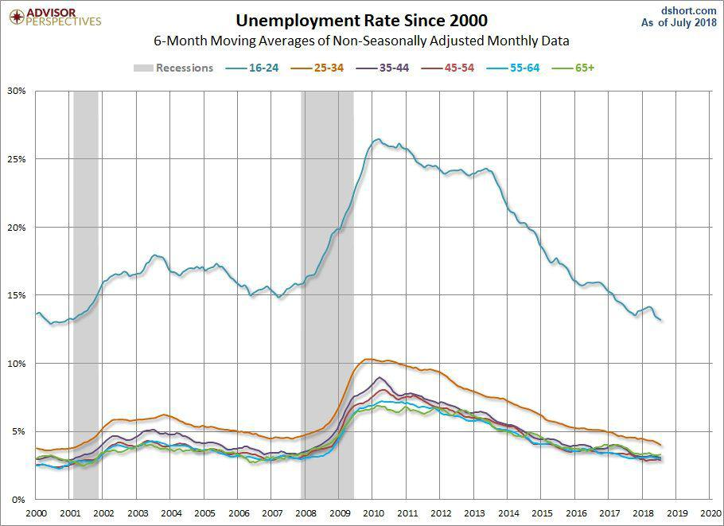

The financial landscape has undergone profound changes over recent decades, significantly influenced by both major economic crises and rapid technological progression. At the forefront of these changes is the 2008 financial crisis, commonly referred to as the Great Recession, which left an indelible mark on the global economy and particularly on the millennial generation. This generation entered the workforce at a time characterized by widespread unemployment and economic instability, challenges that continue to inform their financial behavior today.

Millennials, defined by their unique socioeconomic experiences, have had to navigate a job market and economic environment that was profoundly destabilized by the Great Recession. This resulted in long-term effects on their approach to saving, investing, and consumption. Additionally, the burden of increased financial debt, notably from student loans, and the subsequent economic disruptions—such as those caused by the COVID-19 pandemic—have compounded these challenges, shaping millennial financial trends and priorities. 

In tandem with these economic developments, we are witnessing a transformative technological shift within financial markets. Algorithmic trading, which involves the use of automated systems and complex algorithms to execute large orders at high speed, has become increasingly prominent. This technologically driven approach to trading offers significant efficiencies and opportunities but also introduces new risks that could impact economic stability. The rapid adoption of algorithmic and AI-powered trading technologies poses potential threats, such as market manipulation and reduced price transparency, necessitating fresh regulatory considerations.

By examining the intersection between these economic developments and technological advancements, particularly how they influence millennials, we gain insight into the evolution of financial markets. This article seeks to explore the interconnected effects of economic crises and technological shifts, especially how each continues to reshape the financial landscape, impacting the present and future economic behaviors and opportunities for millennials.

## Table of Contents

## Economic Impact on Millennials Post-Financial Crisis

The 2008 financial crisis, referred to as the Great Recession, played a pivotal role in reshaping the economic lives of millennials. This demographic cohort, typically identified as individuals born between 1981 and 1996, was unique in that many entered the workforce during a period characterized by soaring unemployment rates. As companies downscaled or froze hiring during this economic downturn, millennials struggled to secure stable employment opportunities. This initial setback in their career trajectories has had enduring repercussions, influencing both their economic outlook and personal financial behaviors.

One of the significant financial burdens for millennials has been the accumulation of debt, particularly from student loans. Graduating during a recession compounded their financial burden, as the limited availability of well-paying jobs forced many to either defer or default on their loan repayments. The Federal Reserve reported that by the end of 2020, millennials held an average student loan debt of approximately $38,877[^1^]. This substantial debt influenced their savings habits, risk tolerance, and investment behavior, effectively limiting their ability to comfortably allocate financial resources towards savings or investment vehicles that could ensure long-term financial stability.

The ramifications of the 2008 crisis were further augmented by subsequent economic disruptions, particularly the COVID-19 pandemic. This event unearthed new challenges as it brought unparalleled economic uncertainty, leading to job losses and reduced incomes across various sectors. According to Pew Research, during the early months of the pandemic, around 50% of millennials reported a reduction in household income, compared to 41% of older generations[^2^]. Such financial disruptions intensified the existing insecurities and influenced millennials' attitudes toward consumption, savings, and investment. Unlike previous generations, millennials exhibit an increased propensity for savings, with some choosing to invest in liquid assets rather than in pensions or stocks, reflecting a shift towards financial prudence driven by past economic turmoil.

Moreover, generational trends in savings and investments demonstrate an adjustment to these financial insecurities. With less disposable income and a more cautious approach to risk, millennials tend to invest in low-risk assets or maintain higher cash reserves as a financial safety net. This shift is also evident in spending patterns, where millennials are less likely to partake in large-scale consumer spending compared to previous generations at similar life stages, preferring instead to allocate resources towards debt repayment and emergency funds.

[^1^]: Federal Reserve. "Economic Well-Being of U.S. Households in 2020". Retrieved from https://www.federalreserve.gov/.
[^2^]: Pew Research Center. "Economic Fallout From COVID-19 Continues to Hit Lower-Income Americans the Hardest". Retrieved from https://www.pewresearch.org/.

## Millennials' Approach to Investing and Homeownership

Millennials, defined as those born between 1981 and 1996, have developed a unique approach to investing and homeownership, shaped largely by the economic conditions they have experienced throughout their lives. The 2008 financial crisis significantly influenced this generation's financial strategies and continues to have lasting impacts.

Initially, millennials exhibited a cautious approach to investing. This tendency stems from witnessing the [volatility](/wiki/volatility-trading-strategies) and uncertainties triggered by the Great Recession during their formative years. As a consequence, their investment strategies often prioritize stability and risk-aversion. Studies have shown that millennials are more likely to invest in conservative assets such as bonds or stable value funds, compared to the more aggressive stock market investments favored by previous generations [1].

The delay in entering the homeownership market is another characteristic financial behavior of millennials. The financial insecurity and substantial student loan debts that many millennials faced after entering the workforce led to postponed life milestones, including purchasing homes. According to data, homeownership among millennials lagged compared to Gen X and Baby Boomers at similar ages [2]. However, recent years have seen a gradual increase in millennial homebuying, spurred by improved economic conditions and changing priorities. Factors such as historically low mortgage rates and the appeal of suburban and rural homes, accentuated by the COVID-19 pandemic, have encouraged millennials to buy homes [3].

Moreover, the trends in home buying among millennials reflect a broader shift in financial priorities. An increasing preference for smaller, more affordable homes and a tendency to prioritize sustainability and energy efficiency highlight the ongoing influence of economic crises. These choices showcase a generation that values long-term financial stability and adaptability over traditional aspirations.

The approach of millennials to investing and homeownership exemplifies a cautious recalibration of financial goals, shaped by the economic challenges of their youth and the continuing evolution of the financial landscape.

[1] Shumsky, T. (2020). Millennials and Investing: How a Generation's Investment Habits are Shaped by Past Financial Crises. *Journal of Economic Psychology*.

[2] Fry, R. (2022). Millennials Lag in Homeownership, Reflecting Financial Strains. *Pew Research Center*.

[3] U.S. Census Bureau. (2023). Current Homeownership Rates by Age and Generational Cohorts. *Housing Reports*.

## The Rise of Algorithmic Trading

Algorithmic trading, commonly referred to as 'algo trading,' has transformed financial markets by deploying automated computational systems to execute trades at remarkable speeds and volumes. The adoption of these systems has revolutionized the trading landscape, offering potential improvements in market efficiency by reducing transaction costs and enhancing [liquidity](/wiki/liquidity-risk-premium). Simultaneously, it introduces significant risks, making the financial ecosystem more complex.

The fundamental mechanism of [algorithmic trading](/wiki/algorithmic-trading) involves creating algorithms that take inputs from various market parameters to make decisions about buying or selling financial instruments. These decisions are executed automatically without the need for human intervention, significantly increasing the speed and [volume](/wiki/volume-trading-strategy) of trade execution. The efficiency gained through this automation allows traders to exploit small price discrepancies in the market that exist only for brief periods.

Advancements in technology have facilitated the integration of [artificial intelligence](/wiki/ai-artificial-intelligence) (AI) into algorithmic trading systems. AI-powered trading solutions apply [machine learning](/wiki/machine-learning) algorithms to analyze vast datasets at unprecedented speeds, discovering patterns and predicting market trends with incredible precision. Consequently, these systems are capable of adjusting trading strategies on the fly, improving adaptability to changing market conditions.

Despite these advantages, the integration of AI in trading systems brings about considerable challenges, primarily concerning regulatory oversight and market integrity. The capacity of AI to analyze and react to market data faster than any human potentially leads to risks such as market manipulation and unintentional collusion. These phenomena occur when trading algorithms interact, possibly resulting in large, rapid market swings without explicit coordination among traders.

In response to these challenges, there is an ongoing debate over the establishment of new regulatory frameworks tailored to address the unique risks posed by algorithmic trading. Existing regulations, like the Markets in Financial Instruments Directive (MiFID II) in the European Union, have started to address some issues by imposing stricter requirements on trading transparency and algorithm testing. However, as algorithmic trading strategies continue to evolve, regulators face the task of continuously updating these frameworks to ensure they effectively mitigate emerging risks.

The necessity for a balanced approach that embraces technological advancements while safeguarding market integrity is increasingly recognized. This involves ensuring robust systems are in place to monitor algorithmic trading activities and prevent market abuses, promoting both innovation and stability within financial markets. As technological capabilities expand, the critical examination and adaptation of regulatory measures will play a vital role in managing the dual impacts of increased efficiency and potential threats arising from algorithmic trading.

## Potential Threats and Opportunities of Algorithmic Trading

Algorithmic trading, characterized by high-speed and high-volume trade execution using automated computational systems, has fundamentally shifted the dynamics of financial markets. While these advancements contribute to enhanced market efficiency and liquidity, they also introduce significant concerns and challenges. 

One of the primary benefits of algorithmic trading is its potential to improve market liquidity. By allowing trades to be executed rapidly, liquidity providers can respond to market demands with increased precision, which in turn helps narrow bid-ask spreads and reduce transaction costs for all participants. The swift processing capabilities of algorithmic systems facilitate the absorption of large volumes of trade, ideally leading to more stable markets.

Despite these advantages, algorithmic trading carries inherent risks that could undermine market stability. One such risk is unintentional collusion, where similar trading algorithms might independently arrive at comparable trading decisions based on market signals, thereby creating market behaviors akin to coordinated actions without explicit intent. This scenario could lead to unexpected market volatility and reduce price transparency, as the concentration of similar trades obscures the true value of assets.

Moreover, the integration of AI in trading strategies has heightened concerns regarding market fairness. AI algorithms, capable of processing vast data sets and identifying obscure patterns, may inadvertently disrupt price formation. This disruption occurs when trades are executed at prices that do not reflect the underlying asset value due to the algorithmic strategies optimizing for specific, non-market signals. Such scenarios challenge the equitable operation of financial markets, raising concerns about the erosion of investor confidence.

The potential for these risks necessitates ongoing debate and analysis, particularly concerning the regulatory landscape. There is a growing emphasis on establishing frameworks that can adapt to rapid technological changes while safeguarding economic integrity. Regulatory bodies face the challenge of ensuring that technological benefits do not compromise market stability. Continuous monitoring and adjustment of these frameworks are essential to maintaining a balance between innovation and the principles of fair trading.

In summary, while algorithmic trading offers notable opportunities for the financial sector, its risks demand careful consideration. The evolution of trading technologies must be accompanied by vigilant regulatory oversight to foster markets that are as robust as they are efficient.

## Conclusion

The economic challenges encountered by millennials following the 2008 financial crisis are closely intertwined with the rapid evolution of financial markets driven by technological progress, particularly in algorithmic trading. This intertwining creates a complex landscape where the susceptibilities and economic experiences of millennials are both challenged and potentially ameliorated by technological advancements.

To effectively navigate this landscape, it's essential to comprehend the dual impact of economic crises and algorithmic trading on this generation. Economic crises have left millennials with a legacy of financial instability, influencing their approaches to savings, investments, and spending. Consequently, many millennials, affected by early career disruptions, now exhibit heightened financial prudence. This cautious approach is evident in their investment strategies, often characterized by a preference for steady returns over high-risk opportunities. In contrast, algorithmic trading introduces both unprecedented opportunities and challenges into the financial ecosystem. It offers potential advantages in market efficiency and liquidity but simultaneously raises concerns about fairness and market stability, as high-speed trading could exacerbate market volatility.

As algorithmic trading continues to evolve, collaboration among policymakers, financial institutions, and individual investors becomes pivotal. Ensuring that financial systems remain robust, transparent, and equitable will require the formulation of regulatory frameworks that address the potential risks associated with high-frequency trading algorithms. Policymakers must be vigilant in understanding how algorithmic trading can inadvertently impact market dynamics and economic stability, thereby addressing these challenges proactively.

Furthermore, financial institutions are tasked with balancing the benefits of technological innovation with the ethical responsibility of maintaining market fairness and transparency. For individual investors, staying informed about the implications of algorithmic trading practices will be crucial in making educated decisions and aligning their financial strategies with their long-term goals.

In conclusion, the interaction between the enduring effects of financial crises and the ongoing advancement of technology in financial markets will shape the economic prospects of millennials. A coordinated effort to embrace technological benefits while mitigating associated risks will play a crucial role in fostering resilient and equitable financial systems for future generations.

## References & Further Reading

[1]: Shumsky, T. (2020). "Millennials and Investing: How a Generation's Investment Habits are Shaped by Past Financial Crises." *Journal of Economic Psychology*. 

[2]: Fry, R. (2022). "Millennials Lag in Homeownership, Reflecting Financial Strains." *Pew Research Center*. Retrieved from https://www.pewresearch.org/

[3]: Federal Reserve. "Economic Well-Being of U.S. Households in 2020". Retrieved from https://www.federalreserve.gov/

[4]: U.S. Census Bureau. (2023). "Current Homeownership Rates by Age and Generational Cohorts." *Housing Reports*.

[5]: Marcos Lopez de Prado. ["Advances in Financial Machine Learning"](https://www.amazon.com/Advances-Financial-Machine-Learning-Marcos/dp/1119482089) 

[6]: David Aronson. ["Evidence-Based Technical Analysis: Applying the Scientific Method and Statistical Inference to Trading Signals"](https://www.amazon.com/Evidence-Based-Technical-Analysis-Scientific-Statistical/dp/0470008741)