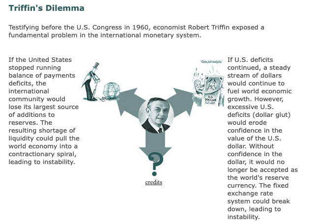

## Table of Contents

## What is the Triffin Dilemma?

The Triffin Dilemma is a problem in international finance named after the economist Robert Triffin. It explains a challenge faced by countries that have their currency used as the global reserve currency, like the United States with the dollar. The dilemma is that the country needs to run a trade deficit to provide the world with enough of its currency, but this can lead to too much debt and weaken its own economy.

When a country's currency is used as the global reserve, other countries hold it to use in international trade. To meet this demand, the country must supply more currency than it needs for its own economy. This means it has to borrow more from other countries, leading to a growing debt. Over time, this can make people lose trust in the currency, causing economic problems both at home and around the world.

## Who was Robert Triffin and why is the dilemma named after him?

Robert Triffin was an economist born in Belgium in 1911. He studied and worked in different countries, including the United States, where he became a professor at Yale University. Triffin was very interested in how money works between countries, especially how the U.S. dollar was used around the world.

The dilemma is named after him because he was the first to point out a big problem with the U.S. dollar being the world's reserve currency. In the 1960s, Triffin explained that for the U.S. to keep supplying dollars to the world, it had to keep borrowing more and more. This could lead to too much debt and make the dollar less trusted. People started calling this problem the Triffin Dilemma because he was the one who first described it.

## How does the Triffin Dilemma affect the country issuing the global reserve currency?

The Triffin Dilemma puts the country with the global reserve currency in a tough spot. When a country's money is used all over the world, like the U.S. dollar, it has to make sure there's enough of it for everyone. To do this, the country has to spend more money than it earns from other countries. This means it has to borrow more, which can lead to a lot of debt. If the debt gets too big, people might start to worry about the country's ability to pay it back.

This worry can make the value of the currency go down, which can cause problems at home and around the world. If people lose trust in the currency, it can lead to inflation, where prices go up a lot, and it can make it harder for the country to borrow money in the future. So, the country has to balance between keeping enough of its currency in the world and not letting its debt get out of control. It's a tricky situation that can affect the country's economy in big ways.

## What are the historical examples of the Triffin Dilemma in action?

One big example of the Triffin Dilemma happened with the U.S. dollar after World War II. Back then, many countries agreed to use the U.S. dollar as the world's reserve currency. This meant the U.S. had to keep printing more dollars to meet the world's demand. To do this, the U.S. started to spend more money than it was making, which led to a lot of debt. By the late 1960s, other countries started to worry about all this debt and began to think the dollar might not be as strong as they thought. This worry led to the end of the Bretton Woods system in 1971, where the U.S. stopped letting other countries exchange dollars for gold.

Another example can be seen in the early 2000s when the U.S. kept running big trade deficits to supply the world with dollars. This meant the U.S. was borrowing a lot of money from other countries, like China and Japan. As the debt grew, some people started to worry about the stability of the U.S. economy. This worry caused the value of the dollar to go up and down a lot, which made it harder for the U.S. to control its economy. Even though the dollar is still the world's reserve currency, these problems show how the Triffin Dilemma can cause trouble for the country that issues it.

## How does the Triffin Dilemma impact global trade and economic stability?

The Triffin Dilemma can make global trade and economic stability tricky. When a country's money is used as the world's reserve currency, like the U.S. dollar, it has to print a lot of it to meet everyone's needs. This can lead to a big trade deficit for that country, meaning it's spending more than it's [earning](/wiki/earning-announcement). Other countries might start to worry about this and think the currency isn't as strong as they thought. If they lose trust in the currency, they might stop using it for trade, which can mess up global trade. When trade gets messed up, it can cause problems for everyone's economy.

If the country with the reserve currency gets too much debt, it can also shake up economic stability around the world. When people start to worry about the debt, they might start selling off the currency, which can make its value go down a lot. This can lead to inflation, where prices go up a lot, and it can make it harder for the country to borrow money in the future. All of this can cause a lot of uncertainty and make it harder for businesses and countries to plan for the future. So, the Triffin Dilemma can have big effects on how stable the world's economy is.

## What role does the US dollar play in the context of the Triffin Dilemma?

The US dollar plays a big role in the Triffin Dilemma because it is the world's reserve currency. This means that other countries use the dollar to buy and sell things with each other. To keep up with this demand, the US has to print more dollars than it needs for its own country. This leads to the US spending more money than it makes, which causes a trade deficit. The US has to borrow money from other countries to make up for this deficit, which can lead to a lot of debt.

If the US keeps borrowing more and more, other countries might start to worry. They might think that the US won't be able to pay back all this debt, which can make them lose trust in the dollar. When trust in the dollar goes down, its value can go down too. This can cause problems not just for the US, but for the whole world because so many countries use the dollar for trade. So, the US has to be careful about how it manages its money to keep the global economy stable.

## Can the Triffin Dilemma lead to currency crises? If so, how?

Yes, the Triffin Dilemma can lead to currency crises. When a country's currency is the world's reserve currency, like the US dollar, it has to print a lot of money to meet everyone's needs. This can lead to the country spending more than it earns, causing a big trade deficit. To cover this deficit, the country has to borrow a lot of money from other countries. If this borrowing gets too big, other countries might start to worry that the country won't be able to pay back all this debt. This worry can make them lose trust in the currency, causing its value to drop quickly.

When the value of the currency drops a lot, it can lead to a currency crisis. People might start selling off the currency, which makes its value go down even more. This can cause prices to go up a lot, which is called inflation. It can also make it harder for the country to borrow money in the future because other countries might not want to lend to them. All of this can shake up the country's economy and even affect the whole world because so many countries use the currency for trade.

## What are the potential solutions to mitigate the effects of the Triffin Dilemma?

One way to deal with the Triffin Dilemma is for the country with the reserve currency to be careful about how much it borrows. If the US, for example, can keep its debt from getting too big, other countries might keep trusting the dollar. This means the US should try to spend less money than it makes or find other ways to get money without borrowing so much. Another idea is to use more than one currency as the world's reserve. If countries could use the euro, the yen, or the Chinese yuan along with the dollar, it might spread out the risk and make the global economy more stable.

Another solution could be to change how the world's money system works. Some people think we should go back to using gold or something else that has real value to back up money. This could stop countries from printing too much money and getting into too much debt. But changing the whole money system would be really hard and might cause a lot of problems in the short term. So, it's important for countries to work together and think carefully about how to keep the global economy stable while dealing with the Triffin Dilemma.

## How have international organizations like the IMF responded to the challenges posed by the Triffin Dilemma?

The International Monetary Fund (IMF) has been trying to help with the problems caused by the Triffin Dilemma. One way they do this is by keeping an eye on how much money countries are borrowing and making sure they don't get into too much debt. The IMF also helps countries that are in trouble by lending them money when they need it. This can stop a country's money from losing too much value and causing a big problem.

Another thing the IMF does is to encourage countries to work together and use different kinds of money for trade. This can help spread out the risk so that one country's money doesn't have to [carry](/wiki/carry-trading) all the weight. The IMF also talks about changing the world's money system to make it more stable. They suggest using something called Special Drawing Rights (SDRs), which is like a mix of different countries' money. This can help keep the global economy steady even if one country's money gets into trouble.

## What are the implications of the Triffin Dilemma for emerging market economies?

The Triffin Dilemma can make things tricky for emerging market economies. These are countries that are still growing and developing their economies. When the country with the world's reserve currency, like the US with the dollar, has to borrow a lot of money, it can make its currency less stable. If the value of the dollar goes up and down a lot, it can make it harder for emerging markets to trade and grow. They might have to pay more for things they need to buy from other countries, which can slow down their growth.

Also, if the world starts to worry about the US dollar and its debt, it can cause big problems for emerging markets. These countries often borrow money in dollars to help their economies grow. If the dollar gets weaker because of the Triffin Dilemma, it can make their debts bigger and harder to pay back. This can lead to economic trouble in these countries, making it harder for them to keep growing and improving the lives of their people.

## How might the rise of digital currencies affect the dynamics of the Triffin Dilemma?

The rise of digital currencies could change how the Triffin Dilemma works. Right now, the US dollar is the world's reserve currency, which means other countries use it to trade with each other. If digital currencies like Bitcoin or other cryptocurrencies become more popular, they might take some of the pressure off the dollar. Countries could start using these digital currencies for trade instead of just the dollar. This could help spread out the risk so that the US doesn't have to borrow as much money to keep the world's economy going.

But digital currencies also bring new challenges. They can be very unpredictable because their value can go up and down a lot. If more countries start using digital currencies, it might make the global economy even more unstable. Also, if a digital currency becomes the new reserve currency, it might face the same problems as the dollar does now. The country or group behind the digital currency would have to make sure there's enough of it for everyone without getting into too much debt. So, while digital currencies might help with the Triffin Dilemma in some ways, they could also make things more complicated.

## What are the long-term prospects for resolving the Triffin Dilemma and what would be the impact on global currencies?

In the long run, solving the Triffin Dilemma might mean changing how the world uses money. One idea is to use more than one currency as the world's reserve, like the US dollar, the euro, and the Chinese yuan. This could spread out the risk so that no single country has to borrow too much money to keep the global economy going. Another idea is to go back to using something like gold to back up money. This could stop countries from printing too much money and getting into too much debt. But changing the whole money system would be really hard and might cause a lot of problems in the short term.

If we can solve the Triffin Dilemma, it could make the global economy more stable. Countries might not have to worry as much about one currency losing value and causing big problems. This could help everyone trade more easily and grow their economies. But it's a tricky problem, and it will take a lot of work and cooperation from countries all over the world to figure out the best way to fix it. Until then, the world will have to keep dealing with the ups and downs that come with having one country's money as the world's reserve currency.

## References & Further Reading

[1]: Triffin, R. (1960). "Gold and the Dollar Crisis: The Future of Convertibility." Yale University Press.

[2]: Bernanke, B. S. (2017). "The Courage to Act: A Memoir of a Crisis and its Aftermath." W. W. Norton & Company.

[3]: King, M. (2016). "The End of Alchemy: Money, Banking, and the Future of the Global Economy." W. W. Norton & Company.

[4]: Lopez de Prado, M. (2018). ["Advances in Financial Machine Learning."](https://www.amazon.com/Advances-Financial-Machine-Learning-Marcos/dp/1119482089) Wiley.

[5]: Chan, E. P. (2009). ["Quantitative Trading: How to Build Your Own Algorithmic Trading Business."](https://github.com/ftvision/quant_trading_echan_book) Wiley.

[6]: Haldane, A. G., & Madouros, V. (2012). ["The Dog and the Frisbee."](https://www.bis.org/review/r120905a.pdf) Federal Reserve Bank of Kansas City.

[7]: Aizenman, J. (2022). ["The Triffin Dilemma: Past, Present, and Future."](https://scholar.google.com/citations?user=zJni9EUAAAAJ) National Bureau of Economic Research Working Paper Series.

[8]: Jansen, S. (2020). ["Machine Learning for Algorithmic Trading."](https://github.com/stefan-jansen/machine-learning-for-trading) Packt Publishing.

[9]: Gomber, P., Arndt, B., Lutat, M., & Uhle, T. (2011). "High-frequency trading." E-Finance Lab research paper, 2011.

[10]: Eichengreen, B. (2011). "Exorbitant Privilege: The Rise and Fall of the Dollar and the Future of the International Monetary System." Oxford University Press.