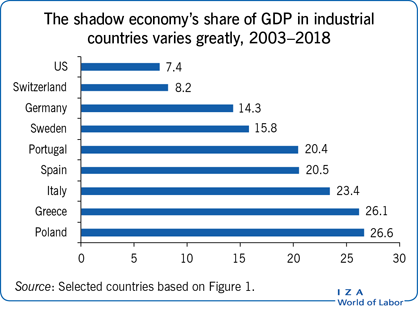

## Table of Contents

## What is the underground economy?

The underground economy refers to all the economic activities that happen without being reported to the government. This includes things like people working without paying taxes, selling goods without a license, or trading services under the table. These activities are not included in official economic statistics, which makes it hard for governments to know the true size of their economy.

People might participate in the underground economy for different reasons. Some do it to avoid taxes, while others might be trying to make extra money when they can't find a regular job. However, being part of the underground economy can be risky because it's often illegal. If caught, people could face fines or even jail time. Despite the risks, the underground economy exists in every country and can be quite large.

## How is GDP typically calculated?

GDP, or Gross Domestic Product, is the total value of all goods and services produced in a country in a year. To calculate it, economists usually use one of three main methods: the production approach, the income approach, or the expenditure approach. The most common way is the expenditure approach, which adds up all the spending in the economy. This includes what consumers spend on goods and services, what businesses spend on investments, what the government spends, and the difference between what a country exports and imports.

The production approach looks at the value added at each stage of production. This means they take the total value of goods and services and subtract the cost of intermediate goods, which are the materials used to make the final product. The income approach adds up all the income earned in the country, like wages, profits, and taxes minus subsidies. All these methods should give the same total GDP, but they might be used differently depending on what data is available and what economists want to focus on.

## What types of activities are included in the underground economy?

The underground economy includes activities that people do without telling the government. This can be things like working a job without paying taxes, selling things without a license, or doing services for cash without reporting it. People might do these things to make extra money or to avoid paying taxes. It can also include activities that are illegal, like selling drugs or stolen goods.

These activities happen all over the world, and they can be a big part of the economy. Because they are not reported, it's hard for governments to know how much money is being made in the underground economy. This can make it difficult to plan the country's budget or to understand how well the economy is doing. Even though it's risky and often illegal, many people participate in the underground economy for different reasons.

## How does the underground economy affect official GDP figures?

The underground economy can make official GDP figures lower than they really are. When people work or sell things without telling the government, this money is not counted in the GDP. GDP is supposed to be the total value of everything made and sold in a country, but if some of that is hidden, then the GDP number will be smaller than it should be.

This can be a problem because governments use GDP to make decisions about the economy. If the GDP is lower because of the underground economy, the government might think the country is doing worse than it really is. They might spend less money or make different plans based on the wrong information. So, the underground economy can make it hard for the government to understand and help the economy.

## What methods are used to estimate the size of the underground economy?

To estimate the size of the underground economy, economists use different methods. One common way is the discrepancy method. This method compares the total income reported to the government with the total spending in the economy. If spending is higher than income, it might mean that some money is coming from the underground economy. Another method is the currency demand approach, which looks at how much cash people are using. People in the underground economy often use cash to avoid being tracked, so if more cash is being used than expected, it could be a sign of underground activities.

Another approach is the survey method, where researchers ask people about their participation in the underground economy. This can give a direct estimate, but people might not always tell the truth. The electricity consumption method is also used. This method assumes that more economic activity, including underground activity, leads to higher electricity use. By comparing electricity use with official economic data, economists can estimate the size of the underground economy. Each method has its strengths and weaknesses, but together they help give a better picture of how big the underground economy might be.

## Can the underground economy contribute positively to GDP?

Yes, the underground economy can contribute positively to GDP. Even though these activities are not counted in the official numbers, they still add to the total goods and services made in a country. For example, if someone fixes cars for cash without reporting it, those car repairs are still part of the economy. They help people and businesses, even if the money is not tracked by the government.

However, it's hard to see this positive effect because the underground economy is hidden. If we could count all the money made from these activities, the GDP would be higher. This could show that the economy is doing better than the official numbers say. But because it's illegal and hard to measure, the underground economy's positive impact on GDP is not easy to see or use for making decisions.

## What are the economic implications of a large underground economy on national statistics?

A big underground economy can make national [statistics](/wiki/bayesian-statistics) look wrong. When people do work or sell things without telling the government, this money is not counted in official numbers like GDP. This means that the real size of the economy might be much bigger than what the government thinks. If the government doesn't know about all the money being made, they might think the country is poorer or doing worse than it really is. This can lead to bad decisions about how to spend money or make laws.

Having a large underground economy can also make it hard for the government to collect taxes. If a lot of people are not paying taxes because they are working in the underground economy, the government will have less money to spend on things like schools, roads, and hospitals. This can make it harder for the government to help everyone in the country. In the end, a big underground economy can make it tough for the government to plan and take care of the country's needs.

## How do different countries' underground economies impact their respective GDPs differently?

The size and impact of the underground economy on GDP can vary a lot from one country to another. In countries where the underground economy is small, the official GDP numbers are pretty close to the real economic activity. These countries usually have strong laws and good ways to keep track of money, so people are less likely to hide their earnings. For example, in places like Sweden or Denmark, the underground economy might only be a small part of the total economy, so the GDP numbers are a good reflection of what's really going on.

In other countries, the underground economy can be much bigger, which means the official GDP numbers might be way off. In places where the government is weak or where there are a lot of rules that people want to avoid, more people might work or sell things without telling the government. For example, in some countries in Latin America or Africa, the underground economy can be a big part of the total economy. This makes the official GDP numbers look smaller than they really are, and it can be hard for the government to make good decisions about how to help the country grow.

## What are the challenges in measuring the impact of the underground economy on GDP?

Measuring the impact of the underground economy on GDP is really hard because this part of the economy is hidden on purpose. People in the underground economy don't want the government to know what they're doing, so they don't report their money. This means economists can't just look at official records to see how big it is. They have to use other ways, like guessing from how much cash people use or asking people if they do things without telling the government. But these ways are not perfect, and they can give different answers, so it's tough to know for sure how much the underground economy is adding to GDP.

Another challenge is that the underground economy can be different in every country. In some places, it's small and doesn't change the GDP numbers much. But in other places, it's big and can make a big difference. This makes it hard to compare countries or to understand how the underground economy is affecting the world economy. Also, the underground economy can change over time. It might grow when the official economy is doing badly, or it might shrink when the government gets better at catching people. All these things make it tricky to measure the impact on GDP and to use that information to make good decisions.

## How do changes in tax policies influence the size of the underground economy and its impact on GDP?

Changes in tax policies can make the underground economy bigger or smaller. If a government raises taxes a lot, people might try to avoid paying by working or selling things without telling the government. This can make the underground economy grow because more people want to keep their money instead of paying more taxes. On the other hand, if taxes go down, people might not feel the need to hide their earnings as much, and the underground economy could shrink. The way taxes are set up can also matter. If taxes are very complicated or hard to understand, more people might choose to work in the underground economy to avoid dealing with them.

The size of the underground economy can change how much money is counted in the GDP. When the underground economy grows because of higher taxes, the official GDP numbers might look smaller than they really are. This is because the money made in the underground economy is not reported to the government, so it's not included in the GDP. If the underground economy shrinks because of lower taxes, more money might be reported, and the official GDP numbers could go up. But it's hard to know exactly how much the underground economy is affecting GDP because it's hidden, and economists have to guess based on other information.

## What role does technology play in the growth of the underground economy and its effect on GDP?

Technology can make the underground economy grow bigger. People can use the internet and apps to sell things or do work without telling the government. For example, someone might use a website to sell things they made at home without paying taxes. This can make the underground economy bigger because it's easier for people to hide what they're doing. Also, technology like cryptocurrencies can help people move money around without the government knowing, which can make the underground economy even bigger.

When the underground economy grows because of technology, it can make the official GDP numbers look smaller than they really are. GDP is supposed to show how much money is being made in a country, but if a lot of that money is hidden because of technology, then the GDP numbers won't be right. This can make it hard for the government to know how well the economy is doing and to make good decisions about how to help the country. So, even though technology can help the economy grow, it can also make it harder to measure that growth.

## How can governments and international organizations better account for the underground economy in GDP calculations?

Governments and international organizations can do a better job of counting the underground economy in GDP by using different methods to guess its size. One way is to look at how much cash people are using, because people in the underground economy often use cash to hide their money. Another way is to ask people if they do things without telling the government, though people might not always tell the truth. By using these methods and others, like comparing total income to total spending, governments can get a better idea of how big the underground economy is and add that to the GDP numbers.

Another thing they can do is to work together and share information. If countries share what they know about the underground economy, they can help each other make better guesses about its size. International organizations can also help by creating rules for how to count the underground economy in GDP. This way, all countries can use the same methods, which makes it easier to compare and understand the real size of economies around the world. By doing these things, governments and international organizations can make their GDP numbers more accurate and help everyone understand the true state of the economy.

## References & Further Reading

[1]: Schneider, Friedrich. (2005). ["Shadow Economies around the World: What Do We Really Know?"](https://www.sciencedirect.com/science/article/pii/S0176268004001107) International Monetary Fund.

[2]: Medina, Leandro, and Schneider, Friedrich. (2018). ["Shadow Economies Around the World: What Did We Learn Over the Last 20 Years?"](https://www.imf.org/en/Publications/WP/Issues/2018/01/25/Shadow-Economies-Around-the-World-What-Did-We-Learn-Over-the-Last-20-Years-45583) International Monetary Fund Working Paper.

[3]: Lopez de Prado, Marcos. (2018). ["Advances in Financial Machine Learning"](https://www.amazon.com/Advances-Financial-Machine-Learning-Marcos/dp/1119482089) Wiley.

[4]: Cowell, F. (1990). ["Cheating the Government: The Economics of Evasion"](https://archive.org/details/cheatinggovernme0000cowe) MIT Press.

[5]: Aronson, David. (2006). ["Evidence-Based Technical Analysis: Applying the Scientific Method and Statistical Inference to Trading Signals"](https://www.amazon.com/Evidence-Based-Technical-Analysis-Scientific-Statistical/dp/0470008741) Wiley.