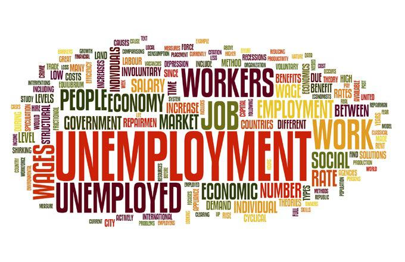

The ever-evolving landscape of the global economy is increasingly influenced by advanced technologies like algorithmic trading. This method of trading utilizes computer algorithms to automatically make trading decisions and execute trades at speeds and frequencies that are impossible for human traders. As such, algorithmic trading is transforming financial markets, leading to increased efficiencies and market liquidity. However, its proliferation also poses challenges, notably its potential impact on unemployment and economic inequality.

Unemployment rates and economic dynamics are deeply intertwined, with significant implications for society. High unemployment can erode economic stability, diminish consumer spending, and lead to broader societal issues, including increased reliance on social welfare programs and a reduction in the overall quality of life. In this context, understanding the relationship between technological advancements like algorithmic trading and unemployment is critical. Automation and technological progress can lead to job displacement, changing the structure of labor markets and altering the nature of employment.

This article explores the intersection of unemployment, economic impact, and algorithmic trading. By examining the ways in which these elements interact, we aim to illuminate their effects on modern economies. We will consider the dual role of algorithmic trading as both a driver of market efficiency and a potential contributor to economic inequality and employment challenges. Furthermore, we will discuss the need for policy interventions that address both the benefits and drawbacks of this technology, ensuring that economic growth remains inclusive and sustainable.

These intersections are shaping our world today, requiring a nuanced understanding of how technology influences economic foundations. By considering the broader implications, we can better navigate the complexities of modern economic systems and work towards solutions that balance technological progress with societal well-being.

## Table of Contents

## Understanding Unemployment and its Economic Impact

Unemployment serves as a pivotal indicator of an economy’s health, characterized by the proportion of the labor force that is jobless and actively seeking employment. As a fundamental economic measure, it directly influences both individual purchasing power and broader economic output. When unemployment rises, the immediate consequence is a reduction in consumer spending, which can stifle economic growth. This is largely because unemployed individuals have limited income, which curtails their purchasing ability.

Mathematically, the unemployment rate ($U$) is calculated as:

$$
U = \frac{\text{Number of Unemployed Persons}}{\text{Labor Force}} \times 100
$$

High unemployment rates can create a cycle of reduced demand for goods and services, leading businesses to slash production and potentially reduce their workforce further, exacerbating the issue. This reduction in consumer spending negatively impacts various sectors, contributing to slower economic expansion and influencing parameters such as Gross Domestic Product (GDP).

Beyond the economic implications, unemployment has profound psychological effects on individuals and societal well-being. Joblessness is often associated with decreased morale among both the unemployed and those still employed, due to perceived job insecurity. This stress can diminish productivity and innovation within a workforce, further detracting from economic progress. Additionally, chronic unemployment can lead to skill atrophy, making it challenging for long-term unemployed individuals to re-enter the labor market even when opportunities arise.

Understanding these dynamics encompasses recognizing that unemployment's repercussions extend far beyond individual financial hardship, manifesting in broader economic stagnation and societal distress. Consequently, addressing unemployment effectively requires not only economic interventions but also social support mechanisms to mitigate its psychological effects.

## Role of Algorithmic Trading in the Economy

Algorithmic trading, which employs high-speed computational methods to automate trading decisions, has become a pivotal element in modern financial markets. This technology leverages complex algorithms to analyze market data, execute orders, and optimize trading strategies at speeds unattainable by human traders. 

One of the primary advantages of [algorithmic trading](/wiki/algorithmic-trading) lies in its potential to enhance market efficiency. By executing trades in microseconds, algorithms can react instantaneously to market changes, ensuring that asset prices more accurately reflect available information. This efficiency can tighten bid-ask spreads and reduce transaction costs, benefiting market participants by facilitating more liquid and transparent markets.

However, the rapid execution capabilities inherent in algorithmic trading can also generate concerns about market equity and [volatility](/wiki/volatility-trading-strategies). For instance, high-frequency trading ([HFT](/wiki/high-frequency-trading-strategies)), a subset of algorithmic trading, has been criticized for potentially exacerbating short-term volatility and contributing to phenomena like "flash crashes." These are abrupt, severe market declines caused by automated trading algorithms triggering cascading sell orders. Moreover, the advantages held by firms with advanced trading infrastructure can lead to perceptions of unfairness, as they can capitalize on market movements more quickly than traditional investors.

In terms of economic influence, the rise of algorithmic trading has implications for job markets and income inequality. The automation of trading processes has diminished the demand for traditional trading roles, contributing to structural shifts in employment within the finance sector. As algorithms increasingly manage both routine and complex trades, jobs that once required human intuition are becoming obsolete, potentially leading to job displacement and necessitating workforce adaptation through reskilling and educational programs.

Moreover, algorithmic trading can influence income inequality by concentrating wealth within firms equipped to exploit these technologies effectively. As these firms achieve greater profitability through high-speed trading and advanced analytics, disparities in income distribution may widen, particularly if regulatory frameworks fail to address the monopolistic advantages afforded by algorithmic tools.

Thus, while algorithmic trading offers significant advancements in trading efficiency and market operation, it is crucial to address the economic ramifications that accompany its integration into global financial systems. This includes developing strategies that foster inclusivity in market participation and implementing regulatory measures to prevent undue market manipulation and promote equitable opportunities across the financial landscape.

## Interconnection Between Algorithmic Trading and Unemployment

The automation of financial markets through algorithmic trading has profound implications for employment, particularly affecting roles traditionally occupied by human traders. As these systems operate at speeds and efficiencies far beyond human capabilities, they have begun to replace many jobs previously reliant on human skill and analysis. This shift is contributing to structural unemployment, where there is an enduring mismatch between the skills of the labor force and those required by the evolving job market.

Algorithmic trading systems primarily rely on complex algorithms and high-speed data processing to execute trades, reducing the demand for traditional, human-operated trading desks. This shift not only displaces jobs but also changes the nature of roles within the financial sector. Employees are increasingly required to possess skills in mathematics, computer science, and trading algorithms, which were not previously necessary. This transition poses challenges for the existing workforce, which may lack the specialized skills necessary to thrive in a technologically advanced environment.

To mitigate these adverse effects, industry adaptation and regulatory measures are critical. By fostering an environment that supports retraining and upskilling of displaced workers, the financial sector can reduce the structural unemployment caused by these technological advancements. Educational programs focusing on data science, computational finance, and [machine learning](/wiki/machine-learning) can equip the workforce with skills relevant to the new trading landscape.

Moreover, regulations must also address the broader impact of algorithmic trading on market volatility and stability. By establishing safeguards such as circuit breakers and transaction taxes, policymakers can create a more stable trading environment that balances automation's benefits with its potential downsides. These measures can provide a level of security, ensuring that the automation of financial systems does not exacerbate existing economic inequalities or lead to widespread job displacement without recourse.

In conclusion, the interconnection between algorithmic trading and unemployment highlights the urgent need for coordinated efforts across education, industry, and regulation to ensure that technological advancements lead to inclusive economic growth rather than increased joblessness.

## Economic Inequities and Algorithmic Influence

Algorithmic systems are increasingly integrated into workplace environments, automating functions once reliant on human judgment. While these systems can enhance efficiency and productivity, they also pose the risk of exacerbating economic inequalities. This scenario is often encapsulated in the concept of the 'code ceiling.' The 'code ceiling' refers to the limitations placed on career advancement due to algorithmic management systems. These systems often prioritize skills related to technology and data analysis, potentially marginalizing workers whose strengths lie in areas less emphasized by algorithms.

Algorithmic management can inadvertently perpetuate biases present within the data they process. These biases can affect hiring, promotions, and evaluations, potentially disadvantaging certain demographic groups. For instance, if an algorithm is trained on data reflecting historical underrepresentation of a particular group in higher-level roles, it may [carry](/wiki/carry-trading) this bias forward, perpetuating existing inequalities.

Moreover, the shift towards algorithm-driven workplaces often demands specialized skills that not all workers possess. This skill gap can widen economic disparities, as those with technological expertise secure more lucrative positions, while others face stagnant wages or job displacement. The result is an economy where income inequality may increase, as algorithmic proficiency becomes a determinant of economic success.

Addressing these inequalities requires comprehensive educational and policy reforms. Education systems must adapt by integrating digital literacy and data analytics into curricula from an early stage. This prepares future workers for the evolving job market and reduces barriers to accessing opportunities in tech-driven industries. Additionally, policies promoting diversity in tech fields can help ensure that algorithmic systems are designed and implemented by teams that reflect broader societal demographics, mitigating bias.

Governments and institutions can also establish frameworks to regularly audit and recalibrate algorithms to ensure fairness and equity. Transparent reporting and accountability mechanisms are essential for evaluating how algorithmic decisions impact different groups and for making necessary adjustments.

In summary, while algorithmic systems herald numerous advantages, they require careful management to prevent exacerbating economic inequalities. By prioritizing educational reforms and implementing robust policy measures, society can aim to bridge digital divides and offer equitable opportunities in an increasingly automated world.

## Mitigating Negative Impacts and Future Considerations

Policymakers face the challenge of addressing both the economic and societal impacts of algorithmic trading and unemployment. A crucial aspect of mitigating the effects of automation is balancing the benefits of technological advancements with the employment needs of the population, a balance essential for sustainable economic growth.

### Balancing Automation and Employment

Automation, driven by algorithmic systems, has the potential to significantly increase productivity and efficiency in various sectors. However, it can also lead to job displacement and exacerbate unemployment, especially for roles traditionally performed by humans. Policymakers need to devise strategies that ensure the workforce is not left behind as technology progresses. This includes creating frameworks that encourage businesses to adopt technologies that complement rather than replace human labor, potentially through tax incentives for companies that focus on upskilling and reskilling their workforce.

### Focus on Education and Retraining

Education and retraining programs are vital in preparing the workforce for a future where technology and automation play a central role. Policymakers should invest in education systems that emphasize critical thinking, creativity, and digital skills, ensuring workers can adapt to changing job requirements. Retraining programs should be made accessible to workers displaced by technology, providing them with new skills that are in demand in the evolving job market.

The implementation of lifelong learning initiatives can further support employees in continuously upgrading their skills. Governments and educational institutions might collaborate with industries to develop curricula that reflect the practical skills needed for emerging roles, ensuring alignment between educational outcomes and labor market needs.

### Inclusive Technological Policies

Inclusive technological policies are necessary to ensure that the benefits of advancement are widespread and equitable. Policymakers should aim to bridge the digital divide by enhancing access to technology and infrastructure, particularly in underserved regions. This may involve investing in digital literacy programs and ensuring affordable internet access to enable all individuals to participate in the digitally-driven economy.

Additionally, policies that promote diversity and inclusion within technology fields can help to address systemic inequities. Encouraging participation from underrepresented groups in STEM (science, technology, engineering, mathematics) fields creates a more inclusive environment, driving broader societal benefits.

### Future Strategies

Strategic foresight is critical, and policymakers should focus on proactive rather than reactive measures. This involves developing forward-looking policies that anticipate potential disruptions caused by technological advancements. Collaborations between government, industry, and educational institutions are essential to create a comprehensive approach that incorporates economic, social, and technological dimensions.

In conclusion, addressing the negative impacts of algorithmic trading and automation on unemployment requires a multifaceted approach. By focusing on education, retraining, and inclusive policies, policymakers can create a resilient workforce ready for future challenges. Ensuring that the transition to an automated economy is balanced and equitable will be key to sustaining economic growth and reducing unemployment disruptions.

## Conclusion

Unemployment and algorithmic trading are profoundly interconnected components of contemporary economics, each influencing the other and the broader economic landscape. As advanced algorithms automate processes in financial markets, they introduce efficiencies and complexities that ripple through employment patterns and economic structures. The automation of these systems can streamline operations but also poses challenges such as job displacement and shifts in traditional employment roles. 

Recognizing these intersections provides valuable insights into formulating balanced economic policies. Policymakers must address the dual challenge of embracing technological advancements while safeguarding employment. This necessitates a proactive approach, combining regulatory measures with initiatives aimed at workforce adaptation. Educational reforms, the promotion of digital literacy, and retraining programs are essential to equip the workforce with skills suited to the evolving job market.

Moreover, a forward-looking approach should consider the ethical and social dimensions of algorithmic trading. It's crucial to develop frameworks that ensure equitable access to opportunities and minimize disparities exacerbated by technological changes. Policymakers and industry leaders must collaborate to create inclusive strategies that harmonize technological progress with social welfare.

Ultimately, addressing the challenges posed by unemployment and algorithmic trading requires a comprehensive understanding of their interconnectedness and an unwavering commitment to policies that support both economic growth and social stability. By doing so, it is possible to foster an environment where technology serves as a tool for empowerment rather than a source of disruption.

## References & Further Reading

[1]: MacKenzie, D. (2017). ["Mechanizing the Merc: The Chicago Mercantile Exchange and the Rise of High-Frequency Trading."](https://www.jstor.org/stable/24468735) Business History Review, 91(2), 50-72.

[2]: Borch, C., Hansen, K. B., Lange, A. C., & Kranholdt, H. (2015). ["High-Frequency Trading, Algorithmic Finance, and the Flash Crash: Reflections on Eventalization."](https://journals.sagepub.com/doi/10.1177/0263775815600444) Environment and Planning D: Society and Space, 33(6), 1046-1063.

[3]: Aldridge, I., & Krawciw, S. (2017). ["Real-Time Risk: What Investors Should Know About Fintech, High-Frequency Trading, and Flash Crashes."](https://en.wikipedia.org/wiki/High-frequency_trading) Wiley.

[4]: Autor, D. H., Dorn, D., & Hanson, G. H. (2013). ["The China Syndrome: Local Labor Market Effects of Import Competition in the United States."](https://www.aeaweb.org/articles?id=10.1257/aer.103.6.2121) The Quarterly Journal of Economics, 128(1), 213-283.

[5]: Biais, B., & Foucault, T. (2014). ["HFT and Market Quality."](https://thierryfoucault.com/wp-content/uploads/2014/09/publishedversion.pdf) Review of Finance, 18(6), 1459-1484.