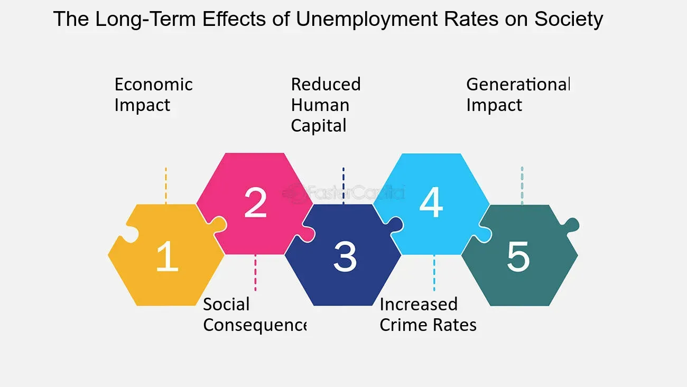

## Table of Contents

## What is the unemployment rate and how is it calculated?

The unemployment rate is the percentage of people in the labor force who are not working but are looking for a job. It is an important measure that helps us understand how well the economy is doing. When the unemployment rate is low, it usually means that more people have jobs and the economy is doing well. When it's high, it means more people are out of work and the economy might be struggling.

To calculate the unemployment rate, you need two pieces of information: the number of people who are unemployed and the total number of people in the labor force. The labor force includes everyone who is either working or actively looking for a job. To find the unemployment rate, you divide the number of unemployed people by the total number of people in the labor force and then multiply by 100 to get a percentage. For example, if there are 10 million unemployed people and 100 million people in the labor force, the unemployment rate would be (10 million / 100 million) * 100 = 10%.

## How does unemployment affect individuals and their families?

Unemployment can really hurt individuals and their families. When someone loses their job, they might not have enough money to pay for important things like food, rent, or medical bills. This can make life very stressful and hard. Kids in the family might have to miss out on activities or even change schools if the family has to move to a cheaper place. It can also make people feel sad or worried about the future, which can affect their health and well-being.

On top of money problems, being unemployed can also hurt someone's confidence. It can be tough to keep looking for a job when you keep getting turned down. This can make people feel like they're not good enough or that they'll never find work. Families might argue more because of the stress, and it can be hard for everyone to stay positive. In the long run, being out of work for a long time can make it even harder to find a new job, which just adds to the problem.

## What are the immediate economic impacts of high unemployment rates on a society?

High unemployment rates can hurt a society's economy right away. When a lot of people are out of work, they don't have money to spend on things like clothes, food, or going out. This means that businesses sell less stuff, and they might have to lay off more workers or even close down. When businesses do worse, the whole economy slows down because less money is moving around. The government also gets less money from taxes because people who are unemployed don't pay as much in income taxes.

Another big impact is that the government has to spend more money to help unemployed people. They might need to give out more unemployment benefits, food stamps, or other kinds of help. This can put a strain on the government's budget, especially if they're not getting as much tax money. If the government has to borrow more money to pay for these programs, it can lead to more debt. All of these things together can make the economy weaker and slower to recover.

## How does unemployment influence crime rates and social stability?

When a lot of people are out of work, it can lead to more crime. People who can't find jobs might get desperate and do things they wouldn't normally do, like stealing to get money for food or other things they need. Studies have shown that when unemployment goes up, crime rates often go up too. This makes sense because if people don't have money, they might feel like they have no other choice. Also, when people are out of work for a long time, they can get really frustrated and angry, which can lead to more crime and even violence.

High unemployment can also make society less stable. When lots of people are struggling to make ends meet, it can lead to protests and even riots. People might feel like the system is unfair and that nobody is helping them. This can make communities feel divided and unsafe. When people don't trust the government or each other, it's harder to work together to solve problems. So, high unemployment can really shake up a society and make it harder for everyone to live peacefully and feel secure.

## What are the long-term effects of unemployment on mental health and well-being?

Being out of work for a long time can really hurt someone's mental health. When people can't find a job, they might start to feel sad, worried, or even hopeless. This can lead to depression and anxiety. It's hard to keep looking for a job when you keep getting turned down, and this can make people feel like they're not good enough. Over time, this can wear down their self-esteem and make them feel like they'll never find work again. It's a tough cycle that can be hard to break.

Not having a job can also make people feel lonely and isolated. Work is not just about money; it's also about being part of a team and having a routine. When someone loses their job, they might lose their social connections too. This can make them feel left out and alone. Over time, this loneliness can affect their overall well-being and make it even harder to stay positive. It's important for people to find other ways to stay connected and feel valued, even when they're out of work.

## How does the unemployment rate impact government policies and social welfare programs?

When the unemployment rate goes up, governments often have to change their policies and social welfare programs. They might need to give more money to people who are out of work, like unemployment benefits or food stamps. This can be hard on the government's budget because they're spending more money but getting less from taxes. So, they might need to borrow money or cut spending in other areas. Governments might also try to create more jobs by starting new projects or giving money to businesses to hire more people.

High unemployment can also make governments think about long-term changes. They might want to help people learn new skills so they can find better jobs. This could mean spending more on education and training programs. Governments might also look at their laws and rules to see if they can make it easier for businesses to grow and hire more workers. All these changes are meant to help people get back to work and make the economy stronger.

## What role does unemployment play in income inequality and poverty levels?

Unemployment makes income inequality and poverty worse. When people lose their jobs, they don't have money coming in, so they fall behind others who still have jobs. This gap between people who are working and those who aren't can grow bigger over time. If someone is out of work for a long time, it's harder for them to catch up because they don't have money to save or invest. This means that the rich get richer and the poor get poorer, making income inequality even bigger.

High unemployment also pushes more people into poverty. When people don't have jobs, they struggle to pay for basic things like food, rent, and healthcare. If they can't find work for a long time, they might need help from the government or charities just to get by. This can make it really hard for them to ever get out of poverty. When a lot of people are in this situation, it can make the whole society poorer and more divided.

## How do different demographic groups experience unemployment differently?

Different groups of people can have different experiences with unemployment. For example, young people often have a harder time finding jobs than older workers. They might not have as much experience or the right skills that businesses are looking for. Also, when the economy is bad, companies might choose to keep their more experienced workers instead of hiring new ones. This can make it really tough for young people to start their careers.

Another group that often faces higher unemployment is people with less education. Jobs that don't need a lot of education or training can be the first to go when businesses need to cut costs. This means that people without a college degree or special skills might find it harder to find work. On the other hand, people with more education and skills usually have an easier time finding jobs, even when the economy is not doing well.

Race and gender can also play a big role in unemployment. In many places, people from certain racial or ethnic groups might face more discrimination when looking for jobs. This can make it harder for them to find work, even if they have the right skills and experience. Women might also face higher unemployment rates, especially if they work in industries that are hit hard by economic downturns. These differences can make life even harder for groups that are already struggling.

## What are the effects of unemployment on consumer spending and economic growth?

When a lot of people are out of work, they don't have as much money to spend on things they want or need. This means they buy less stuff, like clothes, food, or going out to eat. When people spend less, businesses make less money. If businesses are not making enough money, they might have to lay off more workers or even close down. This can make the whole economy slow down because less money is moving around. It's like a cycle: more unemployment leads to less spending, which leads to even more unemployment.

High unemployment can also hurt economic growth in the long run. When people are out of work for a long time, they might lose their skills or stop looking for jobs altogether. This means there are fewer people ready to work when the economy starts to get better. Plus, if people are not spending money, businesses might not want to invest in new projects or expand. This can slow down the economy even more. So, high unemployment can make it harder for the economy to grow and get back on track.

## How does global unemployment affect international trade and economic relations?

When unemployment is high in one country, it can affect how much that country buys and sells with other countries. If a lot of people in a country are out of work, they don't have money to spend on things from other countries. This means that the country might import less stuff, which can hurt the economies of the countries that usually sell to them. At the same time, if a country is not making as many things because of high unemployment, it might export less too. This can make other countries buy less from them, which can hurt trade relationships.

High unemployment in one country can also make other countries worried about their own economies. If one country is struggling, it might make other countries less likely to invest there or do business with them. This can lead to less international trade and weaker economic ties. When many countries are facing high unemployment at the same time, it can even lead to a global economic slowdown. So, unemployment in one place can have a big impact on the whole world's economy.

## What strategies have been successful in reducing unemployment rates in various countries?

Different countries have tried different things to lower unemployment, and some have worked well. One good way is to spend money on education and training programs. This helps people learn new skills that businesses need. For example, Germany has a strong system where young people can learn a trade while they work. This makes it easier for them to find jobs later. Another way is for the government to start big projects, like building roads or schools. This creates jobs right away and can help the economy grow.

Another successful strategy is to help small businesses grow. In the United States, the government gives loans and other help to small businesses so they can hire more people. This can lower unemployment because small businesses are a big part of the economy. Also, some countries make it easier for businesses to start up and grow by changing their rules and laws. For example, Denmark has made it easier for companies to hire and fire people, which can make businesses more willing to take a chance on new workers.

Sometimes, countries work together to fight unemployment. For example, in the European Union, countries share ideas and money to help each other. They might give money to countries with high unemployment to help them start new projects or train workers. This kind of teamwork can make a big difference. Overall, the best strategies usually involve a mix of education, government projects, helping businesses, and working together with other countries.

## How can advanced economic models predict and mitigate the impacts of unemployment on society?

Advanced economic models can help predict and lessen the impacts of unemployment by looking at a lot of data and finding patterns. These models use information like how many people are working, how much money people are spending, and what's happening in different parts of the economy. By studying this data, economists can guess when unemployment might go up and how bad it might get. They can also see which groups of people might be hit the hardest. This helps governments and businesses plan ahead and take steps to stop unemployment from getting worse.

Once economists predict that unemployment might go up, they can suggest ways to make it better. For example, they might tell the government to spend more money on job training programs so people can learn new skills and find work more easily. They might also suggest starting big projects that create jobs right away, like building new roads or schools. By using these models, governments can act quickly to help people stay employed and keep the economy strong. This can make a big difference in keeping society stable and helping people avoid the bad effects of being out of work.

## What is the understanding of unemployment and its economic impact?

Unemployment serves as a pivotal indicator of an economy’s health, characterized by the proportion of the labor force that is jobless and actively seeking employment. As a fundamental economic measure, it directly influences both individual purchasing power and broader economic output. When unemployment rises, the immediate consequence is a reduction in consumer spending, which can stifle economic growth. This is largely because unemployed individuals have limited income, which curtails their purchasing ability.

Mathematically, the unemployment rate ($U$) is calculated as:

$$
U = \frac{\text{Number of Unemployed Persons}}{\text{Labor Force}} \times 100
$$

High unemployment rates can create a cycle of reduced demand for goods and services, leading businesses to slash production and potentially reduce their workforce further, exacerbating the issue. This reduction in consumer spending negatively impacts various sectors, contributing to slower economic expansion and influencing parameters such as Gross Domestic Product (GDP).

Beyond the economic implications, unemployment has profound psychological effects on individuals and societal well-being. Joblessness is often associated with decreased morale among both the unemployed and those still employed, due to perceived job insecurity. This stress can diminish productivity and innovation within a workforce, further detracting from economic progress. Additionally, chronic unemployment can lead to skill atrophy, making it challenging for long-term unemployed individuals to re-enter the labor market even when opportunities arise.

Understanding these dynamics encompasses recognizing that unemployment's repercussions extend far beyond individual financial hardship, manifesting in broader economic stagnation and societal distress. Consequently, addressing unemployment effectively requires not only economic interventions but also social support mechanisms to mitigate its psychological effects.

## References & Further Reading

[1]: MacKenzie, D. (2017). ["Mechanizing the Merc: The Chicago Mercantile Exchange and the Rise of High-Frequency Trading."](https://www.jstor.org/stable/24468735) Business History Review, 91(2), 50-72.

[2]: Borch, C., Hansen, K. B., Lange, A. C., & Kranholdt, H. (2015). ["High-Frequency Trading, Algorithmic Finance, and the Flash Crash: Reflections on Eventalization."](https://journals.sagepub.com/doi/10.1177/0263775815600444) Environment and Planning D: Society and Space, 33(6), 1046-1063.

[3]: Aldridge, I., & Krawciw, S. (2017). ["Real-Time Risk: What Investors Should Know About Fintech, High-Frequency Trading, and Flash Crashes."](https://en.wikipedia.org/wiki/High-frequency_trading) Wiley.

[4]: Autor, D. H., Dorn, D., & Hanson, G. H. (2013). ["The China Syndrome: Local Labor Market Effects of Import Competition in the United States."](https://www.aeaweb.org/articles?id=10.1257/aer.103.6.2121) The Quarterly Journal of Economics, 128(1), 213-283.

[5]: Biais, B., & Foucault, T. (2014). ["HFT and Market Quality."](https://thierryfoucault.com/wp-content/uploads/2014/09/publishedversion.pdf) Review of Finance, 18(6), 1459-1484.