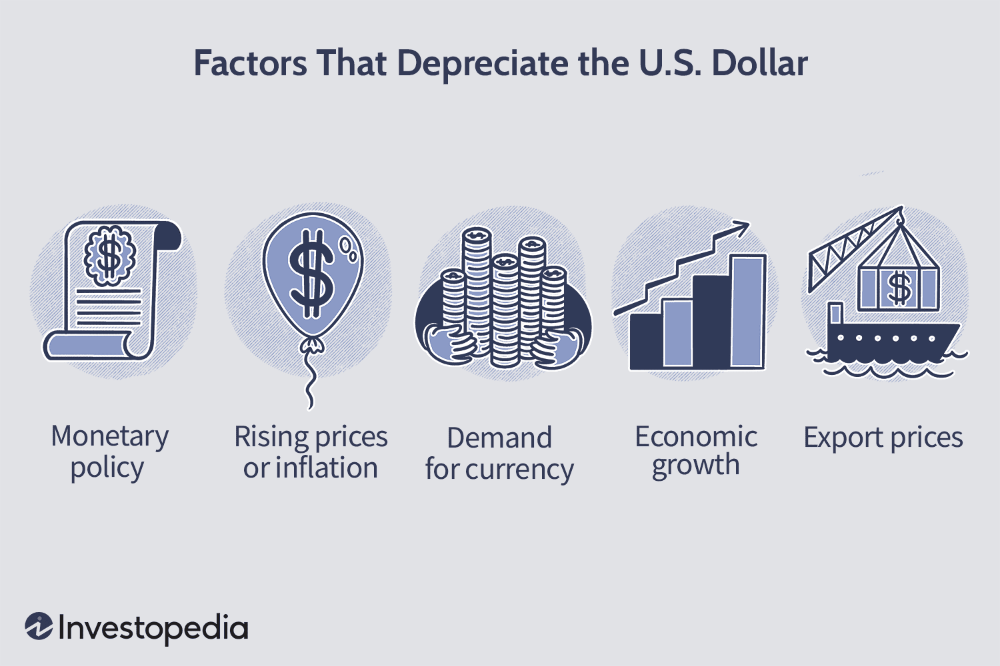

In today's interconnected global economy, the US dollar is the cornerstone of international finance as a primary reserve currency. Its stability and widespread acceptance make it a bedrock for global commerce. However, when the value of the US dollar depreciates, it can create significant challenges for American businesses, particularly those involved in international trade. Dollar depreciation refers to a decline in the dollar's value relative to other currencies and can be driven by factors such as inflation, variations in interest rates, and shifts in national fiscal policy.

For US businesses, a weakening dollar can alter the landscape of international trade. Exporters might find that their products become more attractive and competitive in foreign markets due to favorable exchange rates. On the flip side, companies that rely heavily on imports can experience increased costs, which may affect their pricing strategies and squeeze profit margins. As a result, changes in the dollar's value can lead to inflationary pressures within the domestic economy as imported goods become more expensive.



The fluctuations in the dollar's value necessitate strategic adaptations by businesses to mitigate the associated risks. Among these adaptations is the rise of algorithmic trading, also known as algotrading. This sophisticated approach leverages complex algorithms to optimize and automate trading activities in the foreign exchange market. By employing high-frequency trading, pattern recognition, and exploiting arbitrage opportunities, algorithmic trading enhances liquidity and reduces transaction costs, thereby influencing currency valuation.

This article examines the economic impact of US dollar depreciation on American businesses, specifically focusing on how these businesses and traders are adapting their strategies in response. By understanding the implications of dollar depreciation and the role of algorithmic trading, businesses can better navigate the complexities of the modern financial landscape and capitalize on emerging opportunities.

## Table of Contents

## Understanding Dollar Depreciation

Dollar depreciation occurs when the value of the US dollar decreases relative to other currencies. This phenomenon has various macroeconomic implications, influenced predominantly by factors such as inflation, interest rates, and fiscal policy.

Inflation, a measure of the rate at which the general level of prices for goods and services rises, is inversely related to dollar strength. When inflation rates in the United States climb higher than those of its trading partners, the purchasing power of the dollar erodes, leading to depreciation. This is because investors and traders expect fewer goods and services to be purchasable per dollar, thereby reducing its value.

Interest rates are another critical determinant of the dollar's value. Generally, higher interest rates offer lenders in an economy a higher return relative to other countries. As a result, higher interest rates attract foreign capital, leading to an appreciation of the dollar. Conversely, when US interest rates fall or when other countries' rates increase, the real return on dollar-denominated assets diminishes, prompting a potential depreciation of the dollar.

Fiscal policy, encompassing government spending and tax policies, also plays a significant role in currency valuation. Expansionary fiscal policy, characterized by increased government spending or decreased taxation, can lead to higher deficits and national debt. If a nation’s fiscal policy is perceived as unsustainable, it may undermine confidence in its currency, leading to depreciation as investors seek more stable alternatives.

The depreciation of the dollar can affect the US trade balance by making exports cheaper and imports more expensive. A weaker dollar increases the competitiveness of American goods in foreign markets, potentially boosting export volumes. Nevertheless, the increased cost of imports can impact businesses relying on foreign products and materials. This alteration in trade balances can shift the dynamics of international trade and have a profound impact on domestic economic activities.

In summary, understanding the factors that contribute to dollar depreciation is crucial for anticipating its effects on trade, import costs, and export competitiveness. Effective management of these elements can aid businesses and policymakers in navigating the challenges and opportunities presented by currency value fluctuations.

## Economic Impacts on American Businesses

In the context of an interlinked global economy, the fluctuation of the US dollar's value exerts notable economic impacts on American businesses. When the US dollar depreciates, it undergoes a reduction in its value relative to other currencies. This process generates distinct economic consequences for exporters and importers based in the United States.

For American exporters, a weaker dollar can function as an advantageous [factor](/wiki/factor-investing). The depreciation makes US goods and services less expensive for foreign purchasers, thereby enhancing their competitiveness in the global market. This competitive edge can elevate demand for American exports and support the expansion of business operations abroad. For US exporters, the formula for calculating the potential increase in competitiveness can be expressed as:

$$
\text{Competitive Price} = \frac{\text{Price in USD}}{\text{Exchange Rate}}
$$

Conversely, importers encounter challenges due to increased costs when acquiring goods from abroad as the dollar's value falls. These elevated import costs can compress profit margins and necessitate the adjustment of pricing strategies. Consider a US-based company importing goods that experience a price increase as a result of dollar depreciation. These costs may translate to higher consumer prices domestically, potentially leading to inflationary pressures. Importers must account for the impact on their cost structures as:

$$
\text{New Import Cost} = \text{Old Import Cost} \times \frac{\text{Old Exchange Rate}}{\text{New Exchange Rate}}
$$

The rise in import costs often feeds into the consumer price index (CPI), contributing to broader inflationary trends within the economy. As the cost of imported goods rises, producers and retailers might pass these increased charges onto consumers, thereby affecting purchasing power and demand for local products. Thus, businesses must navigate these economic conditions by possibly leveraging strategies such as cost-cutting, product diversification, or sourcing from domestic suppliers to mitigate adverse effects.

The interplay of these dynamics emphasizes the need for strategic planning among American businesses to harness the benefits of a weak dollar while cushioning against inflationary risks prompted by increased import expenses.

## How Multinationals Adapt

American multinational corporations, such as McDonald's and Procter & Gamble, often find opportunities in a weak US dollar environment. A weaker dollar can enhance the value of revenue generated in foreign markets. When converting profits back to US dollars, companies benefit from favorable exchange rates, thereby potentially increasing their bottom lines. For instance, if a US-based entity earns revenue in euros or yen, a depreciating dollar means more dollars per unit of foreign currency. This scenario boosts the reported earnings in US dollars, potentially improving financial performance and shareholder returns.

Additionally, these corporations strategically hedge their currency risks to stabilize income. Hedging involves using financial instruments like options, futures, or forward contracts to lock in an exchange rate for future transactions. By doing so, companies can protect themselves against currency [volatility](/wiki/volatility-trading-strategies) and plan budgets and cash flow with a higher degree of certainty.

Consider an example illustrating this concept:

```python
# Example: Calculating profits from currency conversion

def calculate_converted_profit(foreign_revenue, exchange_rate):
    return foreign_revenue * exchange_rate

# Assume the following values:
foreign_revenue = 1_000_000  # Revenue in foreign currency units (e.g., euros)
exchange_rate_initial = 1.1  # Initial exchange rate (USD per euro)
exchange_rate_depreciated = 1.2  # Exchange rate after dollar depreciation

# Calculate the profits before and after dollar depreciation
initial_profit = calculate_converted_profit(foreign_revenue, exchange_rate_initial)
depreciated_profit = calculate_converted_profit(foreign_revenue, exchange_rate_depreciated)

initial_profit, depreciated_profit
```
The python code snippet demonstrates how currency depreciation can influence profits. If a company initially converts 1,000,000 euros at an exchange rate of 1.1 USD/EUR, the revenue amounts to 1,100,000 USD. If the dollar depreciates, changing the exchange rate to 1.2 USD/EUR, the same foreign revenue converts to 1,200,000 USD, indicating a clear financial advantage without additional sales effort.

Such currency-related strategies are vital components of financial operations for multinationals that extensively operate across international borders. By effectively managing exchange rate exposures, these companies can ensure stable and predictable financial outcomes, which is crucial for long-term success amidst global currency fluctuations.

## Algorithmic Trading’s Role

Algorithmic trading, commonly known as algotrading, is the process of using computer algorithms to automate and optimize trading decisions in the foreign exchange ([forex](/wiki/forex-system)) market. These algorithms leverage complex mathematical models and real-time data analysis to execute trades at speeds and frequencies far beyond human capacity. The primary objective of algotrading is to increase efficiency and gain competitive advantages in highly volatile and liquid markets such as forex.

One of the key strategies employed in algotrading is high-frequency trading ([HFT](/wiki/high-frequency-trading-strategies)), where algorithms execute a vast number of trades in fractions of a second. High-frequency traders exploit even the smallest price discrepancies between currency pairs across different markets, a process known as [arbitrage](/wiki/arbitrage). By doing so, they provide [liquidity](/wiki/liquidity-risk-premium) to the forex market, which is essential for maintaining stability and smooth transactions.

Pattern recognition is another vital component of algotrading. Advanced algorithms analyze historical and current market data to detect patterns and predict future price movements. These predictive models are constantly refined using [machine learning](/wiki/machine-learning) techniques, allowing for adaptive strategies that adjust to changing market conditions.

An example of a simple algorithm in Python to detect mean reversion, a common pattern in trading, might look like this:

```python
import numpy as np
import pandas as pd

# Generate random forex data
np.random.seed(42)
price_data = pd.Series(np.random.randn(1000).cumsum() + 100)

# Calculate rolling mean and standard deviation
rolling_mean = price_data.rolling(window=20).mean()
rolling_std = price_data.rolling(window=20).std()

# Identify mean reversion signals
buy_signals = price_data < (rolling_mean - rolling_std)
sell_signals = price_data > (rolling_mean + rolling_std)

# Output signals
buy_signal_dates = price_data.index[buy_signals]
sell_signal_dates = price_data.index[sell_signals]
```

In addition to HFT and pattern recognition, algotrading enhances market liquidity and reduces transaction costs. Algorithms can execute trades with minimal human intervention, which leads to lower brokerage fees and faster transaction processing. The increased liquidity ensures tighter bid-ask spreads, benefiting all market participants by improving pricing efficiency.

Moreover, by processing vast amounts of data almost instantaneously, algotrading enables traders to capitalize on short-lived market opportunities. This capability is crucial in currency markets, where exchange rates can be quickly influenced by geopolitical events, economic indicators, or changes in monetary policy.

Overall, algotrading has significantly transformed currency valuation, contributing to a more dynamic and efficient forex market. Its continued evolution is set to shape the future of trading, offering even more sophisticated tools for managing currency risk and maximizing financial returns.

## The Future of Algotrading in Currency Markets

As technology continues its rapid evolution, [algorithmic trading](/wiki/algorithmic-trading) (algotrading) is poised to gain sophistication and efficacy, thereby enhancing the efficiency and execution of trades within currency markets. This technological advancement primarily hinges on the increasing ability of systems to process vast datasets and respond swiftly to market signals.

The modern financial ecosystem is characterized by massive volumes of data generated at an unparalleled pace. Algotraders leverage advanced data analytics and machine learning algorithms to interpret these datasets, identify patterns, and execute trades with precision. The quick processing of market signals offers a competitive edge, allowing for the timely entry and [exit](/wiki/exit-strategy) of trades that capitalize on short-lived market opportunities. Machine learning models, such as neural networks, are often employed to predict price movements by analyzing historical data, news sentiment, and other pertinent market factors.

A critical aspect of algotrading lies in dynamic hedging strategies, which are essential for managing currency risks effectively. Such strategies involve the continuous assessment and adjustment of hedge positions to protect against adverse currency rate movements. Algorithmic models can dynamically adjust these hedges based on real-time data, ensuring that exposure to currency risk is minimized. For instance, these strategies may utilize [statistical arbitrage](/wiki/statistical-arbitrage) methods, incorporating stochastic calculus to model and predict price correlations between different currency pairs.

```python
import numpy as np
from sklearn.linear_model import LinearRegression

# Example: Implementing a simple predictive model for currency pair price movements
# Dummy dataset (historical prices and external economic factors)
X = np.array([[1.1, 0.9], [1.2, 0.85], [1.0, 0.8], [1.15, 0.88]])
y = np.array([1.3, 1.25, 1.2, 1.32])  # Future prices

# Create a simple linear regression model
model = LinearRegression()
model.fit(X, y)

# Predict future price using current market conditions
current_conditions = np.array([[1.1, 0.87]])
predicted_future_price = model.predict(current_conditions)

predicted_future_price
```

The fusion of computational power with financial strategies also allows algotraders to implement complex hedging solutions, such as delta, gamma, and theta hedging in options markets. These allow the efficient management of risk by adjusting portfolios in response to changing market dynamics.

As the technological capabilities of systems continue to expand, algotrading will likely evolve further, emphasizing more integrated and adaptive systems capable of executing sophisticated strategies while mitigating risks. The trend points toward a future where enhanced data analytics and automation lead to more resilient and responsive currency market operations. Strategic adaptability and technological integration will become indispensable for traders seeking to harness the potential of algorithmic trading in this ever-changing landscape.

## Conclusion

Dollar depreciation presents both challenges and opportunities for American businesses involved in global trade. On one hand, it can enhance the competitiveness of U.S. exports by making them more affordable in foreign markets, thus potentially increasing sales volumes and market share internationally. On the other hand, it raises the cost of imports, thereby affecting the bottom line of companies reliant on foreign raw materials or components. This can lead to increased production costs and ultimately result in higher prices for consumers, contributing to inflationary pressures within the domestic economy.

To effectively navigate these challenges, businesses are turning to algorithmic trading as a critical tool. By leveraging these complex algorithms, companies can efficiently manage and hedge against currency risks. Algorithmic trading systems analyze market data in real-time to detect patterns and execute trades at optimal prices, thereby reducing exposure to volatile currency swings. For example, through high-frequency trading and arbitrage opportunities, businesses can offset potential losses due to currency fluctuations, securing a more stable financial footing.

Moreover, the continuous advancement in technology suggests that algorithmic trading will become increasingly sophisticated, enabling even more precise and timely execution of trades. The integration of big data analytics and machine learning technologies can further enhance the decision-making process, allowing businesses to adapt swiftly to changing market conditions. As a result, the ability of firms to strategically adapt and integrate these technologies into their financial operations becomes crucial. 

Overall, while dollar depreciation affects American businesses in varied ways, a strategic understanding and proactive use of algorithmic trading can mitigate some associated risks. This not only safeguards profit margins but also empowers businesses to capitalize on new opportunities presented by shifts in currency valuations. In this ever-evolving marketplace, adaptability and the integration of advanced technologies remain key to sustaining growth and competitiveness.

## References & Further Reading

[1]: ["Advances in Financial Machine Learning"](https://www.amazon.com/Advances-Financial-Machine-Learning-Marcos/dp/1119482089) by Marcos Lopez de Prado

[2]: ["Algorithmic Trading: Winning Strategies and Their Rationale"](https://www.wiley.com/en-us/Algorithmic+Trading%3A+Winning+Strategies+and+Their+Rationale-p-9781118746912) by Ernest P. Chan

[3]: ["Quantitative Trading: How to Build Your Own Algorithmic Trading Business"](https://github.com/LucindaYa/quant-resources/blob/master/Quantitative%20Trading%20How%20to%20Build%20Your%20Own%20Algorithmic%20Trading%20Business.pdf) by Ernest P. Chan

[4]: ["Machine Learning for Algorithmic Trading"](https://github.com/stefan-jansen/machine-learning-for-trading) by Stefan Jansen

[5]: ["Evidence-Based Technical Analysis: Applying the Scientific Method and Statistical Inference to Trading Signals"](https://www.amazon.com/Evidence-Based-Technical-Analysis-Scientific-Statistical/dp/0470008741) by David Aronson

[6]: Frankel, J. A. (2008). ["The Effect of Monetary Policy on Real Commodity Prices"](https://www.nber.org/papers/w12713) National Bureau of Economic Research Working Paper Series

[7]: Hull, J. C. (2017). ["Options, Futures, and Other Derivatives"](https://www.semanticscholar.org/paper/Options%2C-Futures%2C-and-Other-Derivatives-Hull/89bdee500c8623864fc9eb7a471546aa713acc44) 9th Edition. Pearson.