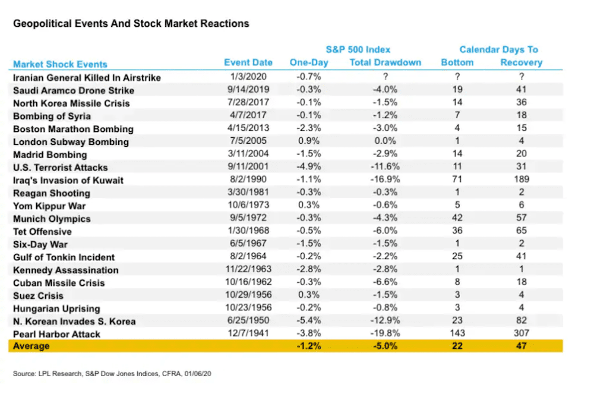

Financial markets constitute a broad array of environments where buyers and sellers engage in the trade of financial securities, commodities, and other fungible assets at prices determined by supply and demand. These markets are central to the functioning of capitalist economies, enabling capital allocation, economic growth, and liquidity provision. Key components of financial markets include the stock market, bond market, commodities market, and derivatives market. 

The stock market, as one of the most recognizable components, provides platforms where equities or shares of publicly-held companies are issued and traded. Stock markets play a critical role in the economy, offering companies access to capital in exchange for ownership stakes to investors. They serve as a barometer for the health of an economy, influencing investor confidence and broader economic patterns.



Wall Street epitomizes the global financial markets hub, situated in New York City. Its historical evolution from a modest trading post to the epicenter of financial activity marks it as a symbol of economic power. Home to major financial institutions, stock exchanges like the New York Stock Exchange (NYSE), and influential market players, Wall Street's importance transcends physical boundaries—it exerts significant influence over global finance.

Algorithmic trading, a cornerstone of contemporary trading strategies, involves the use of complex algorithms to execute orders based on predetermined criteria, such as timing, price, or volume. These algorithms, often aided by AI and machine learning technologies, enable traders to conduct transactions at speeds and frequencies beyond human capability. The expansion of algorithmic trading has been significant, with its influence growing due to its ability to enhance market efficiency, reduce transaction costs, and create more liquid markets.

The focus of this article is to explore how the dynamics of financial markets, particularly any competitions or 'wars', impact Wall Street and the practice of algorithmic trading. Such market conflicts can reshape policies, strategies, and structures within the financial sector, requiring adaptability from traders and institutions alike. Understanding these dynamics not only highlights the resilience and challenges faced by traditional financial hubs like Wall Street but also scrutinizes the robustness and implications of algorithmic systems amid market fluctuations.

## Table of Contents

## Understanding Financial Markets and 'Wars'

Financial market conflicts, often termed as 'financial markets wars', are intense competitions and strategic manipulations among market participants, regulatory bodies, and governments that influence financial instruments and economic policies. These conflicts arise due to divergent interests, competitive pressures, and geopolitical tensions affecting global finance.

### Types of Financial Market Competitions and Tensions

1. **Currency Wars**: Refers to a competitive devaluation of national currencies intended to boost exports by making them cheaper on the global market. This can lead to retaliatory actions and destabilize global trade.

2. **Trade Wars**: Occur when countries impose tariffs or other trade barriers against each other in response to policy disputes, affecting market stability and international investment flows.

3. **Regulatory Arbitrage**: Arises when financial institutions exploit differences in regulations across jurisdictions, leading to uneven market conditions and potential conflicts among regulatory bodies.

4. **Market Manipulation and Speculative Attacks**: Instances where market participants engage in deceptive practices to influence prices and gain unfair advantages, causing short-term volatility and long-term credibility issues.

### Historical and Contemporary Examples of Financial Market Conflicts

Historically, the Bretton Woods system collapse in the early 1970s led to significant currency fluctuations and competitive devaluations among major economies. More recently, the 2008 financial crisis highlighted severe tensions, as global economies struggled to navigate interconnected banking failures and policy disagreements.

The U.S.-China trade war exemplifies a contemporary financial conflict, resulting in tariffs and regulatory changes that have disrupted global supply chains and affected capital markets worldwide. Such events underline the interconnectedness of financial markets and the potential for localized tensions to have wide-reaching implications.

### Global Reshaping of Financial Markets

Financial market conflicts play a pivotal role in reshaping global financial landscapes. As these conflicts unfold, they often lead to shifts in policy, technology adoption, and market structures. For instance, the aftermath of the 2008 crisis saw the introduction of stringent regulations like the Dodd-Frank Act in the United States, aiming to enhance financial stability and transparency.

Technological advancements in response to market conflicts, particularly in high-frequency trading and risk management, have further transformed finance. Market participants adopt sophisticated algorithms and [machine learning](/wiki/machine-learning) models to predict and adapt to volatile conditions, thereby altering traditional trading strategies and market behavior.

In conclusion, financial market conflicts, or 'wars', are significant determinants of global economic dynamics. They compel markets to adapt, innovate, and at times, redefine operational and regulatory frameworks. Understanding these conflicts is crucial for stakeholders aiming to navigate and influence the ever-evolving financial landscapes.

## Wall Street's Pivotal Role in Global Finance

Wall Street, located in the financial district of New York City, is widely recognized as the epicenter of global finance. Its historical evolution into a financial hub began in the late 18th century when traders and speculators would gather under a buttonwood tree on Wall Street to exchange securities. This informal system of trading laid the groundwork for the establishment of the New York Stock Exchange (NYSE) in 1792 with the signing of the Buttonwood Agreement. Over the years, Wall Street has expanded its influence and operations, becoming synonymous with the financial markets and economy of the United States.

Wall Street's role in global financial markets is multifaceted. It serves as the primary exchange where securities are bought and sold, influencing stock markets worldwide. As the home of major financial institutions, investment banks, and insurance companies, Wall Street facilitates capital flows and investment strategies that impact both domestic and international economies. The NYSE and NASDAQ, two of the largest stock exchanges in the world, are headquartered on Wall Street, further solidifying its position as a central player in facilitating global finance.

In response to financial market challenges, Wall Street exhibits considerable resilience and adaptability. Historical events, such as the Great Depression, the 1987 stock market crash, and the 2008 financial crisis, demonstrated Wall Street's ability to recover and implement changes to avert future crises. Post-crisis regulatory measures, like the Dodd-Frank Act following the 2008 crisis, aimed to enhance transparency and reduce systemic risk, showcasing Wall Street's role in shaping market regulations.

Wall Street's influence on global financial policies and markets is profound. Financial institutions headquartered there play critical roles in setting trends and policies that resonate globally. The decisions made by major players on Wall Street, including the Federal Reserve's monetary policies, can have ripple effects across the world's economies. Moreover, Wall Street's practices and innovations often serve as models for other financial markets, underscoring its status as a leader in finance. Its capacity to navigate financial complexities and drive economic growth continues to underscore its pivotal role in the world economy.

## The Rise of Algorithmic Trading

Algorithmic trading, often referred to as algo trading, involves the use of computers programmed to follow defined instructions for trading in financial markets. These instructions or algorithms can execute trades at a speed and frequency that far surpasses human capability. The technological foundation of [algorithmic trading](/wiki/algorithmic-trading) lies in computational finance, [statistics](/wiki/bayesian-statistics), and machine learning, where high-speed data analysis and execution are paramount. 

The evolution of algorithmic trading traces back to the late 20th century, driven by advances in technology and communications. In the 1970s, the introduction of electronic exchanges marked a shift from traditional floor trading to faster, more efficient methods. By the 1980s and 1990s, tech innovations facilitated the execution of trades via computer algorithms. The increasing availability of market data and improvements in computing power further fueled the use of algorithmic trading strategies in the 2000s, enhancing its role in modern finance.

Algorithmic trading offers several advantages. It ensures precision, minimizing the manual errors that can arise in human trading. Algorithms can execute trades at optimal prices by scanning multiple markets simultaneously, thus capitalizing on market inefficiencies. Furthermore, by removing human emotions from trading decisions, algorithms reduce biases and make consistent trading decisions based on predefined criteria. 

However, algorithmic trading is not devoid of controversies. The flash crash of 2010 highlighted the potential risks, where automated trading systems contributed to a rapid, significant market decline within minutes [1]. Such incidents raise concerns about market stability, with critics pointing to the lack of transparency and oversight in some high-frequency strategies. The ethical implications of ultra-fast trading, where only those with advanced technology benefit, also fuel the debate.

On Wall Street, algorithmic trading has significantly transformed traditional trading strategies. It has led to the rise of high-frequency trading ([HFT](/wiki/high-frequency-trading-strategies)), where traders aim to profit from very small price discrepancies that exist for mere microseconds. Traditional buy-and-hold strategies are complemented by short-term, data-driven approaches that rely on algorithmic models. These models may include quantitative analysis, sentiment analysis from news feeds, and pattern recognition in price changes.

In summary, the rise of algorithmic trading reflects a broader trend in financial markets towards automation and data-driven decision making. While it brings efficiency and precision, it also introduces new challenges, such as market [volatility](/wiki/volatility-trading-strategies) and ethical considerations. As these systems become more sophisticated, their role in shaping trading strategies and market dynamics continues to grow.

### References:
1. U.S. Securities and Exchange Commission (2010). Findings Regarding the Market Events of May 6, 2010.

## Impact of Financial Market Conflicts on Wall Street

Financial market conflicts have historically played significant roles in impacting Wall Street, often leading to fluctuations in stock prices and necessitating shifts in investment strategies. These conflicts can arise from various sources, including geopolitical tensions, economic crises, or sudden regulatory changes. To illustrate the impact of such upheavals, prominent case studies can be examined.

One notable example is the Global Financial Crisis of 2008. This period was marked by a severe [liquidity](/wiki/liquidity-risk-premium) crunch and loss of confidence in financial institutions, which led to a significant drop in stock prices. The collapse of Lehman Brothers, a major Wall Street firm, underscored the crisis's impact, leading to a domino effect in financial markets worldwide. Stock prices across industries plummeted, forcing investors to hastily reassess their portfolios and strategies to mitigate losses. The crisis highlighted the intersections between mortgage-backed securities, credit rating agencies, and excessive risk-taking.

Another example is the dot-com bubble burst in the early 2000s. At the peak of this period, technology stocks were overvalued, driven by speculative investments in internet-based companies. When these valuations proved unsustainable, the bubble burst, leading to dramatic declines in stock prices. This upheaval forced a recalibration of investment strategies, with investors becoming more cautious and focusing on companies with solid fundamentals rather than speculative potential.

Financial market conflicts also underscore the complex interplay between market regulations and crises. The 2008 financial crisis, for instance, resulted in stringent regulatory reforms like the Dodd-Frank Act in the United States, which aimed to increase transparency and accountability in financial practices. However, these regulations can sometimes exacerbate market tensions by imposing constraints that may limit liquidity or restrict innovative financial products. Balancing regulation with market freedom remains a key challenge for policymakers.

Despite these challenges, Wall Street has demonstrated resilience and adaptability. The ability to weather financial storms stems from its robust infrastructure, diverse market participants, and innovative financial instruments that provide liquidity and risk management options. Wall Street's capacity to adapt is further exemplified by the quick recovery seen after recent market disruptions, such as the initial market shocks during the COVID-19 pandemic. The rapid development and deployment of technological solutions, such as algorithmic trading, have also aided in navigating turbulent market conditions.

In conclusion, financial market conflicts significantly impact Wall Street, influencing stock prices and investment strategies. These events underscore the need for a careful balance between market regulation and flexibility. Wall Street’s historical resilience and adaptability provide a blueprint for overcoming future challenges, ensuring it remains a pivotal force in global finance.

## Algorithmic Trading Amidst Financial Market Turbulence

Algorithmic trading has become a dominant force in financial markets, leveraging high-speed data analysis and automated systems to execute trades. However, the tumultuous nature of financial markets, characterized by rapid fluctuations and unexpected geopolitical or economic events—often referred to as 'financial market wars'—poses significant challenges to these systems.

### Adaptability of Algorithmic Systems

Algorithmic systems are designed to operate in fast-paced environments, processing vast amounts of data to identify trading opportunities. Their adaptability to rapidly changing markets hinges on their ability to update models quickly and efficiently in response to new information. Algorithms often rely on pre-set rules and historical data to make trading decisions. However, during periods of turbulence, these systems must dynamically adjust to incorporate real-time market data, recalibrating parameters to maintain efficacy. Techniques such as [reinforcement learning](/wiki/reinforcement-learning) can be employed, allowing algorithms to learn and adapt in real-time without being explicitly programmed for every scenario.

### Role of AI and Machine Learning

AI and machine learning (ML) play a crucial role in enhancing the predictive capabilities of algorithmic trading systems. By analyzing intricate patterns in historical and real-time data, ML algorithms can forecast market trends and volatilities more accurately. Neural networks, such as Long Short-Term Memory (LSTM) models, are particularly useful in time series prediction, aiding in anticipating market behaviors that follow complex temporal dependencies. Additionally, AI-driven sentiment analysis can process unstructured data from news and social media, providing insights into market sentiment that might affect asset prices.

Example of a simple LSTM implementation in Python using the Keras library:

```python
from keras.models import Sequential
from keras.layers import LSTM, Dense
import numpy as np

# Dummy dataset for illustration
data = np.random.rand(1000, 10)  # 1000 samples with 10 features each
labels = np.random.rand(1000, 1)

model = Sequential()
model.add(LSTM(50, input_shape=(10, 1)))
model.add(Dense(1))
model.compile(loss='mean_squared_error', optimizer='adam')
model.fit(data, labels, epochs=10, batch_size=32)
```

### Risks and Challenges during Market Turbulence

Despite their sophistication, algorithmic trading systems face several risks amid market turbulence. Firstly, the reliance on historical data may not adequately prepare algorithms for unprecedented market conditions. Sudden shifts can lead to erroneous trades or systemic issues if assumptions about market behavior prove incorrect. Secondly, the speed of automatic trading can exacerbate market volatility, leading to phenomena such as flash crashes, where severe price swings occur within seconds. Lastly, algorithms might encounter liquidity issues, unable to execute trades at desired prices, resulting in slippage that affects profit margins.

Therefore, while algorithmic trading systems offer substantial advantages through speed and data processing capacities, their performance is inherently linked to the unpredictability of financial markets. Continuous advancements in AI and ML can enhance their resilience, but ongoing oversight and regulation play a critical role in ensuring stability in periods of market turbulence.

## Conclusion

The dynamics of financial markets exert profound impacts on Wall Street and algorithmic trading, with market turbulence often dictating the rhythm of financial ecosystems. Financial market conflicts, often described as 'wars', present both challenges and opportunities for Wall Street's trading landscape. These conflicts can drive volatility, leading to rapid shifts in stock prices and necessitating agile responses from traders. Algorithmic trading, relying on swift data analysis and execution, often finds itself at both an advantage and a disadvantage in such turbulences. While it thrives on volatility by executing complex strategies at high speeds, unexpected market shifts can also render pre-programmed strategies obsolete, prompting potential losses.

Global financial markets are increasingly interconnected, heightening the impact of regional financial upheavals on Wall Street. The rise of technology in trading has introduced a paradigm shift; it is critical that traders remain versatile in their strategies to anticipate and adapt to these changes. Looking forward, traders and investors should enhance their focus on risk management strategies, incorporating adaptive algorithms capable of learning from past market behaviors to anticipate future conflicts. Financial institutions might increasingly rely on [artificial intelligence](/wiki/ai-artificial-intelligence) and machine learning to enhance predictive models, increasing the resilience of trading systems.

Balancing technological evolution with market stability presents ongoing challenges. As trading technology advances, ensuring a stable market environment remains paramount. Regulatory frameworks will play a crucial role in curbing excesses of high-frequency trading and minimizing systemic risks. Continuing dialogue between regulators and market participants is essential to foster innovation while preventing volatility from spiraling out of control. Through leveraging technology responsibly and maintaining robust risk management frameworks, Wall Street can navigate the complexities of modern financial markets effectively.

## References & Further Reading

[1]: U.S. Securities and Exchange Commission (2010). [Findings Regarding the Market Events of May 6, 2010.](https://www.sec.gov/news/studies/2010/marketevents-report.pdf)

[2]: ["Advances in Financial Machine Learning"](https://www.amazon.com/Advances-Financial-Machine-Learning-Marcos/dp/1119482089) by Marcos Lopez de Prado

[3]: ["The Man Who Solved the Market: How Jim Simons Launched the Quant Revolution"](https://www.amazon.com/Man-Who-Solved-Market-Revolution/dp/073521798X) by Gregory Zuckerman

[4]: ["Flash Boys: A Wall Street Revolt"](https://en.wikipedia.org/wiki/Flash_Boys) by Michael Lewis

[5]: ["Quantitative Finance for Dummies"](https://www.amazon.com/Quantitative-Finance-Dummies-Steve-DPhil/dp/1118769465) by Steve Bell

[6]: ["Trade Wars are Class Wars: How Rising Inequality Distorts the Global Economy and Threatens International Peace"](https://www.jstor.org/stable/j.ctv10sm96m) by Matthew C. Klein and Michael Pettis