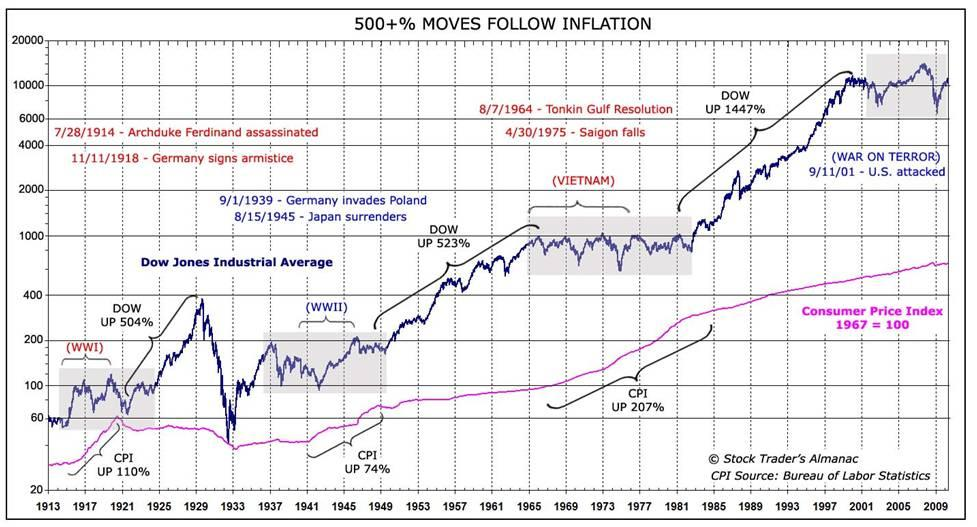

## Table of Contents

## What is the U.S. stock market and how does it function?

The U.S. stock market is a place where people can buy and sell pieces of companies, called stocks. These stocks represent ownership in a company. When you buy a stock, you become a part-owner of that company. The main stock markets in the U.S. are the New York Stock Exchange (NYSE) and the Nasdaq. People trade stocks through brokers, who are like middlemen that help with the buying and selling.

The stock market works by matching buyers and sellers. If you want to buy a stock, you place an order with your broker, who then finds someone willing to sell that stock at a price you're willing to pay. The price of a stock goes up and down based on how many people want to buy or sell it. If more people want to buy a stock than sell it, the price goes up. If more people want to sell than buy, the price goes down. This constant buying and selling helps companies raise money to grow and helps investors make money if the stock price goes up.

## How does war generally affect economies?

War usually has a big impact on economies. When a country goes to war, it often spends a lot of money on things like weapons, soldiers, and supplies. This can help some parts of the economy, like factories that make military equipment, because they get more business. But, it can also take money away from other important things, like schools and hospitals. Also, if the war is happening in the country, it can destroy buildings, roads, and other things that people need to live and work.

War can also mess up trade between countries. If countries are fighting, they might stop trading with each other. This can make it hard for businesses to get the things they need to make their products. It can also make it harder for people to buy things they want or need. Sometimes, war can make prices go up because there are fewer things available. In the end, war can make life harder for people and slow down the economy.

## Can you explain the immediate effects of war on the U.S. stock market?

When war breaks out, the U.S. stock market often gets very shaky. People start to worry about what might happen, so they might sell their stocks quickly to get their money out. This can make stock prices drop fast. Also, if the war is happening in a place that's important for the U.S. economy, like the Middle East where a lot of oil comes from, it can make things even worse. The stock market might go down because people are worried about higher oil prices and how that will affect businesses and the economy.

On the other hand, some parts of the stock market might do better during a war. Companies that make things the military needs, like weapons or vehicles, might see their stock prices go up because the government will buy more from them. But overall, the stock market can be very unpredictable during a war. It can go up and down a lot, and it's hard to know exactly what will happen because it depends on how long the war lasts and how it affects the world.

## What historical examples show the impact of war on the U.S. stock market?

One big example is World War II. When the war started, the U.S. stock market dropped a lot because people were scared and didn't know what would happen. But as the war went on, the U.S. economy got better because the government needed to make a lot of things for the war, like planes and ships. This made factories busy and helped the stock market go up. By the end of the war, the U.S. economy was strong, and the stock market was doing well.

Another example is the Iraq War that started in 2003. When the war began, the stock market went down because people were worried about what would happen with oil prices and the economy. Oil prices did go up because Iraq is an important place for oil. This made some businesses struggle, and the stock market stayed shaky for a while. But over time, as things got more stable, the stock market started to recover.

The Vietnam War also had an impact on the U.S. stock market. During the late 1960s and early 1970s, the war caused a lot of uncertainty. The stock market went through ups and downs because people were worried about how the war would affect the economy. Inflation was high, and this made it hard for the stock market to grow. The war also took a lot of money away from other things, which added to the economic problems during that time.

## How do different sectors of the U.S. stock market respond to war?

When war breaks out, different parts of the U.S. stock market can react in different ways. Companies that make things for the military, like weapons and vehicles, usually see their stock prices go up. This is because the government buys more from them during a war. For example, during World War II, companies like Boeing and Lockheed Martin did well because they made a lot of planes for the military. But not all sectors do well. Companies that need to buy a lot of oil, like airlines and shipping companies, can struggle because war can make oil prices go up. This happened during the Iraq War when oil prices spiked, making it harder for these companies to make money.

Other sectors can also be affected in different ways. Technology companies might see their stocks go down if people are worried about the economy. During the Vietnam War, the stock market was very up and down because of the uncertainty, and tech stocks were hit hard. On the other hand, some sectors like healthcare might stay more stable because people always need medical care, no matter what's happening with the war. Overall, war can make the stock market very unpredictable, with some sectors doing better than others depending on how the war affects the economy and people's worries about the future.

## What role do government policies play during wartime in influencing the stock market?

During wartime, the government often makes new rules and spends a lot of money to help the war effort. These actions can change how the stock market works. For example, the government might give money to companies that make things for the military, like weapons and planes. This can make the stocks of these companies go up because they are getting more business. The government might also control prices or limit how much of some things people can buy, like gas or food. These rules can make the stock market go down if people think the economy will get worse because of the war.

The government can also borrow a lot of money to pay for the war, which can affect interest rates and how much money people have to spend on stocks. If interest rates go up, it can make borrowing money more expensive for companies, and their stocks might go down. On the other hand, if the government helps the economy by spending a lot of money, it can make some parts of the stock market do better. For example, during World War II, the U.S. government's spending helped the economy grow, and the stock market did well by the end of the war. So, what the government does during a war can have a big impact on how the stock market acts.

## How do investor sentiments change during times of war and affect the stock market?

During times of war, investor sentiments can change a lot. People often get scared and worried about what might happen to the economy and their money. Because of this, they might sell their stocks quickly to get their money out. This can make the stock market go down fast. Investors might also be worried about how the war will affect things like oil prices, trade, and the overall economy. If they think the war will make things worse, they might not want to buy stocks, which can keep the stock market from growing.

But not all investors feel the same way. Some might see war as a chance to make money. They might buy stocks in companies that make things the military needs, like weapons or vehicles, because they think these companies will do well during the war. This can make the stocks of these companies go up. Overall, how investors feel during a war can make the stock market very unpredictable. It can go up and down a lot, depending on what people think will happen and how they react to the news about the war.

## What are the long-term effects of war on the U.S. stock market?

War can have big effects on the U.S. stock market that last a long time. When a war ends, it can take a while for the economy to get back to normal. If the war damaged a lot of things, like buildings and factories, it can take years to fix them. This can make the stock market stay low for a while because people are still worried about the economy. Also, if the war made the government spend a lot of money, it might have to borrow more money or raise taxes. This can make it harder for businesses to grow, and their stocks might not go up as fast.

On the other hand, some good things can happen in the long run. After a war, the government might spend money to help the economy grow again. This can make some parts of the stock market do better. For example, after World War II, the U.S. government spent a lot of money on things like roads and schools, which helped the economy and the stock market grow. Also, if the war made new technology or new ways of doing things, it can help businesses in the long run. So, while war can make the stock market go down at first, it can also lead to some good changes that help it grow later on.

## How do global economic conditions during war influence the U.S. stock market?

When there's a war happening somewhere in the world, it can change how the U.S. stock market works. If the war is in a country that's important for trade, like one that makes a lot of oil, it can make things harder for the U.S. economy. Oil prices might go up, and this can make it more expensive for businesses to do their work. If businesses have to pay more for things they need, they might not make as much money, and their stocks might go down. Also, if other countries stop trading with each other because of the war, it can make it harder for U.S. companies to sell their products. This can make the stock market go down because people are worried about the economy.

But it's not just about what's happening in the country where the war is. If the whole world is worried about the war, it can make the U.S. stock market shaky too. People around the world might sell their stocks because they're scared about what might happen. This can make stock prices go down, even if the war isn't happening in the U.S. On the other hand, if the war makes other countries spend more money on things like weapons, it can help some U.S. companies that make these things. Their stocks might go up because they're getting more business. So, what's happening in the world during a war can make the U.S. stock market go up and down a lot.

## What strategies can investors use to mitigate risks during wartime?

During wartime, investors can use different strategies to keep their money safe. One way is to spread out their investments. Instead of putting all their money into one type of stock, they can buy stocks from different kinds of companies. This way, if one part of the market goes down because of the war, they won't lose all their money. Another strategy is to invest in things that are less likely to be affected by war, like healthcare or food companies. People always need these things, so these stocks might stay more stable even when the rest of the market is going up and down.

Investors can also keep some of their money in safe places, like savings accounts or bonds. These don't grow as fast as stocks, but they are less risky. If the stock market goes down a lot because of the war, investors can still have some money that's safe. It's also a good idea to keep an eye on the news and understand how the war might affect different parts of the economy. By staying informed, investors can make better choices about when to buy or sell their stocks.

## How do technological advancements in warfare impact the U.S. stock market?

When there are new technologies in warfare, it can change how the U.S. stock market works. Companies that make these new technologies, like drones or advanced weapons, can see their stock prices go up. This is because the government and other countries might want to buy these new things for their military. For example, if a company makes a new kind of weapon that everyone wants, their stock price can go up a lot. But, it's not just about the companies that make the weapons. Other companies that help make these technologies, like those that make computer chips or special materials, can also do well. Their stocks might go up because they are part of the supply chain for these new military technologies.

On the other hand, these new technologies can also make some parts of the stock market go down. If a new weapon makes older weapons less useful, the companies that make the old weapons might see their stock prices drop. Also, if the new technologies make war more likely or more expensive, it can make people worried about the economy. This can make the whole stock market go down because investors might sell their stocks to get their money out. So, while new technologies in warfare can help some companies, they can also make things harder for others and make the stock market more unpredictable.

## What predictive models or indicators can be used to forecast the impact of war on the U.S. stock market?

To forecast how war might affect the U.S. stock market, people often look at things called economic indicators. One important indicator is the price of oil. If a war happens in a place that makes a lot of oil, like the Middle East, oil prices can go up. This can make it harder for businesses to make money, and their stocks might go down. Another indicator is how much the government is spending on the war. If the government is spending a lot of money, it might help some companies that make things for the military, but it can also make the economy less stable. People also watch things like consumer confidence and unemployment rates. If people are worried about the war, they might spend less money, which can make the stock market go down.

Another way to predict the impact of war on the stock market is by using predictive models. These models use math and past data to guess what might happen. For example, a model might look at how the stock market reacted to past wars and use that to guess what might happen in a new war. These models can also look at things like how long the war might last and how it might affect trade between countries. But, it's important to remember that these models are not perfect. War can make things very unpredictable, and even the best models can't always guess what will happen. So, while these indicators and models can help, they are just tools to help people make better guesses about the future.

## References & Further Reading

[1]: U.S. Securities and Exchange Commission (2010). [Findings Regarding the Market Events of May 6, 2010.](https://www.sec.gov/news/studies/2010/marketevents-report.pdf)

[2]: ["Advances in Financial Machine Learning"](https://www.amazon.com/Advances-Financial-Machine-Learning-Marcos/dp/1119482089) by Marcos Lopez de Prado

[3]: ["The Man Who Solved the Market: How Jim Simons Launched the Quant Revolution"](https://www.amazon.com/Man-Who-Solved-Market-Revolution/dp/073521798X) by Gregory Zuckerman

[4]: ["Flash Boys: A Wall Street Revolt"](https://en.wikipedia.org/wiki/Flash_Boys) by Michael Lewis

[5]: ["Quantitative Finance for Dummies"](https://www.amazon.com/Quantitative-Finance-Dummies-Steve-DPhil/dp/1118769465) by Steve Bell

[6]: ["Trade Wars are Class Wars: How Rising Inequality Distorts the Global Economy and Threatens International Peace"](https://www.jstor.org/stable/j.ctv10sm96m) by Matthew C. Klein and Michael Pettis