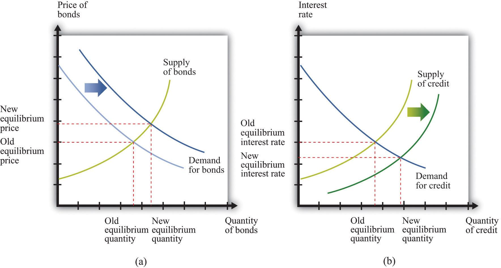

## Table of Contents

## What are open market operations?

Open market operations are when a country's central bank buys or sells government bonds to control the amount of money in the economy. When the central bank buys bonds, it gives banks more money to lend, which can help the economy grow. When it sells bonds, it takes money out of the economy, which can help slow down inflation.

These actions help the central bank reach its goals for the economy, like keeping prices stable and helping businesses and people. By changing how much money is available, the central bank can influence interest rates and the overall economic activity. Open market operations are a key tool that central banks use to manage the economy.

## How do central banks use open market operations?

Central banks use open market operations to control the amount of money in the economy. They do this by buying or selling government bonds. When a central bank buys bonds, it gives money to the banks that sell the bonds. This means banks have more money to lend to people and businesses. This can help the economy grow because more money is available for spending and investment.

On the other hand, when a central bank sells bonds, it takes money out of the economy. Banks give money to the central bank to buy the bonds, so they have less money to lend. This can help slow down the economy and reduce inflation, which is when prices go up too fast. By using open market operations, central banks can influence interest rates and keep the economy stable.

## What is the relationship between open market operations and bond prices?

When a central bank does open market operations, it can change the price of bonds. If the central bank buys bonds, it means there are fewer bonds for people to buy. When something is less available, its price usually goes up. So, when the central bank buys bonds, the price of those bonds goes up. This happens because more people want to buy the bonds than there are bonds available.

On the other hand, if the central bank sells bonds, it means there are more bonds for people to buy. When there are more of something, its price usually goes down. So, when the central bank sells bonds, the price of those bonds goes down. This happens because there are more bonds available than people want to buy. By buying and selling bonds, the central bank can control the price of bonds and influence the economy.

## Can you explain how buying bonds in open market operations affects bond prices?

When a central bank buys bonds in open market operations, it means they are taking bonds out of the market. This makes the number of bonds available for people to buy smaller. When there are fewer bonds to buy, the price of those bonds goes up. It's like when a popular toy is hard to find; people are willing to pay more to get it. So, when the central bank buys bonds, the price of the bonds goes up because there are fewer of them around.

This rise in bond prices also affects interest rates. Bonds and interest rates have an opposite relationship. When bond prices go up, the interest rates on new bonds go down. This is because the interest rate on a bond is fixed, so when the price of the bond goes up, the return on investment (the interest rate) becomes smaller. By buying bonds and making their prices go up, the central bank can help lower interest rates, which can encourage more borrowing and spending in the economy.

## How does selling bonds in open market operations influence bond prices?

When a central bank sells bonds in open market operations, it means they are adding more bonds to the market. This makes the number of bonds available for people to buy larger. When there are more bonds to buy, the price of those bonds goes down. It's like when there's a big sale on a toy; people don't have to pay as much because there's a lot of it around. So, when the central bank sells bonds, the price of the bonds goes down because there are more of them available.

This drop in bond prices also affects interest rates. Bonds and interest rates have an opposite relationship. When bond prices go down, the interest rates on new bonds go up. This is because the interest rate on a bond is fixed, so when the price of the bond goes down, the return on investment (the interest rate) becomes bigger. By selling bonds and making their prices go down, the central bank can help raise interest rates, which can encourage saving and slow down borrowing and spending in the economy.

## What is the impact of open market operations on the yield curve?

When a central bank does open market operations, it can change the yield curve. The yield curve shows the interest rates on bonds of different lengths of time. When the central bank buys bonds, it can make the prices of short-term bonds go up a lot. This makes the interest rates on short-term bonds go down. But the effect on long-term bonds might not be as big. So, the yield curve can get flatter because the difference between short-term and long-term interest rates gets smaller.

On the other hand, when the central bank sells bonds, it can make the prices of short-term bonds go down a lot. This makes the interest rates on short-term bonds go up. The effect on long-term bonds might not be as strong. So, the yield curve can get steeper because the difference between short-term and long-term interest rates gets bigger. By using open market operations, the central bank can shape the yield curve to help control the economy.

## How do open market operations affect interest rates and subsequently bond prices?

When a central bank does open market operations, it changes how much money is in the economy by buying or selling bonds. If the central bank buys bonds, it gives money to the banks that sell the bonds. This means there's more money for banks to lend, so they don't need to charge as much interest. Interest rates go down. When interest rates go down, people want to buy bonds because they can get a good deal. This makes bond prices go up because more people want to buy them.

On the other hand, if the central bank sells bonds, it takes money out of the economy. Banks have to give money to the central bank to buy the bonds, so they have less money to lend. They need to charge more interest to make up for it. Interest rates go up. When interest rates go up, people don't want to buy bonds as much because they can get better deals elsewhere. This makes bond prices go down because fewer people want to buy them. By changing interest rates through open market operations, the central bank can control bond prices and help manage the economy.

## What are the short-term versus long-term effects of open market operations on bond prices?

In the short term, when a central bank does open market operations, it can quickly change bond prices. If the central bank buys bonds, it takes some bonds out of the market. This makes the bonds that are left more valuable because there are fewer of them. So, bond prices go up right away. On the other hand, if the central bank sells bonds, it adds more bonds to the market. This makes the bonds less valuable because there are more of them. So, bond prices go down right away. These quick changes in bond prices can affect the interest rates that banks charge.

In the long term, the effects of open market operations on bond prices can be different. When the central bank keeps buying bonds over a long time, it can keep bond prices high. But if the economy changes, like if inflation goes up or if people start expecting higher interest rates, bond prices might not stay high. If the central bank keeps selling bonds over a long time, it can keep bond prices low. But again, other things in the economy can change this. So, while open market operations can have a big effect on bond prices in the short term, other economic factors can change their long-term impact.

## How do expectations of future open market operations influence current bond prices?

When people think about what a central bank might do with open market operations in the future, it can change bond prices right now. If people expect the central bank to buy a lot of bonds soon, they might want to buy bonds now before the prices go up. This is because they know that when the central bank buys bonds, it takes some bonds out of the market, making the ones left more valuable. So, if people think bond prices will go up because of future buying, they'll buy bonds now, and that makes the prices go up today.

On the other hand, if people expect the central bank to sell a lot of bonds in the future, they might not want to buy bonds now. They think that when the central bank sells bonds, it will add more bonds to the market, making the ones already there less valuable. So, if people think bond prices will go down because of future selling, they'll sell their bonds now, and that makes the prices go down today. This shows how important it is for the central bank to be clear about what they might do, because it can change what people do with their money now.

## What role do quantitative easing and tightening play in the context of open market operations and bond prices?

Quantitative easing (QE) and quantitative tightening (QT) are special kinds of open market operations that central banks use to control the economy. When a central bank does QE, it buys a lot of bonds, like government or corporate bonds, to put more money into the economy. This makes bond prices go up because there are fewer bonds for people to buy. When bond prices go up, the interest rates on new bonds go down. This can help the economy grow because it's easier for people and businesses to borrow money. QE is often used when the economy is not doing well and needs a boost.

On the other hand, when a central bank does QT, it sells a lot of bonds to take money out of the economy. This makes bond prices go down because there are more bonds for people to buy. When bond prices go down, the interest rates on new bonds go up. This can slow down the economy because it's harder for people and businesses to borrow money. QT is often used when the economy is growing too fast and prices are going up too much, which is called inflation. Both QE and QT are powerful tools that central banks use to manage bond prices and help keep the economy stable.

## How do open market operations interact with other monetary policy tools to affect bond prices?

Open market operations work with other monetary policy tools to change bond prices. One tool is the central bank's interest rate, called the policy rate. When the central bank changes this rate, it can make banks want to buy or sell bonds. If the policy rate goes up, banks might sell bonds to get money to lend at the higher rate, which makes bond prices go down. If the policy rate goes down, banks might buy bonds to make money from them, which makes bond prices go up. So, the policy rate and open market operations work together to move bond prices.

Another tool is reserve requirements, which are the rules about how much money banks have to keep in their vaults. If the central bank makes reserve requirements higher, banks have less money to lend, so they might sell bonds to get more money. This makes bond prices go down. If the central bank makes reserve requirements lower, banks have more money to lend, so they might buy bonds. This makes bond prices go up. By using open market operations along with changing the policy rate and reserve requirements, the central bank can control bond prices and help the economy stay stable.

## Can you discuss any historical examples where open market operations significantly impacted bond prices?

In 2008, during the financial crisis, the U.S. Federal Reserve used open market operations to help the economy. They started a program called quantitative easing (QE), where they bought a lot of bonds. This made bond prices go up because there were fewer bonds for people to buy. It also made interest rates go down, which helped people and businesses borrow money more easily. This was important because the economy was in trouble, and the Fed wanted to help it get better.

Another example is from Japan in the 1990s and early 2000s. Japan had a big economic problem called deflation, where prices kept going down. The Bank of Japan used open market operations to buy a lot of bonds, trying to put more money into the economy. This made bond prices go up and helped lower interest rates. But it took a long time for the economy to get better. These examples show how open market operations can change bond prices and help central banks manage the economy during tough times.

## How do OMOs affect bond prices?

Open Market Operations (OMOs) directly influence bond prices through the buying and selling of government securities by central banks. When a central bank decides to purchase bonds, it increases the demand for these securities. This heightened demand results in an upward pressure on bond prices. Conversely, if the central bank opts to sell bonds, the supply of these securities in the market increases, potentially leading to a decrease in their prices.

The bond market operates under the basic supply-demand dynamic where an increase in demand (such as from a central bank purchase) raises prices, while an increase in supply (such as from a central bank sale) can lower prices. This mechanism is simple yet pivotal in fiscal dynamics.

Moreover, there's a fundamental inverse relationship between bond prices and interest rates. This relationship can be understood through the yield, which is the return an investor realizes on a bond. When bond prices increase, the yields fall, given by the formula:

$$
\text{Yield} = \frac{\text{Coupon Payment}}{\text{Bond Price}}
$$

For instance, if a bond has a fixed coupon payment, an increase in the bond’s price will result in a lower yield. As yields are a proxy for interest rates, this means that as bond prices rise, the broader interest rates tend to fall. Conversely, as bond prices fall due to sales by the central bank, yields increase, leading to a rise in interest rates.

Central banks utilize this relationship with precision to influence economic conditions. By lowering yields through OMOs, central banks can stimulate economic activity as lower interest rates reduce the cost of borrowing. Conversely, if inflationary pressures necessitate higher interest rates, central banks might sell bonds to increase yields and curb economic activity.

Ultimately, the manipulation of bond prices through OMOs provides central banks with a critical tool to manage economic stability, influencing everything from consumer spending to business investments based on the prevailing [interest rate](/wiki/interest-rate-trading-strategies) environment.

## How do OMOs influence interest rates?

Open Market Operations (OMOs) are influential tools used by central banks to manage short-term interest rates by manipulating the federal funds rate. The federal funds rate is the interest rate at which depository institutions lend reserve balances to other depository institutions overnight. Central banks conduct OMOs primarily by buying or selling government securities, directly affecting the money supply. 

When a central bank engages in the purchase of government securities, it injects [liquidity](/wiki/liquidity-risk-premium) into the banking system. This increases the amount of reserves held by banks, thereby enhancing the capacity of these banks to offer loans. As a consequence, the supply side of the interbank lending market sees a boost, leading to a decrease in the federal funds rate due to the surplus in reserve funds. A lower federal funds rate typically results in lower borrowing costs across the economy, stimulating economic activity as businesses and consumers increase spending and investment.

Conversely, when a central bank sells government securities, it effectively absorbs liquidity from the banking system. This action reduces the reserves available to banks, constraining their ability to lend. The supply of available funds in the interbank market diminishes, exerting upward pressure on the federal funds rate. A higher federal funds rate translates into increased lending rates for borrowers, which can decelerate economic activity by curbing spending and investment.

The relationship between OMOs, the money supply, and interest rates can be encapsulated by examining the basic supply and demand dynamics that govern the federal funds market equilibrium. By altering the available reserves, OMOs shift the reserve supply curve, leading to a new equilibrium interest rate. Mathematically, this can be expressed with the interest rate equation for reserves:

$$
i = i^* + \alpha (R_d - R_s)
$$

where:
- $i$ is the federal funds rate,
- $i^*$ is the target rate set by the central bank,
- $R_d$ is the reserve demand,
- $R_s$ is the reserve supply,
- $\alpha$ is the responsiveness of the interest rate to changes in reserve supply.

Adjusting $R_s$ through OMOs shifts the equilibrium and impacts $i$, achieving the desired monetary policy outcomes. This intricate process underscores the central role OMOs play in steering short-term interest rates, thereby influencing broader economic conditions.

## References & Further Reading

[1]: Bernanke, B. S. (2020). ["The New Tools of Monetary Policy."](https://www.aeaweb.org/articles?id=10.1257/aer.110.4.943) Journal of Economic Perspectives, 34(4), 3-30.

[2]: Mishkin, F. S. (2009). ["The Economics of Money, Banking, and Financial Markets."](https://www.pearsonhighered.com/assets/preface/0/1/3/4/0134855388.pdf) Pearson Education.

[3]: Gagnon, J., Raskin, M., Remache, J., & Sack, B. (2011). ["The Financial Market Effects of the Federal Reserve's Large-Scale Asset Purchases."](https://www.ijcb.org/journal/ijcb11q1a1.pdf) International Journal of Central Banking, 7(1), 3-43.

[4]: Lopez de Prado, M. (2018). ["Advances in Financial Machine Learning."](https://www.amazon.com/Advances-Financial-Machine-Learning-Marcos/dp/1119482089) Wiley.

[5]: Hamilton, J. D., & Wu, J. C. (2011). ["The Effectiveness of Alternative Monetary Policy Tools in a Zero Lower Bound Environment."](https://www.nber.org/system/files/working_papers/w16956/w16956.pdf) National Bureau of Economic Research Working Paper No. 16956.