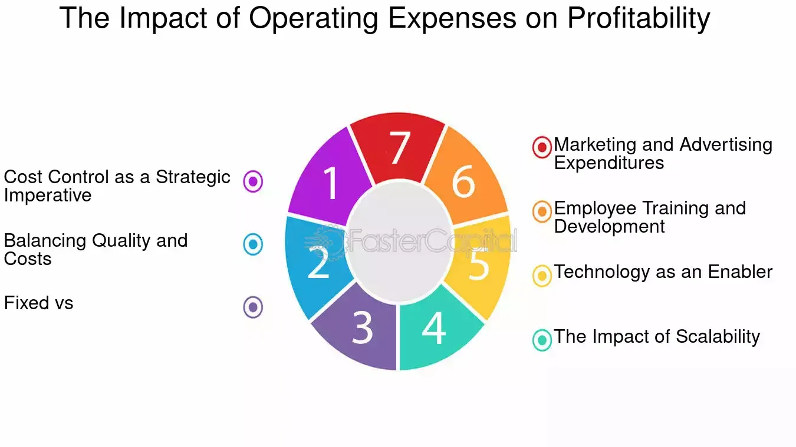

## Table of Contents

## What are operating expenses?

Operating expenses are the costs a business has to pay to keep running day-to-day. These expenses include things like rent for the office, salaries for employees, utility bills, and office supplies. They are different from the costs of making a product or buying goods to sell, which are called cost of goods sold.

These expenses are important because they help a business understand how much it costs to operate, beyond just making or buying products. By keeping track of operating expenses, a business can see if it is spending too much money in certain areas and can make changes to become more efficient. This can help the business make more profit by reducing unnecessary costs.

## How do operating expenses differ from other types of expenses?

Operating expenses are the costs a business pays to keep running every day. These include things like rent, salaries, utility bills, and office supplies. They are different from other expenses because they are not directly tied to making or buying products. For example, the cost of materials to make a product or the price paid to buy goods to sell are not operating expenses. These are called cost of goods sold or direct costs.

Another type of expense that is different from operating expenses is capital expenditures. Capital expenditures are costs for buying or improving long-term assets like buildings, equipment, or vehicles. These costs are not used up quickly like operating expenses, which are ongoing and repeat every month or year. Capital expenditures are usually a one-time or less frequent cost and are often spread out over several years on the financial statements.

Understanding the difference between operating expenses and other types of expenses is important for a business. It helps the business know how much it costs to keep running and how much it costs to make or buy products. This information can help the business make better decisions about where to spend money and how to save money to increase profits.

## What are common examples of operating expenses?

Operating expenses are the costs a business pays to keep running every day. Some common examples are rent for the office or store, salaries for employees, and utility bills like electricity and water. These costs come up regularly and are needed to keep the business going.

Other common operating expenses include office supplies like paper and pens, insurance to protect the business, and advertising to attract customers. Businesses also spend money on repairs and maintenance to keep their buildings and equipment in good shape. These expenses are important because they help the business operate smoothly every day.

Sometimes, businesses also have to pay for travel and entertainment if they need to meet with clients or partners. They might also have legal and accounting fees to keep their finances in order and follow the law. All these costs add up and are part of the operating expenses that a business needs to manage carefully.

## How do operating expenses affect a company's profitability?

Operating expenses have a big impact on a company's profitability. When a company spends a lot of money on operating expenses, it has less money left over as profit. For example, if a company pays a lot for rent, salaries, and utilities, these costs take away from the money the company makes from selling its products or services. If the operating expenses are too high, the company might not make enough profit to grow or even stay in business.

To improve profitability, a company needs to manage its operating expenses carefully. This means looking at each expense and seeing if it can be reduced or if it's really necessary. For instance, a company might find cheaper office space or use energy-saving lights to lower utility bills. By keeping operating expenses under control, a company can increase its profits. This extra money can then be used to grow the business, invest in new projects, or save for the future.

## What is the formula to calculate operating profit?

Operating profit is the money a company makes after paying for the costs of making or buying its products and the costs of running the business every day. To calculate operating profit, you start with the company's total revenue, which is the money it makes from selling its products or services. Then, you subtract the cost of goods sold, which is the money spent on making or buying the products. After that, you subtract the operating expenses, like rent, salaries, and utilities. The formula looks like this: Operating Profit = Total Revenue - Cost of Goods Sold - Operating Expenses.

Understanding operating profit is important because it shows how well a company is managing its day-to-day costs. If a company has a high operating profit, it means it is good at controlling its expenses and making money from its main business activities. A low operating profit might mean the company needs to find ways to cut costs or increase its revenue. By looking at operating profit, business owners and investors can see how healthy the company is and make better decisions about the future.

## How can a company reduce its operating expenses?

A company can reduce its operating expenses by looking at each cost carefully and finding ways to spend less. For example, they might move to a smaller office to pay less rent or switch to cheaper suppliers for office supplies. They could also try to use less electricity and water by turning off lights and fixing leaks. Another way is to use technology to do some tasks instead of hiring more people, which can save on salaries.

It's also important for a company to keep an eye on its operating expenses all the time. They can set a budget and check it regularly to make sure they are not spending too much. If they see a cost that is too high, they can talk to the people in charge and find ways to bring it down. By being careful and making smart choices, a company can lower its operating expenses and have more money left over as profit.

## What is the impact of operating expenses on gross profit vs. net profit?

Operating expenses have a direct impact on a company's gross profit and net profit, but in different ways. Gross profit is what a company makes after paying for the cost of goods sold, which is the money spent on making or buying the products it sells. Operating expenses, like rent, salaries, and utilities, are not part of the cost of goods sold. So, they don't affect the gross profit directly. But, if operating expenses are very high, it can make the gross profit seem bigger than it really is because it doesn't show how much it costs to run the business every day.

Net profit, on the other hand, is what's left after all expenses, including operating expenses, are subtracted from the total revenue. So, operating expenses do affect net profit directly. If a company can keep its operating expenses low, it will have more money left over as net profit. But if the operating expenses are too high, they can eat into the net profit and leave the company with less money at the end of the day. Understanding how operating expenses impact both gross and net profit helps a company manage its money better and make smarter decisions.

## How do operating expenses influence financial ratios like operating margin?

Operating expenses play a big role in financial ratios like the operating margin. The operating margin shows how much profit a company makes from its main business activities after paying for the costs of making or buying its products and the costs of running the business every day. To calculate the operating margin, you take the operating profit, which is the total revenue minus the cost of goods sold and operating expenses, and divide it by the total revenue. If a company can keep its operating expenses low, it will have a higher operating profit and a better operating margin. This means the company is good at controlling its costs and making money from its main business.

A high operating margin is a good sign for a company because it shows that the company is efficient and profitable. If operating expenses are too high, they can lower the operating profit and make the operating margin smaller. This might mean the company needs to find ways to cut costs or increase its revenue. By keeping an eye on operating expenses and trying to keep them as low as possible, a company can improve its operating margin and show investors and owners that it is doing well financially.

## What strategies can businesses implement to manage operating expenses effectively?

Businesses can manage their operating expenses effectively by regularly reviewing their costs and looking for ways to spend less. This means checking things like rent, salaries, and utility bills to see if they can find cheaper options or cut down on what they use. For example, a company might move to a smaller office to save on rent or switch to energy-saving lights to lower electricity costs. They could also use technology to do some tasks instead of hiring more people, which can save on salaries. By being careful and making smart choices, a business can keep its operating expenses under control and have more money left over as profit.

Another important strategy is to set a budget and stick to it. A budget helps a business plan how much it will spend on operating expenses each month or year. By keeping an eye on the budget and comparing it to what they actually spend, a business can see if it is spending too much in certain areas. If they find a cost that is too high, they can talk to the people in charge and find ways to bring it down. This might mean negotiating better deals with suppliers or finding new ways to do things more cheaply. By managing operating expenses carefully and sticking to a budget, a business can improve its profitability and stay healthy financially.

## How do industry-specific factors affect the level of operating expenses?

Different industries have different operating expenses because of what they need to do their work. For example, a restaurant has to pay for things like food, cooks, and a place to serve customers. This means their operating expenses might be higher than a software company, which mostly needs computers and programmers. The type of business a company is in can make a big difference in how much it spends to keep running every day.

Also, some industries have rules and laws that can affect operating expenses. For example, a factory might have to spend more money on safety equipment and training to follow government rules. A bank might need to pay for special security systems and audits to keep customer money safe. These industry-specific costs can make operating expenses higher or lower depending on the kind of business. By understanding these factors, a company can plan better and manage its money more effectively.

## What role do operating expenses play in long-term strategic planning?

Operating expenses are really important when a company makes plans for the future. They help the company see how much it costs to keep running every day. This information is key for making long-term plans because it shows how much money the company needs to cover these costs. If the company knows its operating expenses, it can make better decisions about where to spend money and how to grow. For example, if the operating expenses are too high, the company might decide to find cheaper ways to do things or look for new ways to make more money.

In long-term planning, a company also uses operating expenses to set goals and make budgets. By looking at past operating expenses, the company can guess how much it will spend in the future. This helps them plan how to save money and invest in new projects. If the company can keep its operating expenses low, it will have more money to use for growing the business or saving for the future. Understanding and managing operating expenses well is a big part of making sure the company stays healthy and successful over time.

## How can advanced analytics be used to optimize operating expenses and enhance profitability?

Advanced analytics can help a company find ways to spend less money on operating expenses and make more profit. By looking at a lot of data, advanced analytics can show where a company is spending too much and where it can save money. For example, it can look at utility bills and find patterns to see if there are times when the company uses more electricity than it needs to. It can also look at how employees use office supplies and suggest ways to use less. By using advanced analytics, a company can make smart choices about where to cut costs and how to spend money more wisely.

Using advanced analytics can also help a company plan better for the future. It can predict how operating expenses might change over time and help the company set realistic budgets. For example, if the analytics show that rent costs are going up in the area, the company might decide to move to a cheaper location before the costs get too high. This kind of planning can help the company stay profitable and grow. By using data to make decisions, a company can keep its operating expenses under control and have more money left over as profit.

## What is the understanding of operating expenses in business finance?

Operating expenses (OPEX) are the expenditures required for the daily functioning of a business and are not directly linked to the production of goods or services. These expenses are critical components of a business's financial structure, encompassing a wide array of costs that support operational activities. Common examples of operating expenses include:

1. **Rent:** Costs associated with leasing physical office premises or other facilities.
2. **Utilities:** Expenses for essential services such as electricity, water, and heating, which are necessary to keep the business operational.
3. **Salaries and Wages:** Regular payments to employees for their services, excluding those working directly on production lines.
4. **Office Supplies:** Items such as paper, pens, computers, and other supplies required for administrative tasks.
5. **Travel Costs:** Expenditures related to business travel, including transportation, accommodation, and meals.

Effective management of operating expenses is crucial for businesses aiming to maintain healthy profit margins. Operating expenses are subtracted from gross profit to determine the operating profit, which serves as a key indicator of a company's financial health. The formula for calculating operating profit is:

$$
\text{Operating Profit} = \text{Gross Profit} - \text{Operating Expenses}
$$

Where:
- **Gross Profit** is the revenue minus the cost of goods sold (COGS).
- **Operating Expenses** include all costs like rent, salaries, and utilities mentioned above.

By optimizing operating expenses, businesses can significantly enhance their operating profit, thereby strengthening their overall financial position. This can involve strategic measures such as negotiating better terms with suppliers, investing in more efficient technologies, or restructuring internal processes to reduce waste and improve efficiency. Proper management of these costs not only supports profitability but also helps maintain competitiveness in the market by allowing businesses to allocate resources more effectively towards growth and innovation.

## What is the Role of Operating Expenses in Profitability?

Operating expenses are a crucial component in determining a company's profitability. Essentially, these expenses are subtracted from the gross profit to calculate the operating profit. The formula for operating profit is:

$$
\text{Operating Profit} = \text{Gross Profit} - \text{Operating Expenses}
$$

This calculation highlights the significant role operating expenses play in the financial performance of an enterprise. An increase in these expenses, without a corresponding increase in gross profit, leads to a decrease in operating profit. Therefore, efficient management of operating expenses is essential for maintaining or enhancing a company's profitability.

Companies are continuously striving to optimize operating expenses, seeking ways to reduce costs without sacrificing the quality of their products or services. This optimization not only improves profitability but also strengthens competitiveness in the market. One common strategy involves outsourcing non-core activities. By outsourcing tasks that do not require in-house expertise or resources, companies can reduce labor and operational costs. This allows them to focus resources on core competencies that directly contribute to revenue generation.

Embracing technology is another effective strategy to manage operational costs. Automation of routine tasks can lead to significant savings in both time and money. For instance, deploying software solutions for standard processes minimizes the need for manual intervention, thus reducing human resource costs and the potential for errors. Additionally, investment in advanced analytics can optimize resource allocation and enhance decision-making, further driving efficiency.

Furthermore, companies are leveraging techniques such as activity-based costing to identify cost drivers and allocate resources more effectively. This approach ensures that resources are concentrated on activities that add the most value, enhancing overall profitability.

In conclusion, while operating expenses are indispensable for the smooth operation of a business, their management is crucial in retaining operational profit margins. Through strategic optimization, companies can achieve financial health and competitive advantage.

## References & Further Reading

[1]: Bergstra, J., Bardenet, R., Bengio, Y., & Kégl, B. (2011). ["Algorithms for Hyper-Parameter Optimization."](https://dl.acm.org/doi/10.5555/2986459.2986743) Advances in Neural Information Processing Systems 24.

[2]: ["Advances in Financial Machine Learning"](https://www.amazon.com/Advances-Financial-Machine-Learning-Marcos/dp/1119482089) by Marcos Lopez de Prado

[3]: ["Evidence-Based Technical Analysis: Applying the Scientific Method and Statistical Inference to Trading Signals"](https://www.amazon.com/Evidence-Based-Technical-Analysis-Scientific-Statistical/dp/0470008741) by David Aronson

[4]: ["Machine Learning for Algorithmic Trading"](https://github.com/stefan-jansen/machine-learning-for-trading) by Stefan Jansen

[5]: ["Quantitative Trading: How to Build Your Own Algorithmic Trading Business"](https://www.amazon.com/Quantitative-Trading-Build-Algorithmic-Business/dp/1119800064) by Ernest P. Chan