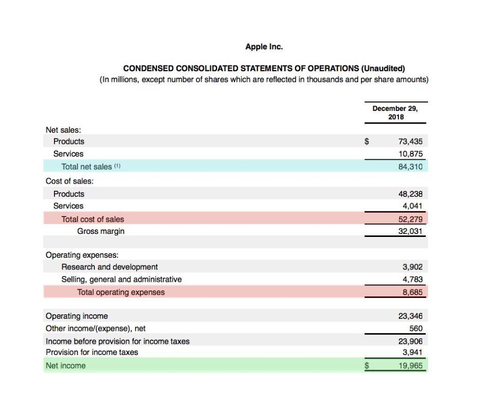

In the modern financial landscape, the interplay between business finance and algorithmic trading has become pivotal for enhancing profitability. As financial markets grow increasingly complex and competitive, businesses must navigate the challenges of managing operating expenses while maximizing returns through algorithmic trading strategies. This article focuses on the crucial aspects of managing operating expenses and examining how they influence profitability within algorithmic trading.

Algorithmic trading employs advanced computational algorithms to execute trades at high speed and efficiency, capitalizing on market volatility and price discrepancies. However, to harness these opportunities effectively, financial institutions must optimize operational costs, which include those associated with technology, data acquisition, and human resources. Balancing these expenses while aligning with profitability goals is essential for sustaining competitive advantage.

Exploring the sophisticated balance required to optimize operational costs involves understanding the impact of operating expenses on financial health indicators like operating profit. Companies engaged in algorithmic trading must scrutinize their OPEX to ensure that resources are allocated efficiently without compromising the quality and effectiveness of their trading algorithms.

Understanding the nuances of these financial components empowers businesses to make informed decisions in the fast-paced world of algorithmic trading. By implementing strategic cost management practices, firms can enhance their operational efficiency, ultimately leading to improved profitability and a stronger foothold in the financially dynamic environment.

## Table of Contents

## Understanding Operating Expenses in Business Finance

Operating expenses (OPEX) are the expenditures required for the daily functioning of a business and are not directly linked to the production of goods or services. These expenses are critical components of a business's financial structure, encompassing a wide array of costs that support operational activities. Common examples of operating expenses include:

1. **Rent:** Costs associated with leasing physical office premises or other facilities.
2. **Utilities:** Expenses for essential services such as electricity, water, and heating, which are necessary to keep the business operational.
3. **Salaries and Wages:** Regular payments to employees for their services, excluding those working directly on production lines.
4. **Office Supplies:** Items such as paper, pens, computers, and other supplies required for administrative tasks.
5. **Travel Costs:** Expenditures related to business travel, including transportation, accommodation, and meals.

Effective management of operating expenses is crucial for businesses aiming to maintain healthy profit margins. Operating expenses are subtracted from gross profit to determine the operating profit, which serves as a key indicator of a company's financial health. The formula for calculating operating profit is:

$$
\text{Operating Profit} = \text{Gross Profit} - \text{Operating Expenses}
$$

Where:
- **Gross Profit** is the revenue minus the cost of goods sold (COGS).
- **Operating Expenses** include all costs like rent, salaries, and utilities mentioned above.

By optimizing operating expenses, businesses can significantly enhance their operating profit, thereby strengthening their overall financial position. This can involve strategic measures such as negotiating better terms with suppliers, investing in more efficient technologies, or restructuring internal processes to reduce waste and improve efficiency. Proper management of these costs not only supports profitability but also helps maintain competitiveness in the market by allowing businesses to allocate resources more effectively towards growth and innovation.

## The Role of Operating Expenses in Profitability

Operating expenses are a crucial component in determining a company's profitability. Essentially, these expenses are subtracted from the gross profit to calculate the operating profit. The formula for operating profit is:

$$
\text{Operating Profit} = \text{Gross Profit} - \text{Operating Expenses}
$$

This calculation highlights the significant role operating expenses play in the financial performance of an enterprise. An increase in these expenses, without a corresponding increase in gross profit, leads to a decrease in operating profit. Therefore, efficient management of operating expenses is essential for maintaining or enhancing a company's profitability.

Companies are continuously striving to optimize operating expenses, seeking ways to reduce costs without sacrificing the quality of their products or services. This optimization not only improves profitability but also strengthens competitiveness in the market. One common strategy involves outsourcing non-core activities. By outsourcing tasks that do not require in-house expertise or resources, companies can reduce labor and operational costs. This allows them to focus resources on core competencies that directly contribute to revenue generation.

Embracing technology is another effective strategy to manage operational costs. Automation of routine tasks can lead to significant savings in both time and money. For instance, deploying software solutions for standard processes minimizes the need for manual intervention, thus reducing human resource costs and the potential for errors. Additionally, investment in advanced analytics can optimize resource allocation and enhance decision-making, further driving efficiency.

Furthermore, companies are leveraging techniques such as activity-based costing to identify cost drivers and allocate resources more effectively. This approach ensures that resources are concentrated on activities that add the most value, enhancing overall profitability.

In conclusion, while operating expenses are indispensable for the smooth operation of a business, their management is crucial in retaining operational profit margins. Through strategic optimization, companies can achieve financial health and competitive advantage.

## Algorithmic Trading: A Financial Perspective

Algorithmic trading, commonly referred to as algo trading, employs automated and systematic strategies powered by complex algorithms to execute trades at speeds that surpass human capabilities. This method utilizes sophisticated quantitative analysis to identify and capitalize on market opportunities, often resulting in improved profit margins compared to traditional trading strategies.

The effectiveness of [algorithmic trading](/wiki/algorithmic-trading) is underpinned by its reliance on key components such as data analysis, technological infrastructure, and skilled human resources. Quantitative analysis forms the backbone of algo trading, allowing traders to derive actionable insights from vast datasets. This analysis involves statistical models and [machine learning](/wiki/machine-learning) techniques that can predict market trends and inform trading decisions. By leveraging historical and real-time data, algorithms can execute trades with precision and efficacy.

Furthermore, the operational success of algo trading significantly depends on managing costs associated with technology and resources. High-frequency trading ([HFT](/wiki/high-frequency-trading-strategies)), a subset of algorithmic trading, requires robust technological infrastructure to handle the rapid processing of data and execution of a large [volume](/wiki/volume-trading-strategy) of trades. This infrastructure includes low-latency networks, high-speed computing systems, and real-time data feeds, all of which contribute to the overall operational costs.

Additionally, successful algorithmic trading requires skilled personnel who can develop and maintain sophisticated algorithms. This need extends to the management and regulation of trading activities, ensuring compliance with financial regulations while optimizing performance.

In conclusion, algorithmic trading enhances profitability through advanced quantitative methods and efficient cost management. Proper allocation of resources towards data, technology, and human expertise is vital for leveraging the full potential of algorithmic strategies in financial markets. As this field continues to evolve, staying at the forefront of technological innovations will be crucial for maintaining a competitive advantage.

## Operating Costs in Algorithmic Trading

In the context of algorithmic trading, operational costs encompass several key components that significantly impact overall profitability. Data center expenses are paramount, as they provide the necessary infrastructure for high-frequency trading and real-time data processing. These costs can include physical server maintenance, cooling and power requirements, and networking equipment. The scalability of these data centers directly affects the speed and volume of trades that can be processed, thus influencing trading efficacy.

Algorithm development and maintenance constitute another major segment of operating expenses. This involves the costs associated with programming, testing, and refining trading algorithms to adapt to changing market conditions. Skilled developers and quants are essential for these tasks, often driving up labor costs. Regular updates and debugging are necessary to ensure algorithmic reliability and performance, resulting in recurrent expenses.

Market data subscriptions are a critical component of operational costs in algo trading. Access to high-quality, real-time market data is vital for algorithmic strategies to identify and exploit trading opportunities swiftly. These subscriptions can be expensive, especially for sophisticated data feeds that include detailed market depth and tick-by-tick updates.

Regulatory compliance costs also play a crucial role. Algorithmic traders must adhere to stringent regulatory requirements, which involve regular audits, reporting, and the implementation of risk management protocols. Compliance costs can vary based on the jurisdiction and the complexity of the trading strategies deployed.

Efficient management of these expenses is crucial to sustain profitability in algorithmic trading operations. Strategies may include utilizing cloud-based solutions to reduce physical data center costs, adopting open-source tools for algorithm development, or negotiating better terms with data providers. Additionally, investing in robust compliance frameworks can prevent costly legal issues arising from regulatory breaches. Overall, the ability to align operational expenses with revenue goals is essential for maintaining a competitive edge in algorithmic trading.

## Strategies to Enhance Profitability through Cost Management

In the rapidly evolving domain of algorithmic trading, efficient cost management stands as a critical [factor](/wiki/factor-investing) for enhancing profitability. Leveraging cloud computing and scalable data solutions represents a significant shift in reducing data and infrastructure expenses. Cloud computing provides a flexible, on-demand model that adjusts to a firm's computing needs without the capital expenditure associated with traditional infrastructure. With platforms like Amazon Web Services (AWS), Google Cloud, and Microsoft Azure, businesses can manage their computational resources more effectively, paying only for what they use, and scaling up as needed during high-demand periods.

In terms of software development, automation and open-source tools play a pivotal role in cost reduction strategies. Automating the maintenance of algorithms reduces the need for constant human oversight, allowing staff to focus on higher-level tasks that provide more value to the organization. Open-source tools like Python and R offer extensive libraries and frameworks that support algorithmic trading without expensive licensing fees. Python, for instance, has libraries like NumPy for numerical computations, pandas for data manipulation, and SciPy for scientific and technical computing, which collectively enhance the efficiency of developing and maintaining trading algorithms.

Negotiating data and service fees can also significantly enhance profitability by reducing fixed recurring costs. Firms can engage with data providers to secure better terms, especially if they are high-volume customers. Additionally, strategically outsourcing non-core business functions can optimize operational costs. By allowing external specialists to handle specific tasks — such as data cleaning or minor software updates — companies can direct their internal resources towards activities that directly impact their trading success.

Effective cost management in algorithmic trading necessitates a keen understanding of how to integrate technological advancements into everyday operations. As technology continues to advance, businesses within this field must remain adaptable, ensuring they adopt innovations early to maintain and enhance their competitive edges. By embracing cloud solutions, automation, open-source development, strategic negotiations, and outsourcing, firms can create a cost-effective environment that maximizes their profitability.

## Case Study: Effective Cost Management in Algo Trading

QuantumTrade Solutions exemplifies effective cost management in algorithmic trading by balancing operating expenses with advanced technological investments. This strategic approach has been pivotal in increasing their operational profitability.

A key area where QuantumTrade Solutions has made significant strides is in the adoption of cloud infrastructure. By shifting their computational needs to the cloud, they have achieved considerable reductions in data and infrastructure costs. Cloud computing provides the flexibility to scale resources according to demand, allowing for optimized expenditure. For instance, instead of maintaining expensive on-site servers, the company utilizes cloud services which charge on a pay-per-use basis, thereby significantly reducing capital expenditures and ongoing maintenance costs.

In addition to cloud infrastructure, QuantumTrade Solutions prioritizes data efficiency. The firm invests in technologies that streamline data processing and analysis, ensuring that trading algorithms work optimally without incurring unnecessary computational expenses. This involves leveraging open-source tools and automating routine algorithmic maintenance tasks, which reduces reliance on costly proprietary software and minimizes the need for extensive human intervention in operations.

QuantumTrade Solutions also strategically outsources non-core business functions. By focusing internal resources on core competencies, such as trading strategy development and execution, while contracting out ancillary services, the company maintains a lean operational model. This approach not only cuts costs but also enhances agility in adapting to market changes.

Through these efforts, QuantumTrade Solutions has realized increased profitability. The integration of cost-effective technologies and the optimization of operational structures have allowed the firm to expand their trading capabilities without proportionately increasing costs. This case underscores the importance of strategic cost management in achieving and sustaining profitability in algorithmic trading.

## Conclusion

Effectively managing operating expenses is crucial for enhancing the profitability of businesses engaged in algorithmic trading. By strategically focusing on cost management, firms can gain a competitive edge, ensuring robust financial health. The continuous evolution of technology presents businesses with opportunities to adopt cost-effective innovations, which is essential for sustaining and improving profitability in algorithmic trading.

To achieve optimal cost management, businesses must actively explore advancements in technology and their potential applications. For instance, utilizing cloud-based solutions can significantly reduce infrastructure costs. Additionally, open-source tools and platforms can reduce software development expenses without compromising the quality and efficiency of trading algorithms. 

Automation is another key aspect, enabling firms to streamline algorithm maintenance processes, thereby lowering operational costs and human resource expenditures. By automating routine tasks and focusing human expertise on strategic decision-making, companies can optimize resource allocation and improve operational efficiencies.

Strategic partnerships and outsourcing of non-core activities present another avenue for cost reduction. By outsourcing functions like IT support and administrative tasks, businesses can focus on their core competencies, leading to enhanced performance in algorithmic trading.

In conclusion, the fast-paced nature of algorithmic trading necessitates a proactive stance on cost management. Firms that rigorously control their operating expenses while staying ahead of technological innovations are more likely to maintain a sustainable competitive advantage and achieve superior financial outcomes.

## References & Further Reading

[1]: Bergstra, J., Bardenet, R., Bengio, Y., & Kégl, B. (2011). ["Algorithms for Hyper-Parameter Optimization."](https://dl.acm.org/doi/10.5555/2986459.2986743) Advances in Neural Information Processing Systems 24.

[2]: ["Advances in Financial Machine Learning"](https://www.amazon.com/Advances-Financial-Machine-Learning-Marcos/dp/1119482089) by Marcos Lopez de Prado

[3]: ["Evidence-Based Technical Analysis: Applying the Scientific Method and Statistical Inference to Trading Signals"](https://www.amazon.com/Evidence-Based-Technical-Analysis-Scientific-Statistical/dp/0470008741) by David Aronson

[4]: ["Machine Learning for Algorithmic Trading"](https://github.com/stefan-jansen/machine-learning-for-trading) by Stefan Jansen

[5]: ["Quantitative Trading: How to Build Your Own Algorithmic Trading Business"](https://www.amazon.com/Quantitative-Trading-Build-Algorithmic-Business/dp/1119800064) by Ernest P. Chan