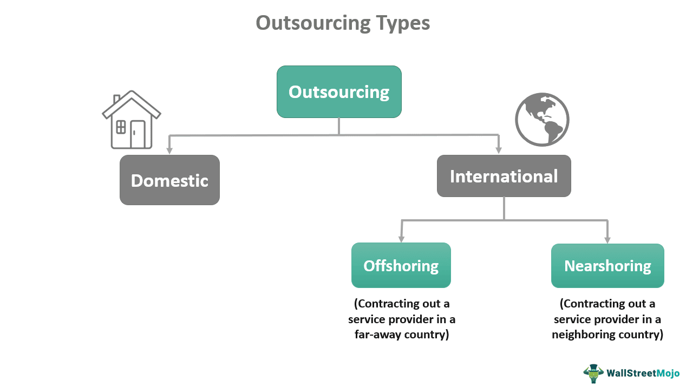

Outsourcing has emerged as a crucial strategy for organizations aiming to achieve cost efficiency and operational scalability. This approach not only affects local economies but also extends its influence across global markets, altering economic landscapes. The advancement of algorithmic trading has introduced new dimensions to outsourcing dynamics, requiring a sophisticated comprehension of its economic effects.

Algorithmic trading, characterized by the utilization of computer algorithms to automate trading processes, has significantly transformed the financial sector. This transformation has prompted financial firms to increasingly turn to outsourcing as a means to harness state-of-the-art technological expertise and manage complex trading operations. As businesses outsource critical components of their operations, from software development to analytical processes, they can access a broader talent pool at competitive prices, thus driving efficiency and innovation.

However, the outsourcing trend in algorithmic trading also presents challenges. While it can lead to substantial cost reductions and operational improvements, it has implications for domestic employment and economic stability, particularly within developed nations where traditional job markets may be affected. The shift in employment dynamics may result in skill shortages and raise concerns about the erosion of domestic competitive advantages.

This article analyses the multifaceted interactions between the outsourcing industry and its economic repercussions, with a particular emphasis on algorithmic trading. By exploring its benefits and drawbacks, we provide a comprehensive overview of this evolving landscape. Understanding this intricate relationship enables firms to strategically leverage outsourcing while considering its broader economic and employment impacts.

## Table of Contents

## The Rationale for Outsourcing in the Trading Industry

Outsourcing in the trading industry, particularly in algorithmic trading, provides financial firms with access to an extensive global talent pool at highly competitive prices. This strategy allows firms to bridge the gap between available in-house capabilities and the advanced skills and technologies necessary for sophisticated algorithmic trading.

One of the primary reasons for outsourcing in this sector is the ability to leverage cutting-edge technology and expertise that may not be readily available domestically. In algorithmic trading, the rapid development and deployment of trading algorithms require a deep understanding of mathematics, [statistics](/wiki/bayesian-statistics), and computer science. These skills are often in high demand and short supply within a single geographic location, making it both practical and economical to outsource.

Furthermore, strategic outsourcing can lead to substantial reductions in operational costs. By reallocating tasks that are resource-intensive yet non-core, firms can concentrate on activities that directly contribute to their competitive edge, such as developing bespoke trading strategies or enhancing customer relationships. This allocation of resources amplifies the potential for innovation, as more internal bandwidth is dedicated to creative and strategic tasks.

Outsourcing has played a pivotal role in fostering innovation and efficiency within trading operations. By tapping into a diverse set of global perspectives and technical knowledge, firms can innovate faster than they could alone. External partners often bring new insights and processes that drive efficiency gains and enhance the firm's overall performance.

Overall, outsourcing in [algorithmic trading](/wiki/algorithmic-trading) gives companies a competitive advantage by combining external expertise with reduced costs, thus enabling them to focus more acutely on their core business functions.

## Impact on Domestic Employment and Economy

Outsourcing in the trading industry can offer benefits such as cost reduction and access to global expertise; however, it also presents challenges for domestic employment and economies. Developed countries often face increased unemployment rates as firms shift jobs offshore to take advantage of lower labor costs. This migration of jobs not only results in immediate job losses but also contributes to a decline in intellectual capital and manufacturing capacity within these economies. As skilled positions are moved abroad, local workers may find themselves lacking opportunities to further develop essential expertise, which can erode a nation’s competitive advantage in high-tech and knowledge-intensive industries.

In the trading industry specifically, the outsourcing of algorithmic development and support functions can exacerbate existing skill shortages. As firms rely more on global talent pools, domestic professionals may miss out on critical training and experience in cutting-edge technologies, leading to a long-term reduction in the domestic workforce’s capability. To maintain a balanced economy, strategic approaches are necessary to address these impacts. This could involve investing in retraining programs for displaced workers, enhancing local education systems to better align with industry needs, and fostering partnerships between firms and local institutions to ensure a steady supply of qualified professionals.

Furthermore, it is essential for policymakers to consider the broader economic implications of outsourcing in the trading industry. Implementing measures such as incentives for companies to retain functions domestically, or investing in research and development initiatives, can help mitigate the negative effects of job migration. These strategies not only support domestic employment but also ensure that local economies remain robust and competitive in the global market. By carefully navigating the challenges and opportunities presented by outsourcing, countries can better preserve their economic strengths while adapting to the ever-evolving landscape of the trading industry.

## Algorithmic Trading: Benefits Derived from Outsourcing

Outsourcing in algorithmic trading brings several significant advantages, aiding financial firms in maintaining a competitive edge in the fast-paced trading environment. By allowing for the rapid deployment of advanced technologies and analytics capabilities, outsourcing enables firms to harness cutting-edge innovations without the need for extensive in-house development.

One of the primary benefits of outsourcing is access to specialized skills and technologies. Algorithmic trading requires sophisticated algorithms and models to analyze market data and execute trades efficiently. By outsourcing, firms tap into a global talent pool possessing expert knowledge and technical skills that may not be available internally. This not only enhances trading strategies but also significantly improves overall performance by incorporating the latest advancements in trading technology.

Outsourcing also facilitates economies of scale, contributing to cost reduction while enhancing market competitiveness. By partnering with specialized service providers, trading firms can share resources and spread fixed costs over a larger [volume](/wiki/volume-trading-strategy) of trade activities. This scalability allows firms to achieve lower transaction costs and allocate resources more effectively, ultimately leading to improved profit margins and a strengthened competitive position in the market.

Moreover, outsourcing plays a crucial role in helping firms adapt to regulatory changes efficiently. The trading industry is subject to stringent and often evolving regulatory requirements that can vary significantly across different jurisdictions. Outsourcing partners, especially those with expertise in compliance, provide the flexibility and knowledge needed to navigate these complexities. They allow trading firms to implement necessary adjustments promptly and ensure ongoing compliance without diverting core resources from strategic initiatives.

In summary, outsourcing provides an essential pathway for firms engaged in algorithmic trading to leverage advanced technologies, access specialized skills, achieve economies of scale, and respond adeptly to regulatory changes. By strategically utilizing outsourcing, firms can sustain superior trading performance and competitive advantage in the dynamically evolving financial markets.

## Challenges and Risks in Outsourcing

Outsourcing, while offering significant benefits, introduces a series of challenges and risks that firms must navigate carefully. One of the primary concerns is data security. When sensitive data is transferred to third-party vendors, the risk of unauthorized access or data breaches increases. According to a report by Cybersecurity Ventures, global cybercrime damage costs are expected to reach $10.5 trillion annually by 2025, underscoring the critical importance of robust data protection measures in outsourcing arrangements \[1\].

The reliance on third-party vendors can also pose a risk of over-dependence. If a vendor fails to meet its obligations, it can disrupt business operations, affecting everything from productivity to customer satisfaction. Companies need to cultivate a diversified vendor base and establish clear contingency plans to mitigate such risks.

Cross-border outsourcing adds another layer of complexity due to varying regulatory environments. Each country may have distinct regulations concerning data protection, financial transactions, and contractual obligations. Navigating these can be challenging and may require additional resources to ensure compliance. For example, the General Data Protection Regulation (GDPR) in the European Union imposes strict rules on data handling, which outsourced services must adhere to when dealing with any EU citizen's data \[2\].

Cultural and time zone differences represent another significant challenge. These differences can lead to miscommunication, delays, and a lack of cohesion in team dynamics. For efficient collaboration, firms may need to invest in cultural training and synchronization technologies, particularly in global operations where effective communication is crucial.

To address these challenges, firms should implement comprehensive risk management strategies. This includes conducting thorough due diligence on potential vendors, establishing rigorous data protection protocols, and regularly reviewing compliance with international regulations. Additionally, firms should foster a culture of continuous improvement by seeking employee feedback and adapting processes to ensure seamless operations amid diverse cultural and regulatory environments.

\[1\]: Cybersecurity Ventures. "Official Annual Cybercrime Report". <https://cybersecurityventures.com/cybercrime-damages-6-trillion-by-2021/>

\[2\]: European Union. "GDPR Portal: Site Overview". <https://www.eugdpr.org/>

## Case Studies: Outsourcing Success and Failures

Examining real-world examples of outsourcing in algorithmic trading illuminates both the successes and failures that firms have encountered, enabling better strategy formulation. Companies that have effectively leveraged outsourcing in algorithmic trading have often thrived due to enhanced technological capabilities, cost efficiencies, and access to specialized expertise.

A prominent example of successful outsourcing in algorithmic trading is the case of JPMorgan Chase. The firm outsourced specific components of its trading algorithms to specialized technology providers. This move allowed JPMorgan to access advanced technological innovations and analytics capabilities without the burden of developing them in-house. Consequently, the firm significantly improved its trading performance and operational efficiency, highlighting the strategic benefits of outsourcing when focused on core competencies and technological advancement.

Another successful case is that of a European [hedge fund](/wiki/hedge-fund-trading-strategies) that outsourced its algorithmic development and maintenance to an Indian technology firm. This decision enabled the hedge fund to achieve substantial cost reductions and allowed it to concentrate on core trading strategies. The partnership facilitated rapid deployment of sophisticated algorithmic solutions, giving the hedge fund a competitive edge in terms of speed and execution quality.

However, outsourcing is not without its pitfalls. One notable failure involved a mid-sized investment firm that outsourced its entire trading system development offshore. The project suffered from poor communication, cultural misunderstandings, and inadequate oversight, leading to a delay in implementation and subpar trading performance. This case underscores the importance of maintaining efficient communication channels and strong project management practices when engaging in outsourcing relationships.

Another instance of outsourcing failure was witnessed when a U.S.-based brokerage firm outsourced its trading analytics to a firm without sufficient expertise in financial markets. The firm experienced significant financial losses due to erroneous algorithmic predictions that stemmed from a lack of contextual understanding and expertise by the outsourcing partner. This case illustrates the critical necessity of thoroughly vetting partners and ensuring alignment with industry-specific requirements and knowledge.

Understanding the lessons from these case studies is essential for optimizing outsourcing strategies in algorithmic trading. Firms must ensure that their outsourcing decisions are guided by strategic alignment, rigorous partner selection, and effective management practices. By doing so, they can harness the benefits of outsourcing while avoiding common pitfalls that could jeopardize their competitive position.

## The Future of Outsourcing in the Trading Sector

Technological advancements such as [artificial intelligence](/wiki/ai-artificial-intelligence) (AI) and [machine learning](/wiki/machine-learning) are significantly reshaping the outsourcing landscape within the trading sector. These innovations are enabling firms to enhance their algorithmic trading capabilities, optimize data analytics, and automate complex trading tasks. By outsourcing these functions, companies can harness sophisticated technology without the necessity of developing it in-house, thus maintaining a competitive edge in a fast-evolving market environment.

Emerging markets are increasingly becoming attractive destinations for outsourcing trading functions. Countries in Asia, Eastern Europe, and Latin America offer cost-effective solutions coupled with a growing base of skilled professionals who specialize in areas such as data science, software development, and financial analysis. This shift is driven not only by cost considerations but also by the quality of talent available, which supports the implementation of complex trading strategies.

The post-COVID reality has highlighted the importance of resilience and flexibility, showcasing outsourcing as a vital component in business continuity planning. The pandemic disrupted global markets and supply chains, leading firms to re-evaluate their operational strategies. Outsourcing has emerged as a crucial tool in ensuring stability and adapting to unforeseen challenges, allowing companies to maintain operations and access global talent despite geographical constraints.

To capitalize on future opportunities, firms must continuously assess and adapt their outsourcing strategies. This involves evaluating potential outsourcing partners, staying abreast of technological trends, and understanding regulatory environments in different jurisdictions. Firms need to establish robust data security measures and ensure compliance with cross-border regulations to mitigate risks associated with outsourcing. By doing so, companies can unlock significant operational efficiencies and respond effectively to market dynamics, ensuring sustainable growth and competitive advantage in the trading sector.

## Conclusion

Outsourcing has become an integral aspect of the trading industry, affecting economic structures across the globe. Through strategic deployment, firms can achieve significant cost savings and drive innovation while accessing specialized skills and technologies. However, the benefits of outsourcing must be balanced against potential economic and employment implications. For instance, while outsourcing can reduce operational costs, it may also lead to increased unemployment and skill shortages in domestic markets, potentially eroding local competitive advantages.

To navigate these complexities, a strategic and informed approach to outsourcing is essential. This approach involves conducting thorough due diligence when selecting outsourcing partners, implementing robust risk management strategies, and ensuring compliance with cross-border regulations. Leveraging these practices can help firms unlock substantial value, optimizing operational efficiency and market competitiveness while mitigating inherent risks.

As technological advancements like artificial intelligence and machine learning continue to reshape the trading industry, continuous reevaluation of outsourcing strategies becomes increasingly important. The post-COVID environment underscores the need for resilience and flexibility, further accentuating the role of outsourcing in achieving these objectives. Firms must remain agile, adapting their outsourcing strategies to capture emerging opportunities and secure a competitive edge in a dynamically changing landscape.

## References & Further Reading

[1]: Bergstra, J., Bardenet, R., Bengio, Y., & Kégl, B. (2011). ["Algorithms for Hyper-Parameter Optimization."](https://dl.acm.org/doi/10.5555/2986459.2986743) Advances in Neural Information Processing Systems 24.

[2]: ["Advances in Financial Machine Learning"](https://www.amazon.com/Advances-Financial-Machine-Learning-Marcos/dp/1119482089) by Marcos Lopez de Prado

[3]: ["Evidence-Based Technical Analysis: Applying the Scientific Method and Statistical Inference to Trading Signals"](https://www.amazon.com/Evidence-Based-Technical-Analysis-Scientific-Statistical/dp/0470008741) by David Aronson

[4]: ["Machine Learning for Algorithmic Trading"](https://github.com/stefan-jansen/machine-learning-for-trading) by Stefan Jansen

[5]: ["Quantitative Trading: How to Build Your Own Algorithmic Trading Business"](https://www.amazon.com/Quantitative-Trading-Build-Algorithmic-Business/dp/1119800064) by Ernest P. Chan

[6]: Willcocks, L. P., Lacity, M., & Sauer, C. (Eds.). (2017). ["Outsourcing and Offshoring Business Services: Theoretical Perspectives and Global Management Strategies."](https://journals.sagepub.com/doi/10.1177/0268396221990778?icid=int.sj-abstract.citing-articles.8) Palgrave Macmillan.

[7]: European Union. "GDPR Portal: Site Overview." <https://www.eugdpr.org/>

[8]: Cybersecurity Ventures. "Official Annual Cybercrime Report". <https://cybersecurityventures.com/cybercrime-damages-6-trillion-by-2021/>