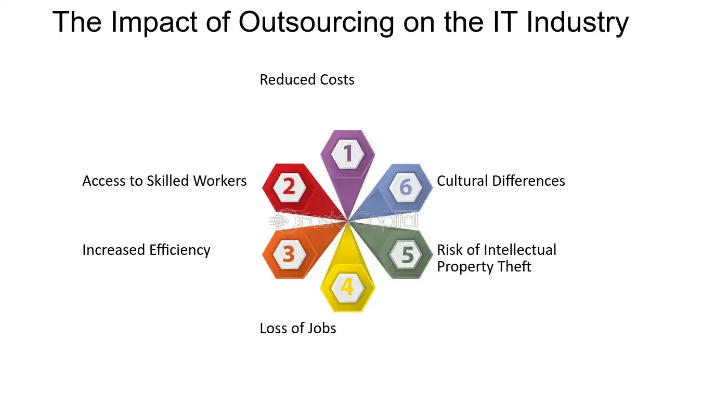

## Table of Contents

## What is outsourcing and how does it work?

Outsourcing is when a company hires another company or person outside of their own to do work for them. This can be anything from customer service to making parts of a product. Companies do this to save money, get special skills they don't have, or to focus on other important parts of their business.

When a company decides to outsource, they first figure out what work they want to give to someone else. Then, they look for other companies or people who can do that work well and at a good price. They make a deal with the chosen company or person, and then that outside group starts doing the work. The original company keeps an eye on the work to make sure it's done right and on time.

## Which industries commonly use outsourcing?

Many different industries use outsourcing to help their businesses. The technology industry is a big user of outsourcing. They often hire other companies to do things like writing software code, managing data, or providing customer support. This helps tech companies focus on making new products and services without worrying about all the other tasks.

Another industry that commonly uses outsourcing is manufacturing. Companies in this field might outsource the making of parts or the whole assembly of their products to other countries where it's cheaper. This can help them save money and make their products faster. The clothing and textile industry also does this a lot, often having clothes made in places where labor costs are lower.

The service industry, including things like call centers and human resources, also uses outsourcing a lot. Companies might hire other firms to handle their customer service calls or to manage their employee hiring and training. This lets them focus on their main business while still getting these important tasks done well.

## What are the primary reasons companies choose to outsource?

Companies choose to outsource mainly to save money. When they hire another company to do work, they often pay less than if they did the work themselves. This is because the other company might be in a place where it costs less to do the work, or they might have a way to do it more cheaply. Saving money is a big reason for outsourcing because it helps companies spend less and make more profit.

Another reason companies outsource is to get special skills or knowledge they don't have. Sometimes, a company needs something done that their own workers don't know how to do well. By outsourcing, they can find experts who can do the job better and faster. This helps the company make better products or services without having to train their own workers or hire new ones.

Lastly, outsourcing helps companies focus on what they do best. When they give other tasks to different companies, they can spend more time and energy on the most important parts of their business. This can make their main work better and help them grow faster. So, outsourcing lets companies be more efficient and successful.

## How does outsourcing affect the cost structure of a business?

Outsourcing can change the cost structure of a business by lowering the amount of money they spend on labor and other expenses. When a company outsources, they often pay another company to do work that would cost more if they did it themselves. This is because the other company might be in a place where it's cheaper to do the work, or they might have a way to do it more cheaply. By paying less for these services, the business can save money and use it for other important things.

Outsourcing also affects the cost structure by changing how a business spends its money. Instead of spending money on hiring and training new workers, or buying equipment and office space, the business pays another company to do the work. This can make the business's costs more predictable because they know how much they will pay the other company. It can also help the business avoid big costs like buying new machines or paying for employee benefits. By changing how they spend money, outsourcing can help a business manage its costs better and be more profitable.

## What are the potential benefits of outsourcing for a company?

Outsourcing can help a company save money. When a company hires another business to do some work, it often costs less than if they did it themselves. This is because the other business might be in a place where it's cheaper to do the work, or they might have a way to do it more cheaply. By saving money on these tasks, the company can spend more on other important things and make more profit.

Another benefit of outsourcing is that it lets a company get special skills or knowledge they don't have. Sometimes, a company needs something done that their own workers don't know how to do well. By outsourcing, they can find experts who can do the job better and faster. This helps the company make better products or services without having to spend time and money training their own workers or hiring new ones.

Outsourcing also helps a company focus on what they do best. When they give other tasks to different companies, they can spend more time and energy on the most important parts of their business. This can make their main work better and help them grow faster. So, outsourcing lets companies be more efficient and successful.

## What are the common challenges and risks associated with outsourcing?

Outsourcing can have some challenges and risks for a company. One big challenge is communication. When a company works with another company in a different place, it can be hard to talk and make sure everyone understands what needs to be done. This can lead to mistakes and delays. Another challenge is quality control. It can be tough to make sure the work done by the other company is as good as the company wants it to be. This means the company needs to keep a close watch on the work to make sure it meets their standards.

There are also risks involved with outsourcing. One risk is that the company might lose control over important parts of their business. When they give work to another company, they have to trust that company to do a good job. If the other company doesn't do the work well, it can hurt the company's reputation and their business. Another risk is security. When a company shares information with another company, there's a chance that information might not be kept safe. This can be a big problem if the information is important or private. So, companies need to be careful and think about these risks when they decide to outsource.

## How does outsourcing impact the quality of products or services?

Outsourcing can affect the quality of products or services in different ways. When a company hires another company to do some work, they hope that the other company will do a good job. If the other company has experts and good ways of doing things, the quality might be even better than if the company did the work themselves. But, if the other company doesn't do the work well, the quality can go down. The company needs to keep a close eye on the work to make sure it meets their standards.

Another way outsourcing can impact quality is through communication. When a company works with another company in a different place, it can be hard to talk and make sure everyone understands what needs to be done. If there are misunderstandings, the work might not be done right, and the quality can suffer. So, good communication is really important to keep the quality high when outsourcing.

## What is the effect of outsourcing on local employment and economies?

Outsourcing can change local employment and economies in big ways. When a company decides to outsource, they might move jobs to another country where it's cheaper to do the work. This can mean fewer jobs for people in their own country. If a lot of companies do this, it can lead to higher unemployment and make it harder for people to find work. This can hurt the local economy because people have less money to spend on things like food, clothes, and other goods and services.

On the other hand, outsourcing can help the economy of the country where the work is being done. When companies move jobs to another country, it can create new jobs there. This can help people in that country find work and earn money. When more people have jobs and money, they can spend more, which can help grow the economy of that country. So, outsourcing can be good for one place but not so good for another.

## How does outsourcing influence innovation within an industry?

Outsourcing can help innovation in an industry by bringing in new ideas and skills. When companies hire other companies to do work, they often work with experts who have different ways of doing things. These experts can bring new ideas and ways to solve problems that the original company might not have thought of. This can lead to new products or better ways of doing things, which can help the whole industry move forward. So, outsourcing can be a way to bring fresh thinking and innovation into a business.

On the other hand, outsourcing can also slow down innovation in some ways. When a company outsources important parts of their work, they might rely too much on the other company. This can make it hard for them to come up with their own new ideas because they are not doing as much of the work themselves. If the company doing the outsourcing is not careful, they might miss out on new ways to improve their products or services. So, while outsourcing can bring in new ideas, it can also make it harder for a company to innovate on their own.

## What are the long-term strategic impacts of outsourcing on an industry?

Outsourcing can change an industry in big ways over time. When many companies in an industry start outsourcing, it can lead to more competition. Companies that outsource might be able to make things cheaper and faster than others. This can make it hard for companies that don't outsource to keep up. Over time, this can change which companies are successful and which ones struggle. It can also lead to more companies in different countries getting involved in the industry, making it more global.

Another long-term impact of outsourcing is on jobs and skills. When companies outsource, they might move jobs to other countries. This can mean fewer jobs in their own country, which can hurt the local economy. But it can also mean more jobs in the country where the work is being done. Over time, this can change where the skills and knowledge in the industry are. Countries that get a lot of outsourced work might become better at certain things, while countries that lose jobs might need to find new ways to grow their economy. So, outsourcing can change where and how an industry grows over the long term.

## How do global economic trends affect outsourcing decisions?

Global economic trends can change how companies think about outsourcing. When the economy is doing well in one country, it might be cheaper for companies to outsource work there. But if the economy is not doing well, it might be more expensive or harder to outsource. For example, if a country's money gets stronger, it might cost more for a company to pay workers there. So, companies always need to watch what's happening in the world's economy to decide where to outsource.

Another way global economic trends affect outsourcing is through trade rules and taxes. Sometimes, countries make new rules or change taxes that can make it easier or harder to outsource. If a country makes it cheaper to bring things in from another country, more companies might decide to outsource there. But if a country makes new rules that make it harder to outsource, companies might have to find other places to do their work. So, companies need to keep an eye on these rules and taxes to make smart outsourcing choices.

## What are the future trends and predictions for outsourcing in various industries?

In the future, outsourcing is likely to keep growing in many industries. One big trend is the use of technology to make outsourcing easier and better. Companies are using things like [artificial intelligence](/wiki/ai-artificial-intelligence) and automation to do more work with fewer people. This means they can outsource more tasks and still get good results. Another trend is that more companies are looking to outsource things like data management and cybersecurity. As more business happens online, these areas become more important, and companies want to work with experts to keep their data safe and their systems running smoothly.

Another trend we might see is more focus on sustainable outsourcing. Companies are starting to care more about the environment and how their work affects it. They might choose to outsource to places that use green energy or have good environmental rules. This can help them do their work in a way that's better for the planet. Also, there could be more outsourcing to nearby countries instead of far away ones. This is called nearshoring, and it can help companies save time and money on shipping and make it easier to talk to the people doing the work.

## References & Further Reading

[1]: Bergstra, J., Bardenet, R., Bengio, Y., & Kégl, B. (2011). ["Algorithms for Hyper-Parameter Optimization."](https://dl.acm.org/doi/10.5555/2986459.2986743) Advances in Neural Information Processing Systems 24.

[2]: ["Advances in Financial Machine Learning"](https://www.amazon.com/Advances-Financial-Machine-Learning-Marcos/dp/1119482089) by Marcos Lopez de Prado

[3]: ["Evidence-Based Technical Analysis: Applying the Scientific Method and Statistical Inference to Trading Signals"](https://www.amazon.com/Evidence-Based-Technical-Analysis-Scientific-Statistical/dp/0470008741) by David Aronson

[4]: ["Machine Learning for Algorithmic Trading"](https://github.com/stefan-jansen/machine-learning-for-trading) by Stefan Jansen

[5]: ["Quantitative Trading: How to Build Your Own Algorithmic Trading Business"](https://www.amazon.com/Quantitative-Trading-Build-Algorithmic-Business/dp/1119800064) by Ernest P. Chan

[6]: Willcocks, L. P., Lacity, M., & Sauer, C. (Eds.). (2017). ["Outsourcing and Offshoring Business Services: Theoretical Perspectives and Global Management Strategies."](https://journals.sagepub.com/doi/10.1177/0268396221990778?icid=int.sj-abstract.citing-articles.8) Palgrave Macmillan.

[7]: European Union. "GDPR Portal: Site Overview." <https://www.eugdpr.org/>

[8]: Cybersecurity Ventures. "Official Annual Cybercrime Report". <https://cybersecurityventures.com/cybercrime-damages-6-trillion-by-2021/>