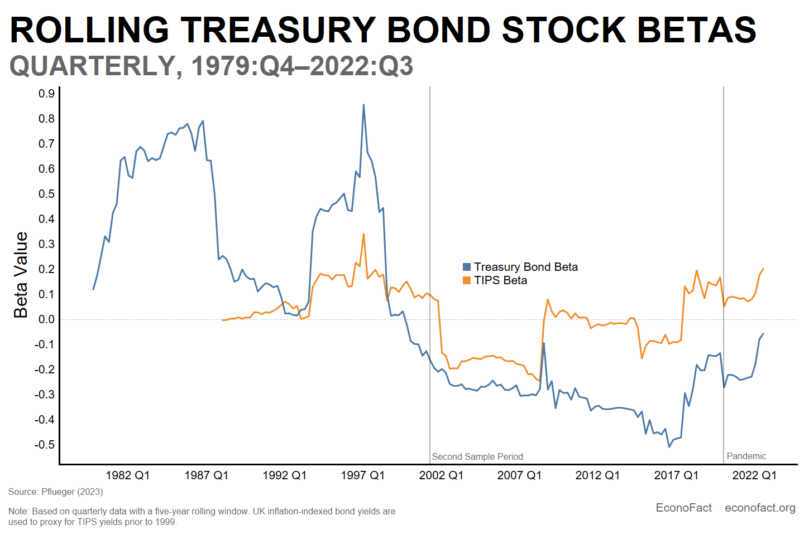

## Table of Contents

## What are bond yields and how are they calculated?

Bond yields are a way to measure the return an investor can expect from a bond. They show how much money you will earn from the bond's interest payments compared to the price you paid for the bond. If you buy a bond for less than its face value, the yield will be higher because you are getting the same interest payments but for a lower cost.

To calculate a bond's yield, you need to know the bond's annual interest payment, its current market price, and its face value. The most common way to calculate yield is the yield to maturity (YTM). This is the total interest rate you will earn if you hold the bond until it matures. You can find the YTM using a financial calculator or a formula that takes into account the bond's price, its face value, the interest payments, and the time until it matures. The formula can be complex, but it basically works out the interest rate that makes the present value of all future cash flows from the bond equal to its current price.

## How do bond yields affect the economy?

Bond yields have a big impact on the economy. When bond yields go up, it means that interest rates are going up too. This can make it more expensive for people and businesses to borrow money. If it's more expensive to borrow, people might buy fewer things, and businesses might not want to start new projects or hire more workers. This can slow down the economy because there's less spending and less growth.

On the other hand, when bond yields go down, interest rates usually go down too. This makes borrowing cheaper, so people and businesses are more likely to take out loans. They might buy more things, like houses or cars, and businesses might start new projects or hire more people. This can help the economy grow because there's more spending and more activity. So, bond yields are an important part of how the economy works, affecting how much people spend and how fast the economy grows.

## What does it mean for bond yields to be persistently low?

When bond yields stay low for a long time, it means that interest rates are also staying low. This can make borrowing money cheaper for everyone. People might take out more loans to buy houses or cars because it costs less to pay back the money they borrow. Businesses might also borrow more money to start new projects or expand their operations. This can help the economy grow because there is more spending and more activity happening.

However, low bond yields can also have some downsides. For people who save money, low yields mean they earn less interest on their savings. This can make it harder for them to save for things like retirement. Also, when interest rates are low, it might encourage people and businesses to take on too much debt because borrowing is so cheap. If they can't pay back their loans, it could cause problems in the economy later on. So, while low bond yields can help the economy grow, they also come with some risks.

## How do low bond yields influence investor behavior?

When bond yields are low, investors often look for other places to put their money where they can earn more. They might move their money from bonds to stocks or other investments that could give them a better return. This is because low bond yields mean they are not getting much interest from their bonds, so they want to find something that will give them more money.

This shift can make stock prices go up because more people are buying stocks. But it can also make the stock market riskier because everyone is trying to get a better return. If too many people move their money into stocks and the market goes down, they could lose a lot of money. So, low bond yields can make investors take more risks as they try to find better places to invest their money.

## What is the relationship between bond yields and stock market performance?

When bond yields are low, it often means that interest rates are low too. This can make people move their money from bonds to stocks because they want to earn more money. When more people buy stocks, the stock market can go up. This is because there is more demand for stocks, and when demand goes up, prices usually go up too. So, low bond yields can help the stock market do well because investors are looking for better places to put their money.

But there is also a risk. If everyone moves their money into stocks because bond yields are low, the stock market can become too crowded. If something bad happens, like a big drop in the market, a lot of people could lose money at the same time. This is because everyone was trying to get a better return by investing in stocks. So, while low bond yields can help the stock market go up, they can also make it riskier because more people are taking chances to earn more money.

## How do low bond yields impact corporate borrowing and investment?

When bond yields are low, it means that interest rates are low too. This makes it cheaper for companies to borrow money. When borrowing is cheaper, companies are more likely to take out loans. They might use this money to start new projects, buy new equipment, or expand their business. This can help the company grow and can also help the economy because there is more business activity happening.

But low bond yields can also make companies take on too much debt. Because borrowing is so cheap, companies might borrow more than they should. If they can't pay back all this debt later, it could cause problems for the company and the economy. So, while low bond yields can help companies grow and invest more, they also come with the risk of companies getting into too much debt.

## Can persistently low bond yields lead to stock market bubbles?

When bond yields stay low for a long time, it can make people move their money from bonds to stocks. They do this because they want to earn more money, and low bond yields mean they are not getting much interest from their bonds. When more people buy stocks, it can make stock prices go up. This is because there is more demand for stocks, and when demand goes up, prices usually go up too. So, low bond yields can help the stock market do well because investors are looking for better places to put their money.

But if too many people move their money into stocks because bond yields are low, it can create a stock market bubble. A bubble happens when prices go up a lot because everyone is buying, but the prices are not based on what the stocks are really worth. If the bubble bursts, stock prices can fall a lot, and people can lose a lot of money. So, while low bond yields can help the stock market go up, they can also make it riskier because more people are taking chances to earn more money.

## What are the long-term effects of low bond yields on stock valuations?

When bond yields stay low for a long time, it can make stock prices go up. This happens because people move their money from bonds to stocks to earn more money. Low bond yields mean that people are not getting much interest from their bonds, so they look for better places to put their money. When more people buy stocks, it increases the demand for stocks, and when demand goes up, prices usually go up too. So, over time, low bond yields can lead to higher stock valuations because investors are pushing up stock prices by looking for better returns.

But there can be risks with this. If stock prices go up a lot because of low bond yields, it can create a stock market bubble. A bubble happens when prices are higher than what the stocks are really worth because everyone is buying. If the bubble bursts, stock prices can fall a lot, and people can lose a lot of money. So, while low bond yields can make stock valuations go up in the long term, they can also make the stock market riskier because more people are taking chances to earn more money.

## How do central bank policies contribute to low bond yields?

Central banks can make bond yields low by keeping interest rates low. They do this by setting their main [interest rate](/wiki/interest-rate-trading-strategies), called the policy rate, at a low level. When this rate is low, it costs less for banks to borrow money from the central bank. Then, banks can lend money to people and businesses at lower rates too. This makes bond yields go down because new bonds are issued with lower interest rates, and the price of existing bonds goes up, which pushes their yields down.

Central banks can also buy bonds themselves, a process called quantitative easing. When they buy a lot of bonds, it increases the demand for bonds, which makes their prices go up and their yields go down. This is because bond yields move in the opposite direction of bond prices. So, by keeping interest rates low and buying bonds, central banks can keep bond yields low for a long time. This can help the economy by making borrowing cheaper, but it also has risks, like making people take on too much debt or causing stock market bubbles.

## What are the potential risks to the stock market from prolonged low bond yields?

When bond yields stay low for a long time, it can make the stock market riskier. People move their money from bonds to stocks because they want to earn more money. When a lot of people do this, it can make stock prices go up a lot. But if the prices go up too much, it can create a bubble. A bubble happens when prices are higher than what the stocks are really worth because everyone is buying. If the bubble bursts, stock prices can fall a lot, and people can lose a lot of money.

Another risk is that companies might borrow too much money because it's cheap. When borrowing is cheap, companies might take out loans to start new projects or expand. But if they borrow too much, they might not be able to pay it back later. This can cause problems for the company and the economy. So, while low bond yields can help the stock market go up, they can also make it more dangerous because more people and companies are taking chances to earn more money.

## How do investors adjust their portfolios in response to low bond yields?

When bond yields are low, investors often move their money from bonds to other places where they can earn more. They might put more money into stocks because stocks can give them a better return. This can make stock prices go up because more people are buying stocks. But it can also make the stock market riskier because everyone is trying to get a better return. So, investors might change their portfolios by buying more stocks and fewer bonds to try to make more money.

Investors might also look at other types of investments, like real estate or commodities, to find better returns. These investments can be riskier, but they might offer higher rewards when bond yields are low. Some investors might even take on more risk by investing in things like high-yield bonds or emerging market bonds, hoping to get more interest. So, when bond yields are low, investors often adjust their portfolios to find other ways to make money, which can lead to more risk but also the chance for more reward.

## What historical examples illustrate the impact of low bond yields on stock markets?

One big example of low bond yields affecting the stock market happened after the 2008 financial crisis. Central banks around the world, like the Federal Reserve in the U.S., kept interest rates very low to help the economy recover. This made bond yields go down a lot. People started moving their money from bonds to stocks because they wanted to earn more money. This helped the stock market grow a lot in the years after the crisis. The S&P 500, which is a big stock market index, went up a lot from 2009 to 2020. But it also made the market riskier because more people were taking chances to earn more money.

Another example is what happened in Japan in the 1990s and 2000s. Japan had very low bond yields for a long time because their economy was not growing much. People moved their money into stocks hoping to earn more. This helped the stock market for a while, but it also made the market more risky. In the early 1990s, Japan had a big stock market bubble that burst, and stock prices fell a lot. This showed that while low bond yields can help the stock market, they can also make it more dangerous if too many people take big risks.

## References & Further Reading

[1]: ["Advances in Financial Machine Learning"](https://www.amazon.com/Advances-Financial-Machine-Learning-Marcos/dp/1119482089) by Marcos Lopez de Prado

[2]: ["Evidence-Based Technical Analysis: Applying the Scientific Method and Statistical Inference to Trading Signals"](https://www.amazon.com/Evidence-Based-Technical-Analysis-Scientific-Statistical/dp/0470008741) by David Aronson

[3]: ["Algorithmic Trading: Winning Strategies and Their Rationale"](https://books.google.com/books/about/Algorithmic_Trading.html?id=WAlFDwAAQBAJ) by Ernest P. Chan

[4]: ["The Little Book of Common Sense Investing: The Only Way to Guarantee Your Fair Share of Stock Market Returns"](https://www.amazon.com/Little-Book-Common-Sense-Investing/dp/1119404509) by John C. Bogle

[5]: ["Irrational Exuberance"](https://en.wikipedia.org/wiki/Irrational_exuberance) by Robert J. Shiller

[6]: ["Investopedia"](https://www.investopedia.com/), a comprehensive resource for financial education and market analysis.

[7]: [U.S. Securities and Exchange Commission (SEC)](https://www.sec.gov/search-filings), providing guidelines and information on market regulations. 