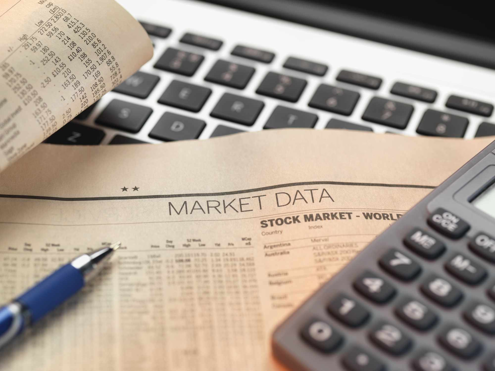

In recent years, the financial landscape has witnessed considerable change, shaped by the interplay of stock market dynamics, bond yields, and advancements in algorithmic trading. The intricate relationships among these factors are pivotal for investors and financial analysts seeking to understand market behaviors and make astute investment decisions.

Stock market dynamics encompass the fluctuations in stock prices, which are influenced by numerous elements including economic indicators, investor sentiment, and geopolitical events. These fluctuations not only reflect the economic value of companies but also serve as vital indicators of the broader economic health. As stock markets change, they inevitably influence other parts of the financial system, creating ripple effects that impact consumer behavior and investment strategies.



Bond yields, which represent the returns on investment for bondholders, play a significant role in shaping financial markets. Typically, bond yields and bond prices move inversely; when bond yields are lower, this can make stocks appear more attractive, potentially leading to increased stock market investments. The yield curve, which maps out bond yields across various maturities, is a critical tool for predicting economic cycles and investor actions.

Algorithmic trading has emerged as a transformative force in financial markets. By employing complex algorithms to execute trades at optimal speeds and prices, algo trading enhances market efficiency by reducing human errors and cutting transaction costs. However, this form of trading also introduces challenges, such as increased market volatility during high-frequency trading periods. The impact of algorithmic trading on market liquidity and pricing remains a topic of intense debate among experts.

Understanding how stock market dynamics, bond yields, and algorithmic trading influence one another is crucial. These elements collectively shape market volatilities and investor strategies, presenting both opportunities and challenges. By reviewing current trends and historical data, this article aims to equip readers with the knowledge needed to navigate the evolving financial landscape and make informed decisions in an ever-changing economic environment.

## Table of Contents

## Understanding Stock Market Trends

The stock market functions as a dynamic, multifaceted system impacted by a variety of factors. Economic indicators such as GDP growth, unemployment rates, and inflation are critical in determining market trends. Positive economic indicators typically bolster investor confidence, potentially leading to a rise in stock prices as investors anticipate higher corporate profits. Conversely, negative economic indicators can lead to pessimism and a decline in market value.

Investor sentiment plays a crucial role in stock market trends. It is guided by subjective factors like market buzz, media influence, and social trends. Sentiment can drive markets beyond fundamental valuations, often resulting in scenarios of overvaluation or undervaluation. Accurate gauging of market sentiment allows for strategic investment decisions, taking advantage of market inefficiencies.

Geopolitical events, including trade tensions, regulatory changes, and international conflicts, also substantially influence stock markets. Such events can introduce uncertainty, leading to [volatility](/wiki/volatility-trading-strategies) as investors react to perceived risks. For instance, the imposition of tariffs can affect specific sectors, consequently impacting related stock values.

Fluctuations in stock markets extend their influence to the economy broadly, affecting consumer spending, corporate investments, and even fiscal policies. A bull market generally encourages consumer confidence and spending, fueling economic growth. Conversely, bear markets may lead to reduced spending and a slowdown in economic activity as consumers and businesses become more risk-averse.

To seize opportunities and mitigate risks, investors must diligently monitor and analyze market trends. Advanced statistical analyses, financial models, and data analytics are vital tools in predicting market movements and valuations. For example, moving averages and regression analysis can be employed to identify potential entry and [exit](/wiki/exit-strategy) points in the market.

Historical patterns provide valuable insights into prospective market behaviors. Through technical analysis, investors can study past price movements and volumes to forecast future performance. Recognizing patterns, such as head and shoulders or double bottoms, enables informed trading decisions. Despite the complexities involved, a thorough understanding of these factors enhances the potential for strategic and profitable stock market investments.

## The Role of Bond Yields in Financial Markets

Bond yields, which signify the return investors earn from holding bonds, play a pivotal role in financial markets. These yields are inversely related to bond prices, meaning as bond prices rise, yields fall and vice versa. This inverse relationship is fundamental to understanding the dynamics of bond yields.

In recent years, bond yields have remained notably low. This trend has profoundly influenced the allocation of capital across financial markets. When bond yields are low, returns on bonds diminish, making stocks a more appealing investment alternative due to the potential for higher returns. Consequently, investors often shift capital from bonds to equities, contributing to increased activity and potentially higher valuations in stock markets.

The yield curve is an essential tool for analyzing bond yields. It represents the yields of bonds across various maturities, generally ranging from short-term to long-term. The shape of the yield curve, whether normal, inverted, or flat, provides insights into economic expectations. For instance, an inverted yield curve, where short-term rates exceed long-term rates, has historically been a precursor to economic recessions.

Several factors influence bond yields, including economic conditions, inflation expectations, and monetary policy decisions. Economically, strong growth prospects can lead to higher inflation expectations, prompting central banks to increase interest rates, thereby elevating bond yields. Conversely, in times of economic uncertainty or recession, central banks may lower interest rates to stimulate growth, resulting in lower bond yields.

Inflation expectations are another critical determinant of bond yields. If investors anticipate rising inflation, they demand higher yields to compensate for the eroding purchasing power of future interest payments. Consequently, bond yields tend to increase with rising inflation expectations.

Monetary policy is also a fundamental driver of bond yields. Central banks, such as the Federal Reserve, use various tools to influence interest rates, impacting bond yields directly. For instance, open market operations, where the central bank buys or sells government bonds, can increase or decrease the supply of money, influencing bond yields accordingly.

Understanding these factors is crucial for investors and financial analysts as they assess how bond yields will evolve and their impact on investment strategies and economic predictions.

## Algorithmic Trading and Market Efficiency

Algorithmic trading, commonly known as algo trading, leverages computer algorithms to [carry](/wiki/carry-trading) out trading orders at unmatched speeds and optimal prices. This advanced trading strategy has transformed financial markets by handling a sizable portion of the trades in principal exchanges. By automating the trading process, [algorithmic trading](/wiki/algorithmic-trading) enhances market efficiency, primarily by reducing human errors and cutting down transaction costs, both of which are key factors in achieving precise and swift market transactions.

The automation of trading processes through algorithms allows for the execution of complex strategies based on predefined criteria, such as timing, price, quantity, or any mathematical model. This level of precision is unattainable with human trading alone, thus providing algo trading an edge in market operations. An example of a basic algorithm might be:

```python
import numpy as np

def moving_average(prices, window_size):
    return np.convolve(prices, np.ones(window_size) / window_size, 'valid')

# Example usage
stock_prices = [120, 121, 122, 119, 123, 124, 125, 126]
ma = moving_average(stock_prices, 3)
print(ma)  # [121. 120.66666667 121.33333333 122. 124. 125.]
```

While algo trading promotes efficiency, it isn't without its challenges. One of the significant concerns associated with it is the risk of increased market volatility, particularly prevalent in high-frequency trading ([HFT](/wiki/high-frequency-trading-strategies)). HFT constitutes a subset of algorithmic trading characterized by quick order execution and short holding periods, often leading to swings in market conditions. Such volatility stems from the rapid-fire execution of trades that can overwhelm the market, causing abrupt price shifts and [liquidity](/wiki/liquidity-risk-premium) issues.

Moreover, the influence of algorithmic trading on market liquidity and asset pricing continues to incite discussions among financial professionals. While some experts argue that algo trading provides liquidity and tightens bid-ask spreads, others warn about its potential to exacerbate liquidity crunches in volatile markets. The cascading effect of automated trades during market stress can lead to events like flash crashes, where prices plummet and recover rapidly over brief periods.

Algorithmic trading undeniably contributes to market efficiency, but the balance between its benefits and inherent risks remains a topic of continuous analysis. As the technology evolves, addressing the limitations and refining the regulatory frameworks governing algo trading will be crucial in maximizing its potential while safeguarding market stability.

## Interdependencies Between Stock Markets, Bond Yields, and Algorithmic Trading

The relationships between stock markets, bond yields, and algorithmic trading are dynamic and multifaceted, requiring precise understanding to navigate effectively. Changes in bond yields directly influence stock market volatility, which in turn affects traders' strategies and movements within the market. Typically, when bond yields rise, it signals higher interest rates, increasing borrowing costs for companies and potentially decreasing their profitability. This can lead to a drop in stock prices as investors adjust their expectations for future returns.

Algorithmic trading plays a crucial role by leveraging these market changes. Algorithms often exploit [arbitrage](/wiki/arbitrage) opportunities arising from discrepancies between bond and stock market pricing. For instance, if a sudden change in bond yields results in a stock price lagging behind its expected adjustment, algorithmic traders might capitalize on this short-term inefficiency to make profits through rapid buy and sell operations.

Understanding these interdependencies is vital for making strategic decisions. Investors and policymakers can stabilize and grow financial markets by monitoring the influence of bond yields on stock volatility and recognizing the role of algorithmic trading in market dynamics. Algorithmic strategies can amplify price changes, so managing their impact is essential for maintaining market stability.

By analyzing these connections, stakeholders are better prepared for economic fluctuations. For example, during periods of anticipated shifts in monetary policy, investors might adjust their portfolios by reallocating assets between stocks and bonds. Algorithmic trading systems could be tuned to respond to specific signals related to yield changes, thus reducing risk and maximizing returns. Exploring these interconnected elements provides valuable insights, enabling strategic planning and more effective market participation.

## Conclusion

The financial impact of stock market dynamics, bond yields, and algorithmic trading is significant and evolving. As these elements continue to advance, they create both opportunities and challenges for investors and financial institutions. The rapid evolution of technology and shifts in economic indicators require vigilant attention from all market participants. It's essential for investors and analysts to adopt innovative strategies and utilize advanced tools to refine their decision-making processes. Technological advancements such as [machine learning](/wiki/machine-learning) and big data analytics provide cutting-edge methods for analyzing market data and deriving insights. For instance, algorithmic trading systems utilize complex algorithms to identify and exploit market inefficiencies in real time, allowing for rapid and accurate trades.

The interconnectedness of stock market performance, bond yields, and algorithmic trading necessitates a thorough understanding of their interdependencies to navigate effectively through financial markets. Factors such as [interest rate](/wiki/interest-rate-trading-strategies) changes, inflation trends, and fiscal policies play a critical role in shaping market conditions, which must be continuously monitored and analyzed.

Ultimately, a comprehensive grasp of these aspects is pivotal for more informed and strategic financial engagements. By maintaining an awareness of emerging trends and economic shifts, investors can better position themselves to capitalize on opportunities while mitigating potential risks. As the financial landscape continues to adapt, those who are well-prepared and knowledgeable will have a distinct advantage in achieving success.

## References and Further Reading

Investopedia offers a comprehensive resource for financial education and market analysis. It provides articles, tutorials, and tools that cover a wide spectrum of financial topics, from basic investing principles to advanced stock trading strategies, making it a valuable reference for both novice and seasoned investors.

The U.S. Securities and Exchange Commission (SEC) plays a crucial role in ensuring fair and efficient financial markets. It offers guidelines, rules, and information on market regulations which are essential for maintaining investor confidence and market integrity. By visiting the SEC's official website, one can gain insights into compliance, legal frameworks, and other regulatory matters affecting financial markets.

For those interested in exploring the latest advancements in algorithmic trading and market automation, numerous resources are available. These include scholarly articles, industry reports, and [books](/wiki/algo-trading-books) that provide detailed analyses of financial technology and automated investing strategies. These resources often explore quantitative models, discuss the implications of high-frequency trading, and suggest methodologies for implementing algorithmic systems efficiently. As this sector continually evolves, staying informed on emerging trends and technologies is crucial for leveraging these tools effectively.

## References & Further Reading

[1]: ["Advances in Financial Machine Learning"](https://www.amazon.com/Advances-Financial-Machine-Learning-Marcos/dp/1119482089) by Marcos Lopez de Prado

[2]: ["Evidence-Based Technical Analysis: Applying the Scientific Method and Statistical Inference to Trading Signals"](https://www.amazon.com/Evidence-Based-Technical-Analysis-Scientific-Statistical/dp/0470008741) by David Aronson

[3]: ["Algorithmic Trading: Winning Strategies and Their Rationale"](https://books.google.com/books/about/Algorithmic_Trading.html?id=WAlFDwAAQBAJ) by Ernest P. Chan

[4]: ["The Little Book of Common Sense Investing: The Only Way to Guarantee Your Fair Share of Stock Market Returns"](https://www.amazon.com/Little-Book-Common-Sense-Investing/dp/1119404509) by John C. Bogle

[5]: ["Irrational Exuberance"](https://en.wikipedia.org/wiki/Irrational_exuberance) by Robert J. Shiller

[6]: ["Investopedia"](https://www.investopedia.com/), a comprehensive resource for financial education and market analysis.

[7]: [U.S. Securities and Exchange Commission (SEC)](https://www.sec.gov/search-filings), providing guidelines and information on market regulations. 