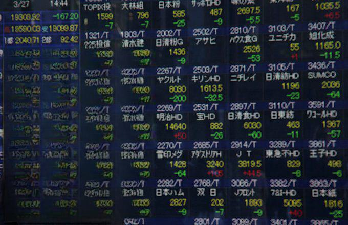

## Table of Contents

## What was the Plaza Accord?

The Plaza Accord was an agreement made in 1985 between five major countries: the United States, Japan, West Germany, France, and the United Kingdom. They met at the Plaza Hotel in New York City to discuss their currencies. The main goal was to lower the value of the U.S. dollar compared to the Japanese yen and the German Deutsche Mark. This was done because the U.S. wanted to reduce its big trade deficit, which means they were buying more from other countries than they were selling.

After the Plaza Accord, the value of the U.S. dollar went down as planned. This made American products cheaper for other countries to buy, which helped reduce the trade deficit. However, it also caused some problems. Japan's economy was affected because their yen became stronger, making their exports more expensive. This led to changes in Japan's economy and some difficulties in the years that followed. Overall, the Plaza Accord was important because it showed how countries could work together to manage their currencies and trade.

## When and where was the Plaza Accord signed?

The Plaza Accord was signed on September 22, 1985. The place where it happened was the Plaza Hotel in New York City. 

This agreement was between five big countries: the United States, Japan, West Germany, France, and the United Kingdom. They wanted to make the U.S. dollar weaker compared to the Japanese yen and the German Deutsche Mark.

## Which countries were involved in the Plaza Accord?

The Plaza Accord involved five countries: the United States, Japan, West Germany, France, and the United Kingdom. These countries came together to make an important agreement about their money.

They met at the Plaza Hotel in New York City in 1985. The main goal was to make the U.S. dollar weaker compared to the Japanese yen and the German Deutsche Mark. This was to help the U.S. reduce its trade deficit, which means they wanted to sell more and buy less from other countries.

## What were the main objectives of the Plaza Accord?

The main goal of the Plaza Accord was to make the U.S. dollar weaker compared to the Japanese yen and the German Deutsche Mark. This was important because the United States had a big trade deficit, meaning they were buying more from other countries than they were selling. By making the dollar weaker, American products would become cheaper for other countries to buy, which could help reduce the trade deficit.

The Plaza Accord was signed by five big countries: the United States, Japan, West Germany, France, and the United Kingdom. They met at the Plaza Hotel in New York City in 1985 to make this agreement. The plan worked, and the value of the U.S. dollar went down. However, it also caused some problems, especially for Japan, as their yen became stronger and their exports more expensive. This led to changes and challenges in Japan's economy in the years that followed.

## How did the Plaza Accord aim to affect the value of the U.S. dollar?

The Plaza Accord aimed to make the U.S. dollar weaker compared to the Japanese yen and the German Deutsche Mark. This was important because the United States had a big trade deficit, which means they were buying more from other countries than they were selling. By making the dollar weaker, American products would become cheaper for other countries to buy. This could help the U.S. sell more and buy less, reducing the trade deficit.

The agreement was made by five big countries: the United States, Japan, West Germany, France, and the United Kingdom. They met at the Plaza Hotel in New York City in 1985 to sign the accord. After the agreement, the value of the U.S. dollar went down as planned. This helped the U.S. with its trade, but it also caused some problems for Japan. Their yen became stronger, making their exports more expensive, which led to economic challenges in Japan in the years that followed.

## What immediate effects did the Plaza Accord have on currency markets?

The Plaza Accord had a big effect on currency markets right away. After the agreement was signed in 1985, the value of the U.S. dollar started to go down quickly. This was what the countries wanted because they wanted to make American products cheaper for other countries to buy. The Japanese yen and the German Deutsche Mark became stronger compared to the dollar. This change happened fast because the countries worked together to make it happen.

The immediate effects were seen in how much the currencies changed. The U.S. dollar lost about 50% of its value against the yen in the two years after the accord. This big change helped the U.S. with its trade because their products were now cheaper for other countries. But it also caused some problems. Japan's economy felt the impact because their yen was now stronger, making their exports more expensive. This led to some challenges for Japan in the years that followed.

## How did the Plaza Accord influence global trade balances?

The Plaza Accord had a big effect on global trade balances. The main goal was to help the United States reduce its big trade deficit. This means the U.S. was buying more from other countries than it was selling. By making the U.S. dollar weaker compared to the Japanese yen and the German Deutsche Mark, American products became cheaper for other countries to buy. This helped the U.S. sell more and buy less, which started to reduce their trade deficit.

However, the changes also affected other countries, especially Japan. When the yen became stronger, Japanese products got more expensive for other countries to buy. This made it harder for Japan to sell their goods abroad, which led to a decrease in their exports. As a result, Japan's trade surplus, which means they were selling more than they were buying, started to shrink. The Plaza Accord showed how changes in currency values can have a big impact on global trade balances, helping some countries while causing challenges for others.

## What were the long-term impacts of the Plaza Accord on currency valuation?

The Plaza Accord had big long-term effects on how currencies were valued. After the agreement, the U.S. dollar kept getting weaker for a while. This made American products cheaper for other countries to buy, which helped the U.S. with its trade. But it also made the Japanese yen and the German Deutsche Mark stronger. Japan had a hard time because their exports became more expensive, and this led to big changes in their economy. Over time, the yen's value went up a lot, and this affected how Japan did business with the rest of the world.

In the long run, the Plaza Accord showed that countries working together could change currency values on purpose. It made people think more about how currency values affect trade and the economy. After the Plaza Accord, countries started to be more careful about how they managed their money. They learned that big changes in currency values can cause problems, so they tried to make smaller and more steady changes. This led to more talks and agreements about currencies and trade, as countries wanted to keep their economies stable.

## How did the Plaza Accord affect the Japanese yen and its economy?

The Plaza Accord made the Japanese yen much stronger compared to the U.S. dollar. This happened because the five countries agreed to make the dollar weaker. When the yen got stronger, Japanese products became more expensive for other countries to buy. This made it harder for Japan to sell things like cars and electronics abroad. As a result, Japan's exports went down, and their trade surplus, which means they were selling more than they were buying, started to shrink.

The stronger yen had big effects on Japan's economy. Companies in Japan found it harder to make money from selling things to other countries. This led to a slowdown in Japan's economy. Also, the strong yen made it easier for Japan to buy things from other countries, which changed the way they did business. Over time, Japan had to deal with these changes, and it led to a period of economic challenges. The Plaza Accord showed how changes in currency values can cause big problems for a country's economy.

## What role did the Plaza Accord play in the development of international monetary policy?

The Plaza Accord played a big role in shaping how countries think about and manage their money. Before the accord, countries didn't often work together to change their currency values on purpose. But when the U.S., Japan, West Germany, France, and the UK met at the Plaza Hotel in 1985, they showed that countries could team up to make big changes. They agreed to make the U.S. dollar weaker compared to the yen and the Deutsche Mark. This helped the U.S. with its trade, but it also showed that these kinds of actions could have big effects on other countries' economies.

After the Plaza Accord, people started to think more about how currency values affect trade and the economy. Countries learned that making big changes in currency values can cause problems, so they started to be more careful. They tried to make smaller and more steady changes to keep their economies stable. This led to more talks and agreements about currencies and trade. The Plaza Accord was an important moment that showed countries they could work together to manage their money, but they also needed to think about the long-term effects on the world economy.

## How did the Plaza Accord contribute to the economic conditions leading to the 1987 stock market crash?

The Plaza Accord helped create the conditions that led to the 1987 stock market crash. After the accord, the U.S. dollar got weaker compared to other currencies like the Japanese yen. This made American products cheaper for other countries to buy, which helped the U.S. sell more. But it also caused a lot of money to flow into the U.S. stock market. Investors from other countries, especially Japan, started buying U.S. stocks because their money was worth more. This pushed stock prices up a lot, creating a big bubble.

When the bubble got too big, it burst, causing the 1987 stock market crash. The Plaza Accord's effect on currency values made the situation worse. The sudden changes in currency values and the big movements of money around the world made the markets unstable. On October 19, 1987, known as Black Monday, the U.S. stock market fell a lot in one day. The Plaza Accord showed how changes in currency values can have big effects on the economy and the stock market, leading to big crashes like the one in 1987.

## What lessons can be learned from the Plaza Accord regarding international economic cooperation and currency interventions?

The Plaza Accord showed us that countries can work together to change their money's value on purpose. This can help fix problems like big trade deficits, but it can also cause new problems. When the U.S., Japan, West Germany, France, and the UK made the dollar weaker, it helped the U.S. sell more stuff. But it made Japan's yen stronger, which hurt their economy because their products got more expensive for other countries to buy. This taught us that big changes in money values can have big effects on different countries, and we need to be careful about how these changes might hurt some countries while helping others.

Another lesson from the Plaza Accord is that working together on money matters can lead to big economic changes. After the accord, the U.S. dollar kept getting weaker, and this led to more money flowing into the U.S. stock market. This helped cause the big stock market crash in 1987. It showed us that changing money values can make markets unstable and lead to big crashes. So, countries learned to be more careful and make smaller, steadier changes to keep their economies stable. This led to more talks and agreements about money and trade to avoid big problems in the future.

## References & Further Reading

[1]: Funabashi, Y. (1988). ["Managing the Dollar: From the Plaza to the Louvre."](https://archive.org/details/managingdollarfr0000funa) Institute for International Economics. 

[2]: Frankel, J. (1994). ["The Making of Exchange Rate Policy in the 1980s,"](https://scholar.harvard.edu/frankel/publications/making-exchange-rate-policy-1980s) National Bureau of Economic Research Working Paper No. 3552.

[3]: Baker, J. C., & Ballew, C. C. (1986). ["The International Monetary System: Problems and Prospects,"](https://link.springer.com/article/10.1023/A:1008313608550) MIT Press.

[4]: ["The Plaza Agreement and Japan: Good Financial Sense?"](https://en.wikipedia.org/wiki/Plaza_Accord) Economic Policy Institute, September 2000. 

[5]: Dong, L., & Clouse, J. A. (1999). ["The US International Economic Policy in an Integrated World Economy"](https://www.nber.org/papers/w6849) Quarterly Journal of Economics, 101(2), 445-479.