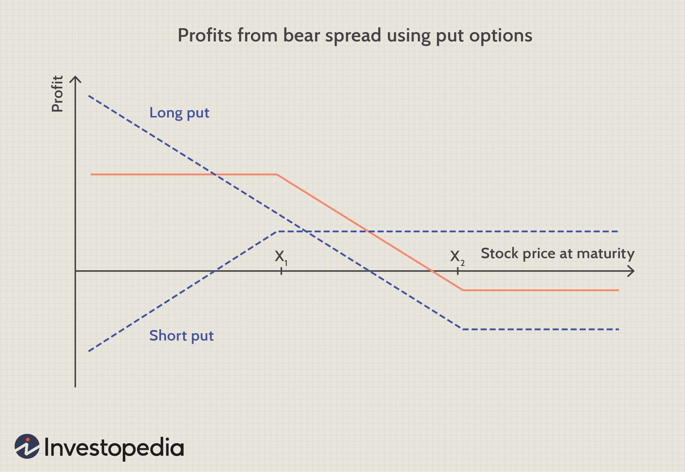

Options trading in financial markets incorporates a variety of strategies that traders employ to take advantage of price movements and the passage of time. Among these strategies, credit spreads stand out for their ability to potentially generate profits through time decay—an inherent characteristic of options. Credit spreads involve the simultaneous writing of a high-premium option and purchasing a lower-premium option within the same asset class or underlying asset. The goal is to profit from the difference between the sold and bought premiums, making accurate trade execution essential.

Central to the efficiency of a credit spread is the concept of 'theta,' a Greek letter symbolizing the rate at which options lose value as they approach expiration. Unlike other factors influencing options pricing, theta's inevitability is rooted in time's constant march forward; options decrease in value, reflecting this time decay. Experienced options traders understand that mastering theta can be pivotal in designing and maintaining a profitable trading strategy. A key aspect of utilizing credit spreads is embracing positive theta, where the time decay works to the trader's advantage, especially under stable market conditions.



The methodology adopted in executing credit spreads significantly impacts the strategy's success. Algorithmic trading, which applies automated systems to make trading decisions, has emerged as an optimal tool in managing the complexities of credit spreads. By using algorithmic strategies, traders can optimize entry and exit points, adjust positions in response to real-time market data, and manage risk effectively, ultimately striving for consistent profitability. This article highlights the role of positive theta in credit spreads and its optimization through algorithmic trading, revealing pathways to achieving sustained returns in options trading.

## Table of Contents

## What Is Theta?

Theta, often referred to as "time decay," is a critical Greek in options trading. It quantifies the rate at which an option's price diminishes as it approaches expiration. For an option, theta is typically expressed as a negative number, reflecting the erosion of its value over a specified time period, usually a single day. Mathematically, theta for an option can be described as:

$$
\Theta = \frac{\partial V}{\partial t}
$$

where $V$ is the option's price and $t$ is time.

In options trading, theta behaves differently based on the maturity and strike price of the option. Shorter-term options tend to have higher theta values, indicating a rapid decline in their extrinsic value as expiration approaches. This is because the time component of the option's overall value, which comprises intrinsic and extrinsic elements, diminishes more quickly as time left to expiration decreases.

For options sellers, theta is often advantageous. Since they collect premiums from the buyers upfront, any reduction in an option's time value directly impacts its market price, often allowing the writers to potentially retain a greater portion of the premium if the options expire worthless. For instance, if an option with a theta of -0.05 loses $0.05 in value per day, a seller benefits as the buyer's cost diminishes over time without any corresponding increase in the option's intrinsic value.

Understanding theta's influence is crucial for traders strategically aiming to exploit time decay, particularly in scenarios where the underlying asset remains relatively stable or moves within a predetermined range.

## Theta and Credit Spreads

Credit spreads represent a strategic approach in options trading. This method involves simultaneously selling a high-premium option while buying a low-premium option within the same asset category. This results in an initial net credit for the trader due to the premium differential. The primary advantage of this strategy lies in the concept of time decay, where the option's value erodes as it approaches expiration. 

In scenarios where the time decay is a significant [factor](/wiki/factor-investing), credit spreads become highly advantageous. The key benefit emerges from the fact that the premium obtained from the sold option is higher than the premium paid for the purchased option. This discrepancy allows traders to potentially realize profits if the option prices narrow towards expiration. 

Moreover, credit spreads are characterized by a positive theta. Theta, as a measure of time decay, indicates how much the price of the option decreases as time progresses. In the case of credit spreads, this positive theta implies that the spread position stands to gain from the time decay effect, particularly when the underlying asset exhibits minimal price fluctuations. 

The effectiveness of credit spreads in options trading is largely due to the exploitation of time decay. A stable underlying asset enhances the potential for realizing gains from these strategies, as it reduces the likelihood of significant adverse movements impacting the credit spread. This strategic exploitation of theta makes credit spreads a vital tool for traders looking to optimize returns while managing risk through careful position structuring.

## Algorithmic Trading and Credit Spreads

Leveraging [algorithmic trading](/wiki/algorithmic-trading) in handling credit spreads can significantly enhance a trader's ability to automate the monitoring of theta decay and adjust positions with precision. Algorithms equipped with real-time market data can continuously evaluate conditions and execute trades that maximize the exploitation of theta, thereby optimizing the potential return through strategic entry and [exit](/wiki/exit-strategy) points.

The efficiency of algorithmic trading stems from its capacity to handle vast amounts of data with speed and accuracy, enabling traders to respond to even the slightest market movements. Advanced data analytics serve as the backbone of these algorithms, offering insights that go beyond human capabilities. By analyzing patterns and trends within the financial markets, algorithms can generate forecasts about future price movements.

A key advantage of using algorithms is their ability to simulate various scenarios and assess the potential outcomes of different strategies. For example, a Python-based algorithm might monitor the theta decay of a credit spread position as follows:

```python
import numpy as np

def calculate_theta(option_price, time_to_expiry, volatility):
    """Estimate theta using the Black-Scholes model."""
    theta = -option_price * volatility * np.sqrt(time_to_expiry)
    return theta

# Example parameters
option_price = 10.0  # Option price in dollars
time_to_expiry = 0.1  # Time to expiry in years
volatility = 0.2  # Annualized volatility

theta_value = calculate_theta(option_price, time_to_expiry, volatility)
print(f"Theta estimate: {theta_value:.2f}")
```

This simple algorithm demonstrates the quantification of theta decay over time, providing critical data required for adjusting positions. By continually reassessing the market conditions and updating these calculations, traders can ensure that their credit spread strategies remain aligned with market dynamics.

In addition to evaluating theta, algorithmic trading systems can incorporate other option Greeks and market parameters. This holistic approach equips traders to adapt quickly to changes in implied [volatility](/wiki/volatility-trading-strategies), market news, and other factors that might influence the profitability of credit spreads.

Furthermore, these algorithms can also integrate [machine learning](/wiki/machine-learning) models, enabling them to learn from past trading activities and refine their strategies. This self-improvement aspect ensures that the decision-making process evolves, leading to more robust and reliable trading strategies over time.

Ultimately, algorithmic trading provides a scalable and efficient mechanism for managing credit spread portfolios, reducing the manual effort required and enhancing strategic execution to capitalize on the nuances of market movements.

## Strategies for Maximizing Theta

To maximize positive theta in options trading, traders employ several strategies that leverage the benefits of time decay. A predominant approach is the use of short-term credit spreads. These spreads, typically executed with options that have a few weeks until expiration, capitalize on the accelerated time decay that occurs as the expiration date approaches. The rapid decay during this short period can significantly enhance profitability, given that the premium collected from options sold may expire worthless, especially if the underlying asset price remains stable. 

Another effective tactic is the implementation of calendar spreads. This strategy involves buying and selling options of the same underlying asset but with different expiration dates. Here, traders exploit the varying rates of theta decay between the short and long-dated options. As the shorter-dated option decays more quickly, the trader can potentially profit from the differential in theta between the two expiration periods. This strategy is particularly useful when market volatility is expected to remain stable or increase, as a stable market can accentuate the effects of time decay.

Diversification across multiple credit spread positions is also a prudent approach to maximize theta. By spreading risk across different expirations and strike prices, traders can buffer their portfolios against market fluctuations and unforeseen volatility spikes. This diversification allows for steady capture of time decay benefits across different market scenarios. Traders often use quantitative models and algorithms to identify optimal spreads that balance risk and return, ensuring that the portfolio remains aligned with their risk tolerance and market outlook.

Overall, maximizing theta requires a strategic combination of these tactics. By focusing on optimizing time decay through short-term credit spreads and calendar spreads, and diversifying positions, traders can enhance their potential for profit while managing risk effectively.

## Avoiding Common Mistakes in Theta Trading

In the pursuit of profits through theta trading, traders often encounter several pitfalls that can undermine their strategies. One significant mistake is neglecting the implications of implied volatility changes. Implied volatility reflects the market's expectations of future volatility in the price of the underlying asset. A surge in implied volatility can increase the premium of options, adversely affecting positions intended to benefit from theta decay. Consequently, it is vital for traders to integrate volatility considerations into their trading models.

Another frequent oversight is failing to evaluate the complete risk exposure of both legs in a spread. For example, in credit spreads, while the net premium received might suggest a buffer against losses, unexpected market movements can lead to substantial risks if either leg is disproportionately affected. Traders should conduct thorough risk assessments and ensure their capital allocation aligns with their risk appetite.

Sustained profitability in theta trading mandates regular monitoring of positions, informed adjustments, and a responsive strategy to market dynamics. Traders can employ algorithmic solutions for real-time analysis, facilitating timely decisions. Below is a simple Python snippet demonstrating how one might track implied volatility and theta using an options pricing library like Quantlib. This helps in staying informed and responsive to market developments:

```python
import QuantLib as ql

def calculate_theta_and_volatility(option):
    today = ql.Date.todaysDate()
    days_to_expiration = (option.expiry - today).days()

    # Set up the Black-Scholes process
    process = ql.BlackScholesProcess(
        ql.QuoteHandle(ql.SimpleQuote(option.underlying_price)),
        ql.YieldTermStructureHandle(ql.FlatForward(today, option.risk_free_rate, ql.Actual360())),
        ql.BlackVolTermStructureHandle(ql.BlackConstantVol(today, ql.NullCalendar(), 
                                                           ql.QuoteHandle(ql.SimpleQuote(option.implied_volatility)), 
                                                           ql.Actual360()))
    )

    option_type = ql.Option.Call if option.is_call else ql.Option.Put
    payoff = ql.PlainVanillaPayoff(option_type, option.strike_price)
    european_option = ql.VanillaOption(payoff, ql.EuropeanExercise(option.expiry))
    european_option.setPricingEngine(ql.AnalyticEuropeanEngine(process))

    # Calculate theta
    theta = european_option.theta()

    # Output results
    return theta, option.implied_volatility

# Example usage
option_data = Option(data)
theta, volatility = calculate_theta_and_volatility(option_data)
print(f"Theta: {theta}, Implied Volatility: {volatility}")
```

In summary, informed risk management and constant attention to both theta decay and implied volatility are crucial. By understanding these dynamics and employing tools for real-time analytics, traders can avoid common pitfalls, enhancing their ability to profit consistently from theta trading.

## Harnessing Long-term Profitability

Traders can achieve long-term profitability in options trading by focusing on strategies that leverage theta decay, while simultaneously mitigating risks through diversification and strategic adjustments. Theta, a measure of time decay in options, can be strategically harnessed to generate consistent returns by carefully selecting positions where the decay of time value benefits the trader.

An effective approach to maximizing theta is to employ a diversified portfolio of credit spreads, where the cumulative effect of positive theta across multiple positions reduces overall risk. By diversifying, traders can spread exposure over various assets and maturities, effectively minimizing the impact of any single market movement that might adversely affect the theta-driven strategy.

Algorithmic trading models provide another layer of precision and efficiency in managing these options strategies. Algorithms can continuously track and evaluate theta-related metrics in real-time, allowing traders to adapt their strategies dynamically. This real-time assessment aids in identifying optimal times for entering or exiting positions, ensuring positions are continuously aligned with market conditions.

Moreover, algorithmic models can perform complex calculations and simulations to project the potential outcomes of different strategies under various market scenarios. For example, an algorithm could be implemented in Python to optimize credit spread strategies by calculating expected theta decay and simulating outcomes across different volatility regimes.

```python
import numpy as np

# Example of a function to simulate option decay
def simulate_theta_decay(start_value, theta, days):
    """
    Simulates the decay of an option's time value over a given number of days.

    :param start_value: Initial option value
    :param theta: Daily theta (time decay) of the option
    :param days: Number of days to simulate
    :return: Simulated option value at the end of the period
    """
    return start_value - theta * days

# Sample simulation
initial_value = 5.0  # Starting option premium
daily_theta = 0.1    # Daily decay rate
simulation_days = 30 # Days until expiration

final_value = simulate_theta_decay(initial_value, daily_theta, simulation_days)
print(f"Option value after {simulation_days} days: {final_value}")
```

This simulation demonstrates how an option's value might change over time when accounting for theta decay. By using such quantitative methods, traders can fine-tune their strategies to exploit theta while adapting to evolving market conditions.

Ultimately, a balanced approach that incorporates both diversification across strategies and precise, algorithmic execution will position traders to harness theta decay effectively, ensuring sustainable profitability over the long term.

## Conclusion

Understanding and leveraging time decay through positive theta credit spreads confers a significant advantage to traders in financial markets. This strategy capitalizes on the predictable nature of options' value erosion as they approach expiration, allowing traders to profit from the passage of time alone. By focusing on positions with positive theta, traders can align their interests with the inherent time decay properties of options, thus creating a robust framework for consistent income generation.

The integration of algorithmic trading strategies further enhances the effectiveness of this approach. Algorithms can efficiently track and manage multiple positions, dynamically adjusting to market conditions and optimizing returns while minimizing exposure. This automation not only streamlines the trading process but also helps in identifying ideal entry and exit points based on real-time data analytics. Algorithms can also provide sophisticated risk management and diversification strategies, reducing the impact of market volatility on the overall portfolio.

In conclusion, an insightful approach to options trading that emphasizes theta allows traders to extract value systematically and sustainably. By marrying this knowledge with the precision and efficiency of algorithmic trading, market participants can navigate diverse market conditions with confidence and achieve consistent profitability. The strategic blending of human insight and algorithmic efficiency therefore stands as a powerful methodology in modern financial markets.

## References & Further Reading

[1]: Shah, A.A., & Brorsen, B.W. (2011). ["Theta Option Trading Strategy Using Short Strangles."](https://www.scirp.org/reference/referencespapers?referenceid=3062310) Journal of Trading, 6(2), 15-24.

[2]: Zhang, P. G. (1998). ["Exotic Options: A Guide to Second Generation Options."](https://www.amazon.com/Exotic-Options-Guide-Second-Generation/dp/9810235216) World Scientific Publishing.

[3]: Hull, J. (2017). ["Options, Futures, and Other Derivatives."](https://elibrary.pearson.de/book/99.150005/9781292212920) Pearson Education Canada.

[4]: Black, F., & Scholes, M. (1973). ["The Pricing of Options and Corporate Liabilities."](https://www.cs.princeton.edu/courses/archive/fall09/cos323/papers/black_scholes73.pdf) Journal of Political Economy, 81(3), 637-654. 

[5]: Cartea, Á., Jaimungal, S., & Penault, J. (2015). ["Algorithmic and High-Frequency Trading."](https://assets.cambridge.org/97811070/91146/frontmatter/9781107091146_frontmatter.pdf) Cambridge University Press.