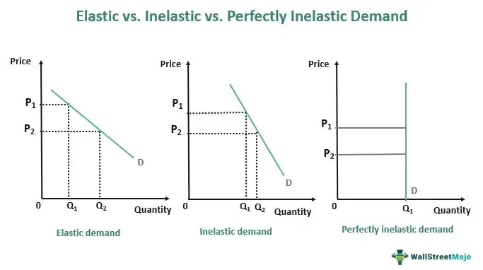

In today's financial markets, understanding the nuances of consumer demand, economic impacts, and algorithmic trading is critical. This article explores the relationship between price inelasticity of consumer demand, its economic impact, and how these factors can be leveraged in algorithmic trading.

The concept of price elasticity, which measures how the quantity demanded of a good responds to changes in price, serves as a fundamental principle in economics. Price inelasticity, a specific case where demand remains relatively constant despite price fluctuations, offers unique insights into consumer behavior. By analyzing the degree of elasticity, businesses and economists can interpret how essential a product is to consumers. For instance, items with price inelastic demand, such as basic necessities and life-saving medications, highlight consumer willingness to purchase these goods regardless of price changes.



Economic modeling plays a crucial role in forecasting demand and shaping trading strategies. These models, built on elasticity concepts, allow investors and financial analysts to anticipate shifts in consumer behavior and develop strategies to optimize pricing and trading decisions. For instance, a precise understanding of price inelasticity can aid in constructing revenue models that withstand market volatility and policy changes.

Algorithmic trading, which utilizes computer algorithms to execute trades at optimal prices, has become an integral component of modern trading strategies. By incorporating insights from price elasticity and inelasticity, these algorithms can predict market responses to price adjustments, thus allowing traders to automate decision-making processes effectively. The intersection of economic theory and algorithmic trading illustrates the sophistication of financial markets, where data-driven approaches provide a competitive edge.

Overall, by understanding these concepts, businesses and traders can better predict market trends and formulate strategies that optimize both pricing and trading decisions. As financial markets continue to evolve, leveraging insights from price elasticity and economic modeling will be increasingly vital for sustained success and profitability.

## Table of Contents

## Understanding Price Inelasticity

Price inelasticity occurs when changes in price result in proportionally smaller changes in quantity demanded, signifying a situation where consumers display minimal sensitivity to price variations. This characteristic is commonly observed in products considered essential, where demand remains relatively stable irrespective of price fluctuations. Necessities, such as basic food items, gasoline, and life-saving medications, are prime examples of goods exhibiting inelastic demand. Consumers purchase these items out of necessity, making their demand less susceptible to price increases or decreases.

The concept of price inelasticity can be better understood through the price elasticity of demand, represented mathematically as:

$$
E_d = \frac{\% \text{ change in quantity demanded}}{\% \text{ change in price}}
$$

For inelastic goods, the absolute value of $E_d$ is less than 1, indicating that the percentage change in quantity demanded is smaller than the percentage change in price. This equation highlights the proportionality and sensitivity of demand concerning price changes.

Businesses can capitalize on price inelasticity by implementing pricing strategies that optimize revenue without a significant impact on sales [volume](/wiki/volume-trading-strategy). When demand is inelastic, an increase in price typically results in a rise in total revenue because the decrease in quantity demanded is minor. This allows businesses to maintain or enhance their revenue streams even when prices fluctuate, ensuring financial stability and potentially greater profitability.

Understanding and identifying inelastic demand is crucial for companies operating in industries dominated by essential goods. By recognizing consumer insensitivity to price variations, businesses can make informed decisions about pricing, marketing, and production to maximize economic outcomes and remain competitive in the marketplace.

## Economic Impact of Price Inelasticity

Price inelasticity plays a pivotal role in shaping economic dynamics, particularly concerning revenue generation and governmental policy decisions. When demand is inelastic, consumers exhibit a limited response to price changes, meaning that a percentage increase in price results in a relatively smaller percentage decrease in quantity demanded. This characteristic can significantly influence both business strategies and economic policies.

From a revenue perspective, goods that are inelastic provide a lucrative opportunity for businesses to increase prices without suffering substantial losses in sales volume. The foundational principle is that total revenue $(TR)$ is a product of price $(P)$ and quantity sold $(Q)$:

$$
TR = P \times Q
$$

In the case of price inelasticity, an increase in price tends to increase total revenue since the decrease in quantity demanded is minimal. This can be defined mathematically by the price elasticity of demand ($E_d$), calculated as:

$$
E_d = \frac{\text{Percentage change in quantity demanded}}{\text{Percentage change in price}}
$$

For inelastic goods, $E_d < 1$, meaning the proportionate change in quantity demanded is less than the proportionate change in price. This implies that businesses can leverage inelastic demand to enhance their revenue through strategic pricing adjustments.

Tax policies are also significantly influenced by the inelasticity of goods. Governments often target inelastic products when implementing indirect taxes, such as sales taxes or excise duties, to ensure a stable revenue stream. Products like cigarettes, alcohol, and gasoline are common examples where increased taxes do not substantially reduce consumption, allowing governments to generate consistent tax revenue. The rationale is that inelastic goods will maintain their demand despite price increases due to taxation, thus not undermining the expected tax income.

In summary, price inelasticity impacts economic structures by enabling revenue optimization for businesses and providing a dependable tax base for governmental fiscal strategies. As such, understanding and leveraging the inherent properties of inelastic demand is essential for economic decision-making, whether in formulating business pricing tactics or designing tax policies aimed at goods with essential or habitual consumption patterns.

## Algorithmic Trading and Price Inelasticity

Algorithmic trading is a sophisticated method of executing trades that relies on automated, pre-programmed trading instructions. These algorithms execute trades at optimal prices, integrating a wealth of market data and leveraging insights from economic principles such as price elasticity and inelasticity. Understanding demand patterns is essential in this context, as it allows algorithms to predict how markets will react to price changes and adjust trading decisions accordingly.

Price inelasticity, characterized by a relatively static demand despite price changes, plays a crucial role in creating stable investment strategies within [algorithmic trading](/wiki/algorithmic-trading). This stability is particularly advantageous in industries where demand for goods and services remains constant regardless of price variations, such as healthcare or utilities. The resilience of these sectors to economic fluctuations provides a reliable framework for investment strategies that aim to mitigate risk and maintain consistent returns.

Algorithms used in trading exploit demand patterns by continuously analyzing and incorporating data on consumer behavior and market conditions. For instance, if a particular asset exhibits inelastic demand, algorithms can identify this and potentially prioritize trades in that asset, anticipating that its price movements will have a limited impact on demand, thereby securing a stable return. The following is a simplified example of how demand elasticity can be incorporated into a trading algorithm using Python:

```python
import numpy as np

# Sample market data
price_change = np.array([-0.01, 0.02, -0.03, 0.01, 0.00])
demand_change = np.array([-0.005, 0.01, -0.01, 0.005, 0.00])

# Calculate elasticity
elasticity = demand_change / price_change

# Determine inelastic asset threshold
inelastic_threshold = 0.5  # Assumption for this context

# Select assets with inelastic demand
inelastic_assets = elasticity < inelastic_threshold

# Output selected inelastic assets
print("Inelastic assets for trading strategy:", inelastic_assets)
```

In this code, `price_change` and `demand_change` represent arrays of percentage changes in price and demand for various assets. The algorithm calculates the elasticity by dividing the demand change by the price change for each asset. Assets with elasticity below the defined threshold are considered inelastic and thus more suitable for stable investment strategies.

Utilizing price inelasticity insights within algorithmic trading offers a robust method for anticipating market behavior. It enables traders to adapt to market [volatility](/wiki/volatility-trading-strategies), thereby potentially achieving more stable investment outcomes. As markets evolve and more data becomes available, algorithmic trading strategies can continue to incorporate elasticity measures, refining their predictions and enhancing overall trading performance.

## Integrating Economic Concepts in Trading Strategies

Successful algorithmic trading strategies often derive their strength from the incorporation of economic indicators such as demand elasticity and inelasticity. These indicators help traders understand how consumers react to price changes, which is crucial for making informed trading decisions. By incorporating real-time data on consumer demand and price responses, algorithms can detect patterns and adjust strategies to exploit the market's behavior effectively.

In the context of algorithmic trading, demand elasticity refers to the degree to which the quantity demanded of a good or service responds to changes in price. When demand is elastic, a small change in price leads to a significant change in demand. Conversely, demand is inelastic when price changes result in only minor changes in demand. Understanding these patterns allows trading algorithms to predict how markets will react to price fluctuations, thereby optimizing trade executions.

Trading algorithms benefit significantly from integrating real-time data. This dynamic data can provide insights into consumer behavior and market trends, which are essential for improving prediction accuracy and optimizing trading outcomes. For example, suppose a particular sector shows consistent inelastic demand despite economic changes. In that case, an algorithm can leverage this stability to maintain a secure investment strategy even amid market volatility.

Python code can be employed in this integration to process and analyze data efficiently. For instance, using libraries like `pandas` for data manipulation and `scikit-learn` for [machine learning](/wiki/machine-learning) can significantly enhance an algorithm's predictive capabilities. Here's a simple example of how one might begin to analyze demand elasticity with Python:

```python
import pandas as pd
from sklearn.linear_model import LinearRegression

# Sample data: price and quantity demanded
data = {'price': [10, 15, 20, 25, 30], 
        'quantity_demanded': [100, 90, 75, 65, 60]}

df = pd.DataFrame(data)

# Reshape data for sklearn
X = df['price'].values.reshape(-1, 1)
y = df['quantity_demanded'].values.reshape(-1, 1)

# Fit linear regression model
model = LinearRegression().fit(X, y)

# Coefficient indicates demand elasticity
elasticity = model.coef_[0][0]
print(f'Demand Elasticity: {elasticity}')
```

Integrating machine learning techniques with insights from elasticity further refines these algorithms by enabling dynamic adjustments. For instance, machine learning models can be trained to recognize when market conditions are shifting, allowing algorithms to adapt their trading strategies in real-time. Predictive models can use historical data to forecast future demand elasticity, making trading algorithms more resilient and profitable.

Machine learning models such as neural networks, decision trees, and support vector machines can process complex datasets to detect nuanced patterns that may not be immediately evident. These models can continually learn from new data, improving their accuracy and adaptability over time. By doing so, they offer traders a sophisticated tool for navigating the ever-changing landscape of financial markets.

Ultimately, the integration of economic concepts like demand elasticity into algorithmic trading strategies is essential for enhancing decision-making and maintaining a competitive edge. By leveraging real-time data and machine learning technologies, traders can better anticipate market movements, optimize their strategies, and increase profitability in a sustainable manner.

## Challenges and Considerations

Integrating elasticity concepts into algorithmic trading poses several challenges, primarily due to the dynamic nature of financial markets and the evolving preferences of consumers. Price elasticity, a measure of how demand responds to price changes, can fluctuate based on numerous factors including economic conditions, consumer sentiment, and external disruptions. An algorithm that does not account for these changes risks being rendered ineffective as market conditions evolve. 

Economic models, which form the basis for understanding and predicting elasticity, must be continuously updated with new and relevant data to maintain their accuracy and effectiveness. The volatility of markets means that historical data may not always accurately predict future trends. For instance, a sudden geopolitical event or a technological disruption can rapidly alter consumer behavior, thereby affecting demand patterns and price elasticity.

Moreover, the unpredictability inherent in financial markets introduces an added layer of complexity. Unforeseen events such as natural disasters, political upheavals, or significant policy changes can disrupt trading activities and undermine predictive models. These events can cause abrupt shifts in demand and supply, leading to price movements that are difficult to forecast accurately.

Despite these challenges, innovation and adaptation remain crucial to the successful application of these concepts in trading. Algorithmic models must be equipped with the capacity to process and analyze vast amounts of real-time data, allowing them to adapt to changing market conditions swiftly. Advanced techniques, such as machine learning and [artificial intelligence](/wiki/ai-artificial-intelligence), can enhance the ability of algorithms to learn from new data, recognize emerging patterns, and refine trading strategies accordingly.

For example, Python's libraries such as numpy and pandas can be utilized to perform complex data analysis and model updating, while machine learning frameworks like TensorFlow and scikit-learn can aid in building adaptive algorithms. Here is a simple example illustrating the use of Python to update a model:

```python
import numpy as np
import pandas as pd
from sklearn.linear_model import LinearRegression

# Load new market data
data = pd.read_csv('market_data.csv')

# Define features and target variable
X = data[['price_change', 'consumer_trend']]
y = data['demand']

# Update the model
model = LinearRegression()
model.fit(X, y)

# Predict demand with updated model
predicted_demand = model.predict(np.array([[0.05, 1.2]]))
print("Predicted Demand:", predicted_demand)
```

This code snippet demonstrates how to read new market data, update a linear regression model, and predict demand based on current price changes and consumer trends. The ability to integrate such adaptive features into trading algorithms is vital for benefiting from elasticity concepts amidst market fluctuations.

In summary, successfully integrating elasticity concepts in algorithmic trading requires an agile approach to model development and adjustment. As new data emerges, continuous refinement of algorithms and strategies is necessary to harness the benefits of price elasticity in trade decision-making and market participation.

## Conclusion

The interplay between price elasticity, economic modeling, and algorithmic trading provides a comprehensive framework for analyzing and interpreting market signals. Price elasticity, which measures consumer responsiveness to price changes, allows businesses to refine their pricing strategies. Conversely, price inelasticity, where demand remains stable despite price fluctuations, provides insights that help businesses optimize revenue without significant impacts on sales volume. Understanding these concepts enables businesses and traders to make informed decisions, fostering profitability.

Algorithmic trading benefits significantly from insights into price elasticity and inelasticity. By incorporating these economic concepts, algorithms can anticipate market reactions and adapt trading strategies. This adaptability enhances the precision of trading decisions, potentially leading to more stable and profitable investment strategies. For instance, if a particular sector exhibits price inelasticity, algorithms can recognize the stability of demand, allowing traders to implement consistent strategies even amidst market volatility.

Financial markets are in constant evolution, with new data and trends continuously emerging. The integration of economic modeling with algorithmic trading ensures that market participants remain agile and effective. By using real-time data and sophisticated modeling techniques, businesses and traders can respond promptly to changing economic conditions, adjusting their strategies to sustain market relevance and competitive advantage.

Ultimately, leveraging the concepts of price elasticity, economic modeling, and algorithmic trading is not merely a theoretical exercise; it is a critical practice for sustained participation and success in modern financial markets. As these markets continue to grow and change, the ability to interpret and act upon market signals using this robust framework becomes indispensable for traders and businesses alike.

## References & Further Reading

[1]: Bergstra, J., Bardenet, R., Bengio, Y., & Kégl, B. (2011). ["Algorithms for Hyper-Parameter Optimization."](https://papers.nips.cc/paper/4443-algorithms-for-hyper-parameter-optimization) Advances in Neural Information Processing Systems 24.

[2]: ["Advances in Financial Machine Learning"](https://www.amazon.com/Advances-Financial-Machine-Learning-Marcos/dp/1119482089) by Marcos Lopez de Prado

[3]: ["Evidence-Based Technical Analysis: Applying the Scientific Method and Statistical Inference to Trading Signals"](https://www.amazon.com/Evidence-Based-Technical-Analysis-Scientific-Statistical/dp/0470008741) by David Aronson

[4]: ["Machine Learning for Algorithmic Trading"](https://github.com/stefan-jansen/machine-learning-for-trading) by Stefan Jansen

[5]: ["Quantitative Trading: How to Build Your Own Algorithmic Trading Business"](https://www.amazon.com/Quantitative-Trading-Build-Algorithmic-Business/dp/1119800064) by Ernest P. Chan