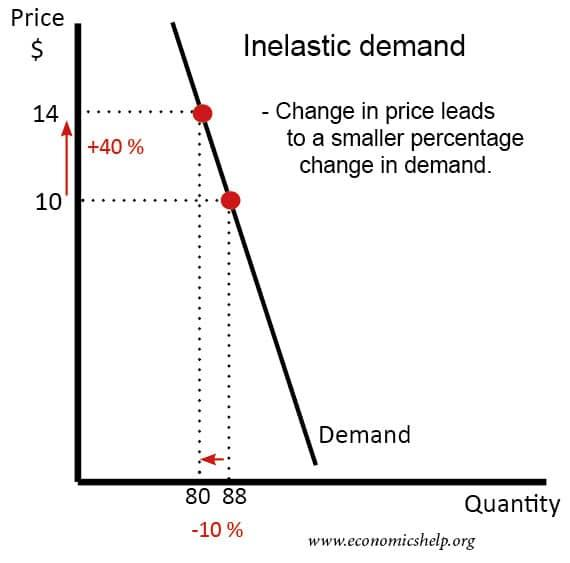

## Table of Contents

## What is price inelasticity?

Price inelasticity is when the demand for a product doesn't change much even if its price goes up or down. Imagine you need medicine for a serious illness. Even if the price of the medicine goes up, you'll still buy it because you need it to get better. That's an example of price inelasticity.

This happens because the product is seen as a necessity, and people can't easily find a substitute for it. Things like gas for your car or electricity for your home are also price inelastic. No matter how much the price changes, people still need to use these things, so the demand stays pretty much the same.

## How is price inelasticity measured?

Price inelasticity is measured using something called the price elasticity of demand. This is a number that shows how much the amount of a product people buy changes when its price changes. To find this number, you take the percentage change in the amount of the product people buy and divide it by the percentage change in the price. If the number you get is less than 1, that means the product is price inelastic. This means that even if the price goes up or down a lot, the amount people buy doesn't change much.

For example, let's say the price of a medicine goes up by 10%, but the amount of medicine people buy only goes down by 2%. You would calculate the price elasticity of demand as 2% divided by 10%, which equals 0.2. Since 0.2 is less than 1, this shows that the medicine is price inelastic. People still need to buy it even if the price changes, so the demand doesn't change much.

## What are some examples of price inelastic goods?

Some examples of price inelastic goods are things like medicine and gasoline. Medicine is price inelastic because if you're sick, you need it to get better. Even if the price goes up, you'll still buy it because it's important for your health. Gasoline is the same way. If you need to drive to work or school, you'll buy gas no matter how much it costs because you have to get where you're going.

Another example is electricity. People use electricity every day for things like lights, cooking, and charging their phones. If the price of electricity goes up, most people will still use it because they need it for their daily lives. It's hard to find something else to use instead of electricity, so the demand stays pretty much the same even if the price changes.

These examples show that price inelastic goods are things that people see as necessities. They can't easily find something else to use instead, so they keep buying them even if the price goes up or down.

## How does price inelasticity affect consumer demand?

Price inelasticity means that the amount of a product people buy doesn't change much even if the price goes up or down. This happens because the product is something people really need and can't easily replace with something else. For example, if the price of medicine goes up, people who need it to get better will still buy it. They can't just stop taking their medicine, so the demand stays about the same.

When a product is price inelastic, businesses know that they can change the price without losing a lot of customers. This can be good for the businesses because they can raise prices to make more money, but it can be hard for consumers. If you need a product that's price inelastic, like gas for your car or electricity for your home, you have to keep buying it even if it gets more expensive. This means that changes in price don't affect how much of the product people buy very much.

## What factors contribute to price inelasticity?

Price inelasticity happens when the amount of a product people buy doesn't change much even if the price goes up or down. This often happens because the product is something people really need. For example, medicine is price inelastic because if you're sick, you need it to get better. You can't just stop taking your medicine, so you'll buy it no matter how much it costs. Gasoline is another example. If you need to drive to work or school, you'll buy gas even if the price goes up because you have to get where you're going.

Another [factor](/wiki/factor-investing) that makes a product price inelastic is when there aren't many other choices. If you need electricity for your home, you can't easily find something else to use instead. You need it for lights, cooking, and charging your phone, so you'll keep buying it even if the price changes. When there are few substitutes for a product, people have to keep buying it, so the demand stays the same even if the price goes up or down.

## Can price inelasticity change over time? If so, how?

Yes, price inelasticity can change over time. This happens when people's needs and choices change. For example, if a new medicine comes out that works just as well as an old one but costs less, people might start buying the new medicine instead. This would make the old medicine less price inelastic because now people have a cheaper choice.

Also, things like technology and new ideas can make a product less price inelastic. If a new way to get around, like electric cars, becomes popular, people might not need as much gasoline. This means that the demand for gasoline could change a lot if the price changes, making it less price inelastic. As people find new ways to do things or new products to use, what they see as a necessity can change, and so can price inelasticity.

## How do businesses use price inelasticity to their advantage?

Businesses use price inelasticity to make more money. If they know that people will keep buying their product even if the price goes up, they can raise the price and make more profit. For example, if a company sells medicine that people need to get better, they can increase the price because people will still buy it. This helps the business because they can earn more money without losing many customers.

However, businesses need to be careful. If they raise prices too much, people might start looking for other options. For instance, if the price of a certain medicine goes up a lot, people might try to find a cheaper one that works just as well. This could make the medicine less price inelastic over time. So, businesses have to find a balance where they can make more money but not so much that people stop buying their product.

## What are the economic implications of price inelasticity for markets?

Price inelasticity can have big effects on markets. When a product is price inelastic, it means that people will keep buying it even if the price goes up. This is good for businesses because they can raise prices and make more money without losing many customers. For example, if a company sells a medicine that people need to get better, they can charge more for it and still sell the same amount. This helps the business make more profit, but it can be hard for consumers because they have to pay more for something they really need.

On the other hand, price inelasticity can also affect how much competition there is in a market. If a product is seen as a necessity and there are few other choices, new businesses might not want to start selling it because they know people will keep buying from the existing company even if the price goes up. This can lead to less competition and fewer choices for consumers. Over time, if new products or ways to do things come along, price inelasticity can change, and this can shake up the market by giving people more options and making businesses think more about their prices.

## How does price inelasticity impact government policy on taxation?

When a product is price inelastic, it means that people will keep buying it even if the price goes up. Governments know this and sometimes use it to make more money from taxes. If they put a tax on a product that is price inelastic, like cigarettes or gasoline, people will still buy it because they need it or really want it. This means the government can collect more tax money without making people stop buying the product.

However, there can be problems with taxing price inelastic goods. If the tax makes the product a lot more expensive, it can be hard for people who really need it. For example, if gas prices go up a lot because of taxes, it can make life harder for people who need to drive to work. Governments have to think about this and try to find a balance where they can get more tax money but not make life too hard for people who need the product.

## What are the differences between short-term and long-term price inelasticity?

In the short term, price inelasticity means that when the price of a product goes up or down, people don't change how much they buy right away. This often happens with things people really need, like medicine or gas for their car. If the price of medicine goes up suddenly, people who need it to get better will still buy it because they don't have time to find something else. So, in the short term, the demand for these products stays pretty much the same no matter what the price does.

In the long term, price inelasticity can change. Over time, people might find other options or ways to do things that they didn't have before. For example, if gas prices keep going up, people might start buying electric cars or using public transportation more. This means that even though gas was price inelastic in the short term, it could become less so in the long term because people have more choices. So, while price inelasticity might be strong in the short term, it can weaken over time as people find new ways to meet their needs.

## How can understanding price inelasticity help in predicting consumer behavior?

Understanding price inelasticity can help predict how people will act when prices change. If a product is price inelastic, it means people will keep buying it even if the price goes up. This is because the product is something they really need, like medicine or gas for their car. So, if you know a product is price inelastic, you can guess that people will still buy the same amount even if it gets more expensive. This helps businesses and governments make smart choices about prices and taxes.

Over time, though, price inelasticity can change. In the short term, people might not change what they buy right away if the price goes up. But in the long term, they might find other options or ways to do things. For example, if gas prices keep going up, people might start buying electric cars or using public transportation more. So, understanding how price inelasticity can change over time helps predict how people's behavior might shift in the future. This way, businesses and governments can plan better for what might happen next.

## What advanced statistical methods are used to analyze price inelasticity in-depth?

To understand price inelasticity better, experts use advanced statistical methods like regression analysis. This method helps them see how much the amount of a product people buy changes when the price changes. They look at lots of data from the past to find patterns and make predictions. For example, they might use something called a linear regression to see if the relationship between price and demand is a straight line. If it is, and the line is almost flat, that means the product is price inelastic because the demand doesn't change much even when the price does.

Another method they use is time series analysis. This helps them see how price inelasticity might change over time. They look at how the demand for a product changes over weeks, months, or years, and see if it stays the same or if it starts to change when prices go up or down. This can help them predict how people might act in the future. For example, if they see that gas was price inelastic in the past but is starting to change, they can guess that people might be finding other ways to get around, like electric cars or public transportation.

## What is Understanding Price Inelasticity?

Price inelasticity occurs when changes in price result in proportionally smaller changes in quantity demanded, signifying a situation where consumers display minimal sensitivity to price variations. This characteristic is commonly observed in products considered essential, where demand remains relatively stable irrespective of price fluctuations. Necessities, such as basic food items, gasoline, and life-saving medications, are prime examples of goods exhibiting inelastic demand. Consumers purchase these items out of necessity, making their demand less susceptible to price increases or decreases.

The concept of price inelasticity can be better understood through the price elasticity of demand, represented mathematically as:

$$
E_d = \frac{\% \text{ change in quantity demanded}}{\% \text{ change in price}}
$$

For inelastic goods, the absolute value of $E_d$ is less than 1, indicating that the percentage change in quantity demanded is smaller than the percentage change in price. This equation highlights the proportionality and sensitivity of demand concerning price changes.

Businesses can capitalize on price inelasticity by implementing pricing strategies that optimize revenue without a significant impact on sales [volume](/wiki/volume-trading-strategy). When demand is inelastic, an increase in price typically results in a rise in total revenue because the decrease in quantity demanded is minor. This allows businesses to maintain or enhance their revenue streams even when prices fluctuate, ensuring financial stability and potentially greater profitability.

Understanding and identifying inelastic demand is crucial for companies operating in industries dominated by essential goods. By recognizing consumer insensitivity to price variations, businesses can make informed decisions about pricing, marketing, and production to maximize economic outcomes and remain competitive in the marketplace.

## What is the economic impact of price inelasticity?

Price inelasticity plays a pivotal role in shaping economic dynamics, particularly concerning revenue generation and governmental policy decisions. When demand is inelastic, consumers exhibit a limited response to price changes, meaning that a percentage increase in price results in a relatively smaller percentage decrease in quantity demanded. This characteristic can significantly influence both business strategies and economic policies.

From a revenue perspective, goods that are inelastic provide a lucrative opportunity for businesses to increase prices without suffering substantial losses in sales volume. The foundational principle is that total revenue $(TR)$ is a product of price $(P)$ and quantity sold $(Q)$:

$$
TR = P \times Q
$$

In the case of price inelasticity, an increase in price tends to increase total revenue since the decrease in quantity demanded is minimal. This can be defined mathematically by the price elasticity of demand ($E_d$), calculated as:

$$
E_d = \frac{\text{Percentage change in quantity demanded}}{\text{Percentage change in price}}
$$

For inelastic goods, $E_d < 1$, meaning the proportionate change in quantity demanded is less than the proportionate change in price. This implies that businesses can leverage inelastic demand to enhance their revenue through strategic pricing adjustments.

Tax policies are also significantly influenced by the inelasticity of goods. Governments often target inelastic products when implementing indirect taxes, such as sales taxes or excise duties, to ensure a stable revenue stream. Products like cigarettes, alcohol, and gasoline are common examples where increased taxes do not substantially reduce consumption, allowing governments to generate consistent tax revenue. The rationale is that inelastic goods will maintain their demand despite price increases due to taxation, thus not undermining the expected tax income.

In summary, price inelasticity impacts economic structures by enabling revenue optimization for businesses and providing a dependable tax base for governmental fiscal strategies. As such, understanding and leveraging the inherent properties of inelastic demand is essential for economic decision-making, whether in formulating business pricing tactics or designing tax policies aimed at goods with essential or habitual consumption patterns.

## References & Further Reading

[1]: Bergstra, J., Bardenet, R., Bengio, Y., & Kégl, B. (2011). ["Algorithms for Hyper-Parameter Optimization."](https://papers.nips.cc/paper/4443-algorithms-for-hyper-parameter-optimization) Advances in Neural Information Processing Systems 24.

[2]: ["Advances in Financial Machine Learning"](https://www.amazon.com/Advances-Financial-Machine-Learning-Marcos/dp/1119482089) by Marcos Lopez de Prado

[3]: ["Evidence-Based Technical Analysis: Applying the Scientific Method and Statistical Inference to Trading Signals"](https://www.amazon.com/Evidence-Based-Technical-Analysis-Scientific-Statistical/dp/0470008741) by David Aronson

[4]: ["Machine Learning for Algorithmic Trading"](https://github.com/stefan-jansen/machine-learning-for-trading) by Stefan Jansen

[5]: ["Quantitative Trading: How to Build Your Own Algorithmic Trading Business"](https://www.amazon.com/Quantitative-Trading-Build-Algorithmic-Business/dp/1119800064) by Ernest P. Chan