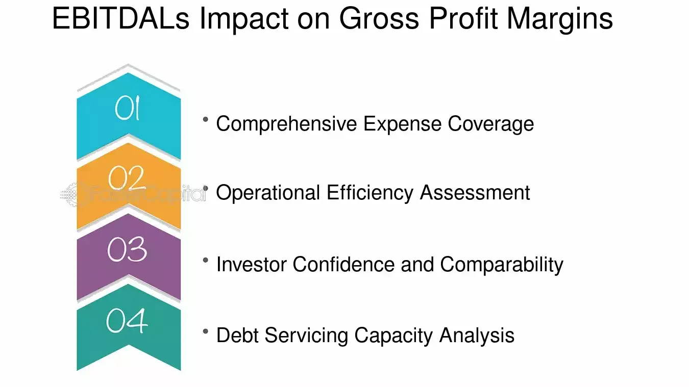

## Table of Contents

## What is product pricing and why is it important?

Product pricing is the process of deciding how much to charge for a product or service. It involves looking at the costs to make the product, what customers are willing to pay, and what competitors are charging. Setting the right price is important because it can affect how much profit a business makes and how many products it sells.

Pricing is important because it helps a business make money and stay competitive. If the price is too high, customers might not buy the product, and the business could lose sales. If the price is too low, the business might sell a lot but not make enough profit. Finding the right balance is key to keeping customers happy and the business successful.

## How does product pricing affect gross profit?

Product pricing directly affects gross profit because gross profit is the money left after you subtract the cost of making the product from the price you sell it for. If you set a higher price for your product, your gross profit can go up, as long as people are still willing to buy it at that price. But if you set the price too high, you might sell fewer products, which could lower your total gross profit.

On the other hand, if you set a lower price, you might sell more products, but each sale will bring in less money. This means your gross profit per item will be smaller. You need to find a good balance where you sell enough products at a price that still gives you a healthy gross profit. It's all about finding the sweet spot that keeps your business profitable while keeping your customers happy.

## What is gross profit and how is it calculated?

Gross profit is the money a business makes after paying for the things it needs to make its products. It's like the first step in figuring out how much money the business is really making. To find gross profit, you take the money you get from selling your products, which is called revenue, and subtract the cost of making those products, which is called the cost of goods sold (COGS).

For example, if you sell a toy for $20 and it costs you $10 to make it, your gross profit for that toy is $10. This number is important because it shows how much money is left to cover other costs like rent, salaries, and marketing, and hopefully leave some profit at the end. By keeping an eye on gross profit, a business can see if it's pricing its products right and if it's making enough money to keep going and growing.

## What is EBITDA and how does it differ from gross profit?

EBITDA stands for Earnings Before Interest, Taxes, Depreciation, and Amortization. It's a way to measure how much money a business is making from its main activities, without worrying about some other costs like interest on loans, taxes, and the gradual wear and tear of its assets. Think of it as a way to see how well the core of the business is doing, without getting distracted by other financial stuff.

EBITDA is different from gross profit because gross profit only looks at the money made after paying for the cost of making the products. It's a more basic number that shows how much is left after the cost of goods sold is taken out of the total sales. EBITDA goes a step further by also subtracting other operating expenses like rent, salaries, and utilities, but it doesn't take out interest, taxes, depreciation, and amortization. So, while gross profit gives you a quick look at the money made from selling products, EBITDA gives you a broader view of the business's overall operating performance.

## How can changes in product pricing impact EBITDA?

Changes in product pricing can directly affect a business's EBITDA because it changes how much money the business makes from selling its products. If a business raises its prices and people still buy the products, the extra money from each sale can increase the total revenue. This higher revenue can lead to a higher EBITDA, as long as the other costs like rent and salaries stay the same. But if the price goes up too much and fewer people buy the products, the total revenue might go down, which could lower the EBITDA.

On the other hand, if a business lowers its prices, it might sell more products because they're cheaper. This could increase the total revenue if enough extra products are sold. But since the price per product is lower, the money made from each sale goes down. This might not always lead to a higher EBITDA, especially if the costs of running the business stay the same or go up. Finding the right price is important because it helps balance how many products are sold with how much money is made from each sale, which directly impacts the business's EBITDA.

## What are the common pricing strategies businesses use?

Businesses use different ways to set prices for their products. One common way is cost-plus pricing, where they add a bit of extra money on top of what it costs to make the product. This extra money is the profit. Another way is called competitive pricing, where a business looks at what other businesses charge for similar products and tries to match or beat those prices. Then there's value-based pricing, where the price is set based on how much customers think the product is worth, not just what it costs to make.

Another strategy is penetration pricing, where a business starts with a low price to get a lot of customers quickly. Once they have a lot of customers, they might raise the price. The opposite is skimming pricing, where a business starts with a high price and then slowly lowers it over time. This works well for new and exciting products. Lastly, there's psychological pricing, where businesses set prices that seem lower to customers, like $9.99 instead of $10.00, to make the product seem like a better deal.

These strategies help businesses find the best price for their products. Each one has its own way of trying to make the most money while keeping customers happy. Choosing the right strategy depends on what the business is selling, who its customers are, and what its competitors are doing.

## How do cost structures influence pricing decisions?

Cost structures are really important when businesses decide how much to charge for their products. They look at all the money they need to spend to make the product, like the cost of materials, labor, and any other expenses. If these costs are high, the business might have to set a higher price to make sure they can still make some profit. But if the costs are low, they might be able to set a lower price and still make money. It's like trying to find the right balance so the business can cover its costs and make a profit, but also keep the price fair for customers.

Sometimes, the way a business's costs are set up can lead them to choose different pricing strategies. For example, if a business has a lot of fixed costs, like rent or salaries, they might use a cost-plus pricing strategy to make sure they cover those costs and make some profit on top. On the other hand, if the costs change a lot, like if the price of materials goes up and down, the business might use a more flexible pricing strategy, like competitive pricing, to adjust to those changes. Understanding the cost structure helps businesses set prices that work for them and their customers.

## What role does market demand play in setting product prices?

Market demand is super important when businesses decide how much to charge for their products. It's all about how many people want to buy the product and how much they're willing to pay. If a lot of people really want the product, the business might set a higher price because they know people will still buy it. But if not many people want the product, the business might need to set a lower price to get more people interested. It's like trying to find the sweet spot where enough people will buy the product at a price that still makes money for the business.

Understanding market demand also helps businesses choose the right pricing strategy. For example, if there's a new product that everyone is excited about, the business might use a skimming strategy and start with a high price. As the excitement goes down, they can lower the price to keep selling to more people. On the other hand, if the product is something people always need, like food or basic supplies, the business might use a competitive pricing strategy to make sure their prices are similar to other businesses. By keeping an eye on what customers want and how much they're willing to pay, businesses can set prices that keep both their customers and their bank accounts happy.

## How can businesses analyze the impact of pricing changes on gross profit and EBITDA?

Businesses can analyze the impact of pricing changes on gross profit and EBITDA by looking at how the new prices affect their sales and costs. If they raise prices, they need to see if people will still buy the product at the higher price. If sales stay the same or go up, the higher price can lead to more gross profit because each sale brings in more money. But if sales drop a lot because of the higher price, the total gross profit might go down. To figure this out, businesses can use past sales data and do some "what if" calculations to see how different prices might change their gross profit.

For EBITDA, businesses need to think about more than just the cost of making the product. They need to look at all the other costs of running the business, like rent, salaries, and utilities. If they raise prices and sales stay strong, the extra money from each sale can increase the EBITDA. But if the price hike leads to fewer sales, the total revenue might go down, which could lower the EBITDA. Businesses can use financial models to predict how changes in pricing will affect their EBITDA. They can also run tests, like trying out new prices in certain stores or markets, to see how customers react and how it impacts their overall earnings.

## What are the potential risks of increasing prices on gross profit and EBITDA?

When a business raises its prices, there's a risk that fewer people will buy the product. This can hurt the gross profit if the drop in sales is bigger than the extra money made from the higher price. If a business sells a lot less because the price is too high, the total money coming in could go down, and that means less gross profit. So, businesses need to think carefully about how much they raise prices and how it might change how many products they sell.

The same thing can happen with EBITDA. If raising prices leads to fewer sales, the total money the business makes might go down. This can lower the EBITDA because even though each sale brings in more money, there are fewer sales overall. Plus, if the business has a lot of costs like rent and salaries that don't change, those costs will still need to be paid, even if sales go down. So, businesses need to look at all their costs and sales to make sure that raising prices won't end up hurting their overall earnings.

## How do competitive dynamics affect pricing strategies and financial outcomes?

Competitive dynamics play a big role in how businesses set their prices and how much money they make. When a business looks at what its competitors are doing, it might decide to set its prices lower to attract more customers. This can lead to more sales, but it might also mean less money per sale, which can affect the gross profit and EBITDA. If the business sets its prices too low just to beat the competition, it might not make enough money to cover all its costs and still make a profit. So, businesses need to watch what their competitors are doing and find a price that helps them stay competitive but also keeps them profitable.

On the other hand, if a business thinks its product is better than what its competitors offer, it might set a higher price. This can work if customers see the product as being worth the extra cost. A higher price can lead to more money per sale, which can boost gross profit and EBITDA. But if the price is too high compared to competitors, customers might choose to buy from someone else, and the business could end up selling less. Balancing the right price with what competitors are doing is key to making sure the business stays both competitive and profitable.

## What advanced analytical tools can be used to optimize pricing for maximum impact on gross profit and EBITDA?

Businesses can use advanced tools like price optimization software to help set the best prices for their products. This software uses data from past sales, what customers are willing to pay, and what competitors are doing to suggest prices that can make the most money. It looks at different prices and figures out how they might change how many products are sold and how much profit the business can make. By using this tool, businesses can try out different prices without actually changing them and see what might happen to their gross profit and EBITDA. This helps them find the best price that keeps customers happy and the business making money.

Another tool that can help is predictive analytics. This tool uses math and computer models to guess what might happen in the future based on past data. It can look at things like how prices have changed before and how that affected sales and profits. By using predictive analytics, businesses can see how raising or lowering prices might change their gross profit and EBITDA. This helps them make smart choices about pricing that can lead to more money for the business. Both of these tools help businesses make better pricing decisions and keep their financial outcomes strong.

## How does product pricing affect gross profit?

Product pricing is a critical determinant of a company’s revenue and, consequently, its gross profit. As a fundamental part of the business strategy, pricing directly influences the monetary outcome of sales activities. Gross profit, the difference between total revenue and the cost of goods sold (COGS), provides an essential measure of basic profitability, reflecting the efficiency of production and selling activities. 

$$
\text{Gross Profit} = \text{Revenue} - \text{COGS}
$$

An adjustment in product prices has a direct effect on total revenue, impacting gross profit. Increases in product price can enhance gross profit margins, assuming that the sales [volume](/wiki/volume-trading-strategy) does not experience a proportionate decline. A higher price for a product means greater revenue per unit, potentially leading to increased gross profit, as long as the COGS remains constant or grows at a lesser rate than the revenue increment.

However, businesses must exercise caution when implementing pricing strategies. A strategic increase in product pricing necessitates a careful evaluation to maintain sales volumes. Rising prices can risk reducing the sales quantity if consumers perceive the value proposition negatively, negating potential gross profit gains. Thus, companies need to consider price elasticity, the measure of how sensitive the quantity demanded is to a change in price. 

For example, using Python, one could simulate the impact of different pricing strategies on gross profit by calculating potential changes in sales volume and revenue:

```python
def calculate_gross_profit(price, cost, expected_sales):
    revenue = price * expected_sales
    gross_profit = revenue - (cost * expected_sales)
    return gross_profit

# Example of calculating gross profit for a product priced at $20, cost of $10, with expected sales of 1000 units
price = 20
cost = 10
expected_sales = 1000

gross_profit = calculate_gross_profit(price, cost, expected_sales)
print(f"Potential Gross Profit: ${gross_profit}")
```

This calculation aids businesses in anticipating the financial outcomes of various pricing scenarios. Therefore, while strategic price increases can be beneficial, maintaining a balance between pricing, sales volume, and customer perception is crucial for sustaining and enhancing gross profit.

## What is the relationship between EBITDA and product pricing?

Understanding EBITDA (Earnings Before Interest, Taxes, Depreciation, and Amortization) is crucial for assessing a company's operational efficiency. EBITDA serves as a measure of a company's overall financial performance and is commonly used as an alternative to net income. By excluding interest, taxes, depreciation, and amortization, EBITDA provides insights into the profitability generated from core business operations without the influence of financing and accounting decisions.

A primary [factor](/wiki/factor-investing) influencing EBITDA is product pricing. When a business increases its product prices, this typically results in increased revenue, assuming sales volumes remain constant. As revenue grows, considering that costs associated with interest, taxes, depreciation, and amortization remain unchanged, EBITDA should also increase. The formula for EBITDA can be expressed as:

$$
\text{EBITDA} = \text{Revenue} - \text{COGS} - \text{Operating Expenses}
$$

where COGS stands for Cost of Goods Sold. A direct implication of increased product pricing is higher revenue, potentially boosting EBITDA if operating costs do not rise proportionately.

However, while higher prices can enhance EBITDA, they must be strategically balanced. Businesses need to consider consumer perception, as excessively high prices might lead to diminished perceived value and a reduction in sales volume. Such a scenario could offset the benefits of increased pricing by leading to overall lower revenue.

Effective pricing strategies should therefore consider both the economic benefits of higher pricing and the potential risks, including market demand elasticity and competitive positioning. By doing so, businesses can leverage product pricing to not only enhance EBITDA but also sustain long-term growth and market presence.

## What is the Role of Gross Profit and EBITDA in Algorithmic Trading?

Gross profit and EBITDA are critical components in [algorithmic trading](/wiki/algorithmic-trading), acting as fundamental quantitative measures to gauge a company's financial robustness. These metrics are utilized by algorithmic traders to refine investment strategies and make informed decisions, fostering a deep understanding of a company’s operational capabilities and profitability.

Gross profit, derived from the formula:

$$
\text{Gross Profit} = \text{Revenue} - \text{Cost of Goods Sold (COGS)}
$$

provides a snapshot of a company's core profitability absent of indirect expenses. This metric is valuable for assessing how effectively a company is managing its production costs relative to sales. In trading, algorithms analyzing gross profit trends can identify businesses that are managing resources efficiently and generating higher profitability from operations, making them attractive candidates for investment.

EBITDA, or Earnings Before Interest, Taxes, Depreciation, and Amortization, extends this analysis further by reflecting the operational efficiency of a company before accounting for non-operating expenses and non-cash charges. Calculated as:

$$
\text{EBITDA} = \text{Net Income} + \text{Interest} + \text{Taxes} + \text{Depreciation} + \text{Amortization}
$$

EBITDA is a pivotal measure in algorithmic trading for assessing the core earnings potential of a company. It assists in evaluating operational performance devoid of financing and accounting decisions, offering a clearer view of cash flows. Algorithms focusing on EBITDA might prioritize companies exhibiting consistent growth or stability, indicative of sound management practices and a resilient business model.

Integrating these metrics into trading algorithms aids in the recognition of financially sound companies, thus refining trading strategies. Traders calibrate algorithms to track variations in these metrics, facilitating dynamic responses to market changes and early identification of promising investment opportunities. By incorporating gross profit and EBITDA into their algorithms, traders enhance their ability to identify companies that are not only profitable but exhibit strong operational efficiency and growth potential, aligning their trading strategies with long-term stability and profitability goals.

## References & Further Reading

[1]: ["Advances in Financial Machine Learning"](https://www.amazon.com/Advances-Financial-Machine-Learning-Marcos/dp/1119482089) by Marcos Lopez de Prado

[2]: ["Evidence-Based Technical Analysis: Applying the Scientific Method and Statistical Inference to Trading Signals"](https://www.amazon.com/Evidence-Based-Technical-Analysis-Scientific-Statistical/dp/0470008741) by David Aronson

[3]: ["Machine Learning for Algorithmic Trading"](https://github.com/stefan-jansen/machine-learning-for-trading) by Stefan Jansen

[4]: ["Quantitative Trading: How to Build Your Own Algorithmic Trading Business"](https://www.amazon.com/Quantitative-Trading-Build-Algorithmic-Business/dp/1119800064) by Ernest P. Chan

[5]: Hull, J. C. (2009). ["Options, Futures, and Other Derivatives"](https://www.amazon.com/Options-Futures-Other-Derivatives-9th/dp/0133456315). Pearson. 

[6]: Natenberg, S. (1994). ["Option Volatility and Pricing: Advanced Trading Strategies and Techniques"](https://www.amazon.com/Option-Volatility-Pricing-Strategies-Techniques/dp/0071818774). McGraw-Hill Education.