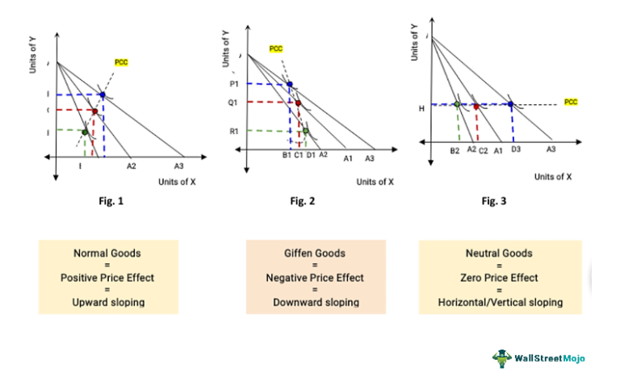

In today’s competitive market environment, understanding the interplay between product pricing, gross profit, and financial metrics like EBITDA is crucial for businesses aiming to maximize profitability. Product pricing directly influences revenue, a critical component of financial success. Setting an appropriate price determines the company's ability to cover costs and achieve target profit margins. Gross profit, calculated as revenue minus the cost of goods sold (COGS), offers insight into a company’s core profitability, excluding indirect expenses.

Gross profit = Revenue - COGS  



EBITDA, or Earnings Before Interest, Taxes, Depreciation, and Amortization, further refines this understanding by evaluating operational efficiency without accounting for financial and non-cash expenses. This metric provides a clearer view of ongoing business performance by removing variables that can obscure an accurate assessment of profitability.

Algorithmic trading, or algo trading, has added a new dimension to how financial metrics are utilized, influencing trading strategies and outcomes significantly. In the context of trading, the relationship between product pricing, gross profit, and EBITDA becomes even more significant. Algorithmic traders leverage these metrics to make informed, data-driven decisions, enhancing their ability to identify and exploit profitable opportunities in the market. By integrating financial metrics into automated trading strategies, traders can optimize performance, adjust to market shifts, and achieve better financial outcomes.

This article explores how product pricing affects gross profit and EBITDA, highlighting the importance of these metrics in the context of algo trading. This understanding is essential for both businesses looking to maximize profitability and traders aiming to develop robust trading algorithms.

## Table of Contents

## Product Pricing and Its Impact on Gross Profit

Product pricing is a critical determinant of a company’s revenue and, consequently, its gross profit. As a fundamental part of the business strategy, pricing directly influences the monetary outcome of sales activities. Gross profit, the difference between total revenue and the cost of goods sold (COGS), provides an essential measure of basic profitability, reflecting the efficiency of production and selling activities. 

$$
\text{Gross Profit} = \text{Revenue} - \text{COGS}
$$

An adjustment in product prices has a direct effect on total revenue, impacting gross profit. Increases in product price can enhance gross profit margins, assuming that the sales [volume](/wiki/volume-trading-strategy) does not experience a proportionate decline. A higher price for a product means greater revenue per unit, potentially leading to increased gross profit, as long as the COGS remains constant or grows at a lesser rate than the revenue increment.

However, businesses must exercise caution when implementing pricing strategies. A strategic increase in product pricing necessitates a careful evaluation to maintain sales volumes. Rising prices can risk reducing the sales quantity if consumers perceive the value proposition negatively, negating potential gross profit gains. Thus, companies need to consider price elasticity, the measure of how sensitive the quantity demanded is to a change in price. 

For example, using Python, one could simulate the impact of different pricing strategies on gross profit by calculating potential changes in sales volume and revenue:

```python
def calculate_gross_profit(price, cost, expected_sales):
    revenue = price * expected_sales
    gross_profit = revenue - (cost * expected_sales)
    return gross_profit

# Example of calculating gross profit for a product priced at $20, cost of $10, with expected sales of 1000 units
price = 20
cost = 10
expected_sales = 1000

gross_profit = calculate_gross_profit(price, cost, expected_sales)
print(f"Potential Gross Profit: ${gross_profit}")
```

This calculation aids businesses in anticipating the financial outcomes of various pricing scenarios. Therefore, while strategic price increases can be beneficial, maintaining a balance between pricing, sales volume, and customer perception is crucial for sustaining and enhancing gross profit.

## Understanding EBITDA and Its Relation to Product Pricing

Understanding EBITDA (Earnings Before Interest, Taxes, Depreciation, and Amortization) is crucial for assessing a company's operational efficiency. EBITDA serves as a measure of a company's overall financial performance and is commonly used as an alternative to net income. By excluding interest, taxes, depreciation, and amortization, EBITDA provides insights into the profitability generated from core business operations without the influence of financing and accounting decisions.

A primary [factor](/wiki/factor-investing) influencing EBITDA is product pricing. When a business increases its product prices, this typically results in increased revenue, assuming sales volumes remain constant. As revenue grows, considering that costs associated with interest, taxes, depreciation, and amortization remain unchanged, EBITDA should also increase. The formula for EBITDA can be expressed as:

$$
\text{EBITDA} = \text{Revenue} - \text{COGS} - \text{Operating Expenses}
$$

where COGS stands for Cost of Goods Sold. A direct implication of increased product pricing is higher revenue, potentially boosting EBITDA if operating costs do not rise proportionately.

However, while higher prices can enhance EBITDA, they must be strategically balanced. Businesses need to consider consumer perception, as excessively high prices might lead to diminished perceived value and a reduction in sales volume. Such a scenario could offset the benefits of increased pricing by leading to overall lower revenue.

Effective pricing strategies should therefore consider both the economic benefits of higher pricing and the potential risks, including market demand elasticity and competitive positioning. By doing so, businesses can leverage product pricing to not only enhance EBITDA but also sustain long-term growth and market presence.

## The Role of Gross Profit and EBITDA in Algorithmic Trading

Gross profit and EBITDA are critical components in [algorithmic trading](/wiki/algorithmic-trading), acting as fundamental quantitative measures to gauge a company's financial robustness. These metrics are utilized by algorithmic traders to refine investment strategies and make informed decisions, fostering a deep understanding of a company’s operational capabilities and profitability.

Gross profit, derived from the formula:

$$
\text{Gross Profit} = \text{Revenue} - \text{Cost of Goods Sold (COGS)}
$$

provides a snapshot of a company's core profitability absent of indirect expenses. This metric is valuable for assessing how effectively a company is managing its production costs relative to sales. In trading, algorithms analyzing gross profit trends can identify businesses that are managing resources efficiently and generating higher profitability from operations, making them attractive candidates for investment.

EBITDA, or Earnings Before Interest, Taxes, Depreciation, and Amortization, extends this analysis further by reflecting the operational efficiency of a company before accounting for non-operating expenses and non-cash charges. Calculated as:

$$
\text{EBITDA} = \text{Net Income} + \text{Interest} + \text{Taxes} + \text{Depreciation} + \text{Amortization}
$$

EBITDA is a pivotal measure in algorithmic trading for assessing the core earnings potential of a company. It assists in evaluating operational performance devoid of financing and accounting decisions, offering a clearer view of cash flows. Algorithms focusing on EBITDA might prioritize companies exhibiting consistent growth or stability, indicative of sound management practices and a resilient business model.

Integrating these metrics into trading algorithms aids in the recognition of financially sound companies, thus refining trading strategies. Traders calibrate algorithms to track variations in these metrics, facilitating dynamic responses to market changes and early identification of promising investment opportunities. By incorporating gross profit and EBITDA into their algorithms, traders enhance their ability to identify companies that are not only profitable but exhibit strong operational efficiency and growth potential, aligning their trading strategies with long-term stability and profitability goals.

## Strategies for Leveraging Financial Metrics in Algo Trading

Investors aiming to optimize their returns through algorithmic trading can leverage financial metrics such as gross profit and EBITDA in crafting effective trading algorithms. These metrics serve as essential indicators of a company's financial health and operational performance, making them invaluable for developing robust trading strategies. By focusing on companies exhibiting strong gross profit and rising EBITDA, algorithms can identify businesses with potential for sustainable long-term growth.

A key strategy involves the dynamic tracking of gross profit and EBITDA changes. Algorithms can be programmed to monitor these metrics continuously, enabling traders to adjust their strategies in response to shifts in market conditions and financial performance. For example, if a company's EBITDA is consistently increasing, it may indicate enhanced operational efficiency and profitability, making it an attractive candidate for investment.

Python, a popular programming language in quantitative finance, can be utilized to implement such algorithms. Below is a simplified example illustrating how one might set up a basic algorithm to track these financial metrics:

```python
import pandas as pd

# Sample data for demonstration
data = {'Company': ['A', 'B', 'C'],
        'Gross_Profit': [200000, 150000, 230000],
        'EBITDA': [50000, 45000, 60000]}

# Creating DataFrame
df = pd.DataFrame(data)

# Simple function to identify companies with strong financials
def select_companies(df):
    gross_profit_threshold = 180000
    ebitda_threshold = 55000

    selected = df[(df['Gross_Profit'] > gross_profit_threshold) & (df['EBITDA'] > ebitda_threshold)]
    return selected

# Applying selection function
selected_companies = select_companies(df)
print(selected_companies)
```

This function filters companies based on specified thresholds for gross profit and EBITDA, effectively narrowing down investment options to firms with robust financial performance.

Additionally, algorithms can be designed to prioritize firms with continuously improving EBITDA margins, which often signal improved operational performance and cost management. Tracking EBITDA margins involves analyzing the ratio of EBITDA to revenue, providing insights into how efficiently a company is generating profit from its operations. As such, incorporating trends in EBITDA margins into algorithmic strategies can enhance the selection of potential high-performing investments.

In the development of these strategies, it is crucial to ensure that algorithms remain adaptable to market fluctuations and financial anomalies. This requires continuous updating and refinement of the algorithms to maintain their effectiveness as predictive tools for trading decisions in diverse economic landscapes. By integrating financial metrics strategically, traders can achieve informed investment decisions and capitalize on opportunities for growth.

## Challenges and Considerations

Integrating financial metrics into trading algorithms provides an edge in the competitive landscape of algo trading by enabling data-driven decision-making. However, successful implementation necessitates robust data management and analysis frameworks. The complexity of processing vast amounts of financial data and extracting actionable insights imposes significant technical challenges. A solid infrastructure that can handle real-time data feeds, coupled with sophisticated analytical tools, is crucial for harnessing the full potential of these financial metrics in trading algorithms.

Market [volatility](/wiki/volatility-trading-strategies) and economic conditions significantly affect the performance of trading algorithms. Algorithms must be sophisticated enough to accommodate fluctuations and predict potential shifts in market dynamics. This requires the incorporation of advanced statistical models and [machine learning](/wiki/machine-learning) techniques to enhance the algorithm’s ability to anticipate and respond to volatility. Techniques such as Monte Carlo simulations or GARCH models can help in forecasting and managing risk under volatile conditions.

```python
import numpy as np
import pandas as pd
from arch import arch_model

# Example of using GARCH model to assess volatility
returns = pd.Series([0.01, -0.02, 0.005, -0.015, 0.02])  # Example returns data
garch = arch_model(returns, vol='Garch', p=1, q=1)
model = garch.fit(disp='off')
forecast = model.forecast(horizon=5)

print("Forecasted volatility:", forecast.variance.iloc[-1]**0.5)
```

Regulatory and ethical considerations form another layer of complexity in the domain of high-frequency and algorithmic trading. Entities must ensure compliance with global trading regulations, which can be stringent and vary significantly across different jurisdictions. Ethical concerns, particularly about market manipulation and the impact on market stability, must also be addressed. A well-structured compliance program, regular audits, and real-time monitoring can mitigate these risks, fostering a transparent and fair trading environment.

Therefore, while the integration of financial metrics into trading algorithms presents a strategic advantage, it comes with challenges that must be carefully managed to maintain effectiveness and ensure adherence to ethical and regulatory standards.

## Conclusion

Product pricing is a fundamental aspect of business strategy that significantly impacts gross profit and EBITDA, two essential metrics for evaluating a company's financial well-being. Gross profit is determined by subtracting the cost of goods sold (COGS) from total revenue, highlighting the direct influence of pricing strategies on profitability. EBITDA, which stands for Earnings Before Interest, Taxes, Depreciation, and Amortization, offers insight into a company's operational efficiency by measuring earnings that exclude non-operational expenses. As such, effective product pricing can enhance both gross profit and EBITDA, reflecting improved financial performance and operational success.

Algorithmic traders gain considerable advantages by integrating these financial metrics into their trading strategies. The ability to assess a company's gross profit and EBITDA enables traders to identify lucrative investment opportunities based on financial health indicators. Algorithms can be designed to target businesses with robust gross profit margins and growing EBITDA values, potentially aligning investments with financially sound companies. This quantitative approach to investment decisions allows traders to navigate an increasingly complex market environment with greater precision.

As financial markets continually evolve, staying adept in utilizing financial metrics remains crucial for algorithmic traders. The dynamic nature of markets necessitates continuous learning and adaptation of strategies to align with changing conditions. Leveraging these metrics effectively requires ongoing data analysis and refinement of algorithms, ensuring traders remain competitive and responsive to market trends. By maintaining a focus on essential financial metrics like gross profit and EBITDA, traders can enhance their strategic capabilities, making informed investment decisions in a constantly shifting landscape.

## References & Further Reading

[1]: ["Advances in Financial Machine Learning"](https://www.amazon.com/Advances-Financial-Machine-Learning-Marcos/dp/1119482089) by Marcos Lopez de Prado

[2]: ["Evidence-Based Technical Analysis: Applying the Scientific Method and Statistical Inference to Trading Signals"](https://www.amazon.com/Evidence-Based-Technical-Analysis-Scientific-Statistical/dp/0470008741) by David Aronson

[3]: ["Machine Learning for Algorithmic Trading"](https://github.com/stefan-jansen/machine-learning-for-trading) by Stefan Jansen

[4]: ["Quantitative Trading: How to Build Your Own Algorithmic Trading Business"](https://www.amazon.com/Quantitative-Trading-Build-Algorithmic-Business/dp/1119800064) by Ernest P. Chan

[5]: Hull, J. C. (2009). ["Options, Futures, and Other Derivatives"](https://www.amazon.com/Options-Futures-Other-Derivatives-9th/dp/0133456315). Pearson. 

[6]: Natenberg, S. (1994). ["Option Volatility and Pricing: Advanced Trading Strategies and Techniques"](https://www.amazon.com/Option-Volatility-Pricing-Strategies-Techniques/dp/0071818774). McGraw-Hill Education.