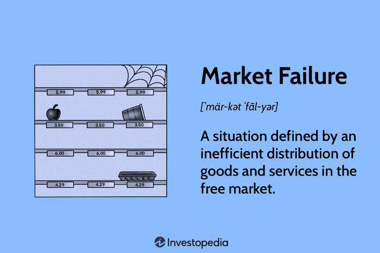

Property rights, externalities, market failure, and algorithmic trading are fundamental concepts in the financial markets. Property rights refer to the legal ownership and control over resources, assets, or goods, which enable individuals or entities to utilize and transfer these assets legally. Historically, well-defined property rights have been crucial for economic development as they provide an incentive structure for investment and innovation. In contrast, externalities refer to the costs or benefits incurred by third parties not directly involved in a transaction. They can be either positive, such as innovation spill-overs that benefit society, or negative, like pollution that harms non-consenting parties.

Market failure occurs when the allocation of goods and services by a free market is not efficient, often due to the presence of externalities. For instance, without regulatory intervention, negative externalities such as environmental damage can lead to market failure. Algorithmic trading, which involves using computer algorithms to automatically execute trades, is increasingly prominent in modern financial markets. It promises benefits such as enhanced speed, efficiency, and data analytics-driven decisions but may also contribute to market volatility and unforeseen externalities if not properly managed.

These concepts are interrelated within the financial markets. Well-defined property rights are essential to provide the legal framework that governs financial transactions, including those conducted via algorithmic methods. At the same time, the externalities associated with algorithmic trading, such as flash crashes, highlight potential market failures requiring intervention. Understanding these relationships is critical for investors seeking to navigate market dynamics and for policymakers aiming to regulate effectively to mitigate risks while fostering innovation.

The purpose of this article is to explore how property rights and externalities influence market dynamics, particularly in the context of algorithmic trading. By examining these impacts, we aim to shed light on their implications for market stability and investor confidence, while also looking at potential regulatory measures.

This article will cover several key topics: first, the nature and significance of property rights in economics; second, the role of externalities in market failure; third, an overview of algorithmic trading and its pros and cons; fourth, the intersections between these elements; and finally, strategies for mitigating market failures linked to algorithmic trading. These discussions are vital for developing a balanced approach that supports technological advancement without compromising market integrity.

## Table of Contents

## Understanding Property Rights

Property rights are a central concept in economics, denoting the legally recognized rights to possess, use, and transfer assets. The historical development of property rights dates back to early civilizations, where these rights were initially established through customary laws. In modern economic terms, property rights are formalized in legal statutes and form the foundation of market economies by determining how resources are allocated and used.

The significance of well-defined property rights in market transactions is profound. Clear property rights ensure that ownership of assets is recognized and protected by law, thereby reducing the risk of disputes. This legal certainty fosters an environment where individuals and businesses feel secure in investing capital, leading to efficient market transactions. The Coase Theorem illustrates this principle by suggesting that when property rights are well-defined and transaction costs are negligible, parties can negotiate to address externalities without government intervention, leading to efficient market outcomes.

In various asset classes and markets, property rights manifest in multiple forms. For instance, in real estate, property rights specify the owner's legal entitlements to use the land, sell it, or lease it. Intellectual property rights, such as patents and copyrights, protect creators by granting them exclusive rights to their innovations or works. In the stock market, shares represent partial ownership in a company and confer rights such as voting on corporate matters.

Property rights significantly affect investor confidence and market stability. When property rights are secure, investors are more likely to invest, knowing their assets are protected by law. This security encourages long-term investments and contributes to the stability of the financial system. Conversely, weak or poorly enforced property rights can lead to market uncertainty, reducing investment and undermining economic growth. Historical instances, such as the asset seizures during political upheavals in some countries, underscore the negative impact of undermined property rights on investor sentiment and market stability.

In summary, the establishment and enforcement of clear property rights are pivotal in guiding market dynamics, fostering investment, and maintaining economic stability. Understanding the intricacies of property rights aids in comprehending their broader economic implications and underscores their critical role in market integrity.

## Exploring Externalities and Their Role in Market Failure

Externalities are a fundamental concept in economic theory, representing the unintended side effects of economic activities on third parties not directly involved in the transaction. These can be broadly categorized into positive and negative externalities. Positive externalities occur when an economic activity confers beneficial effects on others, such as the societal benefits of education or innovation spillovers from research and development. Negative externalities, on the other hand, arise when an activity imposes undesirable costs on others, such as pollution from industrial operations affecting the health and property of nearby residents.

Market failure refers to a situation where the allocation of goods and services by a free market is not efficient. Externalities are one of the primary causes of market failure because the true social costs or benefits of a transaction are not reflected in market prices. In the presence of externalities, the market equilibrium fails to align with the socially optimal level of resource allocation, leading to overproduction in the case of negative externalities and underproduction where positive externalities are present.

Case studies across various sectors highlight how externalities can lead to market failure. For instance, in the environmental sector, industrial pollution is a classic example of a negative externality. The costs related to air and water pollution are not borne by the polluting firms but are instead transferred to society, manifesting as health care costs and environmental degradation. This misalignment discourages firms from reducing pollution autonomously, resulting in a socially suboptimal outcome.

In the healthcare sector, vaccination has been cited as a positive externality. When individuals get vaccinated, they not only protect themselves but also contribute to the wider public health by reducing the transmission of contagious diseases. However, individual decision-making based on personal cost-benefit analysis may lead to under-vaccination, as the societal benefits are not fully internalized by the individual decision-maker.

To address the externalities and associated market failures, various solutions and interventions have been proposed. One common approach is government intervention through taxation or subsidies. Pigovian taxes, designed to equal the external cost of a negative externality, can internalize the external costs of activities like pollution. For instance, carbon taxes aim to reduce greenhouse gas emissions by making it more expensive to pollute.

Subsidies can be employed to encourage behaviors that generate positive externalities. Educational grants or tax incentives for research and development are examples of policies that increase the private benefits relative to societal gains, encouraging greater investment in these areas.

Regulatory measures, such as emission standards or cap-and-trade schemes, are also instrumental in correcting market failures associated with externalities. Cap-and-trade systems set a limit (cap) on emissions while allowing companies to trade allowances, effectively creating a financial incentive to reduce pollution.

Finally, fostering cooperative behavior and community-based solutions can complement formal interventions. This is observed in cases where local communities self-organize to manage resources sustainably, as in the management of fisheries and grazing lands. 

Understanding and addressing externalities is crucial for policymakers aiming to resolve market failures and enhance economic efficiency. It requires a keen assessment of the cost-benefit dynamics inherent in the market, along with well-designed interventions that promote socially optimal outcomes.

## Algorithmic Trading: An Overview

Algorithmic trading refers to the use of computer algorithms to automatically execute trading decisions based on pre-defined criteria and market conditions. This method of trading emerged in the latter half of the 20th century as financial markets sought increased efficiency and precision in executing trades. Historically, the adoption of algorithms began with simple strategies that leveraged opportunities such as [arbitrage](/wiki/arbitrage) but has since advanced into sophisticated programs capable of processing vast volumes of data at remarkable speeds.

The primary benefits of [algorithmic trading](/wiki/algorithmic-trading) lie in its speed, efficiency, and capacity for complex data analysis. By utilizing algorithms, traders can execute orders faster than human capability, reducing the effects of market fluctuations that could alter the expected outcomes of trades. This speed advantage is particularly critical in high-frequency trading ([HFT](/wiki/high-frequency-trading-strategies)), where millisecond advantages can yield significant financial benefits. Moreover, algorithmic trading enhances efficiency by streamlining the buying and selling process, minimizing transaction costs, and eliminating human error. Additionally, algorithms can analyze large datasets to identify patterns and trends, enabling informed decision-making grounded in extensive market analysis.

Nevertheless, algorithmic trading is not without its drawbacks and criticisms. One significant concern is the potential for increased market [volatility](/wiki/volatility-trading-strategies). Algorithms, by their nature, can engage in rapid buy and sell sequences, which, if mismanaged, may contribute to erratic price movements or "flash crashes." Such events can undermine market stability and erode investor confidence. Furthermore, the complexity of algorithmic strategies sometimes obscures their underlying assumptions, raising questions about transparency and the potential for systemic risks.

Several trading strategies exemplify the diverse applications of algorithmic trading in financial markets. Arbitrage strategies exploit price differentials between correlated assets or markets, while market-making algorithms provide [liquidity](/wiki/liquidity-risk-premium) by continuously quoting buy and sell prices. Trend-following strategies, which leverage moving averages or [momentum](/wiki/momentum) indicators, aim to capitalize on sustained price movements. Meanwhile, [statistical arbitrage](/wiki/statistical-arbitrage) involves identifying price inefficiencies in securities believed to revert to the mean over time.

In summary, algorithmic trading has transformed financial market dynamics by introducing high-speed transaction capabilities and advanced data analytics. However, the potential for increased volatility and systemic risks calls for a delicate balance between leveraging its benefits and managing its limitations through effective oversight and regulatory frameworks.

## Intersection of Property Rights, Externalities, and Algorithmic Trading

Property rights are fundamental in establishing a legal framework that facilitates algorithmic trading, as they define the ownership and usage entitlements of financial assets and their derivatives. In the context of algorithmic trading, these rights ensure clarity over the ownership of trading algorithms, data, and the transactions executed by these algorithms. Adequately defined property rights foster trust and investor confidence, enhancing market stability and efficiency.

However, algorithmic trading can lead to various externalities, notably those affecting market dynamics. Externalities are costs or benefits borne by third parties due to business operations, and they can be either positive or negative. In algorithmic trading, such externalities may manifest through market disruptions or heightened volatility. For instance, if an algorithm initiates a rapid series of trades, it can lead to liquidity imbalances, impacting price discovery and increasing volatility, which negatively affects other market participants.

A market failure occurs when the free market, unregulated, fails to allocate resources efficiently. Algorithmic trading can propagate market failures due to these unmanaged externalities. For example, "flash crashes” illustrate this phenomenon, where a sudden, severe drop in security prices occurs, triggered by automated trading algorithms. These events can destabilize markets and erode investors' trust, necessitating intervention.

Regulatory measures are critical in addressing these issues and ensuring that the benefits of algorithmic trading are maximized while minimizing its drawbacks. Regulators may impose rules limiting the speed at which trades can be executed, thus curbing excessive volatility induced by high-frequency trading. Furthermore, implementing circuit breakers can prevent rapid price declines by halting trading when prices drop precipitously, allowing time to assess and respond.

Additionally, promoting transparency and robustness of trading algorithms through regular audits and stress-testing can mitigate unintended consequences. Regulatory bodies could also require the disclosure of algorithmic trading strategies to ensure accountability and ethical trading practices. Collaborative efforts between regulators, financial institutions, and technology providers can lead to a comprehensive regulatory framework that balances innovation with market integrity.

In summary, while algorithmic trading presents remarkable efficiencies, careful consideration of property rights and externalities is essential to prevent market failures. Ongoing dialogue and regulatory evolution are necessary to address the complexities arising from the intersection of these elements within financial markets.

## Mitigating Market Failures Related to Algorithmic Trading

Enhancing property rights enforcement in digital trading involves ensuring clear and enforceable ownership rights over digital assets and trading algorithms. Well-defined property rights are crucial in digital trading as they provide legal certainty, reduce disputes, and enhance market confidence. Digital assets and trading algorithms, being intangible, present unique challenges in property rights enforcement, particularly concerning intellectual property protection, data privacy, and cybersecurity. Legal frameworks need to adapt to these challenges, potentially through international cooperation on standards and regulatory practices to ensure seamless cross-border digital trading.

Policies and technology solutions are critical for reducing the negative externalities associated with algorithmic trading. The rapid pace and complexity of algorithmic trades can lead to significant market externalities, such as flash crashes or systemic risks. Implementing circuit breakers—mechanisms that pause trading under extreme conditions—can mitigate such risks. Moreover, enhancing the transparency of trading algorithms through disclosure requirements can help identify potentially harmful trading patterns early. Advanced technologies like [machine learning](/wiki/machine-learning) and [artificial intelligence](/wiki/ai-artificial-intelligence) can be leveraged to monitor trading activities in real-time, enabling the detection of irregular or manipulative trading activities.

Regulatory bodies play a vital role in minimizing market failure risks by establishing and enforcing rules that govern algorithmic trading. Regulatory frameworks should balance innovation and risk mitigation, encouraging development while protecting market integrity. For instance, the European Markets in Financial Instruments Directive (MiFID II) requires algorithmic traders to be tested and documented before they are deployed in the market. Similarly, the Securities and Exchange Commission (SEC) in the United States has guidelines for fair access to trading platforms and transparency in high-frequency trading activities.

There are several examples of successful interventions aimed at mitigating failures related to algorithmic trading. The "Volatility Control Mechanism" employed in several stock exchanges, such as the New York Stock Exchange (NYSE) and the Tokyo Stock Exchange (TSE), automatically halts trading when volatility exceeds certain thresholds, thus preventing market crashes. Another example is the "Kill Switch" mechanism adopted by some trading firms, which can shut down all trading activities instantly if anomalies are detected. These interventions demonstrate how technological and regulatory measures can effectively address issues arising from algorithmic trading.

## Conclusion

The interaction between property rights, externalities, and algorithmic trading reveals complex dynamics that significantly influence market stability. Central to this discussion is the way property rights provide a legal framework supporting reliable market transactions. Well-defined property rights enhance investor confidence by providing certainty and reducing transaction costs. Conversely, poorly defined rights can result in ambiguities that destabilize markets.

Externalities, both positive and negative, further complicate this landscape. Algorithmic trading, while enhancing market efficiency, often introduces negative externalities such as increased volatility or systemic risks. These include rapid price movements and market liquidity issues. These unintended consequences highlight the role that externalities play in market failures, necessitating regulatory oversight.

The interplay between these concepts underscores the need for ongoing research and policy development. As financial markets continue to evolve, understanding these relationships becomes crucial for designing effective regulatory measures. Policy development must strike a balance that encourages technological innovation, such as advancements in algorithmic trading, while protecting market integrity and ensuring fairness.

Collaboration among stakeholders—including regulators, financial institutions, and technology providers—is imperative to manage these challenges effectively. By fostering a cooperative approach, stakeholders can mitigate risks associated with algorithmic trading while leveraging its benefits. Coordinated efforts can lead to the creation of robust systems that uphold the principles of transparency and accountability.

Ultimately, achieving a balanced approach that promotes innovation without compromising market integrity is paramount. Stakeholders must engage in dialogue and share insights to address these complex issues effectively, ensuring financial markets remain resilient and equitable for all participants. Continuous research and adaptation will be key in maintaining the delicate equilibrium needed for sustainable growth in financial markets.

## References

1. Coase, R. H. (1960). "The Problem of Social Cost." *The Journal of Law and Economics*, 3, 1-44. This seminal paper discusses the role of property rights and externalities in economic markets.

2. Demsetz, H. (1967). "Toward a Theory of Property Rights." *The American Economic Review*, 57(2), 347-359. This article is pivotal in understanding how property rights evolve and their importance in market transactions.

3. Stiglitz, J. E. (1989). "Markets, Market Failures, and Development." *The American Economic Review*, 79(2), 197-203. This paper provides insights into how market failures occur, including the impact of externalities.

4. Harris, L. (2003). "Trading and Exchanges: Market Microstructure for Practitioners." *Oxford University Press*. This book is an essential resource for understanding algorithmic trading strategies and market microstructure.

5. Hendershott, T., Jones, C. M., & Menkveld, A. J. (2011). "Does Algorithmic Trading Improve Liquidity?" *The Journal of Finance*, 66(1), 1-33. This study examines the benefits and drawbacks of algorithmic trading, particularly regarding market liquidity.

6. SEC (2010). "Concept Release on Equity Market Structure." *Securities and Exchange Commission*. This report details regulatory perspectives on algorithmic trading and related market dynamics [Available online at: https://www.sec.gov/rules/concept/2010/34-61358.pdf].

7. Biais, B., Foucault, T., & Moinas, S. (2015). "Equilibrium High-Frequency Trading." *Econometrica*, 83(2), 391-436. This research explores the equilibrium conditions in high-frequency trading environments and related policy implications.

For further reading on these topics, consider exploring the following resources:

- "Externalities and Public Goods" by Baumol, W. J., on how externalities impact economic systems.
- "High-Frequency Trading: A Practical Guide to Algorithmic Strategies and Trading Systems" by Irene Aldridge, which provides a practical perspective on algorithmic trading systems.

Industry reports and case studies for practical insights:

1. "Algorithmic Trading 2023: A Survey" by Aite Group, which gives an overview of current trends in algorithmic trading.
2. "Market Consequences of Algorithmic and High-frequency Trading" by the European Securities and Markets Authority (ESMA), offering regulatory viewpoints on market integrity.
3. "Externalities and Property Rights: The Role of Transaction Costs" a case study from the University of Chicago Law School, focusing on legal frameworks in economic transactions.

## References & Further Reading

[1]: Coase, R. H. (1960). ["The Problem of Social Cost."](https://www.jstor.org/stable/10.1086/674872) The Journal of Law and Economics, 3, 1-44.

[2]: Demsetz, H. (1967). ["Toward a Theory of Property Rights."](https://wpcdn.web.wsu.edu/cahnrs/uploads/sites/5/2017/12/demsetz-2.pdf) The American Economic Review, 57(2), 347-359.

[3]: Stiglitz, J. E. (1989). ["Markets, Market Failures, and Development."](https://www.jstor.org/stable/1827756) The American Economic Review, 79(2), 197-203.

[4]: Harris, L. (2003). ["Trading and Exchanges: Market Microstructure for Practitioners."](https://academic.oup.com/book/52292) Oxford University Press.

[5]: Hendershott, T., Jones, C. M., & Menkveld, A. J. (2011). ["Does Algorithmic Trading Improve Liquidity?"](https://onlinelibrary.wiley.com/doi/full/10.1111/j.1540-6261.2010.01624.x) The Journal of Finance, 66(1), 1-33.

[6]: SEC (2010). ["Concept Release on Equity Market Structure."](https://www.sec.gov/rules-regulations/2010/01/concept-release-equity-market-structure) Securities and Exchange Commission.

[7]: Biais, B., Foucault, T., & Moinas, S. (2015). ["Equilibrium High-Frequency Trading."](https://www.sciencedirect.com/science/article/abs/pii/S0304405X15000288) Econometrica, 83(2), 391-436.