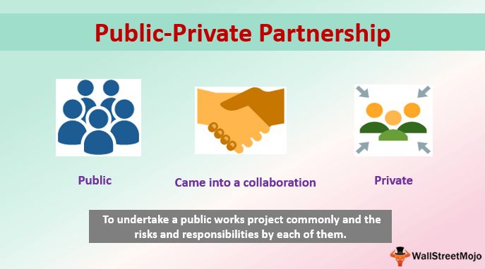

Public-Private Partnerships (PPPs) have become a crucial strategy for enhancing economic growth by bringing together the strengths of both public and private sectors. These collaborations aim to address critical needs in sectors such as infrastructure, innovation, and technology, where significant investments and efficiencies are required. The effectiveness of PPPs is particularly significant in the modern era, where the demand for robust infrastructure and cutting-edge technology drives progress.

Among the technological advancements influencing economic growth is algorithmic trading, which has transformed financial markets by automating trading decisions through sophisticated algorithms. This integration has provided enhanced market liquidity, reduced transaction costs, and improved access to capital. The success of PPPs often fuels the development and deployment of algorithmic trading systems, as public and private entities pool resources and expertise to innovate within financial markets.



Understanding the role of PPPs in transforming economic landscapes and promoting technological growth is vital for policymakers, businesses, and investors. These partnerships not only foster economic prosperity but also spur advancements in technology that can yield substantial economic benefits. Through strategic collaborations, stakeholders can leverage PPPs to accelerate progress, address public service challenges more effectively, and achieve sustainable development. Consequently, the multifaceted implications of PPPs on economic systems remain a pivotal focus for future-oriented growth strategies.

## Table of Contents

## Understanding Public-Private Partnerships

Public-Private Partnerships (PPPs) embody collaborative agreements designed to bridge the gap between government responsibilities and private sector expertise. These partnerships create a synergistic framework where shared resources and risk distribution facilitate the achievement of common objectives, particularly in sectors like infrastructure, health, and education. The essential nature of PPPs lies in harnessing the efficiencies of the private sector while ensuring public accountability and oversight.

Key elements of PPPs involve joint investment, where both parties contribute financial and non-financial resources, thus diluting the burden and risk associated with large-scale projects. This stratagem enables governments to access increased capital and technical expertise, often leading to innovative solutions in the provision of public services. A practical example of PPPs can be seen in infrastructure development projects, which include constructing highways, railways, and public utilities. Such projects require significant funding and expertise, which the private sector can provide, while the public sector oversees regulatory compliance and maintains service standards.

Furthermore, PPPs often operate on the principle of risk allocation, wherein risks are distributed to the party best equipped to manage them. This might encompass financial risks, operational challenges, or the risks associated with public perception and acceptability. The ultimate objective is to align incentives such that both sectors strive for efficiency and effectiveness, ensuring that public services meet the desired quality and accessibility standards.

Despite their benefits, executing successful PPPs involves navigating a myriad of challenges—legal, financial, and operational. Legal hurdles can arise from complex contract structures and the need to adhere to both local and international regulations. Financially, projects can be susceptible to overruns and shifts in economic conditions that alter cost projections and returns on investment. Operationally, ensuring that private entities adhere to public service quality expectations can present challenges that require careful oversight and management.

In summation, understanding PPPs is crucial for leveraging their potential in economic development. These partnerships, while fraught with challenges, offer a unique avenue for public and private entities to collaborate, innovating within traditional frameworks to enhance public service delivery effectively.

## Impact of PPPs on Economic Growth

Public-Private Partnerships (PPPs) play a crucial role in driving economic growth by facilitating substantial investments in infrastructure projects. These partnerships between government entities and private sector companies focus on developing key infrastructure such as highways, railways, airports, and energy facilities. The involvement of the private sector often brings about improved design, efficiency, and operation of public services, thanks to innovations and management practices not typically found in public sector projects.

One of the primary economic benefits of PPPs is the enhancement of productivity. When infrastructure is modernized or newly built through PPPs, it leads to increased efficiency in the transport of goods and services, thereby reducing costs and increasing productivity. This improvement translates to job creation, as new projects often require a workforce for construction, maintenance, and ongoing operations. The employment opportunities generated by PPPs contribute significantly to economic growth by increasing household incomes and consumer spending.

Moreover, PPPs foster increased competitiveness and innovation within the economy. By integrating private sector efficiency, these partnerships can lead to the development of more competitive industries. The infusion of private capital and expertise often results in innovative solutions being applied to public sectors, enhancing service delivery and performance. For instance, technology-driven projects, such as smart city infrastructure, are becoming more prevalent under the PPP framework, promoting urban innovation and sustainable development.

Diversification is another economic advantage presented by PPPs. By engaging in projects across various sectors such as transportation, healthcare, and education, PPPs reduce dependency on a single economic sector, contributing to a more resilient and balanced economy. The diversification of investment sources and industrial involvement aids in stabilizing economic fluctuations, providing robustness against sector-specific downturns.

Despite these benefits, there are critiques regarding PPPs particularly concerning resource allocation. Some argue that resources diverted to PPP projects may have been used more effectively elsewhere, potentially leading to less productive investments. This critique underscores the importance of strategic resource allocation and careful planning when implementing PPPs. The impact on economic growth can significantly vary with the specific sectors involved and the overall effectiveness of the partnerships. Thus, ensuring that PPPs are efficiently structured, with defined objectives and performance metrics, is vital for maximizing their economic contributions.

In conclusion, while PPPs offer substantial opportunities for economic advancement through infrastructure development and innovation, their success largely hinges on the careful planning and resource allocation practices adopted during their implementation.

## Role of Algorithmic Trading in Economic Growth

Algorithmic trading, characterized by the use of sophisticated algorithms and computational power to facilitate trading decisions, plays a crucial role in driving economic growth by bringing about significant efficiencies in financial markets. By automating trading processes, [algorithmic trading](/wiki/algorithmic-trading) offers unparalleled speed and precision, thereby enabling quicker transaction execution and a higher frequency of trades. This is pivotal in enhancing market [liquidity](/wiki/liquidity-risk-premium), as it ensures the availability of buyers and sellers at any given time, leading to more stable and efficient markets.

The integration of algorithmic trading holds the potential to reduce transaction costs. By minimizing human intervention and using data-driven strategies, algorithmic trading can substantially decrease the costs associated with buying and selling securities. As a result, the economic barrier to market entry is lowered, which enhances access to financial markets for a broader range of participants. This increased participation boosts the flow of capital, thereby generating positive ripple effects across the economy.

Public-Private Partnerships (PPPs) often serve as a platform for technological innovations, where algorithmic trading can be strategically applied to maximize financial gains from large-scale projects. For instance, investment in infrastructure or new technologies via PPPs can benefit from the efficiencies brought about by algorithmic methods in managing financial resources. A well-structured PPP leveraging algorithmic trading can optimize financing arrangements, allowing for the efficient management of resources, and potentially leading to greater returns on investment.

Effective risk management is indispensable in leveraging algorithmic trading within PPP frameworks. The use of algorithms demands stringent risk management procedures to mitigate issues such as technological failures or erroneous calculations. Furthermore, transparency and regulatory compliance are critical, as ensuring adherence to financial regulations is essential to maintain market integrity and investor trust. Algorithmic strategies should be developed with full transparency to regulators and stakeholders to preclude risks such as market manipulation or systemic failures.

The synergy between algorithmic trading and PPPs can lead to more informed economic decision-making. By harnessing vast amounts of financial data, algorithms can provide insights into market trends and potential investment opportunities, enhancing the strategic planning capabilities of both public and private sector entities involved in PPPs. Consequently, data-driven decisions can lead to optimized resource allocation, reinforcing economic resilience and promoting sustainable growth.

In summary, algorithmic trading optimizes financial market operations by augmenting liquidity and reducing costs, aligning seamlessly with the strategic objectives of PPPs to spur economic growth. As economies continue to digitize, the integration of algorithmic trading within such partnerships will likely remain a focal point for financial innovation and enhanced market efficiencies.

## Challenges and Considerations

Adopting Public-Private Partnerships (PPPs) necessitates overcoming several operational and strategic challenges, prominently including cost overruns, quality control, and public accountability. These critical issues can impede the efficient functioning and success of PPP projects. Cost overruns often arise due to unforeseen expenditures, inadequate budgeting, or inefficient resource management, requiring rigorous financial discipline and strategic planning to mitigate. Quality control demands meticulous oversight to ensure that the projects meet established standards and public expectations, often necessitating a sophisticated system of checks and balances.

Public accountability within PPPs is essential, given the public funding and communal impact tied to these projects. This necessitates transparent operations and reporting measures, ensuring that the public interest is upheld and that any concerns about governance or expenditure are promptly addressed. 

In the context of algorithmic trading, several distinct challenges exist, which include technological failures, regulatory scrutiny, and the potential for market manipulation. Technological failures, such as system outages or algorithm errors, can lead to significant financial losses or market disruptions, underscoring the need for robust technological support and contingency planning. Regulatory scrutiny is crucial due to the high-speed, automated nature of algorithmic trading, which can sometimes result in behaviors that skirt or breach existing financial regulations. Market manipulation risks arise from the accelerated and opaque environment algorithmic trading creates, potentially leading to unfair market advantages or distortions.

To address these challenges in both PPPs and algorithmic trading, several strategies are recommended. Clear contractual agreements and robust project management are fundamental in establishing expectations, responsibilities, and performance metrics, providing a strong foundation for project success. Developing regulatory frameworks specific to algorithmic trading can help ensure ethical trading practices and maintain market integrity. 

Stakeholder engagement is vital in aligning diverse interests and expectations within PPPs. This engagement promotes mutual understanding and cooperation, facilitating smoother project execution and improving outcomes. Continuous evaluation and adaptation, considered best practices, allow for the timely identification of issues and the implementation of necessary adjustments. These practices are instrumental in optimizing the benefits and navigating the complexities associated with both PPPs and algorithmic trading.

## The Future of Public-Private Partnerships and Algorithmic Trading

As global economies continue to evolve, Public-Private Partnerships (PPPs) and algorithmic trading are poised to play crucial roles in driving innovation and enhancing economic resilience. These collaborations and technological advancements are shaping future economic landscapes by leveraging the strengths of both public oversight and private sector agility.

A significant trend is the digital transformation of PPPs. This involves the incorporation of digital technologies across various stages of PPP projects, from planning and implementation to operation and monitoring. The use of digital tools such as Geographic Information Systems (GIS), Building Information Modeling (BIM), and Internet of Things (IoT) devices can enhance project efficiency and transparency. These technologies offer precise data analytics capabilities, enabling better decision-making processes and improved resource allocation.

Algorithmic trading, driven by advances in Artificial Intelligence (AI) and [machine learning](/wiki/machine-learning), is another critical aspect of future economic growth. AI-enabled algorithms can analyze vast datasets at unprecedented speeds, identifying market trends and executing trades with high precision. This capability not only improves market liquidity but also reduces transaction costs, contributing to more efficient financial markets. A Python example of a simple algorithmic trading strategy might look like this:

```python
import pandas as pd
import numpy as np

def moving_average_strategy(prices, short_window=40, long_window=100):
    signals = pd.DataFrame(index=prices.index)
    signals['signal'] = 0.0

    # Short moving average
    signals['short_mavg'] = prices.rolling(window=short_window, min_periods=1).mean()

    # Long moving average
    signals['long_mavg'] = prices.rolling(window=long_window, min_periods=1).mean()

    # Generate signals
    signals['signal'][short_window:] = np.where(signals['short_mavg'][short_window:] > signals['long_mavg'][short_window:], 1.0, 0.0)

    # Generate trading orders
    signals['positions'] = signals['signal'].diff()

    return signals

# Example use with a price DataFrame
# prices = pd.DataFrame(...) # input your price data here
# strategy_signals = moving_average_strategy(prices)
```

A future-oriented approach requires governments and private enterprises to collaborate on supportive policies and practices. Key issues to address in these collaborations include data security, regulatory compliance, and the ethical use of technology. By aligning policies with technological advancements, stakeholders can ensure sustainable development that addresses both economic and social priorities.

Moreover, balancing technological integration with societal impacts is vital. While technological advancements bring efficiency and growth, they can also lead to challenges, such as workforce displacement due to automation. Thus, it is essential to adopt policies that promote skill development and workforce adaptability to mitigate adverse effects.

The forthcoming landscape of PPPs and algorithmic trading involves navigating new opportunities and managing the risks inherent in technological integration. Stakeholders must embrace innovation while maintaining vigilance against potential pitfalls, ensuring that technological progress contributes positively to broader economic objectives.

## Conclusion

Public-Private Partnerships (PPPs) offer a substantial opportunity for stimulating economic growth by facilitating large-scale investments and capitalizing on the efficiencies inherent in the private sector. By combining resources and expertise, PPPs can undertake ambitious projects that might otherwise be beyond the reach of public or private entities alone. This collaborative approach not only expedites project timelines but also ensures the effective allocation of resources, contributing to enhanced productivity and broader economic development.

The integration of algorithmic trading within PPP frameworks further amplifies their economic impact. Algorithmic trading improves financial performance by optimizing transactions and providing real-time data analytics, which can enhance decision-making processes within PPP projects. The increased efficiency and precision of financial operations can lead to substantial economic benefits, including improved liquidity, cost reductions, and expanded access to capital markets.

Despite the benefits of PPPs, challenges such as regulatory hurdles, potential cost overruns, and maintaining public accountability persist. These challenges underscore the importance of strategic planning and cooperation among stakeholders. By fostering transparent practices and employing adaptive strategies, stakeholders can mitigate risks and maximize the positive outcomes of PPPs.

Looking to the future, it is crucial for both public and private sector partners to continuously explore innovative approaches to sustain and enhance the benefits of PPPs. Embracing emerging technologies, improving data-driven decision-making processes, and prioritizing sustainable development goals will be essential for navigating the dynamic landscape of global economies. Adopting these strategies will not only address present challenges but also pave the way for resilient and robust economic growth facilitated by PPPs.

## References & Further Reading

[1]: López-de-Silanes, F., & Engel, E. M. (2000). ["Contracts as Threats: On a Rationale for Irrevocable Exchange."](https://www.skema.edu/en/faculty-and-research/professors/florencio-lopez-de-silanes-molina) Quarterly Journal of Economics, 114(1), 83-123.

[2]: Grimsey, D., & Lewis, M. K. (2004). ["Public Private Partnerships: The Worldwide Revolution in Infrastructure Provision and Project Finance."](https://www.researchgate.net/publication/264158128_Public_private_partnerships_The_worldwide_revolution_in_infrastructure_provision_and_project_finance) Edward Elgar Publishing.

[3]: Davies, S. M. (2010). ["Public Private Partnerships."](https://www.researchgate.net/publication/276896036_The_Private_Scope_in_Public-Private_Partnerships_An_International_Cross-Sector_Study) Elsevier.

[4]: Gompers, P., & Lerner, J. (2001). ["The Venture Capital Revolution."](https://www.jstor.org/stable/2696596) Journal of Economic Perspectives, 15(2), 145-168.

[5]: Albrecht, P., & Maurer, R. (2001). ["Investment and Financing in the Public-Private Partnership in Germany."](https://www.researchgate.net/publication/243461830_Public_Private_Partnerships_An_Introduction) In Long-Term Care: The Future of Public-Private Partnerships.

[6]: Narayan, P. K., & Wagner, N. (2014). ["Algorithmic Trading and Return Predictability Across Asset Classes."](https://www.sciencedirect.com/science/article/abs/pii/S1566014115000692) Journal of Financial Stability, 15, 104-119.

[7]: Knapp, J. C. (2015). ["The Role of Private Sector Investment in Financing Infrastructure."](https://www.sciencedirect.com/science/article/pii/S2666188824001618) In Financial and Economic Tools Used in the World Infrastructure: Public and Private Sector Projects.